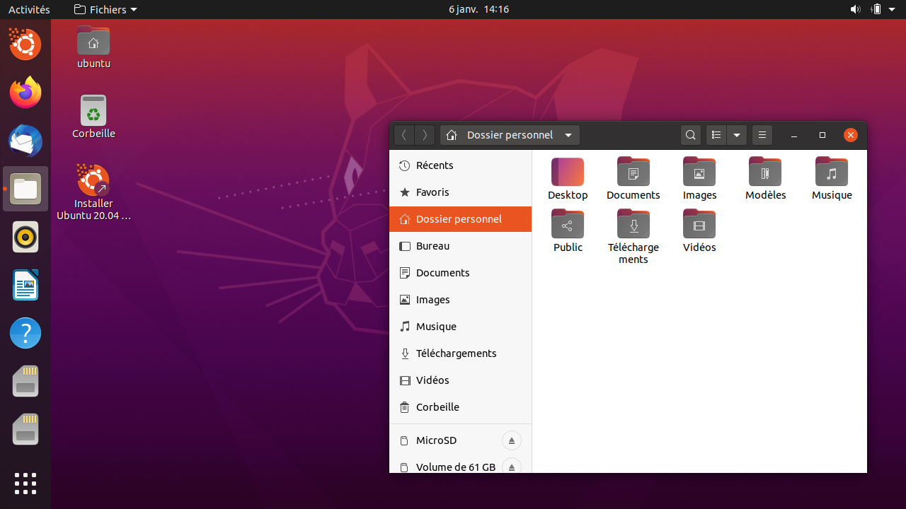

---
## To DO
- Remanier competement l'article
- Ajouter Les avantages inconvenient a passer sous Linux.
- Parler de sla sphere Open SOurces
- Etablir son catalogue
- Parler de Framsof logitheque ou Alternative to mais aussi privacy.

Press <kbd>CTRL</kbd>+<kbd>ALT</kbd>+<kbd>Delete</kbd> to end the session.

---
Pourquoi parler de vie privée sur nos ordinateur ?

Tous simplement parce que **Windows** et **Apple** sont bourrés de **mouchards** en tous genres.

De plus Windows est **vulnérable** a tous les virus et **machin**wares possibles. Cela **oblige** a installer des **antivirus** et **anti-mouchards** sujet a la surconsommation des **ressources système** sans forcement proteger l'utilisateur.

La machine Apple n'a pas tous les défauts de Windows, mais quelques un en plus d'autres.

> Je suis concient que le changement ne peut se faire du jour au lendemain surtout quand on bidouille, moi même j'ai longtemps gardé un windows pour certaines tâches, par facilité. Mais pour un utilisateur lambda, il n'y a rien de vraiment bloquant.

Pour résoudre tous ces problemes, il n'y a malheuresement pas d'autres solutions que le passage sous Linux.

J'utilise **Linux** depuis plis de trois ans et je trouve qu'il est, maintenant, **facilement accessible aux débutants** grâce aux différents systèmes d'exploitations (OS).

Voici quelques OS Linux adaptés aux grands débutants.

## Ubuntu
[Ubuntu](https://ubuntu.com/) est souvent recommandé comme le systeme Linux pour débutants (je le recommande aussi d'ailleur). c'est un OS gratuit mais, **propriétaire** (Canonical). 

Il peut inclure des drivers propriétaires (choix a l'installation) et d'autres services facilitant l'acces au grand publique.

Sachez qu'**Ubuntu** est **basé sur Debian** (je vous en parle plus loin) mais a la difference de ce dernier, il est plus orienté sur des services/logiciels mis a jour que sur la stabilité.

Il beneficie de **plusieurs variantes** (Kubuntu, Lubuntu, Xubuntu, etc) adoptant des [environnements de bureau](https://doc.ubuntu-fr.org/environnements) differents mais aussi ressources miimum differentes.

Pour finir il y a une grande [communauté Francophone](https://www.ubuntu-fr.org/). Alors c'est un très bon début (toujours mieux que Windows).

**Mon avis :** 
C'est une bonne solution pour franchir le pas et il reste la solution la plus comatible grand publique.

## Elementary OS
[Elementary OS](https://elementary.io/) est un systeme **basé sur Ubuntu** mais avec une interface orienté utilisateur MAC.

**Pourquoi je vous parle d'Elementarys OS...** Euh parce qu'il est beau ? Oui un peu, mais aussi car il a une **interface épuré et design**. 

Il beneficie d'une [communauté Francophone](https://www.elementaryos-fr.org/) tres active.

** Mon avis :**
Pour une **utilisation** dite "de tous les jours" de Mr et Mme Michou, il est **simple**, avec une couche de vie privée supplementaire et je le **recommande**.
Maintenant, si vous souhaitez bidouiller, cette solution n'est pas la plus adaptée.

## LinuxMint
[LinuxMint](https://linuxmint.com/) est une solution **facilitant** le passage de **Windows vers Linux** grace a son interface ressemblante. 
C'est une solution **simple est stable** basé sur Ubuntu ou sur Debian(LMDE). LinuxMint est une **solution francaise** avec une vrai [communauté francophone](https://forum-francophone-linuxmint.fr/) prete a aider.

## Debian
[Debian](https://www.debian.org/index.fr.html) est, je pense, la solution la plus connue. Elle est **stable** et **sécurisé**.
Elle sert souvent de **base a d'autres OS**, et beneficie aussi de trés bonnes communautés francophone [ici](https://debian-facile.org/) ou [ici](https://france.debian.net/).
**Disponible** en version **serveur** ou en **desktop** la possibilité de **choisir** son environnement de **bureau** se fait lors de l'installation.

Depuis Debian 11, je trouve que l'interface est moins austere.

**Mon avis :**
C'est la solution que je recommande pour une utilisation serveur pour la securité et la stabilité, mis pour passer de Windows a Linux elle est quand meme moins adapté.

Mais differents serveurs (NAS, RPi ou en ligne) sont sous Debian Cela me permet d'avoir qu'un seul systeme a gerer meme si les commandes Linux sont souvent identique entre les OS.

## Conclusion.
Comme vous vous en doutez, mes articles seront plutot orintés Debian ou Ubuntu.