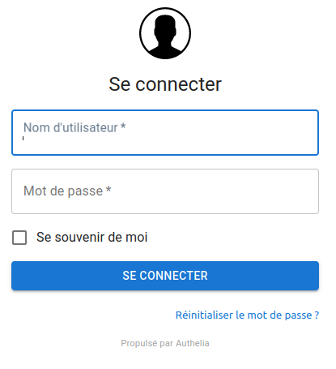

**Tuto réalisé avec :**
* HAOS 11.4, Core 204.1.2
* Add-on : Zigstar 0.40
* Matériels : [Sonoff Zigbee 3.0 USB Dongle Plus **P**](https://amzn.to/41W8f4W) 


### Installation de Authelia.

**??????? BLABLABLA**

Dans le dossier `swag`: 
* Créer un dossier `authelia`
* Puis a l'interieur, un dossier `config`,
* Et a l'interieur du dossier `config`, créer un dossier `logs`.

Dans le dossier config, nous ajoutons un fichier nommé `configuration.yml`. ATTENTION au ;**YML** et non yaml comme precedemment.

Ensuite nous ajoutons ce qui suit dans notre `docker-compose.yaml` a la suite de la partie `crowdsec`
```
  authelia:
    container_name: authelia
    image: docker.io/authelia/authelia:latest
    restart: unless-stopped
    environment:
      - TZ=$TZ
#    expose:
#      - 9091
    volumes:
      - ./authelia/config:/config
```

Nous pouvons maintenant reconstruire notre containeur avec la commande `docker compose up -d`.

#### Configuration de Auhtelia.
Passons a la configuration de ce dernier.

>Au lancement de la création du containeur, authelia passe le dossier config et les fichiers internes au proprietaire `root`, pour pouvoir modifier les fichiers depuis Codium, il faudra, a chaque fois, **eteindre le conteneur Authelia** et se connecter en `root` puis dans le dossier `authelia` lancer la commande `chown votre_user:group_user /config/configuration.yml`.

Un exemple de fichier de configuration complet est disponible sur le [GitHub](https://github.com/authelia/authelia/blob/v4.37.5/config.template.yml).

Nous allons plutot partir sur un fichier vide (`configuration.yml` créé ci-dessus) et allons lui ajouter et les sections importantes et celles qui nous interesses.

Les sections importantes sont :
* jwt_secret,
* default_redirection_url,
* authentication_backend,
* storage,
* session,
* notifier,
* access_control.

```
###############################################################################
#                           Authelia Configuration                            #
###############################################################################

## The theme to display: light, dark, grey, auto.
theme: auto

## The secret used to generate JWT tokens when validating user identity by email confirmation. JWT Secret can also be
## set using a secret: https://www.authelia.com/c/secrets
jwt_secret: a_very_important_secret

## Default redirection URL
##
default_redirection_url: https://home.example.com/

server:
  host: 0.0.0.0
  port: 9091
  path: "authelia"
  
log:
  ## Level of verbosity for logs: info, debug, trace.
  level: debug
  file_path: /config/logs/authelia.log
  
authentication_backend:
  password_reset:
    disable: false #car je suis seul a l'utiliser
  file:
    path: /config/users_database.yml
    password:
      algorithm: argon2id
      iterations: 1
      key_length: 32
      salt_length: 16
      memory: 512
      parallelism: 8
    password:
      algorithm: argon2
      argon2:
        variant: argon2id
        iterations: 3
        memory: 65536
        parallelism: 4
        key_length: 32
        salt_length: 16
        
access_control:
  ## Default policy can either be 'bypass', 'one_factor', 'two_factor' or 'deny'. It is the policy applied to any
  ## resource if there is no policy to be applied to the user.
  default_policy: deny
  networks:
    - name: internal
      networks:
#        - 10.10.0.0/16 #10.10.0.0 a 10.10.255.255
        - 172.20.0.0/8 #172.0.0.0 a 172.255.255.255
        - 192.168.10.0/24 #192.168.10.1 a 192.168.10.255
        - votre_ip_public_fai #Si installation en local
  rules:
    ## Rules applied to everyone
    - domain: 
      - 'sous-domain.ndd.fr'
      - 'sous-domain2.ndd.fr'
      - 'sous-domain3.ndd.fr'
      policy: bypass
      
    - domain:
      - 'sous-domain4.ndd.fr'
      - 'sous-domain5.ndd.fr'
      - '*.ndd.fr'
      policy: bypass
      networks:
        - internal
        
    - domain:
      - 'sous-domain4.ndd.fr'
      - 'sous-domain5.ndd.fr'
      - '*.ndd.fr'
      policy: one_factor       

session:
  name: authelia_session
  domain: ndd.fr
  secret: 7cIgJxxxxxxCIexrzsqxxxxxxTd6JZXX6aHefBf3xxxxxxWa7s4VA3AbkU
  expiration: 1h
  inactivity: 10m
  remember_me_duration: 1M

regulation:
  max_retries: 3
  find_time: 2m
  ban_time: 5m

storage:
  encryption_key: 7cIgxxxxxxxxCIexrzsqxxxxxxVbdTd6JZXxxxxfBf3SDFxxxxxa7s4VxxxbgW
  local:
    path: /config/db.sqlite3

notifier:
  disable_startup_check: false
  smtp:
    host: ssl0.ovh.net
    port: 587
    username: mail@ndd.fr
    password: mot_de_passe_mail
    sender: mail@ndd.fr
    subject: "[Authelia] {title}"
    startup_check_address: mail@ndd.fr
    disable_require_tls: false
    tls:
      skip_verify: false
      minimum_version: TLS1.2

```

#### Ajouter l'acce exterieur à Authelia.
Nous allons autoriser l'acces a Authelia depuis l'exterieur via l'adresse `authentification.ndd.fr`.

* Rendez vous dans le dossier `swag`, `config`, `nginx` puis `proxy-confs`,
* Rechercher `authelia.subdomain.conf.sample`
* * Soit vous copier/coller le contenu dans un fichier `authelia.subdomain.conf`,
* * Soit vous faite une copie du fichier en ligne de commande `cp authelia.subdomain.conf.sample authelia.subdomain.conf`
Dans le fichier `authelia.subdomain.conf` :
* Modifier le `server_name authelia.*;` par `server_name authentification.*;`,
* Verifier que le nom dans les deux `set $upstream_app authelia;` correspond bien au nom de votre conteneur (normalement oui, sinon changer le par le nom de votre conteneur).
* Sauvegarder le fichier avec `CTRL + X`,
* Rendez vous dans votre portainer pour relancer Swag ou alors via le terminal `docker stop swag` puis `docker start swag`,

Il reste a vous rendre sur authentifiction.ndd.fr depuis votre navigateur et vous devriez tomber sur la page d'accueil de Authelia.

Essayer de vous connecter avec login `authelia`, mot de passe `authelia` si cela marche c'est fini pour cette partie.

Passons a la creation d'un utilisateur plus securisé.

#### Créer votre/vos utilisateur(s) Authelia.
Au lancement de Authelia, l'utilisateur `authelia` est créé par defaut.
Vous vous doutez que nous ne pouvons pas laisser cet utilisateur pour des raisons evidentes de sécurité.

Les utilisateurs se trouvent dans le fichier `users_database.yml` se trouvant dans le dossier config de Authelia. Ce fichier est attribué a l'utilisateur `root` lors de la construcion du conteneur, il vous faudra donc, le modifier en tant que root ou alors le changer de proprietaire a chaque fois que vous souhaitez le modifier (`chown votre_user:group_user /config/users_database.yml`).

Voila le fichier d'origine.
```yaml
# yaml int disable rule:line-length
---
###############################################################
#                         Users Database                      #
###############################################################

# This file can be used if you do not have an LDAP set up.
users:
  authelia:
    displayname: "Test User"
    password: "$argon2id$v=19$m=32768,t=1,p=8$eUhVT1dQa082YVk2VUhDMQ$E8QI4jHbUBt3EdsU1NFDu4Bq5jObKNx7nBKSn1EYQxk"  # Password is 'authelia'
    email: authelia@authelia.com
    groups:
      - admins
      - dev
      
...
# yamllint enable rule:line-length
```
Pour ajouter un utilisateur, il vous suffit de copier/coller l'utilisateur existant, commenter celui par defaut et personnaliser votre utilisateur.

Ensuite il faudra generer votre mot de passe sous forme de HASH :
* Ouvrir une connexion SSH,
* Lancer la commande `docker run --rm authelia/authelia:latest authelia hash-password 'voTre_MOt_2_P@SsE'`
* Recuperer la valeur et copier là dans le le fichier.

Exemple :
```yaml
# yaml int disable rule:line-length
---
###############################################################
#                         Users Database                      #
###############################################################

# This file can be used if you do not have an LDAP set up.
# Generer mot de passe docker run --rm authelia/authelia:latest authelia hash-password 'MOT_DE_PASSE'
users:
#  authelia:
#    displayname: "Test User"
#    password: "$argon2id$v=19$m=32768,t=1,p=8$eUhVT1dQa082YVk2VUhDMQ$E8QI4jHbUBt3EdsU1NFDu4Bq5jObKNx7nBKSn1EYQxk"  # Password is 'authelia'
#    email: authelia@authelia.com
#    groups:
#      - admins
#      - dev

  votre_user:
    displayname: "Votre User"
    password: "$argon2id$xxxxxxxxxxxxxxxxxxxxxxxxxxxxxxxxxxxxxxxxxxxxxxxxxxxxxxxxxxxxxxxxxxxxxxxxxxxxxxxxxxxxxxx"
    email: mail@ndd.fr
    groups:
      - admins
      - dev
```