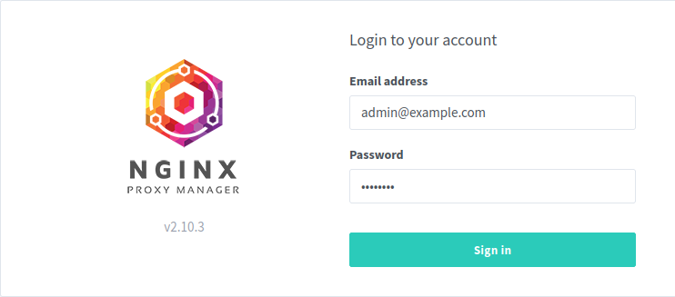
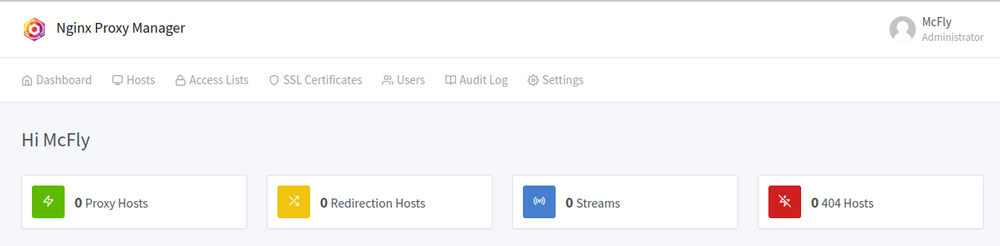
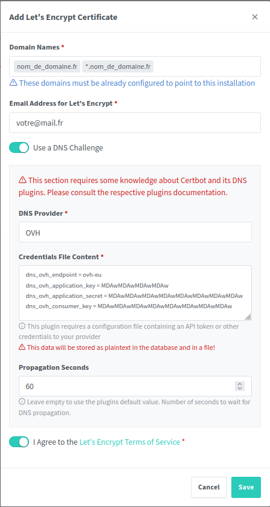

**Tuto réalisé avec :**
* HAOS 11.4, Core 204.1.2
* Add-on : Zigstar 0.40
* Matériels : [Sonoff Zigbee 3.0 USB Dongle Plus **P**](https://amzn.to/41W8f4W) 


BLABLBALBLABLABLA

**Pré-requis**
Si vous installez Nginx Proxy Manager en local chez vous
* Rediriger les port 443 de votre routeur/box vers l'IP de votre serveur.
* (facultatif) Rediriger le port 80 aussi le temps des challenges DNS

## Installation de Nginx Proxy Manager LePresidente

Connectez vous en SSH a votre serveur, puis rendez vous dans le dossier destiné a vos docker.
1. Creez un dossier `npm` puis dans ce dernier un dossier `mkdir -p config config/logs config/crowdsec config/crowdsec/templates config/crowdsec/data config/crowdsec/config mysql/config`,
1. Créez un ficher `docker-compose.yaml` à la racine du dossier `npm`,
1. Créez un fichier `.env` aussi à la racine,
1. Copiez le code suivant dans le fichier `docker-compose.yaml`

```yaml
services:
  nginx-proxy-manager:
    image: 'lepresidente/nginx-proxy-manager:latest'
    container_name: npm
    restart: always
    ports:
      - "81:8181"
      - "80:8080"
      - "443:4443"
    environment:
      - USER_ID=$PUID
      - GROUP_ID=$PGID
      - LANG=$LANG
      - TZ=$TZ
      - DISABLE_IPV6=$DISABLE_IPV6
    volumes:
      - "./config:/config:rw"
      - "./config/crowdsec/templates:/templates:ro"
    depends_on:
      - mariadb
    networks:
      - npm_net
      - npm_db_net
      - npm_crowdsec_net

  mariadb:
    image: linuxserver/mariadb:10.11.6
    container_name: npm_db
#    command: --transaction-isolation=READ-COMMITTED --binlog-format=ROW
    environment:
      - PUID=$PUID
      - PGID=$PGID
      - TZ=$TZ
      - MYSQL_ROOT_PASSWORD=$MYSQL_ROOT_PASSWORD
      - MYSQL_DATABASE=$MYSQL_DATABASE
      - MYSQL_USER=$MYSQL_USER
      - MYSQL_PASSWORD=$MYSQL_PASSWORD
#      - REMOTE_SQL=http://URL1/your.sql,https://URL2/your.sql #optional
    volumes:
      - ./mysql/config:/config
#    ports:
#      - 3306:3306
    networks:
      - npm_db_net
    restart: unless-stopped

  crowdsec:
    image: "crowdsecurity/crowdsec:v1.6.0-1"
    container_name: crowdsec
    expose:
      - 8080
    environment:
      - PGID=$PGID
      - TZ=$TZ
      - COLLECTIONS=crowdsecurity/nginx-proxy-manager
    volumes:
      - "./config/crowdsec/data:/var/lib/crowdsec/data"
      - "./config/crowdsec/config:/etc/crowdsec"
      - "/var/log/auth.log:/var/log/auth.log:ro"
      - "./config/logs:/var/log/nginx:ro"
    restart: unless-stopped
    networks:
      - npm_net
      - npm_crowdsec_net
    security_opt:
      - no-new-privileges=true

networks:
  npm_net:
    name: npm_net
  npm_db_net:
    name: npm_db_net
  npm_crowdsec_net:
    name: npm_crowdsec_net
```

1. Copier le code suivant dans le fichier `.env` puis remplacer par vos informations

***ATTENTION :** Evitez les caracteres speciaux dans les mots de passe.*

```env
PUID=1000 #Se recupere via la commande id votre_user
PGID=1000 #Se recupere via la commande id votre_user
LANG=fr_FR.UTF-8 # https://en.wikipedia.org/wiki/ISO_3166-1#Current_codes et https://en.wikipedia.org/wiki/List_of_ISO_639_language_codes
TZ=Europe/Paris # https://en.wikipedia.org/wiki/List_of_tz_database_time_zones
DISABLE_IPV6=1 #1=desactivé 0= Activé

MYSQL_ROOT_PASSWORD=root_pwd_XXXXXXXXXXXXX
MYSQL_DATABASE=npm
MYSQL_USER=user_XXXXXXXXXXXXXXXX
MYSQL_PASSWORD=user_pwd_XXXXXXXXXXXXXXXx

CROWDSEC_API=
```

* Lancer le docker compose depuis le terminal avec la commande `docker compose up -d`

Nginx Proxy Manager est installé.

### Premier lancement.
***Infos :** Le conteneur met du temps a se lancer et se configurer, je vous conseille de regarder les logs depuis Portainer, car meme si les conteneurs sont bien vues lancés, ils ne sont pas forcement prets.*

Ouvrez un navigateur a l'adresse de votre serveur `http://xxx.xxx.xxx.xxx:81`


Sur la page de connexion, saisir :
login : `admin@example.com`
Password : `changeme`

Puis suivez les instruction pour remplir les informations demandées et changer le mot de passe par un mot de passe **FORT**.

Vous voila maintenant sur le tableau de bord.


### Description du Dashboard.

BLABLABLABLA

### Générer un certificat Wildcard
Un certificat Wildcard est un certificat SSL qui prend en compte tous vos sous-domaines. Cela vous permet de lmimiter les requetes a LetsEncrypt et de ne pas devoir generer un certificat pour chaque nouveau sous domaine.

Pour generer un certificat Wildcard depuis NPM :
* Rendez vous dans `SSL Certificates`,
* Cliquez sur `Add SSL Certificate`,
* Dans `Domain Names` indiquez votre nom de domaine sous la formes `nom_de_domaine.fr` et `*.nom_de_domaine.fr`,
* Votre mail devrait deja etre saisi, mais vous pouvez le changer,
* *Optionnel* Utiliser un DNS challenge en y renseignant les informations demandées, (exemple si vous etes chez OVH en dessous),
***Note :** Si vous n'utilisez pas le DNS Challenge, verifier bien que le port 80 est ouvert (non commenté dans le docker-compose de NPM) et que vous avez bien fait la redirection sur votre box si vous etes en local (chez vous)*
* Accepter le reglement
* Cliquer sur `save`.


Une fois generé vous devriez avoir ca.


Vous pouvez en ajouter autant que vous le souhaitez.

## Ajouter Crowdsec un parefeu communautaire


BLAVLABLABLA Crowdsec c'est quoi ?

### Installation de Crowdsec

Installation, c'est un peu fort comme titre mais passons.

Vous avez remarqué que Crowdsec apparait déja dans note docker compose ci-dessus. Donc nous allons en faite seulement le configurer.

**Générer une clé API**
Pour générer une clé API, il faut lancer dans le terminal, ou tourne votre npm et Crowdsec, la commande suivante  `docker exec nom_do_container_crowdsec cscli bouncers add npm-proxy` (`nom_do_container_crowdsec` correspond ici a `crowdsec_npm`).

*Retour de la commande*
```bash
root@npm:/docker/npm# docker exec crowdsec_npm cscli bouncers add npm-proxy
API key for 'npm-proxy':

   XXXXXXXXXXXXXXXXXXXXXX

Please keep this key since you will not be able to retrieve it!
```

Vous allez copier la clé a deux endroits :
* Dans le fichier `.env` en face de `CROWDSEC_API=` 
* Dans le fichier `crowdsec-openresty-bouncer.conf` situé le dossier `/npm/config/crowdsec/` en face d'`API_KEY=`
* Remplissez aussi `API_URL=` avec l'URL de votre conteneur Crowdsec (utiliser le nom du containeur pour evitee les changements d'IP ex.http://crowdsec_npm:8080.)
* Passez `ENABLED=` à `true`
```
ENABLED=true
API_URL=http://nom_de_votre_container_crowdsec:8080
API_KEY=la_cle_que_vous_venez_de_generer
```

### Ajouter l'instance sur votre compte Crowdsec (facultatif)
Aller sur le site de crowdsec puis créer un compte et logger vous.

Ensuite cliquer sur le bouton `Add Security Engine` il va vous donner une commande ressemblant a ca `sudo cscli console enroll XXXXXXXXXXXXWXXXXXXXX`

retourner sur votre instance et lancer la commande suivante.
```bash
docker exec nom_de_votre_container_crowdsec cscli console enroll XXXXXXXXXXXXWXXXXXXXX
```

Sur votre compte crowdsec, il va y avoir une instance en attente de validation a vous d'accepter et c'est partie.

### Tester le fonctionnement de crowdsec
Nous allons tester le bon focntionnement de crowdsec en bannissant l'adresse IP de notre smartphone via sa **connexion 4G** 

***NOTE :** Attention de ne pas bannir votre IP du domicile (meme si normalement l'adresse IP locale devrait vous aider a vous en sortir).*

```bash
docker exec nom_de_votre_container_crowdsec cscli decisions add -i XXX.XXX.XXX.XXX
```

## Conclusion


## Sources
https://experimentalnetworks.com.au/?p=449
https://github.com/LePresidente/docker-nginx-proxy-manager
https://app.crowdsec.net