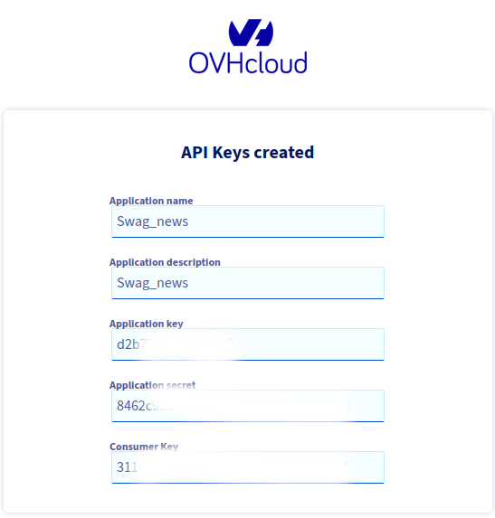

**Tuto réalisé avec :**
* HAOS 11.4, Core 204.1.2
* Add-on : Zigstar 0.40
* Matériels : [Sonoff Zigbee 3.0 USB Dongle Plus **P**](https://amzn.to/41W8f4W) 

BLABLA SWAG


**Pré-requis**

Si vous installez Swag en local chez vous, il faudra rediriger le port 443 de votre routeur/box vers l'IP de votre serveur hebergeant Swag.

Je pars toujours d'une installation de [Debian 12](/blog/linux_debian_12_installation/), puis de [Docker](/blog/linux_debian_docker_installation/) en suivant mes articles.

## Installation
Comme je le préfere, nous utiliserons docker compose pour installer Swag.
1. [Connectez-vous en SSH](/blog/linux_connexion_ssh/) au serveur,
1. Rendez-vous dans le dossier `docker` (`cd docker`) (Si vous avez suivi mon tutoriel sur l'[installation de Docker](/blog/linux_debian_docker_installation/), sinon rendez vous dans le dossier contenant vos conteneurs docker),
1. Créez un dossier nommé `swag` (`mkdir swag`) et rendez vous dans ce dernier (`cd swag`)
1. Créez le dossier config, (`mkdir config`),
1. Créez le fichier `docker-compose.yaml` (`nano docker-compose.yaml`) et coller le contenu ci-dessous:
```yaml
services:
  swag:
    image: linuxserver/swag:2.9.0
    container_name: swag
    restart: unless-stopped
    cap_add:
      - NET_ADMIN
    environment:
      - PUID=$PUID
      - PGID=$PGID
      - TZ=$TZ
      - URL=$NDD
      - VALIDATION=dns
      - SUBDOMAINS=wildcard
#      - CERTPROVIDER= #optional
      - DNSPLUGIN=ovh #optional
      - PROPAGATION=60 #optional
      - EMAIL=$EMAIL #optional
      - ONLY_SUBDOMAINS=true #optional
#      - EXTRA_DOMAINS= #optional
#      - STAGING=false #optional
#      - DOCKER_MODS=linuxserver/mods:swag-crowdsec #|linuxserver/mods:swag-dbip #|linuxserver/mods:swag-dashboard #|linuxserver/mods:swag-maxmind
#      - CROWDSEC_API_KEY=$CROWDSEC_API_KEY ## Genere avec docker exec -t crowdsec cscli bouncers add bouncer-swag
#      - CROWDSEC_LAPI_URL=http://crowdsec:8080
#      - MAXMINDDB_LICENSE_KEY=$MAXMINDDB_LICENSE_KEY
    volumes:
      - ./config:/config
    ports:
      - 443:443
#      - 80:80 #optional
#      - 81:81
    networks:
      - swag_net
      - web_net
      
networks:
  swag_net:
    name: swag_net
  web_net:
    name: web_net
```
1. Créez du fichier `.env`
***Note :** Votre PUID et PGID peuvent etre récuperé via la commande `id votre_user`*
```bash
PUID=1000
PGID=1000
TZ=Europe/Paris
NDD=votre_ndd.fr
EMAIL=mon@mail.fr
```

Une fois les fichiers sauvegardés, lancez la creation du conteneur via `docker compose up -d`. Des fichiers devraient apparaitre dans le dossier config.

Arretons le conteneur via la commande `docker stop swag`.

### Configuration du service DNS.
J'utilise OVH pour mes noms de domaine, donc il a fallut que je créé une application a [cette adresse](https://eu.api.ovh.com/createToken/)

Une fois connecté a votre compte OVH, il vous demande :
* Donner un nom a votre application dans Application Name,
* *Otionnel* Mettre une description dans Application description,
* `Validity` a mettre sur `Unlimited`,
Dans `Rights` (les droits) mettre :
* GET -> /domain/zone/*
* PUT -> /domain/zone/*
* POST -> /domain/zone/*
* DELETE -> /domain/zone/*


Pour finir cliquer sur `Create`.
Sauvegarder bien les informations.


Retournons a notre conteneur SWAG.
Dans le dossier `swag`, `config` puis `dns-conf` rerchercher et éditer le fichier `ovh.ini` avec vos elements puis sauvegarder.
```bash
# Instructions: https://github.com/certbot/certbot/blob/master/certbot-dns-ovh/certbot_dns_ovh/__init__.py#L20
# Replace with your values
dns_ovh_endpoint = ovh-eu
dns_ovh_application_key = MDAwMDAwMDAwMDAwMDAwMDAwMDAwMDAw
dns_ovh_application_secret = MDAwMDAwMDAwMDAwMDAwMDAwMDAwMDAw
dns_ovh_consumer_key = MDAwMDAwMDAwMDAwMDAwMDAwMDAwMDAw
```
Nous relancons le containeur avec `docker compose up -d`.

Logs
```
[migrations] started
[migrations] 01-nginx-site-confs-default: skipped
[migrations] done
───────────────────────────────────────
      ██╗     ███████╗██╗ ██████╗ 
      ██║     ██╔════╝██║██╔═══██╗
      ██║     ███████╗██║██║   ██║
      ██║     ╚════██║██║██║   ██║
      ███████╗███████║██║╚██████╔╝
      ╚══════╝╚══════╝╚═╝ ╚═════╝ 
   Brought to you by linuxserver.io
───────────────────────────────────────
To support the app dev(s) visit:
Certbot: https://supporters.eff.org/donate/support-work-on-certbot
To support LSIO projects visit:
https://www.linuxserver.io/donate/
───────────────────────────────────────
GID/UID
───────────────────────────────────────
User UID:    1000
User GID:    1000
───────────────────────────────────────
using keys found in /config/keys
Variables set:

0

0
TZ=Europe/Paris
URL=mon_ndd.fr
SUBDOMAINS=wildcard
EXTRA_DOMAINS=
ONLY_SUBDOMAINS=true
VALIDATION=dns
CERTPROVIDER=
DNSPLUGIN=ovh
EMAIL=mon@mail.fr
STAGING=
Different validation parameters entered than what was used before. Revoking and deleting existing certificate, and an updated one will be created
Using Let's Encrypt as the cert provider
SUBDOMAINS entered, processing
Wildcard cert for only the subdomains of mon_ndd.fr will be requested
E-mail address entered: mon@mail.fr
dns validation via ovh plugin is selected
Generating new certificate
Saving debug log to /var/log/letsencrypt/letsencrypt.log
Account registered.
Requesting a certificate for *.mon_ndd.fr
Unsafe permissions on credentials configuration file: /config/dns-conf/ovh.ini

Waiting 120 seconds for DNS changes to propagate

Successfully received certificate.
Certificate is saved at: /etc/letsencrypt/live/mon_ndd.fr/fullchain.pem
Key is saved at:         /etc/letsencrypt/live/mon_ndd.fr/privkey.pem
This certificate expires on 2023-08-08.
These files will be updated when the certificate renews.
NEXT STEPS:
- The certificate will need to be renewed before it expires. Certbot can automatically renew the certificate in the background, but you may need to take steps to enable that functionality. See https://certbot.org/renewal-setup for instructions.
- - - - - - - - - - - - - - - - - - - - - - - - - - - - - - - - - - - - - - - -
If you like Certbot, please consider supporting our work by:
 * Donating to ISRG / Let's Encrypt:   https://letsencrypt.org/donate
 * Donating to EFF:                    https://eff.org/donate-le
- - - - - - - - - - - - - - - - - - - - - - - - - - - - - - - - - - - - - - - -
New certificate generated; starting nginx
The cert does not expire within the next day. Letting the cron script handle the renewal attempts overnight (2:08am).
[custom-init] No custom files found, skipping...
[ls.io-init] done.
Server ready
```
### Activation du HSTS.

Editez le fichier `/config/nginx/ssl.conf` et decommenter la ligne suivante.
```bash
# HSTS (ngx_http_headers_module is required) (63072000 seconds)
add_header Strict-Transport-Security "max-age=63072000" always;
```
On arrete et redemarre le containeur.

### Fail2ban.
Fail2ban est inclu dans SWAG par defaut, il peut etre personnalisé, mais nous verrons peut etre cela dans un autre article.

Voici quelques commandes qui peuvent vous etre utiles :
* Voir les "prisons" actives : `docker exec -it swag fail2ban-client status`
* Voir les IPs bannies pour une "prison" : `docker exec -it swag fail2ban-client status <NOM_PRISON>`
* Débannir une IP d'une "prison" : `docker exec -it swag fail2ban-client set <JAIL-NAME> unbanip <ADRESSE_IP>`,
* Bannir une IP dans une "prison" : `docker exec -it swag fail2ban-client set <JAIL-NAME> banip <ADRESSE_IP>`.

## Utilisation de Swag.
Nous avons dèja vu pour Authelia, comment declarer un acces externe pour une application avec Swag. Nous allons essayer de balayer les utilisatiuons les plus courantes.

**Quelques remarques :**
* Votre conteneur doit etre sur le meme reseau (reseau docker) que Swag,
* Vous n'avez pas besoin de declarer les Ports dans le docker-compose,
* Vos conteneurs peuvent etre dans un docker-compose different (c'est meme conseillé)

>Si vous comptez n'utiliser que les sous domaine (conformement au parametre `- ONLY_SUBDOMAINS=true #optional` dans le docker-compose de Swag), vous pouvez supprimer tous les fichier *.subfolder.conf.sample avec la commande `rm *.subfolder.conf.sample` a executer dans le dossier `proxy-confs`.

### Configurer l'acces a un conteneur interne.
#### Fichier existant.

#### Depuis le fichier template.

### Acceder a une application via une IP


#### Sources.
* https://docs.linuxserver.io/images/docker-swag
* https://www.linuxserver.io/blog/blocking-malicious-connections-with-crowdsec-and-swag
* https://www.authelia.com/
* https://www.forum-nas.fr/threads/tuto-installer-swag-en-docker-reverse-proxy.15057/

* [Calculer les masques IP](https://cric.grenoble.cnrs.fr/Administrateurs/Outils/CalculMasque/)
