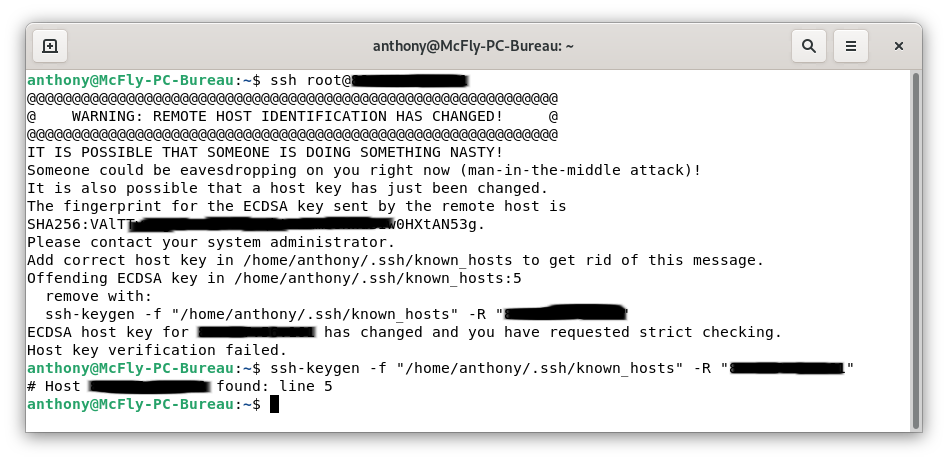
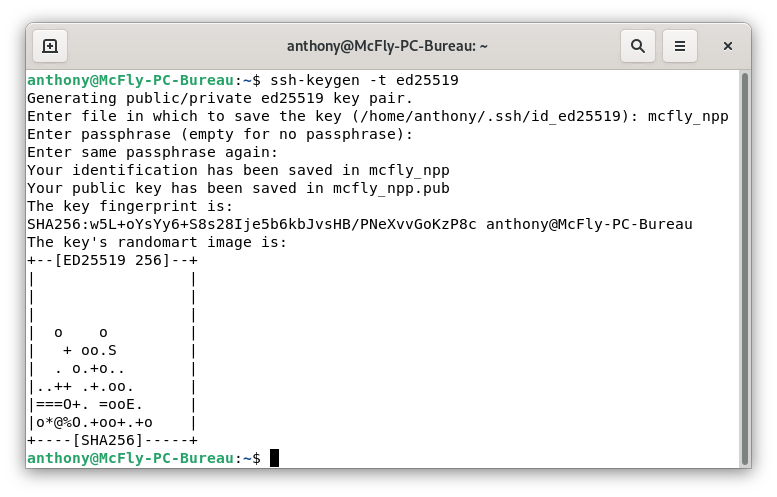
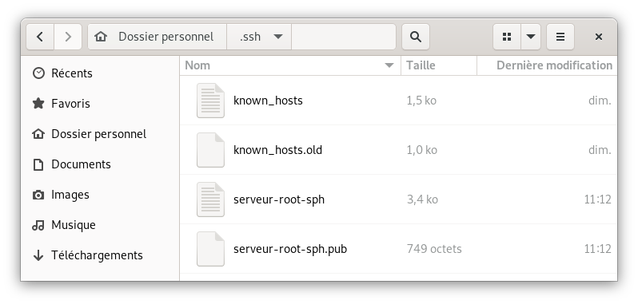
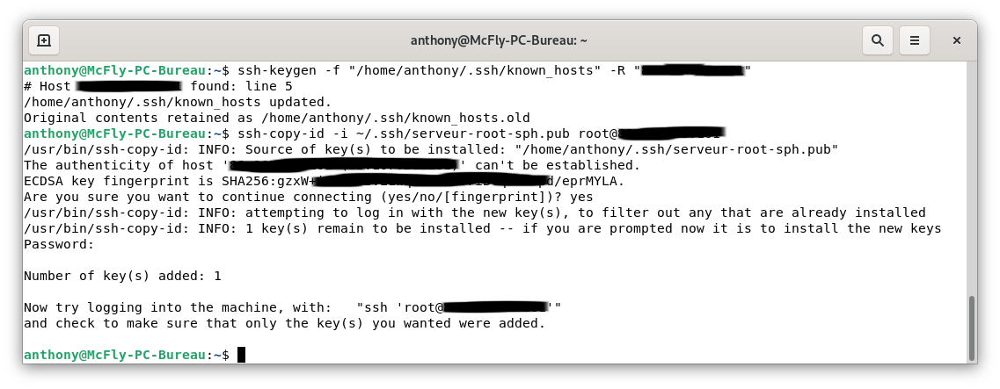

Dès que l'on commence à travailler avec un serveur ou en ligne de commande, la connexion en SSH devient obligatoire.

Voici comment se connecter simplement en SSH avec un utilisateur et un mot de passe.

Nous allons voir comment se connecter en SSH depuis une machine Linux, mais aussi comment sécuriser cette connexion.

## Connexion SSH depuis un Terminal

Il est possile d'utiliser des applications, lais la connexion depuis un Terminal suffit amplement

Dans un terminal, il suffit de taper la commande suivante.
```bash
ssh root@ip-de-votre-serveur
```

Lors de la première connexion au serveur, il vous demandera de valider la clé ECDSA en tapant `yes`


Si vous vous êtes déjà connecté sur ce serveur avant une réinstallation, il vous demandera de supprimer l'ancienne clé via la commande suivante.
`ssh-keygen -f "/home/anthony/.ssh/known_hosts" -R "XXX.XXX.XXX.XXX"`



## Connexion via Codium
Codium est une version, Opensource et debarrassé des mouchards Microsoft, de Visual Studio Code.
Quand on commence a bidouiller, c'est un super outil.

Il existe plusieurs exentensions pour se connecter en SSH de puis VSC (Visual Studio Code) ce qui simplifi les copier/.coller de code, car l'edition peut se faire directement depuis VSC.

L'extension que j'utilise est [SSH Client](https://marketplace.visualstudio.com/items?itemName=cweijan.vscode-ssh) car elle fonctionne aussi sur une version serveur de VSC.

Il suffit de la rechercher depuis le market, de l'installer puis d'ajouiter vos serveur.

Il est possible soit de se connecter avec un login/mot de passe, ou avec une clé SSH.


## Conclusion

À vous les joies de la bidouille sur serveur.

Personnellement, j'uilise plus souvent VSC, plutoy que le Terminal, mais c'est bien de connaitre les deux.

## Sources
* [Extension SSH Client](https://github.com/vscode-ext-studio/vscode-ssh)


Quand l'on commence à utiliser des serveurs sur internet, il est bien évident qu'ils leur faillent une sécurité accrue pour ne pas se faire pirater.
Nous ne sommes pas tous ingénieurs en sécurité informatique, mais il y a quand même des petites astuces que l'on peut faire pour en améliorer leur sécurité.

Nous allons voir ensemble quelques manipulations simples rendant les attaques plus compliquées.

## Les différents types de clé.
Il existe plusieurs types de clés asymétriques, mais les plus connues sont RSA, ECDSA, ED25519 et DSA.
* [DSA](https://fr.wikipedia.org/wiki/Digital_Signature_Algorithm) est plus récent et se voulait être une alternative au RSA (qui à l'époque était breveté). Il serait plus rapide, mais n'est plus supporté depuis openssh v7.
* [RSA](https://fr.wikipedia.org/wiki/Chiffrement_RSA) est le premier type de clé à être sorti et connait plusieurs versions.
* [ECDSA](https://fr.wikipedia.org/wiki/Elliptic_curve_digital_signature_algorithm) : Longueurs de clés plus courtes et des opérations de signature et de chiffrement plus rapides, mais semble bénéficier d'une Backdoor US. **conseillé par l'ANSSI**
* [ED25519](https://fr.wikipedia.org/wiki/EdDSA) : Semble être le nouveau format dans le monde de la cybersécurité longueurs de clés  de 256 bits et des opérations de signature et de chiffrement plus rapides.


Pour ma part, j'utilise le ED25519 car j'utilise que des distributions récentes.

## Principe simple.
* Vous générez une clé publique et une privée.
* Vous mettez la clé publique sur tous les serveurs que vous souhaitez contrôler 
* Vous gardez la clé privée bien au chaud sur le ou les systèmes que vous utilisez pour vous connecter.

Lorsque vous vous connectez les deux clés communiquent et autorise la connexion.
Il peut vous demander de saisir la passphrase si vous en avez choisi une lors de la génération des clés, cela augmente la sécurité.

**Quel est l'intérêt de se connecter avec des clés s'il faut rentrer un mot de passe ?**
**La sécurité**. Si vous vous faites dérober votre clé privée, la personne malveillante aura accès a toutes vos machines reliées à cette clé. (il faut connaitre les ndd ou adresse IP quand même). Avec la passphrase il y a une double sécurité tout en ayant un seul mot de passe à retenir pour toutes vos connexions.

## Générer sa paire de clés.
Pour créer une paire de clés, sur votre ordinateur (Linux de préférence).
* Ouvrir un terminal,
* Lancer la commande `ssh-keygen -t ed25519`

*Par défaut vos clés sont dans `~/.ssh/votre_cle` pour la clé privée et `~/.ssh/votre_cle.pub` pour la clé publique.*

*Vous pouvez générer autant de clé que vous voulez avec la même passphrase par exemple.*



Aprés avoir affiché les dossiers cachés, regarder dans le dossier `.ssh`.


## Envoyer la clé publique sur le serveur.
### Depuis votre ordinateur.
`ssh-copy-id -i ~/.ssh/votre_cle.pub -p num_port user@ndd_ou_ip_du_serveur`

*Si vous vous êtes déjà connecté au serveur via SSH, il risque de vous mettre un avertissement, il suffit de taper la commande qu'il vous donne `ssh-keygen -f /home/anthony/.ssh/known_hosts -R XXX.XXX.XXX.XXX`*



*Si vous essayez d'envoyer la clé d'un utilisateur qui ne peut se connecter en SSH, il faut passer par un compte autorisé puis se connecter à son utilisateur (`su votre_suer`), aller dans son dossier (`cd ~/`) pour créer un dossier `.ssh` (`mkdir .ssh`) et ajouter le fichier `authorized_keys` (`nano authorized_keys`) dans lequel vous devez copier la clé **publique** manuellement*

### Modifier les paramètres SSH.
* Connecter vous en SSH sur votre serveur `ssh -p num_port user@ndd_ou_ip_du_serveur` (`-p` est optionnel, si vous avez changé le port SSH par défaut),
* Activer la connexion par clé publique, dans `/etc/ssh/sshd_config` (si ce n'est pas déjà fait), avec la commande `nano /etc/ssh/sshd_config`,
```
PubkeyAuthentication yes
```
* CTRL+X pour sauvegarder
* `sudo service sshd restart` pour valider les nouveaux paramètres.

## Connexion.
Ouvrez un autre terminal et tester la connexion
```
`ssh -p num_port user@ndd_ou_ip_du_serveur`
```

Si vous avez mis une passphrase lors de la génération, il vous demande de la saisir.

Vous voilà maintenant connecté de manière plus sécurisée.

## Allez plus loin avec le fichier `sshd_config`.
Il est possible de sécuriser encore plus votre serveur par quelques réglages supplémentaires.

Vérifier que cette ligne apparaisse en non commenté. (adapter en fonction du type de clé choisie)
```
HostKey /etc/ssh/ssh_host_ed25519_key
```
### Désactiver la connexion par mot de passe.
Pour désactiver la connexion par mot de passe, dans `/etc/ssh/sshd_config`,
```
PasswordAuthentication no
```
### Changer le port par défaut.
Le port 22 est le port par défaut sur toutes les machines lors de leurs installations, il est donc naturellement la source d'attaque par des robots.
Ne choisissez pas un [port déjà connu](https://fr.wikipedia.org/wiki/Liste_de_ports_logiciels) utiliser un port compris entre 49152-65535.
```
Port 52145
```

### Désactiver l'accès SSH avec le compte `root`.
```
PermitRootLogin No
```

Une fois les parametres changés n'oublier pas de sauvegarder et relancer le service `ssh`.


## Conclusion.
Je ne suis pas un expert en sécurité informatique, se guide est élaboré à base de plusieurs informations glanées sur le net.

Je suis preneur de toutes autres modifications pouvant apporter plus de sécurité.