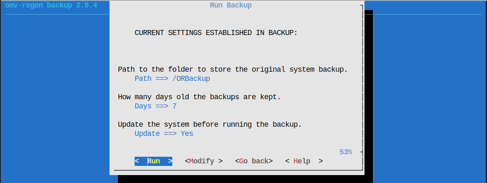
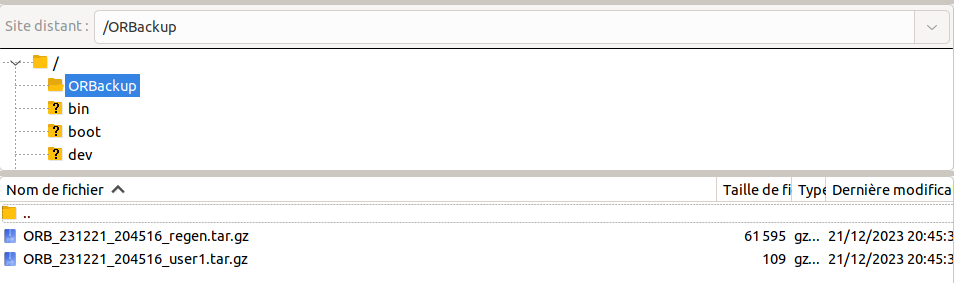
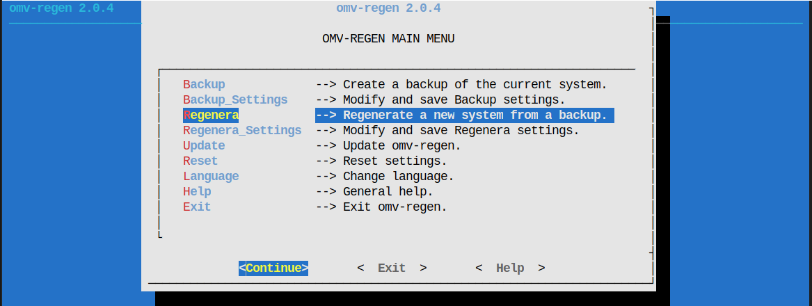

# OpenMediaVault - Sauvegarder et restaurer votre installation OMV-REGEN


Le gros probleme de OpenMediaVault (OMV) pour moi, c'etait l'impossibilité de creer une sauvegarde de notre configuration de maniere simple, mais maintenant ce n'est plus un probleme grace a l'outil [OMV Regen]() qui nous a été concocté par un modérateur deu forum OMV, [chente](https://forum.openmediavault.org/wsc/index.php?user/35013-chente/).

**Prérequis**
Il vous faut un acces SSH a votre NAS OpenMediaVault (??????Voir l'article sur son installation?????).

Connectez vous en SSH a votre NAS puis lancer la commande suivante 
```bash
sudo wget -O - https://raw.githubusercontent.com/xhente/omv-regen/master/omv-regen.sh | sudo bash
```

Ensuite lancer l'outil de sauvegarde et restauration avec la commande 

```bash
omv-regen
```


A partir de ce moment vous pouvez lancer votre premiere sauvegarde en tapant sur la touche <span><kbd>ENTREE</kbd></span> de votre clavier.

il va vous proposer des parametres par defaut a vous de les garder ou de les modifier.


Apres avoir fait votre premiere auvegarde, le dossier ORBackup est créé avec votre premier backup a l'interieur 


**Restaurer**

Pour restaurer, connectez vous avec un client SSH ou FTP comme filezilla puis a jouter votre sauvegarde a restaurer dans le dossier.

Ensuite lancer l'outil, toujours depuis un terminal, avec la commande `omv-regen` sauf que cette fois ce n'est aps backup que l'on va prendre, vous vous en doutez.

C'est `Regenera` 


Par contre, j'ai des doutes sur le transfert du sauvegarde OMV installe sur Proxmox vers une installation clean.
## Sources.
* [Github du Plugin](https://github.com/xhente/omv-regen/blob/master/README.md)
* [Sujet sur le Forum OMV](https://forum.openmediavault.org/index.php?thread/47589-how-to-migrate-restore-omv-settings-to-another-system-with-omv-regen/)

