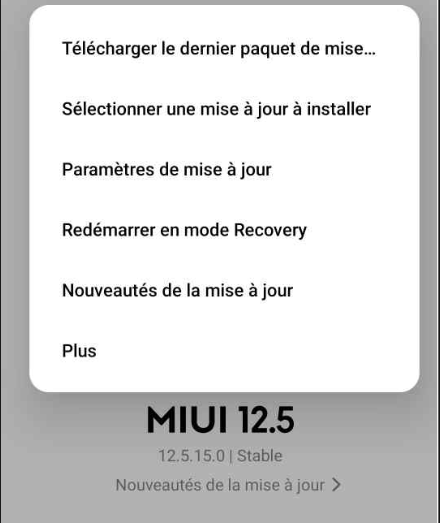
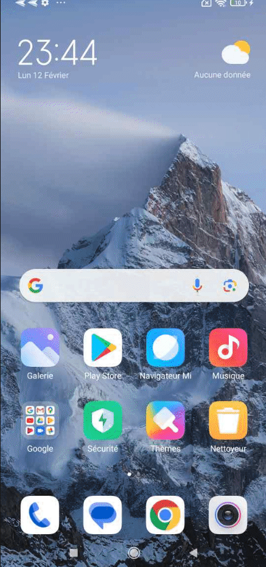

## Mettre a jour son Xiaomi Redmi Note 8 Pro (begonia)
Mettez a jour votre Redmi Note 8 Pro vers la versions v12.5 minimum (android 11) (la derniere version officielle de Xiaomi la 12.5.15.0.RGGEUXM, mais je n'ai pas réussie a passer au dessus de la v12.5.14.0)

Pour ma part je suis parti de la v12.0.4.0 QGGEUXM (Android 10), 
***Note :** C'est la roms Europe dite "Global" mais qui est replacé par la EEA depuis la version 12.0.6.0 aussi a destination de l'Europe.*

Alors deux choix s'offre a vous :
1. Jouer sur les régions pour récuperer de maniere officiellle les dernieres roms (recommandé)
1. Récuperer les roms sur les lien ci dessous puis les installer depuis votre smartphone (elles seront verifiées avant d'etre installé).
1. Récuperer les roms sur les lien ci dessous puis les installer via ADB.

### Depuis le téléphone
Pour mettre a jour directement depuis Xiaomi, il va falloir jouer avec les régions (Guyanne francaise, serbie, gréce, il faut essayer et redemarrer le smartphone a chauqe fois).
Rendez-vous dans les Paramètres supplémentaires `Paramètres -> Paramètres supplémentaires -> Région`


***Note :** Je me suis donc arrété a la version 12.5.14 car je n'arrivais pas a voir la derniere 12.5.15. **Le pricipal c'est d'etre sur une version 12.5***

### Depuis les liens
Il va falloir récuperer la 12.0.6.0.QGGEUXM via ce lien https://xiaomifirmwareupdater.com/miui/begonia/stable%20beta/V12.0.6.0.QGGEUXM/ puis le coller dans votre téléphone.

Faite de meme avec la derniere version 12.5.15.0.RGGEUXM (2.4Go) recuperable ici https://xiaomifirmwareupdater.com/miui/begonia/stable/V12.5.15.0.RGGEUXM/

***Note :** Cette méthode n'a pas marché chez moi, les roms ne passaient pas le check je me suis donc arrété a la version 12.5.14. Mais je n'avais pas de carte SIM dans le telephone, peut etre est-ce lié a ca. **Le pricipal c'est d'etre sur une version 12.5***

Ensuite, aller dans `Parametres -> A propos du téléphone` puis cliquer sur `Version MIUI` (carré image en haut a gauche)
Une fois affiché, appuyer 7 fois sur le logo, un popup doit vous afficher `des fonctionnalites de mise a jour supplementaires sont disponnible`.

Cliquer maintenant sur les trois petits point en haut a droite puis `Selectionner une mise a jour a installer` selectionner le fichier telechargé precedemment (d'abord le v12.0.6.0) puis apres une verification il va l'installer et redemarrer.



### Installer TWRP

1. Activez les options developpeur

Rendez-vous dans les options développeur `Paramètres -> Paramètres supplémentaires -> Options développeur`.
1. Verifiez que le deverouillage oem est désacivé (doit etre grisé)
1. Verifiez que Statut du déverrouillage Mi est bien `Déverrouillé`
1. Activez le débogage USB

1. Branhez votre smartphone a votre PC et validez le popup d'autorisation du debogage USB.

Récuperer le fichier `fastboot-zip/MIUI12.5/BRP3.5.2v3.1-fastboot.zip` a cette adresse https://sourceforge.net/projects/begonianon-cfw/ et dézipper le pour récuperer le fichier `BRP3.5.2v3.1.img`
Assurez vous d'avoir le fichier ZIP de la version de MUI installée sur votre smartphone (miui_BEGONIAEEAGlobal_V12.5.14.0.RGGEUXM_d0012c6e24_11.0.zip) qu'il faut déziper pour récuperer le fichier `vbmeta.img`

Mintenant pour lancer les commandes suivantes il vous faut ADB et Fastboot sur votre machine
I vous faut ADB et fastoot sur votre PC.
Pour Linux
```bash
anthony@McFly-Bureau:~/Téléchargements/MiUnlockTool/platform-tools_r34.0.5-linux
/platform-tools$ adb version
Android Debug Bridge version 1.0.41
Version 34.0.0-9570255
Installed as /usr/lib/android-sdk/platform-tools/adb

```

```bash
anthony@McFly-Bureau:~/Téléchargements/MiUnlockTool/platform-tools_r34.0.5-linux
/platform-tools$ fastboot --version
fastboot version 34.0.5-10900879
Installed as /usr/lib/android-sdk/platform-tools/fastboot

```
Pour Windaub


 et récuperer le fichier 

Dans le dossier platformtool????, copiez le fichier `vbmeta.img` (remplacez celui existant) et le fichier `BRP3.5.2v3.1.img` de votre version de MIUI et lancez les commandes suivantes dans un Terminal depuis le dossier Platformtools??????

```bash
adb reboot bootloader
fastboot devices

fastboot flash recovery BRP3.5.2v3.1.img
fastboot flash vbmeta miui_BEGONIAEEAGlobal_V12.5.14.0.RGGEUXM_d0012c6e24_11.0/vbmeta.img --disable-verity --disable-verification
fastboot reboot recovery
```

Retour des commandes
```bash
anthony@McFly-Bureau:~/Téléchargements/MiUnlockTool/platform-tools_r34.0.5-linux
/platform-tools$ adb reboot bootloader
anthony@McFly-Bureau:~/Téléchargements/MiUnlockTool/platform-tools_r34.0.5-linux
/platform-tools$ fastboot devices
8xnbw8giv4fuucfq	 fastboot
anthony@McFly-Bureau:~/Téléchargements/platform-tools_r34.0.5-linux/platform-too
ls$ fastboot flash recovery BRP3.5.2v3.1.img 
Sending 'recovery' (65536 KB)                      OKAY [  2.119s]
Writing 'recovery'                                 OKAY [  0.305s]
Finished. Total time: 2.428s
anthony@McFly-Bureau:~/Téléchargements/platform-tools_r34.0.5-linux/platform-too
ls$ fastboot flash vbmeta vbmeta.img --disable-verity --disable-verification
Rewriting vbmeta struct at offset: 0
Sending 'vbmeta' (4 KB)                            OKAY [  0.012s]
Writing 'vbmeta'                                   OKAY [  0.001s]
Finished. Total time: 0.016s
anthony@McFly-Bureau:~/Téléchargements/platform-tools_r34.0.5-linux/platform-too
ls$ fastboot reboot recovery
Rebooting into recovery                            OKAY [  0.001s]
Finished. Total time: 0.251s
```

Votre smartphone redemarre sur un TWRP modifié

Passons a l'installation d'une Rom personnalisée

## Via le recovery (TWRP) 
***ATTENTION :** Cette methode peut ne pas fonctionner si votre TWRP n'est pas compatible avec la version android de votre ROM dns ce cas provilegiez la methode ADB ou alors flasher le recovery qui peutetre fourit avec la roms que vous souhaitez installer en suicat la methode ci-dessous en remplcant le roms.zip par votre fichier revery.ip.*

Exemple avec crDroid qui apporte la versio Android 14 a votre Xiaomi Redmi Note 8 Pro, il lui faudra donc un recovery compatible Android 14 qui est recuperable via le site de crDroid.


Démmarage sous recovery
Si loupe Bouton ON/OFF + Volume Haut

Lors du lacement de TWRP, vous pouvz le passer en Francais en cliquant sur `Select language`
Ensuite faites glisser la barre en bas vers la droite pour `autorier les modifications`


Selectionner Formater (Wipe) puis Formater les données (format data() taper `yes` puis valider.
***ATTENTION :** Toutes vos données seront supprimées et c'est **irreversible**.*
Ensite fites Retour (Retunr)puis cliquez deux fois sur le fleche `<` pour revenir au menu principal

ensuite allez dans Montage partitions (Mount) puis selectionner Systéme (System) et Données (data),
Cliquez sur Sélect. l'emplacement (Select Storage) puis sur mémoire interne (Internal Storage) et sur OK, vous drevriez avoir votre smarpthone reconnu sous linux (ou windaub).

Coller la roms custom de votre choix dans le dossier TWRP par exemple ou a la racine si vous preferez.


Une fois la rom collé, retourner sur la page principal du menu puis 
1. selectionnez Installer (install),
1. Selectionnez votre roms.zip laisser les deux cases decochées,
1. Faite glisser pour confirmer le flash en bas de l'ecran.
Une fois le flash terminé, revenez au menu principale
1. Cliquez sur Formatter, Formatter les données, tapez `yes`,
1. Cliquez sur Redémarrer le systeme (reboot systeme)

Normalement vore telephone devrait booter sur votre custom rom fraichement installée.


## Via ADB
Entrer dans le recovery avec Bouton On/Off et volume haut
aller dans Paramètres vancé (advanced) puis Transfert vi ADB (sideload)

cocher Effacer le cache Dalvik (Wipe Davlvik Cache) rt Effacer le Cache  (Wipe Cache) 
Faites glisser la barrde du bas pour valider.

maintenant dans un Terminal, lancer la commande suivante (adapter avec le nom de votre roms)
`adb sideload filename.zip`

Retour avec cdDroid :
```bash
anthony@McFly-Bureau:~/Téléchargements/platform-tools_r34.0.5-linux/platform-too
ls$ adb sideload roms/crDroidAndroid-14.0-20240112-begonia-v10.1.zip 
serving: 'roms/crDroidAndroid-14.0-20240112-begonia-v10.1.zip'  (~15%)    
```

Une fois le flash terminé, redémarré le smartphone.

S'il redemarre sur TWRP,
## Installer Android 14
Nous allons installé crDroid pour Xiaomi Redmi Note 8 Pro avec Android 14.

Il faut d'abord installer le recvery compatible ici en suivant la meme procedure qu'au dessus mais au lieu de flasher le fichier BPR????.img vous allez flasher le fichier recovery .img qui se trouve dans le dosier fraichement telechargé depuis le lien de crDroid
Ensuite pssons a l'installtion de la roms rn suivant le procedure via TWRP ou via ADB. en faisant un format data puis en rebootant le syseme a la fin.

## Revenir sur la rom MIUI
Pour revenir a la rom d'origine, il vous suffit soit de passer la TWRP et copier coller la derniere version de la roms Xiaomi pour votre smartphone ou alors via aADB.

### Sources
* https://xdaforums.com/t/recovery-unofficial-begonia-recovery-project-themed-twrp-3-5-0-v2-unified-begonia-begoniain.4242717/
* https://www.phonandroid.com/forum/threads/probleme-mise-a-jour-miui-sur-redmi-note-8-pro.214881/
* https://android-mt.ouest-france.fr/tutoriel/astuces/liste-des-commandes-adb-et-fastboot-loutil-indispensable-du-super-utilisateur-android/74897/
