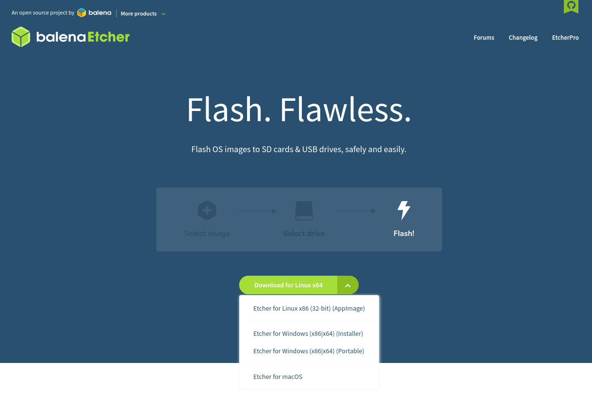
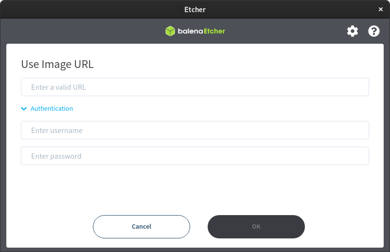
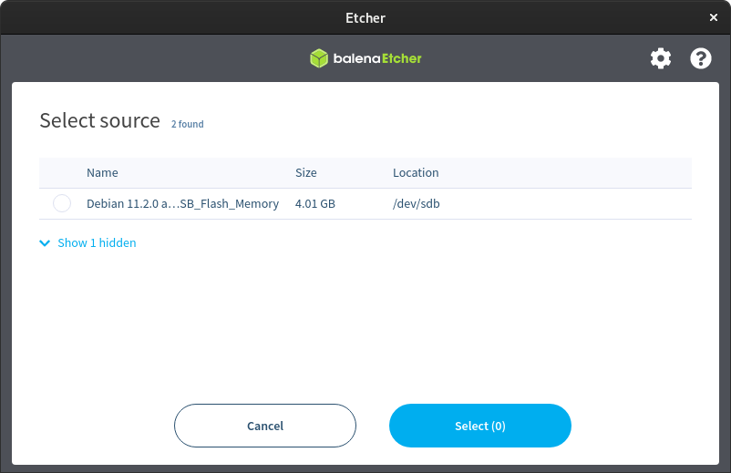
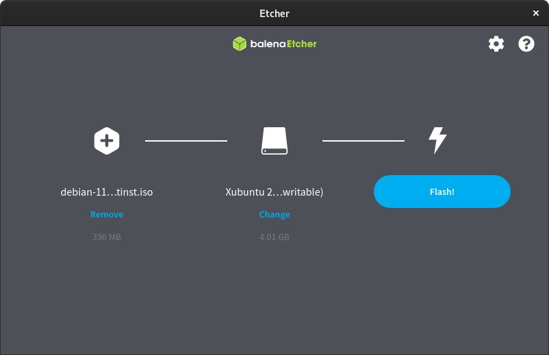
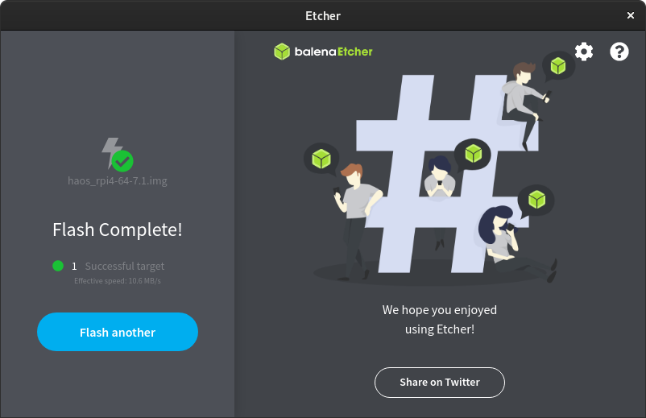

Nous allons voir rapidement comment utiliser [Balena Etcher](https://etcher.balena.io/) pour copier vos systèmes d'exploitation (OS) sur un support amovible en vue de les installer sur une machine ou tout simplement de démarrer dessus.

C'est un logiciel très simple d'utilisation avec deux possibilités :
* À partir d'un OS téléchargé en avance,
* À partir d'une URL.

## Utilisation

Il vous suffit de récupérer la version correspondante à votre OS sur le [site de Balena Etcher](https://etcher.balena.io/#download-etcher), Pour Windows et Linux, l'application existe en version portable ou AppImage (pas besoin de l'installer, ça suffit largement).


Une fois récupéré et exécuté, il ne vous reste plus que trois étapes :
* Sélectionner l'image (OS) téléchargé OU via une URL,
* Sélectionner le support,
* Cliquer sur FLASH.

****L'OS téléchargé peut être dans un format compressé (ZIP, 7ZIP, RAR), Balena le décompressera tout seul****

Voici une série d'images.







Vous avez vu, c'était rapide ;)


## Installation en dur sur Ubuntu ou Debian

*Cette partie est complétement facultative pour les systèmes acceptant les AppImage.*

**Prérequis**

Il faut avoir le paquet `curl` d'installé, si ce n'est pas le cas où si vous ne savez pas, il suffit de taper 'sudo apt install curl` dans votre terminal.

*Retour de la commande*

```bash
anthony@McFly-Bureau:~$ sudo apt install curl
[sudo] Mot de passe de anthony : 
Lecture des listes de paquets... Fait
Construction de l'arbre des dépendances... Fait
Lecture des informations d'état... Fait      
Les paquets suivants ont été installés automatiquement et ne sont plus nécessaires :
  libflashrom1 libftdi1-2
Veuillez utiliser « sudo apt autoremove » pour les supprimer.
Les NOUVEAUX paquets suivants seront installés :
  curl
0 mis à jour, 1 nouvellement installés, 0 à enlever et 0 non mis à jour.
Il est nécessaire de prendre 194 ko dans les archives.
Après cette opération, 453 ko d'espace disque supplémentaires seront utilisés.
Réception de :1 http://fr.archive.ubuntu.com/ubuntu jammy-updates/main amd64 curl amd64 7.81.0-1ubuntu1.6 [194 kB]
194 ko réceptionnés en 0s (894 ko/s)
Sélection du paquet curl précédemment désélectionné.
(Lecture de la base de données... 195544 fichiers et répertoires déjà installés.)
Préparation du dépaquetage de .../curl_7.81.0-1ubuntu1.6_amd64.deb ...
Dépaquetage de curl (7.81.0-1ubuntu1.6) ...
Paramétrage de curl (7.81.0-1ubuntu1.6) ...
Traitement des actions différées (« triggers ») pour man-db (2.10.2-1) ...
```

**Récupérer le fichier**

Récupérer le fichier d'installation avec la commande suivante :
```bash
curl -1sLf \
   'https://dl.cloudsmith.io/public/balena/etcher/setup.deb.sh' \
   | sudo -E bash
```

*Résultat de la commande*

```bash
anthony@McFly-Bureau:~$ curl -1sLf \
   'https://dl.cloudsmith.io/public/balena/etcher/setup.deb.sh' \
   | sudo -E bash
[sudo] Mot de passe de anthony : 
Executing the  setup script for the 'balena/etcher' repository ...

   OK: Checking for required executable 'curl' ...
   OK: Checking for required executable 'apt-get' ...
   OK: Detecting your OS distribution and release using system methods ...
 ^^^^: ... Detected/provided for your OS/distribution, version and architecture:
 >>>>:
 >>>>: ... distro=ubuntu  version=22.04  codename=jammy  arch=x86_64  
 >>>>:
   OK: Checking for apt dependency 'apt-transport-https' ...
   OK: Checking for apt dependency 'ca-certificates' ...
   OK: Checking for apt dependency 'gnupg' ...
  RUN: Importing 'balena/etcher' repository GPG key ...gpg: Attention : le propriétaire du répertoire personnel « /home/anthony/.gnupg »
            n'est pas sûr
   OK: Checking for apt signed-by key support ...
   OK: Importing 'balena/etcher' repository GPG key ...
   OK: Checking if upstream install config is OK ...
   OK: Installing 'balena/etcher' repository via apt ...
   OK: Updating apt repository metadata cache ...
   OK: The repository has been installed successfully - You're ready to rock!
```

**Installation**

Installer Balena Etcher avec la commande suivante :

```bash
sudo apt-get install balena-etcher-electron
```

*Résultat de la commande*
```bash
anthony@McFly-Bureau:~$ sudo apt-get install balena-etcher-electron
[sudo] Mot de passe de anthony : 
Lecture des listes de paquets... Fait
Construction de l'arbre des dépendances... Fait
Lecture des informations d'état... Fait      
Les paquets suivants ont été installés automatiquement et ne sont plus nécessaires :
  libflashrom1 libftdi1-2
Veuillez utiliser « sudo apt autoremove » pour les supprimer.
Les paquets supplémentaires suivants seront installés : 
  gconf-service gconf-service-backend gconf2 gconf2-common libgconf-2-4
  libgdk-pixbuf-xlib-2.0-0 libgdk-pixbuf2.0-0
Paquets suggérés :
  gconf-defaults-service
Les NOUVEAUX paquets suivants seront installés :
  balena-etcher-electron gconf-service gconf-service-backend gconf2
  gconf2-common libgconf-2-4 libgdk-pixbuf-xlib-2.0-0 libgdk-pixbuf2.0-0
0 mis à jour, 8 nouvellement installés, 0 à enlever et 0 non mis à jour.
Il est nécessaire de prendre 87,8 Mo dans les archives.
Après cette opération, 237 Mo d'espace disque supplémentaires seront utilisés.
Souhaitez-vous continuer ? [O/n] O
Réception de :1 http://fr.archive.ubuntu.com/ubuntu jammy/universe amd64 gconf2-common all 3.2.6-7ubuntu2 [698 kB]
Réception de :2 http://fr.archive.ubuntu.com/ubuntu jammy/universe amd64 libgconf-2-4 amd64 3.2.6-7ubuntu2 [86,0 kB]
Réception de :3 http://fr.archive.ubuntu.com/ubuntu jammy/universe amd64 gconf-service-backend amd64 3.2.6-7ubuntu2 [59,3 kB]
Réception de :4 http://fr.archive.ubuntu.com/ubuntu jammy/universe amd64 gconf-service amd64 3.2.6-7ubuntu2 [17,4 kB]
Réception de :5 http://fr.archive.ubuntu.com/ubuntu jammy/universe amd64 gconf2 amd64 3.2.6-7ubuntu2 [83,9 kB]
Réception de :6 http://fr.archive.ubuntu.com/ubuntu jammy/main amd64 libgdk-pixbuf-xlib-2.0-0 amd64 2.40.2-2build4 [42,6 kB]
Réception de :7 http://fr.archive.ubuntu.com/ubuntu jammy/universe amd64 libgdk-pixbuf2.0-0 amd64 2.40.2-2build4 [2 454 B]
Réception de :8 https://dl.cloudsmith.io/public/balena/etcher/deb/ubuntu jammy/main amd64 balena-etcher-electron amd64 1.7.9 [86,8 MB]
87,8 Mo réceptionnés en 37s (2 401 ko/s)                                       
Sélection du paquet gconf2-common précédemment désélectionné.
(Lecture de la base de données... 195213 fichiers et répertoires déjà installés.)
Préparation du dépaquetage de .../0-gconf2-common_3.2.6-7ubuntu2_all.deb ...
Dépaquetage de gconf2-common (3.2.6-7ubuntu2) ...
Sélection du paquet libgconf-2-4:amd64 précédemment désélectionné.
Préparation du dépaquetage de .../1-libgconf-2-4_3.2.6-7ubuntu2_amd64.deb ...
Dépaquetage de libgconf-2-4:amd64 (3.2.6-7ubuntu2) ...
Sélection du paquet gconf-service-backend précédemment désélectionné.
Préparation du dépaquetage de .../2-gconf-service-backend_3.2.6-7ubuntu2_amd64.deb ...
Dépaquetage de gconf-service-backend (3.2.6-7ubuntu2) ...
Sélection du paquet gconf-service précédemment désélectionné.
Préparation du dépaquetage de .../3-gconf-service_3.2.6-7ubuntu2_amd64.deb ...
Dépaquetage de gconf-service (3.2.6-7ubuntu2) ...
Sélection du paquet gconf2 précédemment désélectionné.
Préparation du dépaquetage de .../4-gconf2_3.2.6-7ubuntu2_amd64.deb ...
Dépaquetage de gconf2 (3.2.6-7ubuntu2) ...
Sélection du paquet libgdk-pixbuf-xlib-2.0-0:amd64 précédemment désélectionné.
Préparation du dépaquetage de .../5-libgdk-pixbuf-xlib-2.0-0_2.40.2-2build4_amd64.deb ...
Dépaquetage de libgdk-pixbuf-xlib-2.0-0:amd64 (2.40.2-2build4) ...
Sélection du paquet libgdk-pixbuf2.0-0:amd64 précédemment désélectionné.
Préparation du dépaquetage de .../6-libgdk-pixbuf2.0-0_2.40.2-2build4_amd64.deb ...
Dépaquetage de libgdk-pixbuf2.0-0:amd64 (2.40.2-2build4) ...
Sélection du paquet balena-etcher-electron précédemment désélectionné.
Préparation du dépaquetage de .../7-balena-etcher-electron_1.7.9_amd64.deb ...
Dépaquetage de balena-etcher-electron (1.7.9) ...
Paramétrage de libgdk-pixbuf-xlib-2.0-0:amd64 (2.40.2-2build4) ...
Paramétrage de gconf2-common (3.2.6-7ubuntu2) ...

Creating config file /etc/gconf/2/path with new version
Paramétrage de libgdk-pixbuf2.0-0:amd64 (2.40.2-2build4) ...
Paramétrage de gconf-service (3.2.6-7ubuntu2) ...
Traitement des actions différées (« triggers ») pour man-db (2.10.2-1) ...
Traitement des actions différées (« triggers ») pour sgml-base (1.30) ...
Traitement des actions différées (« triggers ») pour mailcap (3.70+nmu1ubuntu1) ...
Traitement des actions différées (« triggers ») pour desktop-file-utils (0.26-1ubuntu3) ...
Traitement des actions différées (« triggers ») pour hicolor-icon-theme (0.17-2) ...
Paramétrage de libgconf-2-4:amd64 (3.2.6-7ubuntu2) ...
Traitement des actions différées (« triggers ») pour gnome-menus (3.36.0-1ubuntu3) ...
Traitement des actions différées (« triggers ») pour libc-bin (2.35-0ubuntu3.1) ...
Paramétrage de gconf-service-backend (3.2.6-7ubuntu2) ...
Paramétrage de gconf2 (3.2.6-7ubuntu2) ...
Paramétrage de balena-etcher-electron (1.7.9) ...
chmod: impossible d'accéder à '/opt/balena-etcher-electron/chrome-sandbox': Aucun fichier ou dossier de ce type
```

**Désinstallation**
Et oui, on trouve souvent comment installer, mais jamais comment désinstaller, alors voici la procédure :

```bash
sudo apt-get remove balena-etcher-electron
rm /etc/apt/sources.list.d/balena-etcher.list
apt-get clean
rm -rf /var/lib/apt/lists/*
apt-get update
```

## Conclusion

Depuis un bon moment (découverte de [Ventoy](/blog/ventoy_installation_update) et l'ajout des fonctionnalités de [Raspberry Pi Imager](/blog/raspberry_pi_installer_os)) je n'utilise plus Balena Etcher, mais l'article était écrit depuis un moment, alors je préférais quand même le mettre à disposition, les goûts et les couleurs étant propres à chacun, il peut être utile.

## Sources
* [GitHub de Balena](https://github.com/balena-io/etcher?d_id=3b31ed76-310c-4a90-b691-41da11c4e087&s_id=1668416948422#debian-and-ubuntu-based-package-repository-gnulinux-x86x64)