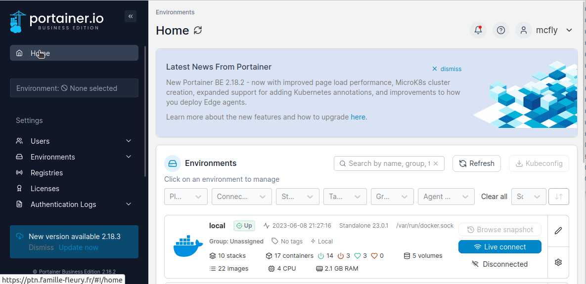
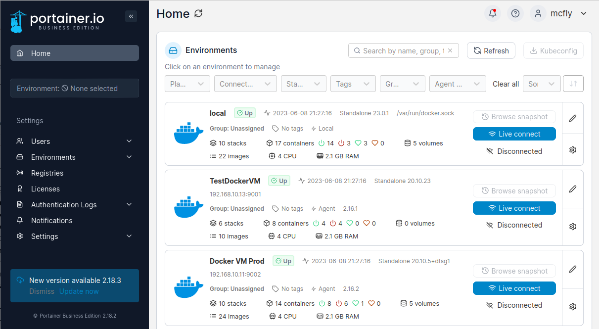

**Tuto réalisé avec :**
* Debian 12.50 sur VM Proxmox
* Docker Version v26.0.0
* Docker Compose v2.25.0
* Portainer CE ou EE en version 2.20.0
* Portainer Agent version 2.20.0

Si vous avez plusieurs serveurs avec Docker, que ce soit des serveurs réels ou des machines virtuelles, il n'est pas très pratique de déployer plusieurs instances Portainer avec quasiment les mêmes réglages, ni même de devoir se connecter à chaque instance Portainer séparément. C'est là qu'entre en jeu Portainer Agent.
Ce dernier va installer une liaison entre le serveur sur lequel il est installé et votre instance Portainer  afin de pouvoir tout gérer depuis une seule interface. Fini la bascule d'adresse IP et les reconnexions.
Vous n'avez plus qu'une seule et unique adresse à connaitre pour gérer vos serveurs Docker.

Lets Go !

**Prérequis**
Ce tutoriel est réalisable que vous soyez en Community Edition ou Buisness Edition.

* Vous avez déjà un [serveur avec Portainer installé](/blog/docker_portainer_installation/), appelé ici serveur maître.
* Vous disposez d'un autre serveur avec [Docker et Docker Compose](/blog/linux_debian_docker_installation/), appelé ici serveur esclave.


## Installation de Portainer Agent.
Sur le serveur esclave :
* Connectez-vous en SSH (`ssh votre_user@ip_du_serveur`),
* Rendez-vous dans le dossier `docker` (`cd docker`) (Si vous avez suivi mon tutoriel sur l'[installation de Docker](/blog/linux_debian_docker_installation), sinon rendez-vous dans le dossier contenant vos conteneurs docker),
* Créez un dossier nommé `portainer_agent`, et a l'intérieur, un dossier `volumes` (`mkdir portainer_agent portainer_agent/volumes`),
* Créez le fichier `docker-compose.yaml` (`nano docker-compose.yaml`) et collez le contenu ci-dessous :
```yaml
services:
  portainer_agent:
    image: portainer/agent:2.20.0
    container_name: portainer_agent
    ports:
      - 9001:9001
    volumes:
      - /var/run/docker.sock:/var/run/docker.sock
      - ./volumes:/var/lib/docker/volumes
    restart: always
```
* Lancez la commande `docker compose up -d`
* Vérifiez avec `docker ps` que votre image est bien lancée.

## Ajout sur votre instance sur le serveur maître.
Connectez-vous à l'instance Portainer, installée sur votre serveur maître.
Dans le menu de gauche :
* Allez dans `Environments`,
* `+ Add environment`,
* Sélectionnez `Docker Standalone`
* Cliquez sur `Start wizard`,
* Cliquez sur `Agent`,
* Donnez un nom a votre instance,
* Saisir l'adresse IP et le port ou le nom de domaine de votre instance principale (`192.168.xx.xx:9001`),


Une fois terminé, rendez-vous dans `Environments` pour voir apparaitre votre serveur esclave.


## Conclusion.
Vous pouvez à présent gérer vos instances depuis une seule interface avec la possibilité de basculer rapidement de serveur en serveur.

Enjoy !

### Sources
* https://github.com/portainer/agent/releases