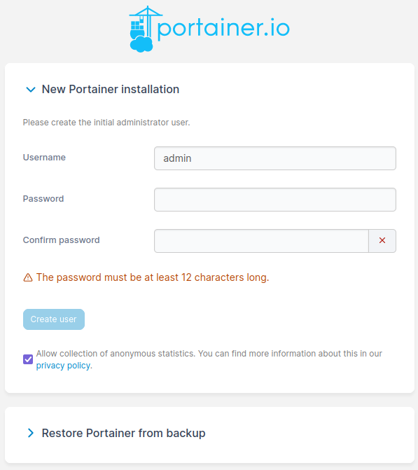
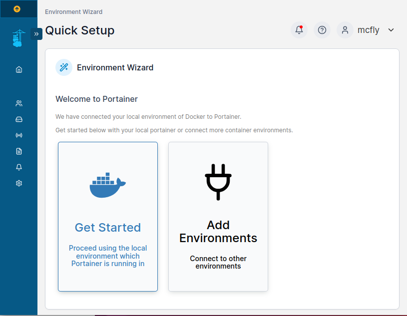
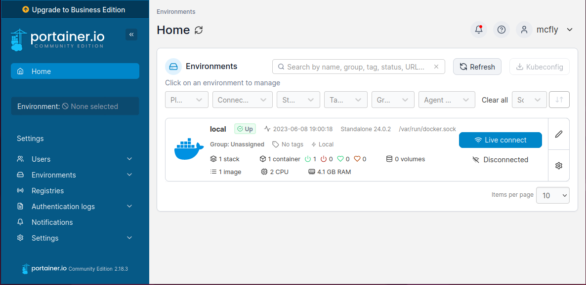
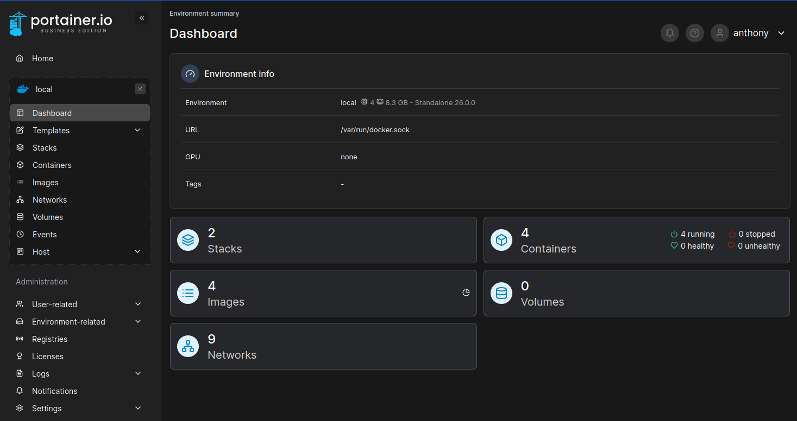
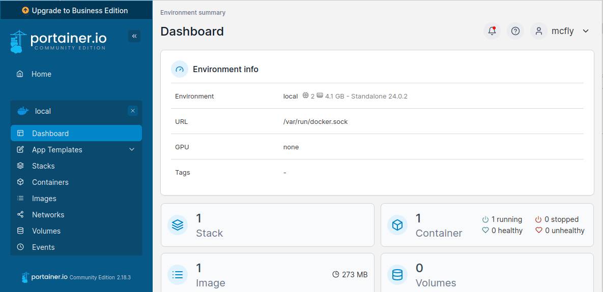
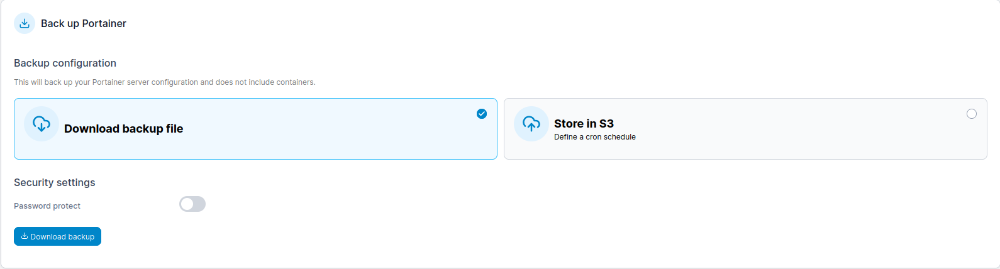

import Alert from "@components/mdx/Alert.astro";

**Tuto réalisé avec :**
* Debian 12.50 sur VM Proxmox
* Docker Version v26.0.0
* Docker Compose v2.25.0
* Portainer CE ou EE en version 2.20.0

Portainer est un conteneur permettant de gérer ses conteneurs docker depuis une interface graphique. Il permet de les créer/supprimer/arrêter/relancer/démarrer vos conteneurs, mais il offre aussi la possibilité d'utiliser le format Docker Compose ou Kubernetes pour créer des stacks (ensemble de conteneurs). Nous verrons cela dans d'autres articles.
Je n'utilise pas Portainer pour la création de conteneur ou stacks, car même s'il est accessible aux débutants, il lui manque quelques trucs comme l'impossibilité de créer les réseaux déclarés dans un docker compose. Je m'en sers donc pour voir les logs et jouer sur les conteneurs.

Portainer existe en deux versions :
* Community Edition (ce)
* Business Edition (ee pour entreprise edition)

Pour un utilisateur lambda comme nous, la Community Edition est largement suffisante, mais la version Business vous autorise gratuitement la gestion de trois nœuds (comprendre trois instances de Portainer). Pour cela, il vous suffit de créer un compte.

Un des avantages pour nous, les utilisateurs lambda, c'est l'affichage d'une pastille verte ou rouge devant le conteneur, indiquant si celui-ci est à jour ou pas. Pour le reste, c'est plus orienté pro.

<Alert type="info"> Dans un prochain article, je vais vous parler de [Portainer Agent](/blog/docker_portainer_agent_installation) qui vous permet depuis une seule instance Portainer d'en contrôler plusieurs. Dans ce cas, vous n'utiliserez toujours qu'un seul nœud Portainer et donc la limite des trois nœuds ne vous impacte plus.</Alert>

Je pars toujours d'une installation de [Debian 12](/blog/linux_debian_12_installation/), puis de [Docker](/blog/linux_debian_docker_installation/) en suivant mes articles.

## Installation de Portainer.
Nous allons installer Portainer Community Edition via un fichier `docker-compose.yaml`, mais il suffit de remplacer `image: portainer/portainer-ce:2.20.0` par `image: portainer/portainer-ee:2.20.0` pour installer directement la version Business.

1. [Connectez-vous en SSH](/blog/linux_connexion_ssh/) au serveur,
1. Se rendre dans le dossier `docker` (`cd docker` si vous avez suivi mon [article sur l'installation de docker sur Debian 12](/blog/linux_debian_docker_installation),
1. Créer un dossier `portainer` puis dans ce dernier, un dossier `data` (`mkdir portainer portainer/data`)
1. Rendez-vous dans le dossier `portainer` (`cd portainer`)
1. Créez un fichier nommé docker-compose (`nano docker-compose.yml`)
1. Collez le contenu suivant et sauvegardez avec `CTRL+X`:

```yml
  portainer-ee:
    container_name: portainer
    restart: always
    image: portainer/portainer-ee:2.20.0
    ports:
      - 8000:8000
      - 9443:9443
    volumes:
      - /var/run/docker.sock:/var/run/docker.sock
      - ./data:/data
    networks:
      - portainer_net

networks:
  portainer_net:
    name: portainer_net
```
1. Lancer la commande `docker compose up -d` pour récupérer la dernière image du conteneur et le lancer.

## Premier lancement.
Votre conteneur est lancé (vous pouvez vérifier avec la commande `docker ps`), rendez-vous sur `https://ip_serveur:9443`.

<Alert type="info">En fonction de votre navigateur, il se peut qu'il vous informe que le site n'est pas sécurisé, c'est normale, car nous nous connectons via une adresse IP et non un nom de domaine.</Alert>



Dans cette fenêtre :
* Rentrez un nom d'utilisateur,
* Un mot de passe **FORT**,
* *Optionnel* Décochez *Allow collection of anonymous statistics*,
* Cliquez sur `CREATE USER`.

<Alert type="info">Comme vous le voyez, il est possible de réinjecter une sauvegarde d'une précédente installation de Portainer. Je vous indique plus loin dans l'article comment faire une sauvegarde.</Alert>

Dans la nouvelle fenêtre.
* Sélectionnez `Get Started`,


Félicitation, vous  êtes sur la page d'accueil de Portainer.

### Description de l'interface.

Le premier écran qui s'affiche à vous est l'écran de gestion de Portainer. 
Dans le menu de gauche, vous pouvez effectuer les réglages d'administration comme l'ajout d'un utilisateur, d'un groupe, etc, mais aussi la gestion des environnements (instances) pour leur ajouter des tags. Plein d'autres réglages plutôt orienté pro sont disponibles.
C'est aussi ici que vous trouverez `Settings` permettant de faire les backup. Nous le voyons plus bas dans l'article.

Quand vous cliquez sur une instance (ici `local`), vous avez accès à la page suivante.

Cette page permet de créer ou manager vos conteneurs présent sur cette instance, de voir leur état, voir les images téléchargé (vous pouvez en profiter pour supprimer les `unused` qui permet de gagner de la place, car par défaut docker ne supprime pas les images même si elles ne servent pas.)

À vous de découvrir.

## Passer en Business Edition.
### Comment avoir accès à la BE.
Il faut simplement créer un compte pour bénéficier de la BE.
* Soit directement depuis le site de Portainer,
* Soit directement depuis votre instance Portainer.


Une fois votre licence reçu par mail, il vous suffit de refaire la même manipulation, mais en rentrant cette fois votre licence au lieu de vous inscrire.

<Alert type="info">Vous n'avez pas besoin de changer l'image de votre `docker-compose.yml`, même si vous stoppez et relancez le conteneur, il lancera la version Buisness Edition malgré la présence de l'image CE dans le fichier.</Alert>

Si vous souhaitez quand même changer l'image dans le Docker Compose vous devriez avoir ça.
```yml
services:
  portainer-ee:
    container_name: portainer
    restart: always
    image: portainer/portainer-ee:2.20.0
    ports:
      - 8000:8000
      - 9443:9443
    volumes:
      - /var/run/docker.sock:/var/run/docker.sock
      - ./data:/data
    networks:
      - portainer_net

networks:
  portainer_net:
    name: portainer_net
```
Avant de relancer, il faudra arrêter et supprimer notre ancien conteneur Portainer (`docker stop portainer` et `docker rm portainer`) puis relancer la construction de l'image avec `docker compose up -d` mais ne vous inquiétez pas, vos données ne seront pas effacées vu que nous avons tout stocké dans le dossier `data`.

## Sauvegarde de Portainer.
Une sauvegarde de Portainer vous permet de réinstaller/déployer rapidement votre/vos instances.

Pour récupérer la sauvegarde, dans le menu à gauche :
1. Cliquez sur `Settings -> General`,
1. Allez en bas de la page dans `Back up Portainer`.

1. *Optionnel* Activez la protection par mot de passe,
1. Cliquez sur `Download backup file`

Un fichier sous la forme `portainer-backup_2023-06-08_18-52-16.tar.gz` va se télécharger.

<Alert type="info">En Comunity Edition, seul `Download backup file` est disponible.</Alert>

## Mise à jour de Portainer.
Quand une nouvelle version de Portainer est disponible, vous en serez averti dans la page principale en bas à gauche.

<Alert type="info">Pas le choix de passer en ligne de commande, car depuis l'interface de Portainer, vous ne pouvez pas gérer Portainer, logique)</Alert>

1. Connectez-vous en SSH,
1. Arrêtez le conteneur `docker stop portainer`,
1. Supprimez le container `docker rm portainer` (vos données ne seront pas effacées),

**Si vous avez utilisé le tag `latest` dans votre image** (`image: portainer/portainer-ce:latest`)
* Supprimer l'image `docker image rm portainer/portainer-ce` ou `docker image rm portainer/portainer-ee`
* Retourner dans votre dossier Portainer et lancer la commande `docker compose up -d`.

**Si vous avez utilisé le tag de version**
* Allez dans le dossier de Portainer (l'endroit où est le fichier docker-compose.yaml)
* Éditez et modifiez dans le `docker-compose.yaml` la version de votre image par la dernière disponible (`image: portainer/portainer-ee:2.20.0`),
* Enregistrer,
* Lancer la commande `docker compose up -d`

## Conclusion

Même si Portainer a des défauts, il a la qualité de simplifier la gestion de ses conteneurs. Vous pouvez à présent utiliser le potentiel de Docker sans aucune ligne de code et depuis une interface graphique.

Amusez-vous bien !

### Sources
* https://github.com/portainer/portainer/releases
* https://docs.portainer.io/v/ce-2.6/start/install/server/docker/linux