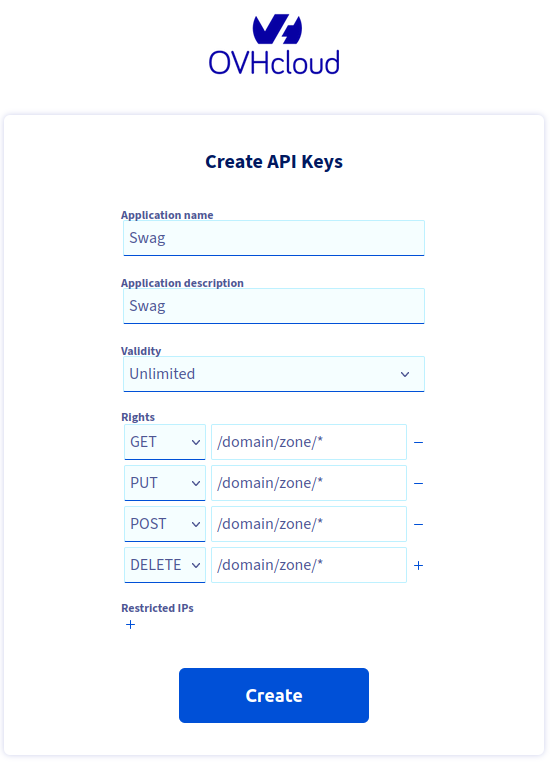

**Tuto réalisé avec :**
* HAOS 11.4, Core 204.1.2
* Add-on : Zigstar 0.40
* Matériels : [Sonoff Zigbee 3.0 USB Dongle Plus **P**](https://amzn.to/41W8f4W) 

# Installer SWAG pour beneficier d'un serveur proxy securisé.

### Pré-requis.
Si vous installez Swag en local chez vous
* Rediriger le port 443 de votre routeur/box vers l'IP de votre serveur.

## Installation de SWAG.

Comme je le prefere, nous allons utiliser docker compose pour installer Swag, Authelia et Crowdsec.
* Connectez vous en SSH (`ssh votre_user@ip_du_serveur`),
* Rendez-vous dans le dossier `docker` (`cd docker`) (Si vous avez suivi mon tutoriel sur l'[installation de Docker](/blog/linux_debian_docker_installation/), sinon rendez vous dans le dossier contenant vos conteneurs docker),
* Créer un dossier nommé `swag` (`mkdir swag`) et rendez vous dans ce dernier (`cd swag`)
* Créer les dossiers config, (`mkdir config`),
* Créer le fichier `docker-compose.yaml` (`nano docker-compose.yaml`) et coller le contenu ci-dessous:
```yaml
version: "3.8"
services:
  swag:
    image: lscr.io/linuxserver/swag:latest
    container_name: swag
    restart: unless-stopped
    cap_add:
      - NET_ADMIN
    environment:
      - PUID=$PUID
      - PGID=$PGID
      - TZ=$TZ
      - URL=$NDD
      - VALIDATION=dns
      - SUBDOMAINS=wildcard
#      - CERTPROVIDER= #optional
      - DNSPLUGIN=ovh #optional
      - PROPAGATION= #optional
      - EMAIL=$EMAIL #optional
      - ONLY_SUBDOMAINS=true #optional
#      - EXTRA_DOMAINS= #optional
#      - STAGING=false #optional
#      - DOCKER_MODS=linuxserver/mods:swag-crowdsec #|linuxserver/mods:swag-dbip #|linuxserver/mods:swag-dashboard #|linuxserver/mods:swag-maxmind
#      - CROWDSEC_API_KEY=$CROWDSEC_API_KEY ## Genere avec docker exec -t crowdsec cscli bouncers add bouncer-swag
#      - CROWDSEC_LAPI_URL=http://crowdsec:8080
#      - MAXMINDDB_LICENSE_KEY=$MAXMINDDB_LICENSE_KEY
    volumes:
      - /docker/swag/config:/config
    ports:
      - 443:443
#      - 80:80 #optional
#      - 81:81
    networks:
      - swag
      - web
      
networks:
  swag:
    name: swag
  web:
    name: web
```
* Création du fichier `.env`
```bash
PUID=1000
PGID=1000
TZ=Europe/Paris
NDD=mon_ndd.fr
EMAIL=mon@mail.fr
```

Une fois les fichiers sauvegardés, lancer la creation du containeur via `docker compose up -d`.
Normalement le lancement du conteneur a ajouté les fichiers dans le dossier config.

Arretons le conteneur via la commande `docker stop swag`.

### Configuration du service DNS.
J'utilise OVH pour mes noms de domaine, donc il a fallut que je créé une application a [cette adresse](https://eu.api.ovh.com/createToken/)

Une fois connecté a votre compte OVH, il vous demande :
* Donner un nom a votre application dans Application Name,
* *Otionnel* Mettre une description dans Application description,
* `Validity` a mettre sur `Unlimited`,
Dans `Rights` (les droits) mettre :
* GET -> /domain/zone/*
* PUT -> /domain/zone/*
* POST -> /domain/zone/*
* DELETE -> /domain/zone/*


Pour finir cliquer sur `Create`.
Sauvegarder bien les informations.


Retournons a notre conteneur SWAG.
Dans le dossier `swag`, `config` puis `dns-conf` rerchercher et éditer le fichier `ovh.ini` avec vos elements puis sauvegarder.
```bash
# Instructions: https://github.com/certbot/certbot/blob/master/certbot-dns-ovh/certbot_dns_ovh/__init__.py#L20
# Replace with your values
dns_ovh_endpoint = ovh-eu
dns_ovh_application_key = MDAwMDAwMDAwMDAwMDAwMDAwMDAwMDAw
dns_ovh_application_secret = MDAwMDAwMDAwMDAwMDAwMDAwMDAwMDAw
dns_ovh_consumer_key = MDAwMDAwMDAwMDAwMDAwMDAwMDAwMDAw
```
Nous relancons le containeur avec `docker compose up -d`.

Logs
```
[migrations] started
[migrations] 01-nginx-site-confs-default: skipped
[migrations] done
───────────────────────────────────────
      ██╗     ███████╗██╗ ██████╗ 
      ██║     ██╔════╝██║██╔═══██╗
      ██║     ███████╗██║██║   ██║
      ██║     ╚════██║██║██║   ██║
      ███████╗███████║██║╚██████╔╝
      ╚══════╝╚══════╝╚═╝ ╚═════╝ 
   Brought to you by linuxserver.io
───────────────────────────────────────
To support the app dev(s) visit:
Certbot: https://supporters.eff.org/donate/support-work-on-certbot
To support LSIO projects visit:
https://www.linuxserver.io/donate/
───────────────────────────────────────
GID/UID
───────────────────────────────────────
User UID:    1000
User GID:    1000
───────────────────────────────────────
using keys found in /config/keys
Variables set:

0

0
TZ=Europe/Paris
URL=mon_ndd.fr
SUBDOMAINS=wildcard
EXTRA_DOMAINS=
ONLY_SUBDOMAINS=true
VALIDATION=dns
CERTPROVIDER=
DNSPLUGIN=ovh
EMAIL=mon@mail.fr
STAGING=
Different validation parameters entered than what was used before. Revoking and deleting existing certificate, and an updated one will be created
Using Let's Encrypt as the cert provider
SUBDOMAINS entered, processing
Wildcard cert for only the subdomains of mon_ndd.fr will be requested
E-mail address entered: mon@mail.fr
dns validation via ovh plugin is selected
Generating new certificate
Saving debug log to /var/log/letsencrypt/letsencrypt.log
Account registered.
Requesting a certificate for *.mon_ndd.fr
Unsafe permissions on credentials configuration file: /config/dns-conf/ovh.ini

Waiting 120 seconds for DNS changes to propagate

Successfully received certificate.
Certificate is saved at: /etc/letsencrypt/live/mon_ndd.fr/fullchain.pem
Key is saved at:         /etc/letsencrypt/live/mon_ndd.fr/privkey.pem
This certificate expires on 2023-08-08.
These files will be updated when the certificate renews.
NEXT STEPS:
- The certificate will need to be renewed before it expires. Certbot can automatically renew the certificate in the background, but you may need to take steps to enable that functionality. See https://certbot.org/renewal-setup for instructions.
- - - - - - - - - - - - - - - - - - - - - - - - - - - - - - - - - - - - - - - -
If you like Certbot, please consider supporting our work by:
 * Donating to ISRG / Let's Encrypt:   https://letsencrypt.org/donate
 * Donating to EFF:                    https://eff.org/donate-le
- - - - - - - - - - - - - - - - - - - - - - - - - - - - - - - - - - - - - - - -
New certificate generated; starting nginx
The cert does not expire within the next day. Letting the cron script handle the renewal attempts overnight (2:08am).
[custom-init] No custom files found, skipping...
[ls.io-init] done.
Server ready
```
### Activation du HSTS.

Editer le fichier `/config/nginx/ssl.conf` et decommenter la ligne suivante.
```bash
# HSTS (ngx_http_headers_module is required) (63072000 seconds)
add_header Strict-Transport-Security "max-age=63072000" always;
```
On arrete et redemarre le containeur.

### Fail2ban.
Fail2ban est inclu dans SWAG par defaut, il peut etre personnalisé, mais nous verrons peut etre cela dans un autre article.

Voici quelques commandes qui peuvent vous etre utiles :
* Voir les "prisons" actives : `docker exec -it swag fail2ban-client status`
* Voir les IPs bannies pour une "prison" : `docker exec -it swag fail2ban-client status <NOM_PRISON>`
* Débannir une IP d'une "prison" : `docker exec -it swag fail2ban-client set <JAIL-NAME> unbanip <ADRESSE_IP>`,
* Bannir une IP dans une "prison" : `docker exec -it swag fail2ban-client set <JAIL-NAME> banip <ADRESSE_IP>`.

### Installation de Crowdsec.
**QUEST CE QUE C'EST**


Dans le dossier `swag` :
* créer un dossier `crowdsec` 
* A l'interieur de ce dernier, deux dossiers nommés `crowdsec-db` et `crowdsec-config`
* De retour dans le dossier `crowdsec`, créer un fichier `acquis.yaml` et ajouter ceci:
```
filenames:
  - /var/log/nginx/*.log
labels:
  type: nginx
```
C'est le template d'acquisition pour la [collection nginx](https://hub.crowdsec.net/author/crowdsecurity/collections/nginx)

Ajouter le containeur Crowdsec a notre docker `docker-compose.yaml` se trouvant dans le dossier `swag`
```yaml
  crowdsec:
    container_name: crowdsec
    image: crowdsecurity/crowdsec
    restart: unless-stopped
    environment:
      - COLLECTIONS=crowdsecurity/nginx
      - GID=$PGID
    depends_on:
      - swag
    volumes:
      - ./config/log/nginx:/var/log/nginx
      - ./crowdsec/acquis.yaml:/etc/crowdsec/acquis.yaml
      - ./crowdsec/crowdsec-db:/var/lib/crowdsec/data/
      - ./crowdsec/crowdsec-config:/etc/crowdsec/
    security_opt:
      - no-new-privileges=true
```

On arrete le conteneur `swag` puis on relance la creation du conteneur. (Pour rappel `docker compose up -d`).
Cela va permettre de recuperer l'image de crowdsec et l'installer.

Garder les conteneurs swag et crowdsec demarrés.

##### Creation du Bouncer.
C'est quoi un bouncer ?

????????

Depuis le terminal, il faut lancer la commande suivante qui est un conteneur docker qui va s'executer, generer une cle puis se fermer.

```bash
docker exec -t crowdsec cscli bouncers add bouncer-swag
```
Résultat :
```bash
anthony@Docker:/docker/swag$ docker exec -t crowdsec cscli bouncers add bouncer-swag
Api key for 'bouncer-swag':

   0a93axxxxxxxxxxxxxxxxxxxxxx

Please keep this key since you will not be able to retrieve it!
```

Retourner dans le `docker-compose.yaml` puis decommenter les lignes 
```yaml
      - DOCKER_MODS=linuxserver/mods:swag-crowdsec #|linuxserver/mods:swag-dbip #|linuxserver/mods:swag-dashboard #|linuxserver/mods:swag-maxmind
      - CROWDSEC_API_KEY=$CROWDSEC_API_KEY ## Genere avec docker exec -t crowdsec cscli bouncers add bouncer-swag
      - CROWDSEC_LAPI_URL=http://crowdsec:8080
```

Ajouter `CROWDSEC_API_KEY=` dans le fichier `.env` puis coller votre cle apres le `=`

Stopper le conteneur `swag` et relancer sa creation (vous connaissez la commande maintenant).
Logs (seulement la partie crowdsec):
```
**** Configuring CrowdSec nginx Bouncer ****
**** Successfully configured CrowdSec nginx Bouncer v1.0.5 ****
[mod-init] **** Installing all mod packages ****
fetch http://dl-cdn.alpinelinux.org/alpine/v3.17/main/x86_64/APKINDEX.tar.gz
fetch http://dl-cdn.alpinelinux.org/alpine/v3.17/community/x86_64/APKINDEX.tar.gz
(1/14) Installing libgomp (12.2.1_git20220924-r4)
(2/14) Installing gettext-libs (0.21.1-r1)
(3/14) Installing gettext (0.21.1-r1)
(4/14) Installing luajit (2.1_p20210510-r3)
(5/14) Installing lua-resty-http (0.16.1-r1)
(6/14) Installing lua-sec (1.2.0-r1)
(7/14) Installing lua5.1-libs (5.1.5-r11)
(8/14) Installing lua5.1 (5.1.5-r11)
(9/14) Installing lua5.1-socket (3.1.0-r0)
(10/14) Installing lua5.1-sec (1.2.0-r1)
(11/14) Installing lua5.1-cjson (2.1.0-r10)
(12/14) Installing lua-resty-lrucache (0.13-r0)
(13/14) Installing lua-resty-core (0.1.24-r0)
(14/14) Installing nginx-mod-http-lua (1.22.1-r0)
Executing busybox-1.35.0-r29.trigger
OK: 212 MiB in 219 packages
[custom-init] No custom files found, skipping...
[ls.io-init] done.
nginx: [error] [lua] crowdsec.lua:48: init(): error loading captcha plugin: no recaptcha site key provided, can't use recaptcha
nginx: [alert] [lua] init_by_lua:8: [Crowdsec] Initialisation done
Server ready
```

>l'erreur de captcha plugin est normale car nous l'utilisons pas. [Plus d'information (EN Off)](https://github.com/linuxserver/docker-mods/tree/swag-crowdsec#recaptcha-support-notes)ou [FR](https://www.forum-nas.fr/threads/tuto-installation-et-configuration-de-crowdsec-avec-le-reverse-proxy-swag.18327/post-118080). Cela permet a une IP bannie de pouvoir quand meme se connecter a votre site en entrant un Captcha.

### Ajouter le blocage géographique.
**BLABLABLABLA**

Dans le `docker-compose.yaml`, 
* decommenter et supprimer l'espace devant devant `|linuxserver/mods:swag-dbip`
```yaml
      - DOCKER_MODS=linuxserver/mods:swag-crowdsec|linuxserver/mods:swag-dbip #|linuxserver/mods:swag-dashboard #|linuxserver/mods:swag-maxmind
```
* Créer un dossier `geoip2db` dans le dossier `/swag/config/`,
* Sauvegarder, Stopper puis recréer le conteneur.
Logs:
```
**** Configuring CrowdSec nginx Bouncer ****
Applying the dbip mod...
Downloading GeoIP2 City database.
Connecting to download.db-ip.com (104.26.5.15:443)
saving to '/tmp/dbip-country-lite.mmdb.gz'
dbip-country-lite.mm  17% |*****                           |  639k  0:00:04 ETA
**** Successfully configured CrowdSec nginx Bouncer v1.0.5 ****
[mod-init] **** Installing all mod packages ****
fetch http://dl-cdn.alpinelinux.org/alpine/v3.17/main/x86_64/APKINDEX.tar.gz
dbip-country-lite.mm  39% |************                    | 1470k  0:00:03 ETA
dbip-country-lite.mm  63% |********************            | 2334k  0:00:01 ETA
dbip-country-lite.mm  89% |****************************    | 3294k  0:00:00 ETA
fetch http://dl-cdn.alpinelinux.org/alpine/v3.17/community/x86_64/APKINDEX.tar.gz
dbip-country-lite.mm 100% |********************************| 3700k  0:00:00 ETA
'/tmp/dbip-country-lite.mmdb.gz' saved
Applied the dbip mod
(1/14) Installing libgomp (12.2.1_git20220924-r4)
(2/14) Installing gettext-libs (0.21.1-r1)
(3/14) Installing gettext (0.21.1-r1)
(4/14) Installing luajit (2.1_p20210510-r3)
(5/14) Installing lua-resty-http (0.16.1-r1)
(6/14) Installing lua-sec (1.2.0-r1)
(7/14) Installing lua5.1-libs (5.1.5-r11)
(8/14) Installing lua5.1 (5.1.5-r11)
(9/14) Installing lua5.1-socket (3.1.0-r0)
(10/14) Installing lua5.1-sec (1.2.0-r1)
(11/14) Installing lua5.1-cjson (2.1.0-r10)
(12/14) Installing lua-resty-lrucache (0.13-r0)
(13/14) Installing lua-resty-core (0.1.24-r0)
(14/14) Installing nginx-mod-http-lua (1.22.1-r0)
Executing busybox-1.35.0-r29.trigger
OK: 212 MiB in 219 packages
[custom-init] No custom files found, skipping...
[ls.io-init] done.
nginx: [error] [lua] crowdsec.lua:48: init(): error loading captcha plugin: no recaptcha site key provided, can't use recaptcha
nginx: [alert] [lua] init_by_lua:8: [Crowdsec] Initialisation done
Server ready
```
Ensuite editer le fichier `/swag/config/nginx/nginx.conf` pour ajouter `include /config/nginx/dbip.conf;` dans la section `http`.

Résulat:
```
http {
    include /config/nginx/dbip.conf;
    # Includes mapping of file name extensions to MIME types of responses
    # and defines the default type.
```

Dans le fichier `/swag/config/nginx/dbip.conf` modifier $geo-whitelist et $geo-blacklist en vous aidant de [Wikipedia](https://en.wikipedia.org/wiki/ISO_3166-2)

>Le fichier a été créé avec docker-compose, il se peut qu'il appartienne a l'utilisateur `root` donc soit vous le modifiez en passant par l'utilisateur `root` soit vous lui changez les droits. Dans les deux cas il faudra se connecter en root avec la commande `su root` puis soit `nano /chemindufichier/dbip.conf` ou alors `chown votre_user:votre_user /chemin_vers_fichier/dbip.conf`
 
`$geo-whitelist` n'accepte rien, sauf les pays listés, `$geo-blacklist` accepte tout, sauf les pays listés.

Il vous faudra ajouter dans chaque fichier `proxy-confs` (configuration de vos services) les deux ligne ci-dessous avant `location /`:
```
    if ($lan-ip = yes) { set $geo-whitelist yes; }
    if ($geo-whitelist = no) { return 404; }
```

Exemple:
```
 server {
     listen 443 ssl;
     listen [::]:443 ssl;

     server_name some-app.*;
     include /config/nginx/ssl.conf;
     client_max_body_size 0;

     if ($lan-ip = yes) { set $geo-whitelist yes; }
     if ($geo-whitelist = no) { return 404; }

     location / {
[...]
```
A vous de bloquer les pays qui ne doivent pas se connecter votre serveur.


### Redirection d'une application indisponible ou inexistante.
Si vous souhaitez rediriger vos visiteurs (ou les sniffeurs) plutot que leur afficher une page d'erreur, il faut ajouter dans chaque fichier `proxy-conf` :
* `error_page 404 500 502 503 504 = @fallback;` apres la ligne `proxy_pass $upstream_proto://$upstream_app:$upstream_port;`
* et avant le dernier `}` de votre fichier :
```
    location @fallback {
        rewrite ^/(.*) https://page_erreur.ndd.fr/?;
    }
```

### Installation de Authelia.

**??????? BLABLABLA**

Dans le dossier `swag`: 
* Créer un dossier `authelia`
* Puis a l'interieur, un dossier `config`,
* Et a l'interieur du dossier `config`, créer un dossier `logs`.

Dans le dossier config, nous ajoutons un fichier nommé `configuration.yml`. ATTENTION au ;**YML** et non yaml comme precedemment.

Ensuite nous ajoutons ce qui suit dans notre `docker-compose.yaml` a la suite de la partie `crowdsec`
```
  authelia:
    container_name: authelia
    image: docker.io/authelia/authelia:latest
    restart: unless-stopped
    environment:
      - TZ=$TZ
#    expose:
#      - 9091
    volumes:
      - ./authelia/config:/config
```

Nous pouvons maintenant reconstruire notre containeur avec la commande `docker compose up -d`.

#### Configuration de Auhtelia.
Passons a la configuration de ce dernier.

>Au lancement de la création du containeur, authelia passe le dossier config et les fichiers internes au proprietaire `root`, pour pouvoir modifier les fichiers depuis Codium, il faudra, a chaque fois, **eteindre le conteneur Authelia** et se connecter en `root` puis dans le dossier `authelia` lancer la commande `chown votre_user:group_user /config/configuration.yml`.

Un exemple de fichier de configuration complet est disponible sur le [GitHub](https://github.com/authelia/authelia/blob/v4.37.5/config.template.yml).

Nous allons plutot partir sur un fichier vide (`configuration.yml` créé ci-dessus) et allons lui ajouter et les sections importantes et celles qui nous interesses.

Les sections importantes sont :
* jwt_secret,
* default_redirection_url,
* authentication_backend,
* storage,
* session,
* notifier,
* access_control.

```
###############################################################################
#                           Authelia Configuration                            #
###############################################################################

## The theme to display: light, dark, grey, auto.
theme: auto

## The secret used to generate JWT tokens when validating user identity by email confirmation. JWT Secret can also be
## set using a secret: https://www.authelia.com/c/secrets
jwt_secret: a_very_important_secret

## Default redirection URL
##
default_redirection_url: https://home.example.com/

server:
  host: 0.0.0.0
  port: 9091
  path: "authelia"
  
log:
  ## Level of verbosity for logs: info, debug, trace.
  level: debug
  file_path: /config/logs/authelia.log
  
authentication_backend:
  password_reset:
    disable: false #car je suis seul a l'utiliser
  file:
    path: /config/users_database.yml
    password:
      algorithm: argon2id
      iterations: 1
      key_length: 32
      salt_length: 16
      memory: 512
      parallelism: 8
    password:
      algorithm: argon2
      argon2:
        variant: argon2id
        iterations: 3
        memory: 65536
        parallelism: 4
        key_length: 32
        salt_length: 16
        
access_control:
  ## Default policy can either be 'bypass', 'one_factor', 'two_factor' or 'deny'. It is the policy applied to any
  ## resource if there is no policy to be applied to the user.
  default_policy: deny
  networks:
    - name: internal
      networks:
#        - 10.10.0.0/16 #10.10.0.0 a 10.10.255.255
        - 172.20.0.0/8 #172.0.0.0 a 172.255.255.255
        - 192.168.10.0/24 #192.168.10.1 a 192.168.10.255
        - votre_ip_public_fai #Si installation en local
  rules:
    ## Rules applied to everyone
    - domain: 
      - 'sous-domain.ndd.fr'
      - 'sous-domain2.ndd.fr'
      - 'sous-domain3.ndd.fr'
      policy: bypass
      
    - domain:
      - 'sous-domain4.ndd.fr'
      - 'sous-domain5.ndd.fr'
      - '*.ndd.fr'
      policy: bypass
      networks:
        - internal
        
    - domain:
      - 'sous-domain4.ndd.fr'
      - 'sous-domain5.ndd.fr'
      - '*.ndd.fr'
      policy: one_factor       

session:
  name: authelia_session
  domain: ndd.fr
  secret: 7cIgJxxxxxxCIexrzsqxxxxxxTd6JZXX6aHefBf3xxxxxxWa7s4VA3AbkU
  expiration: 1h
  inactivity: 10m
  remember_me_duration: 1M

regulation:
  max_retries: 3
  find_time: 2m
  ban_time: 5m

storage:
  encryption_key: 7cIgxxxxxxxxCIexrzsqxxxxxxVbdTd6JZXxxxxfBf3SDFxxxxxa7s4VxxxbgW
  local:
    path: /config/db.sqlite3

notifier:
  disable_startup_check: false
  smtp:
    host: ssl0.ovh.net
    port: 587
    username: mail@ndd.fr
    password: mot_de_passe_mail
    sender: mail@ndd.fr
    subject: "[Authelia] {title}"
    startup_check_address: mail@ndd.fr
    disable_require_tls: false
    tls:
      skip_verify: false
      minimum_version: TLS1.2

```

#### Ajouter l'acce exterieur à Authelia.
Nous allons autoriser l'acces a Authelia depuis l'exterieur via l'adresse `authentification.ndd.fr`.

* Rendez vous dans le dossier `swag`, `config`, `nginx` puis `proxy-confs`,
* Rechercher `authelia.subdomain.conf.sample`
* * Soit vous copier/coller le contenu dans un fichier `authelia.subdomain.conf`,
* * Soit vous faite une copie du fichier en ligne de commande `cp authelia.subdomain.conf.sample authelia.subdomain.conf`
Dans le fichier `authelia.subdomain.conf` :
* Modifier le `server_name authelia.*;` par `server_name authentification.*;`,
* Verifier que le nom dans les deux `set $upstream_app authelia;` correspond bien au nom de votre conteneur (normalement oui, sinon changer le par le nom de votre conteneur).
* Sauvegarder le fichier avec `CTRL + X`,
* Rendez vous dans votre portainer pour relancer Swag ou alors via le terminal `docker stop swag` puis `docker start swag`,

Il reste a vous rendre sur authentifiction.ndd.fr depuis votre navigateur et vous devriez tomber sur la page d'accueil de Authelia.

Essayer de vous connecter avec login `authelia`, mot de passe `authelia` si cela marche c'est fini pour cette partie.

Passons a la creation d'un utilisateur plus securisé.

#### Créer votre/vos utilisateur(s) Authelia.
Au lancement de Authelia, l'utilisateur `authelia` est créé par defaut.
Vous vous doutez que nous ne pouvons pas laisser cet utilisateur pour des raisons evidentes de sécurité.

Les utilisateurs se trouvent dans le fichier `users_database.yml` se trouvant dans le dossier config de Authelia. Ce fichier est attribué a l'utilisateur `root` lors de la construcion du conteneur, il vous faudra donc, le modifier en tant que root ou alors le changer de proprietaire a chaque fois que vous souhaitez le modifier (`chown votre_user:group_user /config/users_database.yml`).

Voila le fichier d'origine.
```yaml
# yaml int disable rule:line-length
---
###############################################################
#                         Users Database                      #
###############################################################

# This file can be used if you do not have an LDAP set up.
users:
  authelia:
    displayname: "Test User"
    password: "$argon2id$v=19$m=32768,t=1,p=8$eUhVT1dQa082YVk2VUhDMQ$E8QI4jHbUBt3EdsU1NFDu4Bq5jObKNx7nBKSn1EYQxk"  # Password is 'authelia'
    email: authelia@authelia.com
    groups:
      - admins
      - dev
      
...
# yamllint enable rule:line-length
```
Pour ajouter un utilisateur, il vous suffit de copier/coller l'utilisateur existant, commenter celui par defaut et personnaliser votre utilisateur.

Ensuite il faudra generer votre mot de passe sous forme de HASH :
* Ouvrir une connexion SSH,
* Lancer la commande `docker run --rm authelia/authelia:latest authelia hash-password 'voTre_MOt_2_P@SsE'`
* Recuperer la valeur et copier là dans le le fichier.

Exemple :
```yaml
# yaml int disable rule:line-length
---
###############################################################
#                         Users Database                      #
###############################################################

# This file can be used if you do not have an LDAP set up.
# Generer mot de passe docker run --rm authelia/authelia:latest authelia hash-password 'MOT_DE_PASSE'
users:
#  authelia:
#    displayname: "Test User"
#    password: "$argon2id$v=19$m=32768,t=1,p=8$eUhVT1dQa082YVk2VUhDMQ$E8QI4jHbUBt3EdsU1NFDu4Bq5jObKNx7nBKSn1EYQxk"  # Password is 'authelia'
#    email: authelia@authelia.com
#    groups:
#      - admins
#      - dev

  votre_user:
    displayname: "Votre User"
    password: "$argon2id$xxxxxxxxxxxxxxxxxxxxxxxxxxxxxxxxxxxxxxxxxxxxxxxxxxxxxxxxxxxxxxxxxxxxxxxxxxxxxxxxxxxxxxx"
    email: mail@ndd.fr
    groups:
      - admins
      - dev
```

## Utilisation de Swag.
Nous avons dèja vu pour Authelia, comment declarer un acces externe pour une application avec Swag. Nous allons essayer de balayer les utilisatiuons les plus courantes.

**Quelques remarques :**
* Votre conteneur doit etre sur le meme reseau (reseau docker) que Swag,
* Vous n'avez pas besoin de declarer les Ports dans le docker-compose,
* Vos conteneurs peuvent etre dans un docker-compose different (c'est meme conseillé)

>Si vous comptez n'utiliser que les sous domaine (conformement au parametre `- ONLY_SUBDOMAINS=true #optional` dans le docker-compose de Swag), vous pouvez supprimer tous les fichier *.subfolder.conf.sample avec la commande `rm *.subfolder.conf.sample` a executer dans le dossier `proxy-confs`.

### Configurer l'acces a un conteneur interne.
#### Fichier existant.

#### Depuis le fichier template.

### Acceder a une application via une IP


#### Sources.
* https://docs.linuxserver.io/images/docker-swag
* https://www.linuxserver.io/blog/blocking-malicious-connections-with-crowdsec-and-swag
* https://www.authelia.com/
* https://www.forum-nas.fr/threads/tuto-installer-swag-en-docker-reverse-proxy.15057/

* [Calculer les masques IP](https://cric.grenoble.cnrs.fr/Administrateurs/Outils/CalculMasque/)
