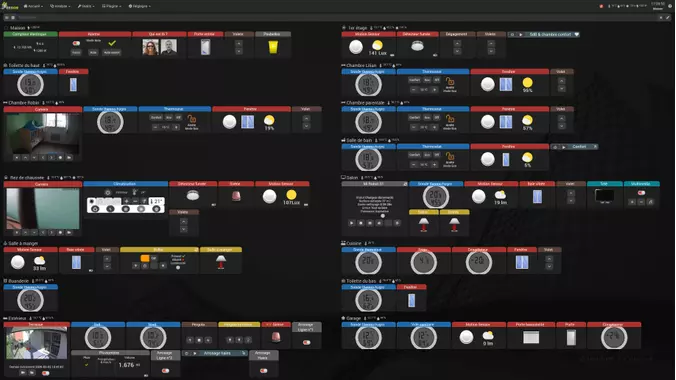
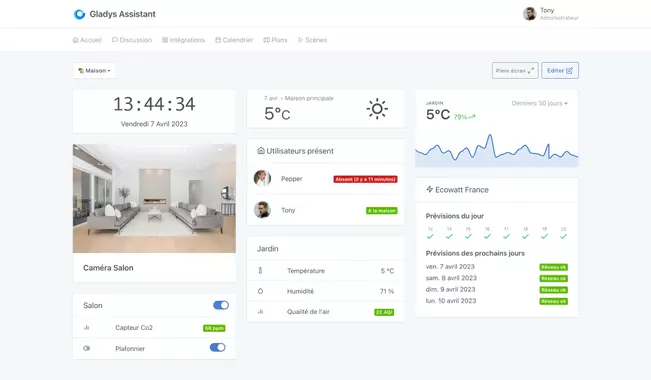
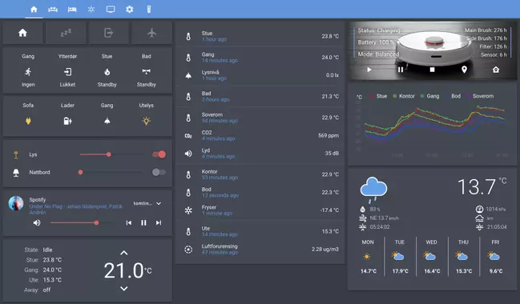

Nous voyons fleurir dans le commerce, depuis quelques années, une multitude d'**appareils connectés** vendus pour nous **faciliter la vie** (surtout nous rendre plus fainéants)

Cela fait maintenant plus de cinq ans que j'ai mis le pied dedans et il y a du bon et du moins bon. Malheureusement, ce n'**est pas** forcément les **solutions** qui ont **pignon sur rue** qui sont les **meilleures**, voire complètement l'inverse.

Ayant essayé trois (presque quatre) des solutions domotiques les plus connues du marché français, je vais vous livrer mon **avis personnel** sur ces solutions, mais aussi vous expliquer **pourquoi** il vaut mieux passer par des **solutions domotique plutôt que les applications des constructeurs**.

Bien-sur les goûts et les couleurs étant propres à chacun, **ce n'est que mon avis**, libre a chacun de penser ce qu'il veut ou de tester toutes les **solutions** pour voir celle **qui** lui **convient** le mieux.

Je vais essayer d'être entièrement objectif et donc par transparence avec vous, je suis resté environ **un an** sur [**Jeedom**](https://www.jeedom.com/fr/), **six mois** sur [**Domoticz**](https://www.domoticz.com/) et je suis **depuis 2020** sur [**Home Assistant**](https://www.home-assistant.io/).

Depuis le début de l'année 2024, j'ai voulu tester Gladys Assistant, une solution domotique made in France et je peux vous dire que j'ai été très bluffé par la simplicité de prise en main, que ce soit des intégrations ou des automatisations (scènes). Son interface moderne et intuitive fait de cette solution, selon moi, la plus adaptée à un public débutant et conviendra à 90% des personnes non-geek pour une domotique simple et épurée. J'ai fait un article de présentation [ici](/blog/gladys_assistant_intro/).

## Posons les bases

Je vais parler de deux types de domotique, la domotique décentralisée et la centralisée. Ce sont des termes que je trouve plus parlant pour expliquer aux personnes la domotique.

### La domotique décentralisée

Dans un monde dans lequel on parle de plus en plus de décentralisation comme une chose positive (et c'est vraie), dans la domotique, c'est plutôt l'inverse.

Ce que j'appelle une **domotique décentralisée**, c'est le fait d'**utiliser** une **application** pour tel et tel appareil, une autre pour tel ou tel autre appareil etc, etc. Et malheureusement, c'est un peu ce que nous vendent les marques.

Si vous achetez du **matériel** (protocole identique, Wifi ou Zigbee par exemple) de la marque **Phillips**, il ne sera **pas compatible** avec **Xiaomi** ni même avec **Sonoff**, alors que c'est un protocole censé être universel. Tous ça à cause de gros sous.

Donc le **problème** de cette **domotique décentralisé**, c'est que vous êtes **obligé** d'avoir une **application par marque**, mais aussi une passerelle (gateway/routeur) par marque, et vous ne **pourrez pas faire fonctionner la lumière Philips avec le capteur de porte Xiaomi** (par exemple).

Vous l'avez bien compris, ce n'est **pas la solution** que j'utilise ni même que je **recommande**, car à part Tuya (vos données, images, sons, passe et sont stockées quelque part en Chine) qui a un catalogue assez important d'appareil (de différentes marques), il n'y aura **pas la possibilité** de faire **fonctionner** deux appareils de **marque différents ensemble**.

C'est là qu'intervient la **Domotique centralisée**

### La domotique centralisée

Elle permet de **faire cohabiter** tout ce petit monde de **marques et protocoles ensemble**, soit via les passerelles (Gateway/routeur) propriétaires, soit via des **passerelles universelles**.

Cela veut dire que votre ampoule Zigbee Philips pourra interagir avec un capteur de porte Wi-Fi Tuya ou un autre en Zigbee de chez Sonoff, etc, etc. Mais ce n'est pas tout, vous allez aussi **pouvoir intégrer d'autres services** comme Météo France, Ecowatt, etc etc.

Ça semble quand même plus intéressant, car aucune marque (à part Tuya qui est un ensemble de marques) ne propose tout le panel d'appareils domotique dans son catalogue.

C'est bien sûr de ce type de domotique que je vais vous parler maintenant.

### Mes exigences

Les **points importants** (exigences personnelles) pour une **solution domotique** en 2023 :
* **Open source :** _Assure normalement la pérennité de la solution_.
* Solution non propriétaire : _Idem sur la pérennité, mais aussi pour éviter d'être limité ou de s'enfermer dans certains appareils_,
* **Majoritairement gratuite :** Je n'ai pas de soucis pour payer un produit complet et évolutif, mais j'aime aussi pouvoir tester avant et avoir un support bienveillant,
* Installation sur plusieurs supports : Au fur et à mesure que votre domotique augmente, l'appareil servant de cerveau doit aussi pouvoir évoluer.
* **Exploitable sur tous les types d'écrans :** Doit pouvoir être utilisé depuis un PC, un smartphone ou une tablette,
* **Mises à jour fréquentes :** Pas forcément pour de nouvelles fonctionnalités hebdomadaires, mais au moins pour la sécurité,
* Interface agréable (subjectif) : Mais il faut que ce soit accepté par tous dans la maison,
* **Intégrations :** Pour une forte évolutivité et des limites quasi inatteignables.
* **Simplicité :** Pas passer trois jours à faire un tableau de bord utilisable sur tous les écrans,
* Évolutive.

Commencons le tour des solutions.

### Jeedom

* **Open-source :** Oui / Gratuite
* **App Mobile :** Oui / Payante (et non exempte de bug)
* **Intégrations / Add-ons :** Très souvent payants, pas de période d'essai, certains sont remplacés plutôt que mis à jour (passage par la case achat), support compliqué

J'ai commencé par [Jeedom](https://www.jeedom.com/fr/) après avoir essayé trois autres solutions (en 2016/17), car il me paraissait le plus **simple** et promettait de belles choses avec une grosse **communauté française**.

Il bénéficie d'un système se disant _gratuit et open source_ (**un peu faux**) et il y a beaucoup de tutoriels sur Internet.

J'ai mème décidé de lancer ma [chaîne YouTube](https://yt.mcflypartages.fr) sur cette solution domotique en espérant rendre accessible ce système au plus débutant.

Après un an de loyaux services, j'ai décidé de changer pour les raisons suivntes :
* Le **prix des Add-ons** en augmentation permanente, **sans** possibilité de les **essayer** et sans garantie de mise à jour (confirmé depuis).
* De moins en **moins d'Add-ons gratuits**, mais plus de payants,
* L'**ambiance** au sein du forum communautaire, que je trouvais trop **hautaine, et arrogante**, surtout de la part de certains développeurs,
* Une **communauté** de développeurs **exclusivement française**,
* La construction d'un tableau de bord propre et responsive trop complexe,
* **Application mobile payante**.

_La priorité de Jeedom SAS est le professionnel, ce qui, malgré une volonté des utilisateurs de faire évoluer les choses, bloque ou retarde les mises à jour, voire bloque des évolutions qui sont jugées quasi indispensable._

Une des principales qualités était son système d'automatisation par bloc avec le débugueur qui n'avait pas d'équivalent à l'époque.

---
Même si beaucoup d'appareils sont compatibles, on est quand même loin de couvrir l'ensemble de ce qui est proposé par la concurrence.
La plupart des Add-ons sont créés par des personnes tierces à l'équipe (qui sont souvent seules à les maintenir d'ailleurs) et donc n'assure en aucun cas sa pérennité. Très peu sont officiels et de toute façon même officielle, le suivi n'est pas top.

La gestion de l'interface non responsive nous oblige à mettre les mains dans le code HTML/CSS/PHP pour adapter le tableau de bord à nos petits écrans.

Dernier point, l'application payante, qui était encore très buguée, il y a quelque temps (pas retesté depuis…)

[Site Officiel de Jeedom](https://jeedom.fr)

**Si vous souhaitez économiser de l'argent et ne pas perdre de temps avant un changement de solution, je ne vous la recommande pas.**

_Un grand nombre de personnes quittent Jeedom pour une autre solution, mais très peu, voire aucunes, ne font l'inverse._
_Beaucoup restent, car ils ont passé tellement de temps sur leurs automatisatons et tableaux de bord, que basculer sur une autre solution demanderait trop de travail._

**Si vous partez de zéro, ne commencez pas par Jeedom.**

---

### Domoticz

* **Open-source :** Oui / Gratuite
* **App Mobile :** Oui / Deux versions, Gratuite et Payante
* **Intégrations / Add-ons :** Tous est gratuit et supporte plein de langages

Le deuxième système domotique que j'ai installé est [Domoticz](https://www.domoticz.com/), malgré son **interface austère et dépassée**, il y a une vraie promesse de **gratuité**, une **communauté** internationale et [francophone](https://easy-domoticz.fr) avec une **bienveillance**, il permet l'utilisation de **plusieurs langages** (blocky, lua, python, etc) pour ses automatisations.

Après six mois d'utilisation, j'ai aussi décidé de le remplacer pour les raisons suivantes :
* Interface vieillissante,
* Construction d'un tableau de bord responsive compliqué,
* **Application mobile payante** si vous souhaitez utiliser la géolocalisation,
* La construction d'**automatisations complexes** nécessitant souvent du codage.

Ses principaux atouts sont sa "**vraie gratuité**" (seule l'application mobile est payante, mais peut être remplacé par d'autres applications Ex:Homy) et sa [communauté francophone](https://easy-domoticz.fr) et internationale.

[Site Officiel de Domoticz](https://www.domoticz.com/) [Lien vers la Communauté FR](https://easy-domoticz.fr)

---

_Je pense que ce n'est pas une solution vraiment accessible au grand public, il faudra quand même mettre les mains dans du code._

Il semblerait que, depuis la version 2023.1, une amélioration de l'interface soit apparue. À vous de tester.

---

### Gladys Assistant

>

**Open-source :** Oui / Gratuit
**App Mobile :** Oui / Gratuite
**Intégrations / Add-ons :** Gratuit dans sa grande majorité avec une option payante sécurisant l'accès de l'extérieur, ajoutant les assistants vocaux, la sauvegarde automatique en chiffré, l'intégration avec ChatGPT et d'autres options.

Début 2024, j'ai voulu tester Gladys Assistant, que j'avais déjà essayé dans le passé, mais trop de code encore à l'époque. Je peux vous dire que j'ai vraiment été surpris. Certes, elle a moins d'intégrations disponibles que Home Assistant, mais elle est d'une grande simplicité à prendre en main, que ce soit dans l'ajout d'une intégration, dans la création de scènes (automatisations) ou alors dans la gestion de l'interface. J'en ai même fait un [article introductif](/blog/gladys_assistant_intro/) tellement je suis convaincu qu'elle suffit amplement à l'utilisateur, débutant ou non, cherchant une solution domotique simple, stable et efficace sans avoir besoin de coder quoi que ce soit.

* Intégrations **simples à installer**,
* Une **documentation exemplaire et très complète** en français et en anglais.
* Une seule **interface**, complètement **Responsive**,
* Pas d'application mobile, car c'est une application web progressive (PWA),
* Une communauté [internationale](https://en-community.gladysassistant.com/) et [francophone](https://community.gladysassistant.com/),
* Des **développeurs** internationaux et francophones,
* L'utilisation de technologies et de langages actuels et reconnus (NodeJS, Docker) permettant l'ajout de **nouvelles intégrations**.
* Des mises à jour continues,
* L'utilisation de services connus et reconnus au lieu de réinventer la roue,
* Pleins d'autres choses encore...

Voici quelques liens :
* [Site Officiel de Home Assistant](https://gladysassistant.com/)
* [Lien de la communauté Francophone](https://community.gladysassistant.com/)
* [Une formation complète en partant de zéro de qualité](https://formation.gladysassistant.com/gladys-starter-pack-2024/25ut8)
---

Contrairement à son principal concurrent (Home Assistant), Gladys Assistant met l'utilisateur en avant en travaillant d'abord sur l'utilisation plutôt que sur la technique, ce qui lui permet d'être très facile à prendre en main, même pour des grands débutants. Il y a certes moins d'intégrations, mais elles sont complètement intégrées dans l'interface et ne nécessitent, pour la plupart, aucun réglage.

Je trouve que c'est ce qui permet d'avoir rapidement un beau rendu et une domotique rapidement opérationnelle et stable.

Si vous débutez en domotique, je vous invite vraiment à l'essayer.

Il existe un abonnement **facultatif** en deux versions vous permettant de vous simplifier et de sécuriser l'accès depuis l'extérieur, d'intégrer les assistants vocaux Alexa et Google et de stocker une sauvegarde chiffrée de manière automatique et journalière . D'autres services comme ChatGPT permettant de discuter avec votre domotique dans un langage humain sont aussi présents. Ce n'est **aucunement obligatoire**.
---

### Home Assistant

**Open-source :** Oui / Gratuit
**App Mobile :** Oui / Gratuite
**Intégrations / Add-ons :** Tous est gratuit avec une option payante facilitant l'accès de l'extérieur et l'ajout des assistants vocaux.
Home Assistant est la solution en place chez moi depuis 2020, **sans aucune envie de la remplacer**.

Pour la petite histoire, j'avais déjà entendu parler de Home Assistant lors de mes recherches sur la domotique à ses débuts, mais son côté international sans sources françaises était un frein pour moi. Un autre de ses problèmes (à l'époque) était le recours à l'utilisation de ligne de code pour le configurer. Il n'était pas très "User Friendly", il fallait être "barbu" pour l'utiliser.

Mais **depuis 2020**, tout ceci a bien changé, permettant maintenant de limiter le recours à la **ligne de code** pour l'utilisation de M et Mme TOUTLEMONDE, en voici un petit résumé :

* La grande majorité des intégrations sont **configurables depuis l'interface utilisateur**,
* Une **documentation très complète, dans un langage simple et pédagogique** (En anglais, mais peut être traduite facilement par [Deepl](https://www.deepl.com/translator)),
* Une seule **interface**, complètement **Responsive**,
* **Une application mobile gratuite**,
* Une communauté internationale,
* Une [communauté francophone](https://hacf.fr),
* Une **armée** de **développeurs** amateurs internationaux et francophones,
* L'utilisation de technologies et de langages actuels (Python, Docker) permettant l'ajout de **nouvelles intégrations simplement et rapidement**.
* Des mises à jour continues,
* L'utilisation de services connus et reconnus au lieu de réinventer la roue,
* Pleins d'autres choses encore...

Voici quelques liens :
* [Site Officiel de Home Assistant](https://www.home-assistant.io/)
* [Démo en ligne](https://demo.home-assistant.io/#/lovelace/0)
* [Lien de la communauté Francophone HACF](https://hacf.fr)
---

On peut penser que je ne suis pas très objectif sur ce choix, mais ce sont des points que j'avais déjà remarqués avant de lancer [HACF, la communauté francophone](https://hacf.fr).

>Vous l'avez compris, je pense que c'est **la solution domotique** du moment pour les geek et non débutant en domotique. Elle est complètement évolutive, avec plus de 1900 intégrations disponibles nativement. Les plus grandes et plus petites marques sont déjà intégrables via des passerelles prioritaires ou universelles. Il y a du développement continu avec la totalité des add-ons/intégrations accessibles en open-source, ce qui la rend perenne.

En 2023, Home Assistant s'est donné un objectif de réussir à intégrer un assistant vocal complètement local et ça, c'est une très bonne nouvelle pour une domotique libre, sans cloud et commandable à la voix.

>Il existe un abonnement **facultatif** vous permettant de simplifier la mise en place d'un accès depuis l'extérieur et l'intégration simplifiée des assistants vocaux Alexa et Google. Ce n'est **aucunement obligatoire** et il n'est **pas difficile de le faire sans l'abonnement**.

## Conclusion

Il n'y a pas de surprise, mes choix et ma **recommandation** vont vers **Home Assistant**.

Vous trouverez donc des articles sur la domotique largement orientés Home Assistant et Gladys Assistant, mais mes anciens articles sur Jeedom ou Domoticz pourraient revenir dans une catégorie archive, si le temps me le permet.