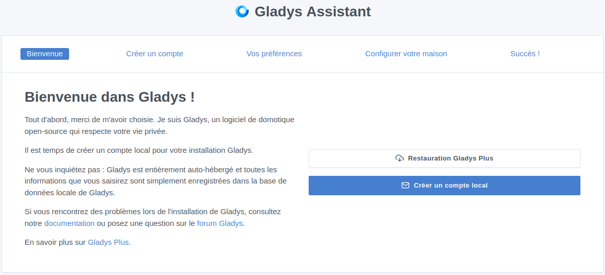
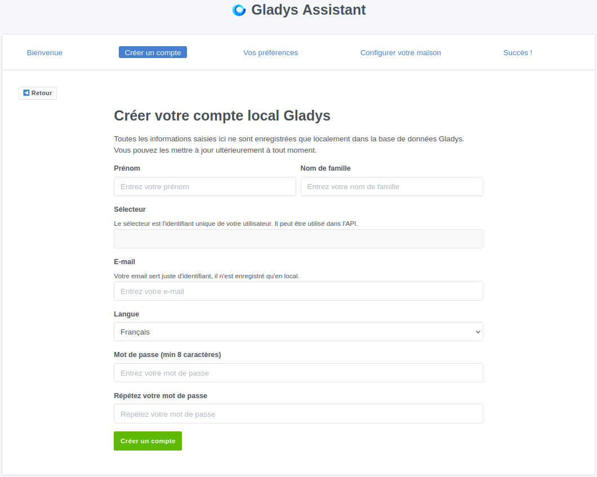
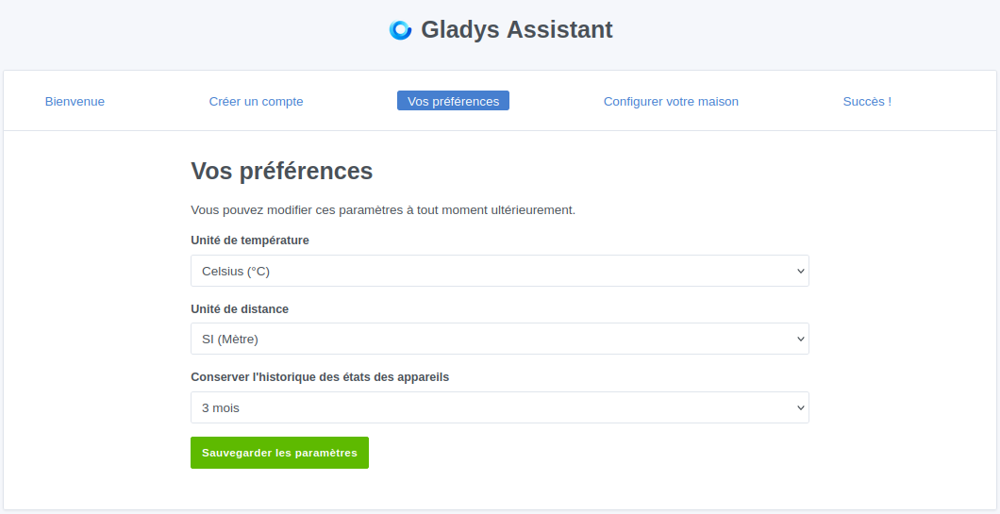
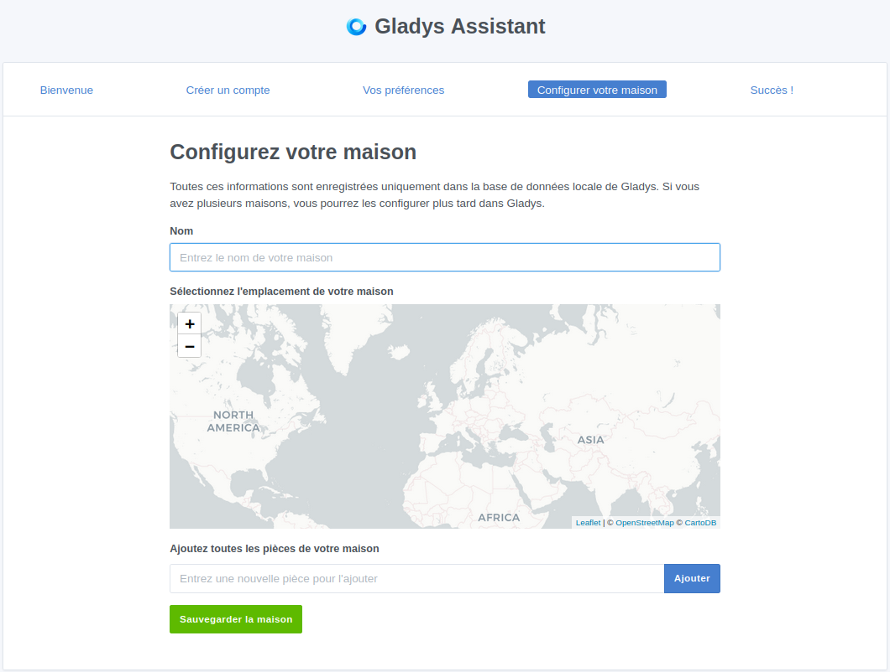
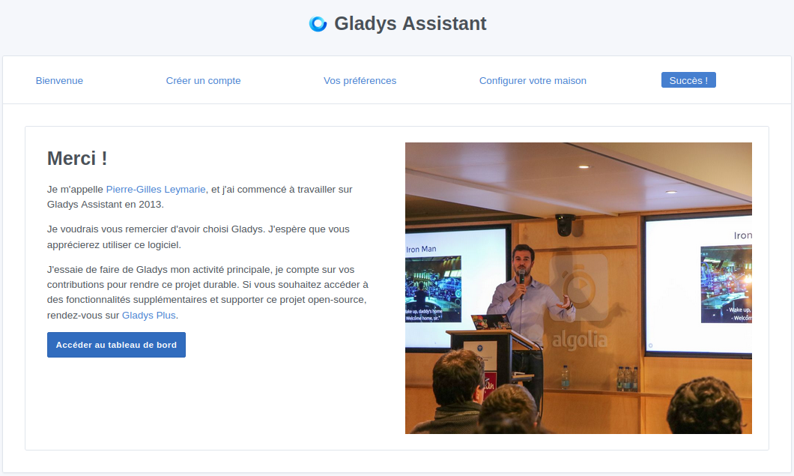
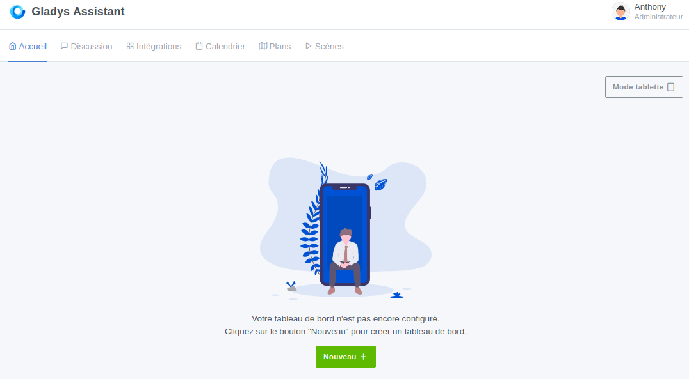
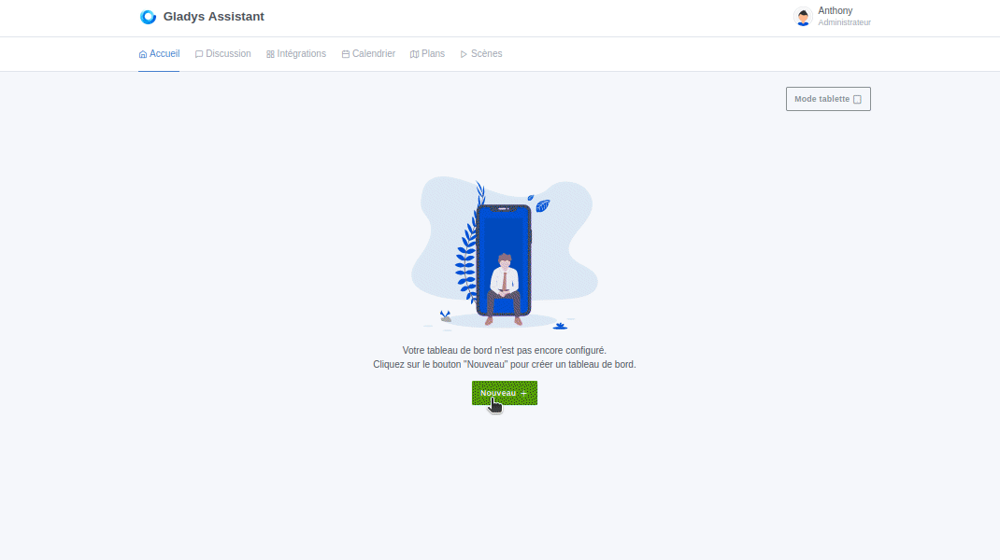
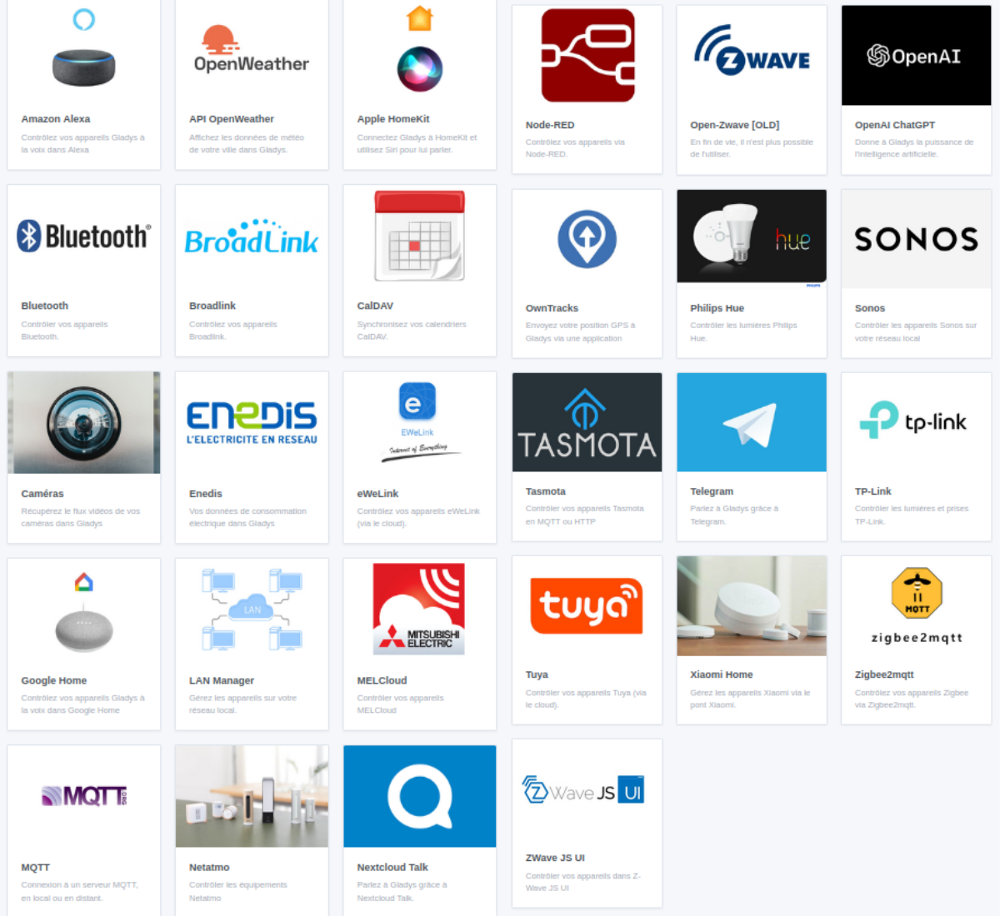
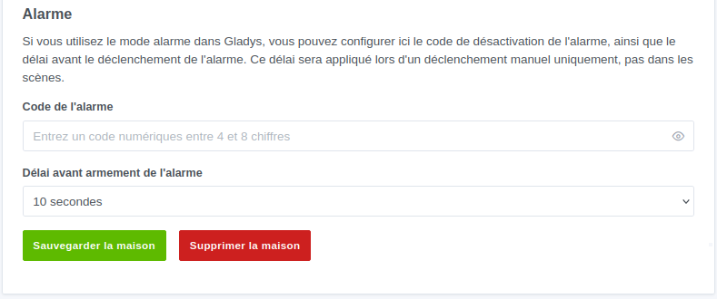
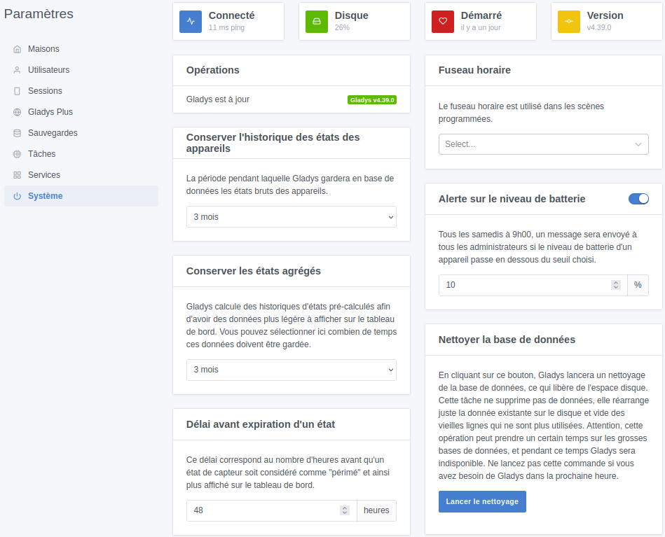

import Alert from "@components/mdx/Alert.astro";

Je vous ai parlé de Gladys Assistant lors de mon [précédent article](/blog/gladys_assistant_intro/). J'ai fait la promotion d'une solution prometteuse et surtout accessible aux débutants comme aux confirmés.

Nous allons donc voir ensemble comment l'installer sur une Raspberry Pi et sur un Mini PC.

<Alert type='info'>Comme pour Home Assistant, je vous conseille l'installation sur un Mini PC, même si Gladys consomme très peu de ressources.</Alert>

<Alert type="success">J'en profite aussi pour vous informer que la documentation officielle est disponible en Français et en Anglais [ici](https://gladysassistant.com/fr/docs/) et qu'une formation complète en partant de zéro est disponible [ici (90€)](https://formation.gladysassistant.com/gladys-starter-pack-2024/25ut8)</Alert>

Pour être honnête, je pense que l'installation sur Mini PC est la partie la plus compliquée de Gladys, mais en suivant le tutoriel, ça va être super simple.

Commençons !

<Alert type="info">Je vais vous présenter deux façons d'installer Gladys Assistant, mais sachez que la documentation recense plusieurs autres méthodes d'installation comme les [NAS Synology](https://gladysassistant.com/fr/docs/installation/synology/), [Unraid](https://gladysassistant.com/fr/docs/installation/unraid/), [Freebox Delta](https://gladysassistant.com/fr/docs/installation/freebox-delta/). Glady Assistant est aussi disponible dans plusieurs projets d'auto-hébergement comme [CasaOS](https://casaos.io/), [Tipi](https://runtipi.io/docs/apps-available) et d'autres à découvrir [ici](https://community.gladysassistant.com/t/gladys-dans-tous-les-stores/8454)</Alert>

## Installation sur Raspberry Pi

L'installation sur Raspberry Pi va aller assez vite, car il vous suffit de suivre mon tutoriel "[Installer un OS sur Raspberry Pi](/blog/raspberry_pi_installer_os/)" et de choisir Gladys Assistant dans la sélection de l'OS. Voici les étapes :
1. Choisissez votre modèle de Raspberry Pi.
1. Choisissez l'OS : `Other specific-pupose OS -> Home Assistant and Home automation -> Gladys Assistant -> Glaydys Assistant (64-bit)`.
1. Sélectionnez votre carte MicroSD ou votre SSD qui ira sur la Raspberry Pi.

Introduisez ou branchez le support sur votre Raspberry, reliez-le avec un câble Ethernet et lancez-le.

Rendez-vous sur l'adresse IP de votre Raspberry et c'est partie.

## Installation sur un mini PC.

L'installation va se dérouler en plusieurs étapes, dont voici le déroulement :
1. Installer un OS serveur comme Debian ([mon article ici](/blog/linux_debian_12_installation/)) ou Ubuntu serveur.
<Alert type="info">C'est le seul moment où vous avez besoin d'un écran, d'un clavier et d'une souris sur votre mini PC.</Alert>
1. Installer Docker en suivant [mon tutoriel](/blog/linux_debian_docker_installation/).
1. Installer Gladys Assistant avec deux lignes de commande.

### Installation de Gladys Assistant en Docker
Comme le stipule la documentation, il n'y a vraiment que deux lignes de code à taper pour avoir une instance de Gladys opérationnelle qui se mettra à jour toute seule. Vous n'aurez ensuite plus besoin de vous connecter en SSH.

Une fois connecté en SSH, la première commande concernera l'installation du conteneur Gladys Assistant dans sa version la plus à jour au moment de l'exécution.
```bash
docker run -d \
--log-driver json-file \
--log-opt max-size=10m \
--cgroupns=host \
--restart=always \
--privileged \
--network=host \
--name gladys \
-e NODE_ENV=production \
-e SERVER_PORT=80 \
-e TZ=Europe/Paris \
-e SQLITE_FILE_PATH=/var/lib/gladysassistant/gladys-production.db \
-v /var/run/docker.sock:/var/run/docker.sock \
-v /var/lib/gladysassistant:/var/lib/gladysassistant \
-v /dev:/dev \
-v /run/udev:/run/udev:ro \
gladysassistant/gladys:v4
```

Pour les débutants, la commande peut être lancée sans aucune modification, pour les plus expérimentés, vous pouvez l'adapter à votre installation.

La deuxième commande ajoutera le conteneur Watchover, qui vérifiera toutes les 24 heures si une nouvelle version de Gladys est disponible, puis il mettra à jour Gladys de façon complètement autonome.

```bash
docker run -d \
  --name watchtower \
  --restart=always \
  -v /var/run/docker.sock:/var/run/docker.sock \
  containrrr/watchtower \
  --cleanup --include-restarting
```

Pour vérifier que tout tourne, il vous suffit de lancer un `docker ps` qui devrait vous retourner ça.
```bash
anthony@DockerTest:~/$ docker ps
CONTAINER ID   IMAGE                                       COMMAND                  CREATED         STATUS                  PORTS      NAMES
ffe6c23f8c24   gladysassistant/gladys:v4                   "docker-entrypoint.s…"   8 minutes ago   Up 8 minutes                       gladys
2786e11c7a46   containrrr/watchtower                       "/watchtower --clean…"   21 hours ago    Up 21 hours (healthy)   8080/tcp   watchtower
anthony@DockerTest:~/$
```

Ouvrez votre navigateur et saisissez l'adresse IP de votre Mini PC dans la barre d'URL. 

Félicitations, vous êtes sur Gladys Assistant.



### Docker Compose
<Alert type="warning">Si vous avez suivi la procédure précédente, pas besoin de suivre celle-ci, passez directement au chapitre suivant.</Alert>

Pour ceux préférant les fichiers docker-compose, voici celui de Gladys Assistant.

```yaml
services:
  gladys:
    image: gladysassistant/gladys:z2m-setup-external
    container_name: gladys
    restart: always
    privileged: true
    network_mode: host
    cgroup: host
    logging:
      driver: "json-file"
      options:
        max-size: 10m
    environment:
      NODE_ENV: production
      SQLITE_FILE_PATH: /var/lib/gladysassistant/gladys-production.db
      SERVER_PORT: 80
      TZ: Europe/Paris
    volumes:
      - /var/run/docker.sock:/var/run/docker.sock
      - ./gladysassistant:/var/lib/gladysassistant
      - /dev:/dev
      - /run/udev:/run/udev:ro
      
  watchtower:
    image: containrrr/watchtower
    restart: always
    container_name: watchtower
    command: --cleanup --include-restarting
    volumes:
      - /var/run/docker.sock:/var/run/docker.sock
```

## Premier lancement

Lors du premier lancement de Gladys Assistant, vous allez devoir créer un compte **local** ou vous pourrez restaurer une sauvegarde (nécessite Gladys Plus pour le moment).

Sachez qu'à part la création de compte, vous pourrez tout modifier ou ajouter des choses plus tard depuis le tableau de bord en cliquant sur l'icône en haut à droite puis sur `Paramètres`.

1. Cliquez sur `Créer un compte local`.

Remplissez les champs disponibles et terminez en cliquant sur `Créer un compte`.
<Alert type="info">Toutes les informations restent en local, il n'y a aucune information qui part sur le web. L'adresse e-mail ne sert qu'à se connecter, vous ne recevrez jamais d'e-mail.</Alert>
1. Paramétrez vos préférences.

Le paramètre 'Conserver l'historique des états des appareils` fera en sorte que la base de donnée ne conserve que trois mois d'historique par défaut, tout le reste sera supprimé. A vous de choisir en fonction de votre besoin.

<Alert type="warning">Je vous conseille de changer le paramètre `Conserver l'historique des états des appareils` en `illimité` si vous comptez faire de la gestion d'énergie.</Alert>

1. Passons à la configuration géographique de la maison et de ses pièces.

Commencez par donner un nom à votre maison, puis sélectionnez là sur la carte. Ensuite, vous pouvez ajouter toutes les pièces.



La configuration est terminée, vous pouvez dès à présent `Accéder au tableau de bord`.

Il est bien vide ce tableau de bord ;).


### Petit tour rapide des onglets.
En haut de votre page d'accueil, vous avez six onglets au centre/gauche et l'accès à votre profil et à vos paramètres en haut à droite.

**Accueil :**
Par défaut, nous sommes sur l'Accueil, c'est la page où sera affiché tout ce que vous souhaitez avoir en visuel. Vous pourrez créer plusieurs tableaux de bord pour organiser vos éléments en différentes vues.
Pour le modifier, il vous suffit de cliquer sur `Editer` en haut à droite.


**Discussion :**
L'onglet discussion est un chat permettant d'interagir avec votre domotique. Vous pouvez lui poser tout un tas de questions comme "Quel temps fait-il ?", "Montre-moi la caméra de la cuisine", "Quelle est la température dans la cuisine ?".

Avec Gladys Plus, vous avez accès à l'intégration ChatGPT, ce qui vous permet de discuter avec votre domotique de la façon la plus humaine possible.

Une intégration Telegram est aussi disponible.

**Intégrations :**
Les intégrations de Gladys sont vraiment son point fort, car elles sont installables sans aucune configuration technique. De plus, chaque intégration a une documentation complète disponible en français et en anglais.



**Calendrier :**
Gladys permet de créer des scènes à partir d'un ou plusieurs calendriers. Pour cela, il suffit de connecter Gladys à vos calendriers externes. Il est compatible avec Nextcloud, iCloud, Google Agenda, Calendrier Synology et tous les calendriers CalDAV.

Il est possible de déclencher des scènes sur un événement qui arrive ou qui est en cours. Des variables préconfigurées permettent de récupérer simplement le nom de l'événement, le lieu, la date de début et de fin, etc.

**Plans :**
Le plan vous permet de définir des zones qui pourront être appelées dans des scènes sous l'effet d'entrée ou de sortie.

**Scènes :**
Dans Gladys Assistant, les scènes sont les automatisations. La création d'une scène est très intuitive, car chaque intégration a des déclencheurs et des actions qui lui sont associées. Cette façon de faire les choses rend la création de scènes très facile sans avoir besoin de se torturer le cerveau de mécanismes de codeur.

Il nous reste l'icône de notre utilisateur avec son menu qui permet d'accéder aux paramètres de Gladys Assistant et à ceux de notre profil.

### Les paramètres
Je ne vais pas entrer dans les détails du menu paramètre de Gladys Assistant, car pour la plupart, vous n'aurez pas besoin d'y aller.

Je vais en citer quelques-uns.

**Maison :** Vous pouvez ajouter ou supprimer des pièces depuis cet endroit. Il vous permet aussi de **définir un code d'alarme** et un **délai avant son armement**.


**Utilisateurs :** C'est ici que vous pouvez gérer vos utilisateurs, que ce soit pour en ajouter, en modifier ou en supprimer.

**Gladys Plus :** C'est ici que vous pouvez vous connecter à votre compte Gladys Plus si vous en avez un.
<Alert type="success">Gladys Assistant est **gratuit** à utiliser, mais vous pouvez vous abonner à Gladys Plus pour des fonctionnalités supplémentaires tel que l'accès à distance chiffré de bout en bout, les sauvegardes automatiques, l'accès à une API REST ouverte accessible de partout dans le monde et d'autre fonctionnalité comme Google Home, Alexa ChatGPT, etc. [En savoir plus](https://gladysassistant.com/fr/plus/)</Alert>

**Sauvegardes :** Accessible seulement avec un compte Gladys Plus, mais il est possible de faire des sauvegardes manuelles, nous verrons ça dans un prochain article. J'espère qu'à terme la possibilité de faire une sauvegarde locale sera implantée, car c'est un élément important pour une domotique robuste.

**Système :** Vous pouvez retrouver plusieurs informations sur votre instance Gladys Assistant, mais aussi modifier l'historique des états des appareils, nettoyer la base de données.

Une fonction intéressante comme l'envoi tous les samedis à 09h00 de la **liste des appareils avec moins de 10% (configurable) de batterie** est configurable depuis cet endroit.



## Conclusion
Nous arrivons à la fin de cet article et j'aurai encore envie de vous parler de Gladys pendant longtemps. Je suis vraiment très sensible à cette solution, grâce à sa simplicité et ses petites options par-ci par-là.

Je vous le dis encore, mais pour ceux qui ne souhaitent pas se prendre la tête avec des configurations, du code ou autres joyeusetés, testez Gladys Assistant et on en reparle.

Je vais continuer à découvrir et à écrire sur Gladys Assistant, car c'est un réel plaisir.


J'en profite pour vous rappeler que pour les personnes partant de zéro, il y a une **formation complète et accessible** pour vous accompagner dans la prise en main de cette solution domotique. Dans cette formation, dispensée sous forme de vidéos et d'appels live, Pierre-Gilles profite de l'achat récent de son appartement pour le domotiser de A à Z avec vous. Cela permet la découverte des fonctionnalités de Gladys Assistant et de mettre en place votre propre installation domotique en parallèle. Elle est accessible sur [formation.gladysassistant.com](https://formation.gladysassistant.com/gladys-starter-pack-2024/25ut8) pour 90 euros et son contenu évolue de semaine en semaine.

<Alert type="info">**Mon avis personnel:** Je me suis inscrit à cette formation plus comme un don envers le projet que pour son contenu, mais cette formation est très intéressante et adaptée aux grands débutants. Elle part vraiment du début et présente plein d'informations liées à la solution Gladys Assistant, mais aussi à la domotique générale. Elle a pour le moment peu d'intérêt pour les gens connaissant déjà la domotique, mais permet de soutenir Gladys Assistant.</Alert>

Il y a toujours en cours le **lancement d'un kit de démarrage en édition très limitée**, même si le contenu n'est pas connu pour le moment, il est limité à 10 exemplaires. Vous pouvez y participer en remplissant le formulaire à [cette adresse](https://forms.gle/p4GpnPfbk8GxMKEB9).

Je vous dis à très vite pour un prochain article. Home Assistant ou Gladys ????

### Sources
* [Site Officiel](https://gladysassistant.com/fr/)
* [Gladys Plus](https://gladysassistant.com/fr/plus/)
* [La documentation](https://gladysassistant.com/fr/docs/)
* [La formation](https://formation.gladysassistant.com/gladys-starter-pack-2024/25ut8)
* [La chaine Youtube](https://www.youtube.com/@GladysAssistant) avec des tutos et du live coding.
