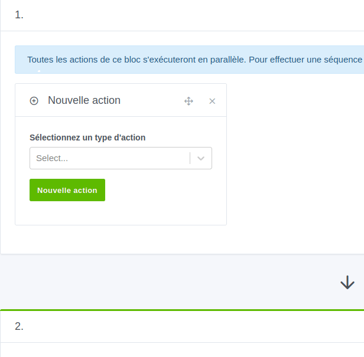

Je vois, sur les réseaux, groupes, forums que je fréquente, beaucoup de débutants se diriger vers Home Assistant pour, au final, faire de la domotique assez basique. Home Assistant n'est pas la solution la plus facile à prendre en main, surtout pour un débutant en domotique, même si elle s'est grandement améliorée depuis quelque temps.

C'est dans ce contexte que Gladys Assistant a de quoi rivaliser avec Home Assistant et c'est pour cela que je compte vous en parler dans cet article.

Après avoir utilisé Jeedom, Domoticz puis Home Assistant, je pense que Gladys a largement sa place dans les solutions domotique, voire monté à la première place du podium pour le débutant.

Gladys Assistant se présente comme une alternative prometteuse aux mastodontes de la domotique tels que Jeedom, Domoticz et Home Assistant. Cette solution open-source française séduit par son approche centrée sur la simplicité d'utilisation et le respect de la vie privée. Mais face à des concurrents bien établis, Gladys Assistant parvient-elle à se démarquer ? Découvrons ses points forts et ses points faibles, en nous attardant sur sa prise en main, ses atouts et son offre Gladys Plus.

Gladys est codé en Javascript via Node.js côté serveur, et utilise la librairie Preact.js pour le frontend. Le thème, quand a lui, utilise [Tabler](https://tabler.io/) basé sur Bootstrap 5.

Gladys peut être installée soit sur une Raspberry Pi soit en Docker, mais Pierre-Gilles Leymarie (le fondateur et principal contributeur du projet) a pensé son application en mode "l'utilisateur en premier" ce qui la rend accessible au grand débutant, mais peut frustrer les utilisateurs avancés (ils peuvent quand même s'amuser à bidouiller). De plus, la documentation exemplaire vous propose aussi une installation sur NAS Synology, Unraid ou encore Freebox Delta.

## Une facilité de prise en main : Un atout indéniable

L'un des points forts indéniables de Gladys Assistant réside dans sa simplicité d'utilisation. L'installation se déroule sans encombre et sans connaissances (sur les Raspberry Pi), même pour les novices, grâce à une documentation claire, elle peut être un peu plus complexe pour une installation sur un Mini PC, mais encore une fois la documentation est très explicite et permettra donc au plus novices d'installer Gladys Assistant. 

L'interface web est intuitive et ergonomique, permettant une navigation fluide et une prise en main rapide des fonctionnalités. Que vous soyez un geek chevronné ou un utilisateur lambda, Gladys Assistant vous permettra de domotiser votre maison sans vous arracher les cheveux.

### Un tableau de bord personnalisable.
Le tableau de bord de Gladys Assistant fait partie des meilleures interfaces de système domotique. Avec une gestion par colonnes depuis la sortie de la V4 (Novembre 2020) et l'ajout de widgets très intuitifs, il permet aussi de replacer ces widgets par simple glisser/déposer (février 2023).

Il est possible de créer plusieurs tableaux de bord et d'y ajouter des graphiques, des boutons ou toute autre information d'un capteur ou d'une pièce de manière simple et efficace.

### Un mode tablette intégré par défaut.
Intégrée depuis octobre 2023, l'option tablette disponible dans Gladys Assistant, permet de transformer une tablette tactile en véritable centre de contrôle domotique. Gérez vos éclairages, pilotez vos volets roulants, visualisez les images de vos caméras, le tout depuis le confort de votre canapé, de votre terrasse ou depuis un mur de votre habitation.

C'est une fonction bien pensée qui ajoute des petites options sympathiques comme le verrouillage de la tablette avec affichage du pad de déverrouillage lorsque le mode alarme est activé, un mode kiosque d'un simple clic et par tableau de bord.

### Application mobile
Pierre-Gilles a fait le choix de faire une application Progressive Web App (PWA) qui permet d'être installée sur n'importe quel appareil (iOS, Android, Windows, Mac, etc...).

La procédure est expliquée [ici.](https://gladysassistant.com/fr/docs/installation/phone/)

## Les scènes

Les scènes (automatisations) de Gladys Assistant sont un élément vraiment génial qui vous permet de domotiser votre maison de manière intuitive et puissante. Voici quelques points forts à souligner :

* Hautement personnalisables :  Créez des scénarios uniques qui correspondent à votre vie quotidienne. Envie d'une ambiance "Cinéma" ? tamisez les lumières, allumez le projecteur et lancez votre film en une seule commande.

* Déclencheurs variés :  Programmez vos scènes pour qu'elles se déclenchent automatiquement en fonction de l'heure, du lever ou du coucher du soleil, de la présence d'un utilisateur ou même d'événements de votre calendrier.

* Enchainement d'actions :  Ne vous limitez pas à une seule action par scène. Gladys Assistant permet d'enchaîner plusieurs actions à la suite, pour des routines encore plus élaborées. Imaginez une scène "Départ" qui éteint les lumières, ferme les volets roulants et ajuste le thermostat en une seule fois.

* Une gestion par tags (depuis novembre  2023) qui facilite les recherches.

En résumé, les scènes de Gladys Assistant vous donnent le pouvoir de transformer votre maison en un environnement intelligent et automatisé qui répond parfaitement à vos besoins et à votre mode de vie.

## Les intégrations
Les intégrations de Gladys sont sa force, mais aussi sa faiblesse, je m'explique.

Il y a un nombre limité d'intégrations, qui est bien sûr amené à évoluer en fonction des demandes et des contributions, mais elles ont un avantage indéniable. Chaque intégration bénéficie :
* D'une intégration à l'interface complète. 
* D'une documentation exemplaire et complète en Français et en Anglais au moment de sa sortie et à chaque fonctionnalité ou évolution.
* Il n'y a pas plusieurs intégrations pour une même fonction (ce qui évite de s'y perdre).
* Certaines nécessitent Gladys Plus ou le Cloud et pour le moment, elles ne sont pas clairement indiquées, mais ça va venir (Pierre-Gilles, si tu m'écoutes ;))

Voici les intégrations actuellement supportées au moment où j'écris cet article (pour voir les nouveautés, rendez-vous sur la [documentation](https://gladysassistant.com/fr/docs/))

## Une documentation exemplaire pour une prise en main facilitée

*Je souhaite **mettre à l'honneur** la **qualité** de la **documentation** de Gladys Assistant que ce soit en français ou en anglais. Elle est complète et de qualité.*

Gladys Assistant se distingue par sa documentation complète et accessible, conçue pour accompagner les utilisateurs de tous niveaux dans la prise en main de la solution domotique.

Que vous soyez un novice en domotique ou un utilisateur expérimenté, vous trouverez dans la documentation Gladys Assistant toutes les informations nécessaires pour installer, configurer, utiliser votre système domotique et même développer.

### Une documentation riche et structurée

La documentation Gladys Assistant est structurée en différentes sections, chacune abordant un aspect spécifique de la solution. Vous trouverez ainsi des guides détaillés pour :

* Installer Gladys Assistant sur différents supports (Raspberry Pi, Docker, etc.).
* Configurer vos périphériques domotiques.
* Créer des scénes d'automatisation.
* Utiliser l'interface web et l'application mobile.
* Dépanner les problèmes courants.

### Des tutoriels vidéo et des exemples concrets

En plus des guides textuels, la documentation Gladys Assistant propose également de nombreux tutoriels vidéo qui illustrent pas à pas les différentes étapes de la configuration et de l'utilisation de la solution.

De plus, des exemples concrets sont fournis pour chaque fonctionnalité, vous permettant de mieux comprendre son fonctionnement et de l'adapter à vos besoins spécifiques.

## Gladys+ : Un service premium pour une expérience enrichie

Pour les utilisateurs les plus exigeants, Gladys+ propose des fonctionnalités supplémentaires moyennant un abonnement payant. 

* Accès à distance : Accédez à votre instance Gladys depuis n'importe où dans le monde, sans configuration, avec un trafic entièrement chiffré de bout en bout.
* Sauvegardes automatiques : Gladys Plus sauvegarde votre instance locale tous les jours. Les sauvegardes sont chiffrées avec une clé que vous seul détenez.
* Assistant vocaux : Contrôler votre domotique Gladys depuis Google Home / Alexa, à la voix ou sur votre téléphone.
* Converser de manière humaine avec votre domotique grâce à ChatGPT.
* Faites parler vos enceintes avec le Text To Speech.
* API REST ouverte : Pour les plus bidouilleurs, vous pouvez envoyer des requêtes HTTP à votre instance Gladys de n'importe où dans le monde. Vous pouvez envoyer des valeurs de capteurs, votre géolocalisation avec Owntracks ou Tasker, les possibilités sont infinies !

Pour en savoir plus sur Gladys Plus, rendez-vous sur le [site de Gladys Assistant](https://gladysassistant.com/fr/plus/)

## Gladys Assistant vs les concurrents : Un positionnement stratégique

Face à des acteurs bien installés comme Jeedom, Domoticz et Home Assistant, Gladys Assistant se distingue par sa simplicité d'utilisation et son approche résolument centrée sur la vie privée. La préoccupation permanente de l'utilisateur plutôt que la technique ou les options à gogo en font une solution avec une courbe d'apprentissage plus simple. Les utilisateurs avancés ne sont pas en reste avec l'intégration Node-Red qui leur permettra d'être limités que par leurs imaginations.

* **Jeedom** offre un écosystème plus vaste et une communauté plus active (mais assez sectaire), avec une interface pouvant s'avérer moins intuitive pour les débutants et surtout, il n'y a **rien** de vraiment **gratuit**.
* **Domoticz** se positionne comme une solution légère et personnalisable, mais son **interface vieillissante** peut rebuter certains utilisateurs.
* **Home Assistant** propose une expérience riche et personnalisable à l'extrême, mais sa courbe d'apprentissage peut être plus ardue.

**Gladys Assistant** se positionne donc comme un compromis idéal entre simplicité, fonctionnalités et respect de la vie privée.
**Points forts :**
* Facilité de prise en main.
* Respect de la vie privée.
* Fonctionnalités alarme et tablette pratiques.
* Option Gladys+ pour une expérience enrichie.

**Points faibles :**
* Écosystème moins vaste que ses concurrents.
* Communauté plus petite, mais active.
* Certaines fonctionnalités avancées nécessitent un abonnement Gladys Plus.

## Conclusion : Une solution prometteuse à essayer et pourquoi pas à adopter.

Gladys Assistant se révèle être une solution domotique prometteuse, particulièrement adaptée aux utilisateurs novices à la recherche d'une solution simple et intuitive. Ses atouts en matière de respect de la vie privée et de fonctionnalités pratiques en font un choix intéressant.

Néanmoins, Gladys Assistant devra continuer à étoffer son écosystème et à développer sa communauté pour rivaliser pleinement avec les ténors du marché. La solution a cependant le vent en poupe et mérite d'être suivie de près par tous ceux qui recherchent une alternative simple et efficace aux solutions domotiques traditionnelles comme Jeedom et Domocticz.

Comme toute solution, pour maximiser l'utilisation locale de votre système domotique, il faut y réfléchir avant d'acheter des produits en se tournant vers des protocoles ouverts comme le Zigbee.

J'en profite aussi pour vous parler de deux produits en place (en plus de Gladys Plus) orientés débutants en domotique.
* **Une formation complète et accessible :** Pour accompagner ses utilisateurs dans la prise en main de sa solution domotique, Gladys Assistant propose une formation complète et accessible à tous. Dans cette formation, dispensée sous forme de vidéos et d'appels live, Pierre-Gilles profite de l'achat récent de son appartement pour le domotiser de A à Z avec vous, permettant la découverte des fonctionnalités de Gladys Assistant et de mettre en place votre propre installation domotique en parallèle. Elle est accessible sur [formation.gladysassistant.com](https://formation.gladysassistant.com/gladys-starter-pack-2024/25ut8) pour 90 euros et son contenu évolue de semaine en semaine.

***Mon avis personnel:** Je trouve, pour le débutant, cette formation très intéressante et adaptée qui part vraiment du début et présente plein d'informations liées à la solution Gladys Assistant, mais aussi à la domotique générale. Elle a pour le moment peu d'intérêt pour les gens connaissant déjà la domotique, mais permet de soutenir Gladys Assistant autrement tout en ayant un contenu de qualité.*

* **Lancement d'un kit de démarrage / édition très limitée :** Il vient de lancer un kit de démarrage, même si le contenu n'est pas connu pour le moment, il est limité à 10 exemplaires. Vous pouvez y participer en remplissant le formulaire à [cette adresse](https://forms.gle/p4GpnPfbk8GxMKEB9).

Si vous êtes à la recherche d'un système domotique simple et rapide, je vous invite vraiment à tester Gladys Assistant, surtout si vous débutez dans la domotique. Il vous évitera des heures d'arrachage de cheveux et du temps.

### Sources
* [Site Officiel](https://gladysassistant.com/fr/)
* [Gladys Plus](https://gladysassistant.com/fr/plus/)
* [La formation](https://formation.gladysassistant.com/gladys-starter-pack-2024/25ut8)
* [La chaine Youtube](https://www.youtube.com/@GladysAssistant) avec des tutos et du live coding.
