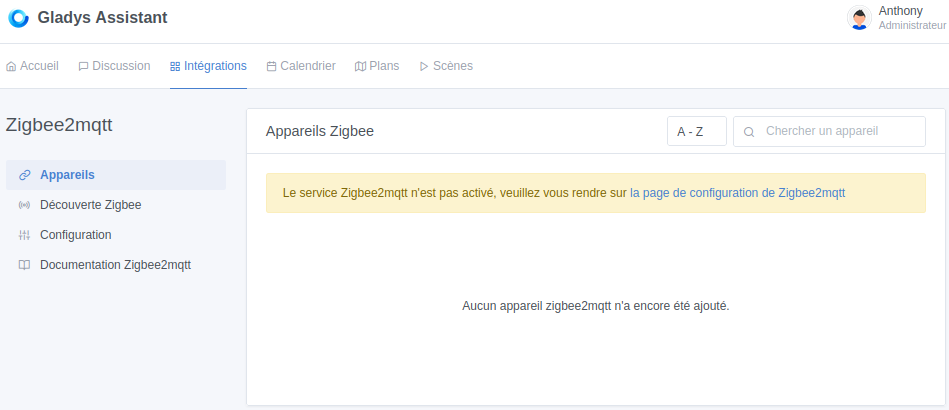
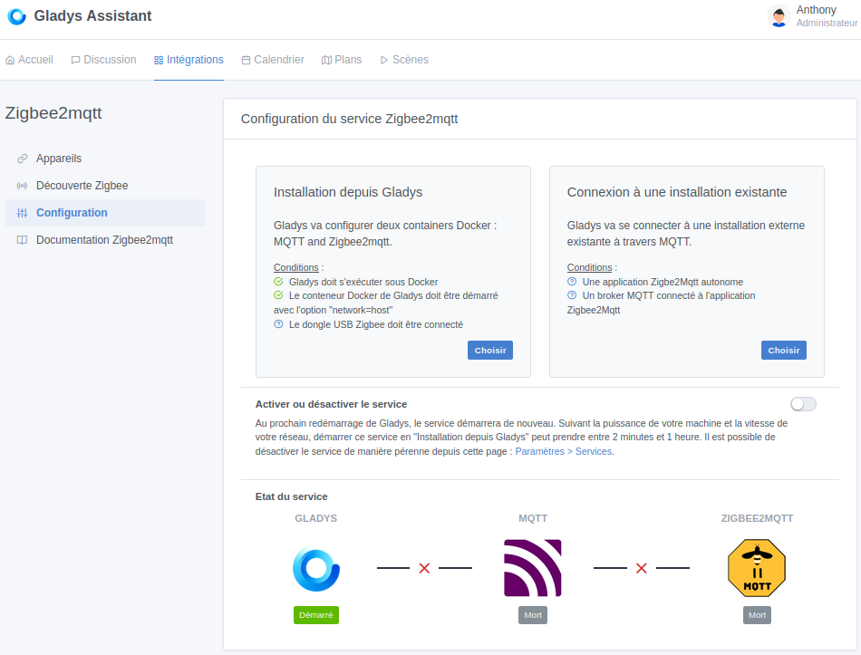
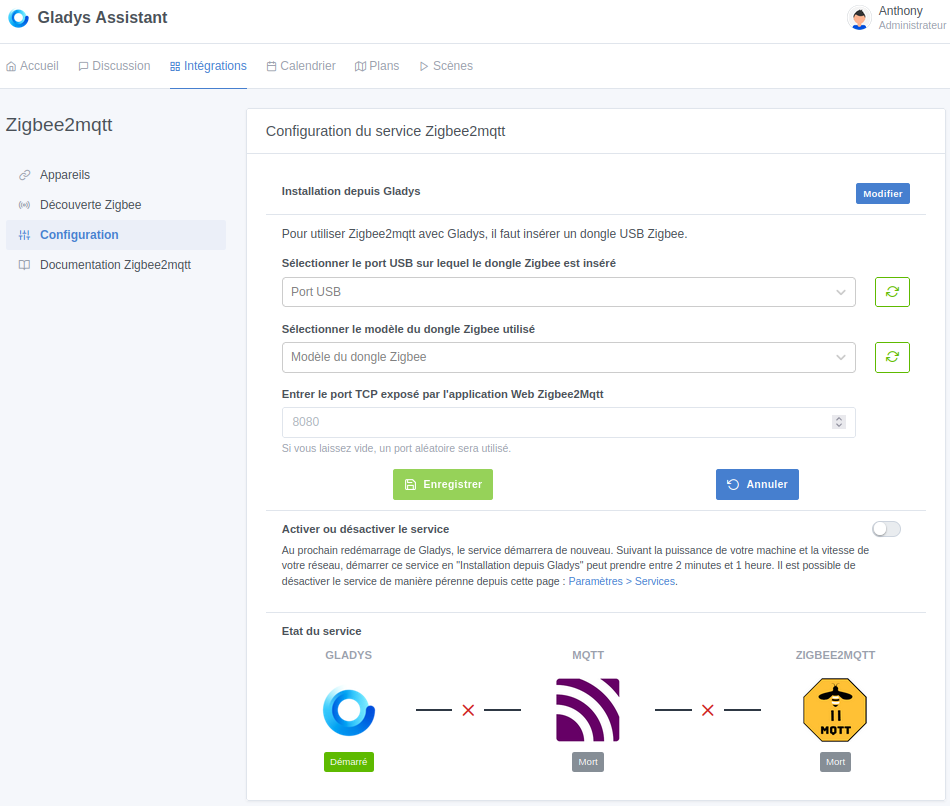
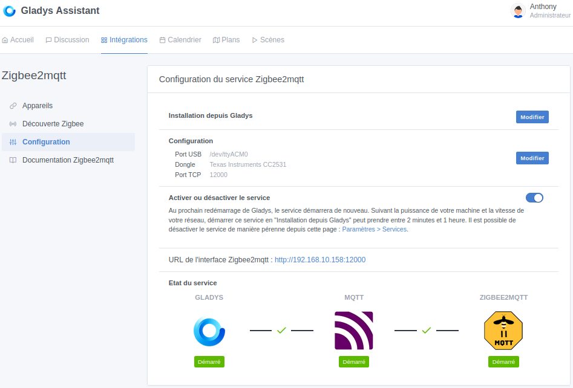
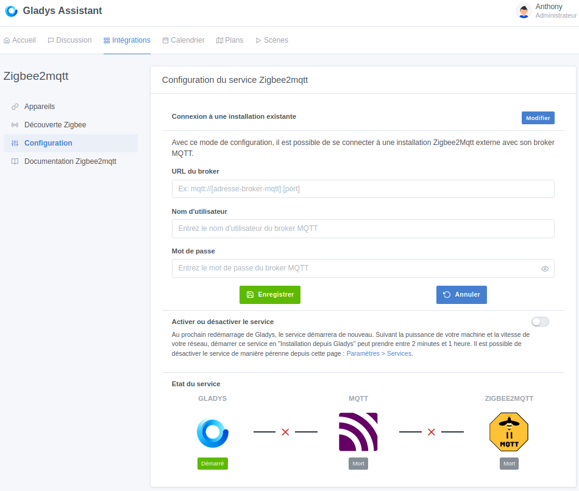
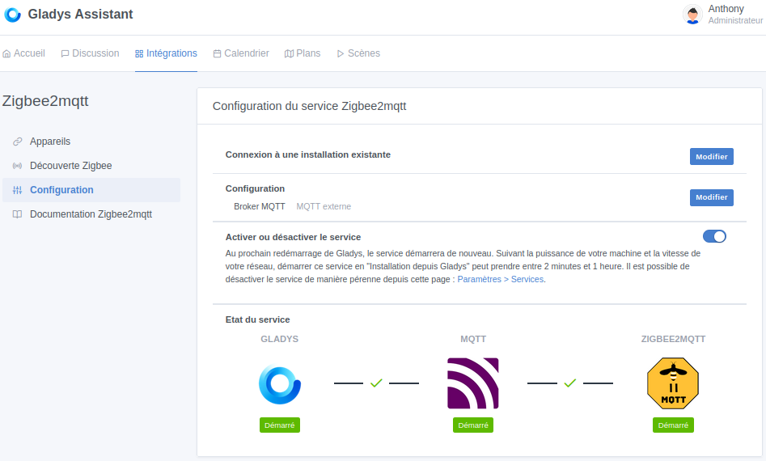
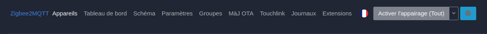
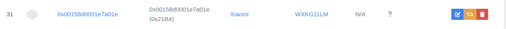
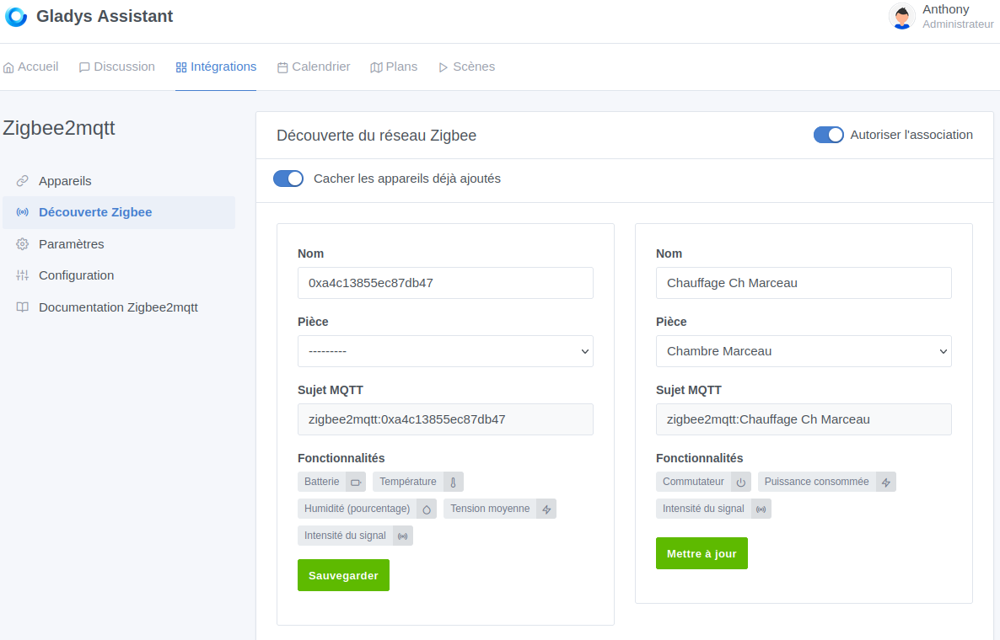

import Alert from "@components/mdx/Alert.astro";

**Tuto réalisé avec :**
* Gladys Assistant v4.39
* Intégration : Zigbee2MQTT
* Matériels : [Sonoff Zigbee 3.0 USB Dongle Plus **P**](https://amzn.to/4a0zXQf)

Blablablabal Zigbee

Gladys Assistant permet deux façons d'ajouter l'intégration Zigbee2MQTT :
* Depuis Gladys : C'est Gladys qui gère tout. Sans rentrer dans les détails, Gladys Assistant va créer un conteneur MQTT et Zigbee2MQTT. Ça va être complètement transparent pour vous.
* Depuis une installation existante : C'est à vous de fournir les paramètres de connexion au broker sur lequel est rattaché Zigbee2MQTT.

<Alert type="warning">Attention à bien sélectionner l'intégration Zigbee2MQTT si vous souhaitez connecter une Zigbee2MQTT existante. Ne passez pas par le broker MQTT fourni par Gladys pour cela</Alert>

## Ajouter l'intégration Zigbee2MQTT a Gladys
### Installation de Zigbee2MQTT depuis Gladys
Pour ajouter l'intégration Zigbee2MQTT depuis Gladys, il faut :
1. Allez dans l'onglet `intégrations`, recherher Zigbee2MQTT et cliquez dessus.

1. Cliquez sur `Configuration` dans le menu de gauche puis cliquez sur le bouton `Choisir` dans le cadre `Installation depuis Gladys`.

1. Il faut sélectionner votre clé USB puis définir le modèle. Ensuite, vous pouvez personnaliser le port pour l'interface de Zigbee2MQTT.

1. Enregistrez et activer le service.

Votre Zigbee2MQTT est démarré et fonctionnel. Pour ouvrir l'interface, cliquez sur le lien qui vous est fourni.
 
Passez le chapitre suivant pour aller directement a l'interface.

### Connexion a une instance existante
Si vous avez déjà une instance Zigbeee2MQTT et que vous souhaitez la connecter à Gladys Assistant, il vous suffit :
1. Allez dans l'onglet `intégrations`, rechercher Zigbee2MQTT et cliquez dessus.

1. Cliquez sur `Configuration` dans le menu de gauche puis cliquez sur le bouton `Choisir` dans le cadre `Connexion à une installation existante`.

1. Remplissez les informations de votre Broker MQTT, ainsi que le nom d'utilisateur et le mot de passe pour s'y connecter.

1. Enregistrez puis Activez le service.

Vous ne pourrez pas accéder à l'interface de votre Zigbee2MQTT depuis Gladys, pour le moment.

## Utilisation de Zigbee2MQTT
<Alert type="info">L'interface étant la même, j'ai repris cette partie de l'[article sur l'installation de Zigbee2MQTT sur Home Assistant](/blog/ha_mosquitto_broker_zigbee2mqtt/).</Alert>

L'utilisation de Zigbee2MQTT est assez simple, même si l'interface peut faire peur avec tous les menus et options disponibles.

Voyons ensemble ce que vous devez savoir dès le début.

### Appairer ses appareils
Avant de parler d'appairage, je vais quand même vous faire un petit rappel sur les deux types d'appareils que vous pouvez trouver sous Zigbee qui constitue son réseau "maillé".
* Vous avez les capteurs que l'on appelle les **End Device** (children, Enfants), souvent des capteurs sur pile, qui ne font que transmettre leurs informations. Ils ne participeront pas au "maillage" permettant d'étendre votre réseau.
* Vous avez ceux que l'on appelle **routeur**, qui permettent d'étendre le réseau en faisant transiter les informations des "enfants" vers le **coordinateur** (clé USB Sonoff dans notre cas). Dans la plupart des cas, tous les appareils alimentés en permanence par le réseau électrique font office de  routeur.

Ce réseau permet de connecter bien plus d'appareils que ne pourrait supporter votre **coordinateur** (clé USB Sonoff) à lui seul, car un routeur compte comme un enfant aux yeux du coordinateur, mais chaque routeur peut avoir plusieurs End Device.

Une image vaut bien plus que des mots.

**1^er^ conseil**
Normalement le réseau est censé se gérer tout seul, mais il est conseillé d'ajouter en premier les appareils faisant office de routeur puis les autres.
**2^e^ conseil**
Appairez vos appareils à leur emplacement définitif, si et seulement si ça ne marche pas, essayez proche du coordinateur.

Chaque appareil a sa procédure pour être appairé, la documentation de Zigbee2MQTT l'indique dans la plupart des cas sur la fiche du produit supporté.

Un point positif pour Zigbee2MQTT est la possibilité de mettre tous les routeurs en mode appairage en un clic ou alors de ne sélectionner qu'un seul routeur, ce qui forcera votre capteur à se connecter à ce dernier.

***Mon avis :** Je ne sais pas si cela a vraiment une incidence, car j'active toujours l'appairage sur tous les routeurs, mais je suis preneur de vos retours*.

### Comment ajouter un appareil à Zigbee2MQTT

<Alert type="success">Notez qu'il est possible d'appairer les appareils depuis Gladys directement dans le menu `Découverte Zigbee`. (Voir chapitre suivant)</Alert>

Rendez-vous dans l'interface de Zigbee2MQTT.
* Cliquer sur le bouton en haut à droite `Activer l'appairage (Tout)` ou alors sur la petite flèche pour choisir sur quel routeur. L'apparaige est autorisé pendant 4 minutes et 14 secondes.

* Aller sur l'appareil à appairer puis lancer la manipulation d'appairage.
* Retourner sur l'interface de Zigbee2MQTT (le plus simple est de s'y connecter avec votre smartphone, ça évite les aller-retour), plusieurs pop-ups devraient s'afficher en vert.
* Une fois appairé, il doit s'afficher à la suite des appareils déjà ajoutés.

Sur l'image ci-dessus, 
* `0x00158d0001e7a01e` correspond à l'adresse IEEE de l'appareil, c'est un numéro unique,
Ensuite, vous avez des informations classiques, le constructeur, le modèle, l'image et le nom simplifié (pas simple pour le moment). Vous avez aussi l'information sur la source d'alimentation, pile ou secteur.
* Le `LQI` est la qualité du signal entre votre appareil et votre coordinateur ou routeur (en fonction de là où il est connecté), plus il est fort, mieux c'est (je crois que ça s'arrête à 255)

Il reste maintenant les trois boutons complètement à droite.
* Le premier permet de renommer votre appareil,

* Le deuxième de forcer la reconfiguration de l'appareil (en gros, il l'interroge)
* Le troisième, facile, il supprime votre appareil.

Lors de la suppression, vous avez deux options :
* * Forcer la suppression
* * Bloquer tout nouvel appairage (si vous vendez un appareil par exemple)

## Zigbee2MQTT dans Gladys - Découverte et gestion des appareils
Maintenant que nous avons ajouté nos appareils à Zigbee2MQTT, nous allons devoir les intégrer dans Gladys pour pouvoir les utiliser dans nos scènes ou les afficher sur nos tableaux de bord.

Rendez-vous dans le menu `Découverte Zigbee` à gauche. Vous devriez voir apparaitre tous les capteurs que vous avez ajoutés via Zigbee2MQTT. Profitez-en pour localiser le bouton `Autoriser l'association` à droite, qui vous permet de lancer l'appairage sans passer par l'interface de Zigbee2MQTT.

Dans la capture suivante, nous voyons un nouvel appareil détecté, le `0xa4c13855ec87db47`. Il faut lui attribuer une pièce, lui changer son nom et le sauvegarder. Une fois sauvegardé, il apparaîtra dans le menu `Appareils`.

## Conclusion

Vous venez d'installer Zigbee2MQTT dans Gladys de manière extrêmement simplifiée. Il vous reste à déterminer l'appairage de tous vos capteurs Zigbee en privilégiant les capteurs faisant office de routeur en premier, même si normalement le réseau devrait se stabiliser tout seul.

Profitez-en pour ajouter quelques informations à vos tableaux de bord et créer quelques scènes.

Chaque appareil devant être intégré à Gladys de façon individuelle, il est possible que certains capteurs puissent ne pas être reconnus. Il faudra alors ouvrir une demande sur le forum de Gladys à [cette adresse](https://community.gladysassistant.com/) et un dev l'ajoutera.

### Sources
* [Site Officiel de Zigbee2MQTT](https://www.zigbee2mqtt.io/)
* [Liste des appareils supportés par Z2MQTT](https://www.zigbee2mqtt.io/supported-devices/)
* [Documentation Zigbee2MQTT Gladys](https://gladysassistant.com/fr/docs/integrations/zigbee2mqtt/)