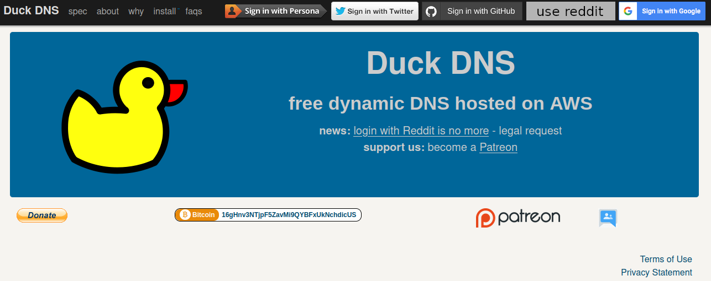
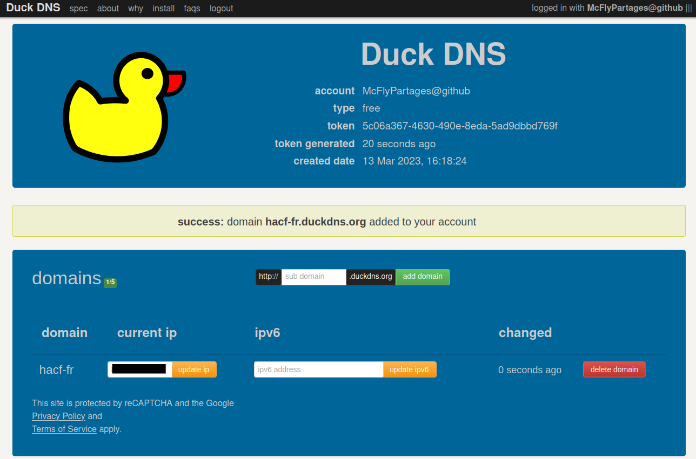
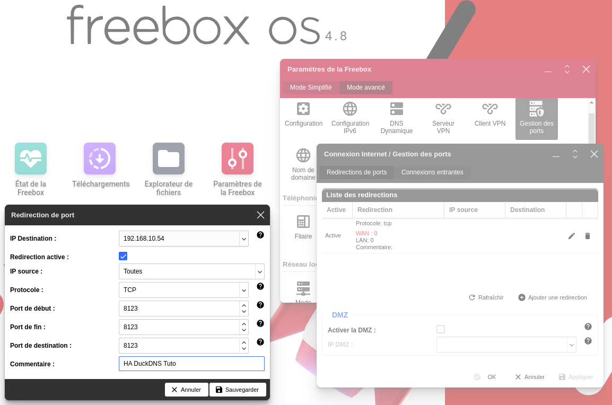
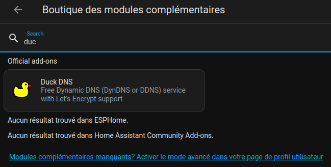
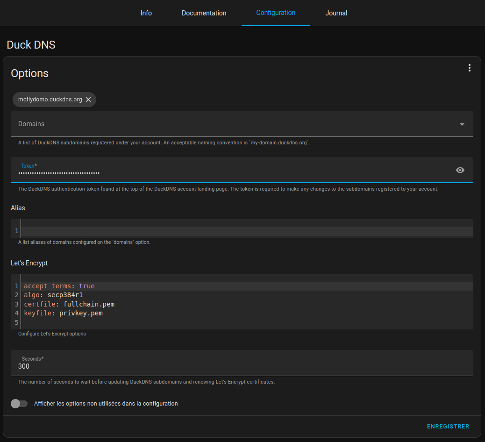
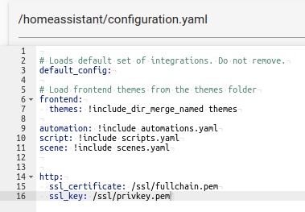
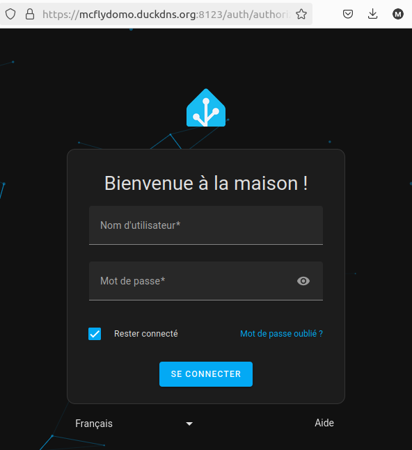

**Tuto réalisé avec :**
* HAOS 12.0, Core 2024.3.0, Supervisor 2024.02.1
* Add-on : DuckDNS 1.15.0
* Freebox Ultra avec Freebox OS V4.8

Vous souhaitez accéder à votre Home Assistant depuis l'extérieur ou bénéficier d'un nom de domaine gratuit pour ajouter un des assistants vocaux grand public.
DuckDNS est une des solutions, même si ce n'est pas la plus sécurisée, car elle ouvre une porte sur votre box/routeur pouvant être utilisé par des pirates s'ils la trouvent.
Nous allons voir ensemble comment donner rapidement un accès depuis l'extérieur à votre Home Assistant.

## Principe de DuckDNS
DuckDNS va vous permettre d’obtenir simplement et gratuitement un **sous domaine** DuckDNS (exemple : mcflydomo.duckdns.org) qui sera relié via l'add-on DuckDNS installé sur votre Home Assistant et permettra d’associer votre adresse IP publique au domaine DuckDNS (même si elle change).
Par contre, il faudra ouvrir un port sur votre Box/Routeur pour rediriger les demandes de l'extérieur vers votre instance Home Assistant.

***ATTENTION :** Cette solution n'est pas la plus sécurisée, car elle nécessite d'ouvrir un port sur votre Box/Routeur ce qui est une porte d’entrée pour des attaques potentielles. **Je vous la suggère uniquement parce qu'elle est assez simple à mettre en œuvre et elle vous permet d'avoir un nom de domaine gratuit. Je vais vous proposer prochainement un autre article sur une méthode bien plus sécurisée, mis ne permettant pas l'utilisation des assistants vocaux grand public.***

## Prérequis
Avant de configurer Home Assistant, vous devez :
* Créer un compte [DuckDNS](https://www.duckdns.org/),
* Créer un sous-domaine : par exemple `mcflydomo` qui permettra d'accéder à votre machine via `mcflydomo.duckdns.org`, 
* Récupérer son token,
* Ouvrir le port 8123 et le rediriger vers l'IP de votre machine Home Assistant.

### Création de compte et de domaine DuckDNS
Pour créer votre compte DuckDNS, rendez-vous sur [DuckDNS](https://duckdns.org) puis choisissez la méthode de connexion que vous préférez parmi les cinq proposés.

Ensuite il vous suffit de choisir votre sous domaine et de cliquer sur `add domain`.

Maintenant, vérifiez que l'adresse IP est bien la vôtre et récupérez votre token.


### Ouvrir le port 8123 et le rediriger
Mon FAI étant Free en ce moment, je vais le faire pour une Freebox, mais la procédure reste sensiblement la même pour les autres.
1. Connectez-vous à votre Freebox via l'adresse 192.168.1.254 (ou chez les concurrents 192.168.1.1, 192.168.0.1, 192.168.1.254, 192.168.0.254),
1. Allez dans les `Paramètres de la Freebox`,
1. Puis, dans `Gestion des ports`,
1. Cliquez sur Ajouter une redirection
1. Remplissez les champs disponibles,
1. Appliquez si besoin.


Passons à présent à l'installation de l'add-on DuckDNS.

## L'add-on DuckDNS
### Installation et configuration de l'add-on
Assurez-vous de bien avoir vérifié tous les prérequis.

Installons l'add-on DuckDNS comme n'importe quel add-on (si besoin le [tuto est là](/blog/ha_addons/)). Une fois installé, n'oubliez pas de regarder la documentation.


Rendez-vous ensuite dans l'onglet `Configuration`,
* Ajouter votre domaine,
* Ajouter votre token,
* Remplacer `false` par `true` dans la ligne `accept_terms`
* Enregistrer.


Retournez dans l'onglet `info` de l'add-on puis activez les deux boutons `Lancer au démarrage` et `Chien de garde`.

Démarrez l'add-on, puis rendez-vous dans l'onglet `Journal`.

Vous devriez avoir, au nom de domaine prêt, la même chose que moi :
```bash
s6-rc: info: service s6rc-oneshot-runner: starting
s6-rc: info: service s6rc-oneshot-runner successfully started
s6-rc: info: service fix-attrs: starting
s6-rc: info: service fix-attrs successfully started
s6-rc: info: service legacy-cont-init: starting
s6-rc: info: service legacy-cont-init successfully started
s6-rc: info: service legacy-services: starting
s6-rc: info: service legacy-services successfully started
# INFO: Using main config file /data/workdir/config
+ Generating account key...
+ Registering account key with ACME server...
+ Fetching account URL...
+ Done!
[14:32:32] INFO: OK
XXX.XXX.XXX.XXX

NOCHANGE
[14:32:32] INFO: Renew certificate for domains: mcflydomo.duckdns.org and aliases: 
# INFO: Using main config file /data/workdir/config
 + Creating chain cache directory /data/workdir/chains
Processing mcflydomo.duckdns.org
 + Creating new directory /data/letsencrypt/mcflydomo.duckdns.org ...
 + Signing domains...
 + Generating private key...
 + Generating signing request...
 + Requesting new certificate order from CA...
 + Received 1 authorizations URLs from the CA
 + Handling authorization for mcflydomo.duckdns.org
 + 1 pending challenge(s)
 + Deploying challenge tokens...
OK + Responding to challenge for mcflydomo.duckdns.org authorization...
 + Challenge is valid!
 + Cleaning challenge tokens...
OK + Requesting certificate...
 + Checking certificate...
 + Done!
 + Creating fullchain.pem...
 + Done!
```

***Note :** En cas d'erreur, vérifier que le domaine n'est pas vide ou basculer en mode `yaml` en cliquant sur les `...` en haut à droite.*
*Voici ma configuration en mode `YAML`*
```yaml
domains:
  - mcflydomo.duckdns.org
token: 5c06a367-XXXX-XXXX-XXXX-XXXXXXXXXXXXX
aliases: []
lets_encrypt:
  accept_terms: true
  algo: secp384r1
  certfile: fullchain.pem
  keyfile: privkey.pem
seconds: 300
```

### Configuration de Home Assistant
Une fois l'add-on installé et configuré, c'est au tour de Home Assistant de recevoir sa configuration et ça se passe dans le fichier `configuration.yaml`

Depuis un éditeur (File Editor ou VSCode) vous devez ajouter ces quelques lignes dans le fichier `configuration.yaml`

```yaml
http:
  ssl_certificate: /ssl/fullchain.pem
  ssl_key: /ssl/privkey.pem
```


Sauvegardez puis redémarrez Home Assistant.

Essayez de vous connecter avec votre domaine nouvellement créé `https://mcflydomo.duckdns.org:8123` (**ATTENTION** à bien ajouter **:8123**( et vous devriez atterrir sur votre Home Assistant.



**Note :** Si vous n'arrivez pas à accéder à votre instance depuis l'extérieur, essayez depuis votre mobile en 4G, sinon reconnectez-vous en local via l'adresse `http**S**://votre_ip:8123`.

Il vous faut modifier l'adresse externe de votre Home Assistant sur votre application mobile pour profiter de votre nouvel accès extérieur.

### Conclusion.
C'est tout bon, vous avez accès à votre instance domotique depuis l'extérieur. Comme déjà dit en début d'article, ce n'est pas la solution la plus sécurisée pour accéder depuis l'extérieur à Home Assistant, car il ouvre une porte sur votre Box/Routeur, mais pour ceux ne voulant pas acheter un nom de domaine et voulant utiliser les assistants vocaux, il peut vous être utile.

Cet article était déjà écrit et je l'ai juste testé et remis en forme.

Nous verrons dans un article comment se connecter à Home Assistant depuis un VPN Zéro Trust (méthode recommandée par Home Assistant), vous donnant accès à votre Home Assistant (et seulement à ce dernier) via un tunnel chiffré. Bien sûr, depuis un service open source pouvant même être auto hébergé pour les plus aguerris.

DuckDNS est un service gratuit et il peut y avoir quelques problèmes de connexion de temps à autre, sachez-le.