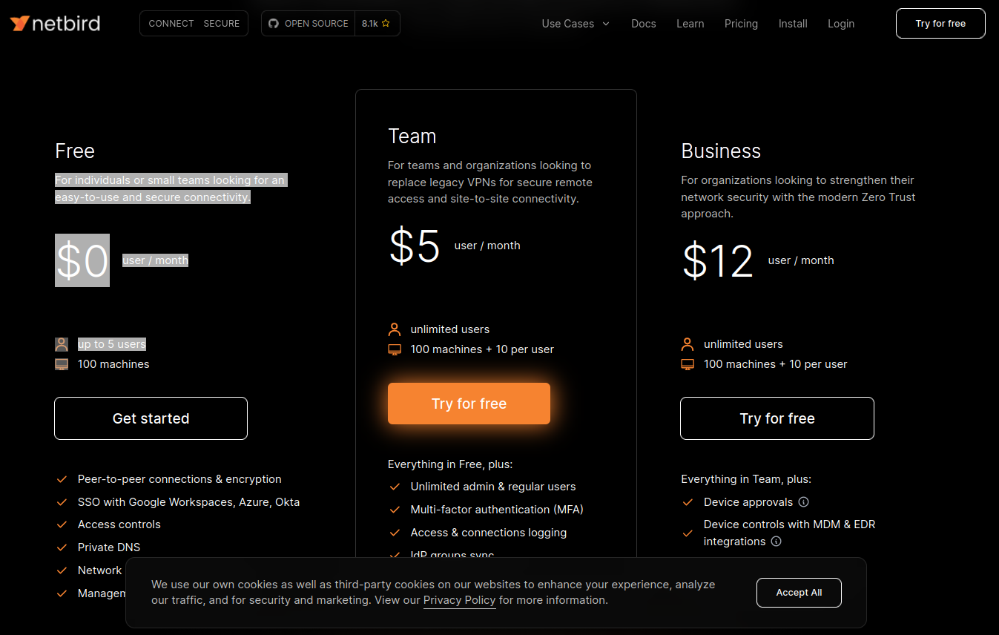
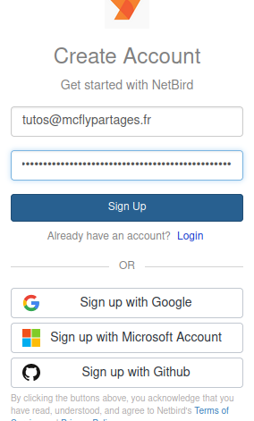
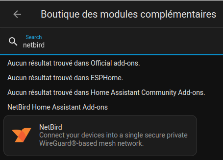
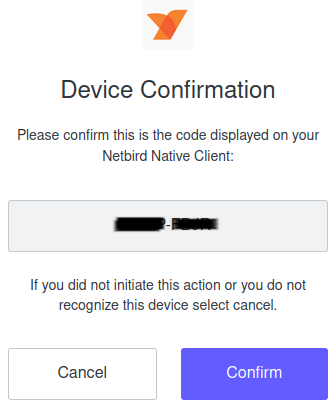
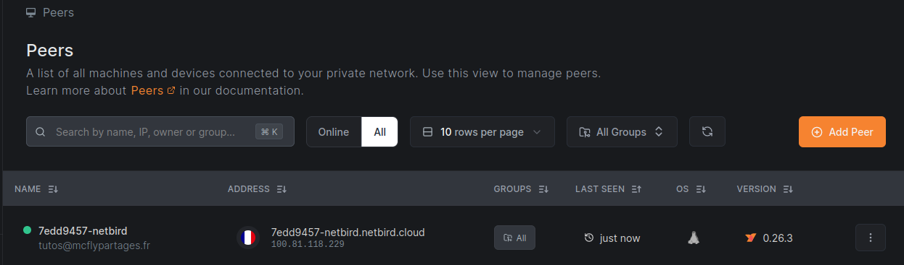
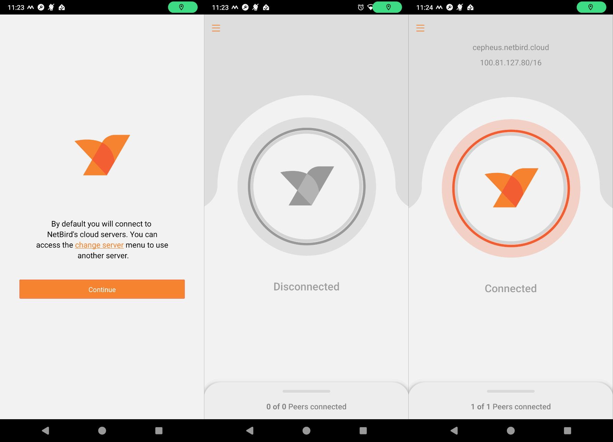

**Tuto réalisé avec :**
* HAOS 12.0, Core 2024.3.0, Supervisor 2024.03.0
* Add-on : NetBird 0.26.3

Comme je vous l'avais promis dans mon premier article sur l'[accès extérieur à Home Assistant avec DuckDNS](/blog/ha_acces_depuis_exterieur_duckdns/), je vais vous parler d'une méthode bien plus sécurisé, car elle ne nécessite pas d'ouvrir de port sur votre Box/Routeur et donnera l'accès à votre Home Assistant tout en empêchant l'accès aux autres dispositifs sur votre réseau local en cas de piratage de votre Home Assistant.
Ce type de configuration se nomme VPN Zéro Trust, et c'est ce qui est [recommandé par Home Assistant](
https://www.home-assistant.io/docs/configuration/remote/
). Grossièrement, il vous permet de vous connecter à une machine sur votre réseau local comme si vous étiez chez vous.

Dans l'état actuel, cette solution ne vous permettra pas d'utiliser les assistants vocaux comme Google ou Alexa, car ils nécessitent un nom de domaine associé à un certificat SSL. Personnellement, je me limite au strict nécessaire (androidTV) les Google et Alexa dans ma maison, donc ça ne me pose aucun problème.

Vous avez dû déjà entendre parler du service [ZeroTiers](https://www.zerotier.com/), mais je trouve dommage d'utiliser un service non open source quand il en existe un que l'on peut même l'auto hébergé pour les plus bidouilleurs.

Dans cet article, nous allons voir comment utiliser le service [Netbird](https://netbird.io/) avec Home Assistant en passant par leur serveur (non auto hébergé) pour que ce soit accessible à tous.
Son utilisation est gratuite pour 5 utilisateurs et 100 machines, de quoi largement satisfaire notre utilisation.

Voici la grille tarifaire pour ceux ayant besoin de plus :


**Ce que permet NetBird :**
* Combine un réseau privé peer-to-peer sans configuration et un système de contrôle d'accès centralisé en une seule plateforme, ce qui facilite la création de réseaux privés sécurisés pour votre organisation ou votre domicile.
* Crée un réseau superposé basé sur WireGuard qui connecte automatiquement vos machines via un tunnel crypté, sans avoir à ouvrir de ports, à appliquer des règles de pare-feu complexes ou à créer des passerelles VPN, etc.
* Permet un accès à distance sécurisé en appliquant des politiques d'accès granulaires, tout en vous permettant de les gérer intuitivement à partir d'un seul endroit. Fonctionne universellement sur n'importe quelle infrastructure.

Passons à la pratique.

Ce tutoriel se déroule en 3 étapes :
1. Création d'un compte sur NetBird,
1. Ajout du dépôt et installation et lancement de l'add-on NetBird
1. Configuration de son smartphone et de Home Assistant

## Création du compte NetBird

Rendez-vous sur la page de [NetBird](https://netbird.io/) puis cliquez sur `Try for free`.

Dans la nouvelle fenêtre, cliquez sur `Sign up`, saisissez un e-mail et un mot de passe, puis il vous demandera de valider votre inscription via un lien d'activation envoyé par mail.

Une fois votre e-mail validé, il rafraîchit la page et vous affiche différentes commandes ou informations permettant de lancer votre première connexion. Fermez le popup.

Nous allons maintenant suivre la [documentation de l'add-on (EN)](https://github.com/netbirdio/addon-netbird/blob/main/netbird/DOCS.md) pour l'installation et la configuration.

## Add-on NetBird
### Installation
J'ai déjà [écrit un article là-dessus](/blog/ha_addons/), il faudra simplement ajouter la source `https://github.com/netbirdio/addon-netbird` puis installer l'add-on nommé `NetBird`.

Je suis sympa avec vous :
1. Ajouter la source en cliquant ci-dessous :
[](https://my.home-assistant.io/redirect/supervisor_add_addon_repository/?repository_url=https%3A%2F%2Fgithub.com%2Fnetbirdio%2Faddon-netbird)
1. Ajouter l'add-on en cliquant ci-dessous (peut nécessiter un rafraîchissement du navigateur) puis l'installer.
[](https://my.home-assistant.io/redirect/supervisor_addon/?addon=7edd9457_netbird&repository_url=https%3A%2F%2Fgithub.com%2Fnetbirdio%2Faddon-netbird)


### Configuration
Une fois le module complémentaire installé, activez les deux boutons `Lancer au démarrage` et `Chien de garde` puis lancez-le (pas de configuration à faire, elle va se faire toute seule).
Rendez-vous dans l'onglet `Journal`, vous devriez avoir quelque chose de ressemblant à ceci :

```bash
s6-rc: info: service s6rc-oneshot-runner: starting
s6-rc: info: service s6rc-oneshot-runner successfully started
s6-rc: info: service base-addon-banner: starting

-----------------------------------------------------------
 Add-on: NetBird
 Connect your devices into a single secure private WireGuard®-based mesh network.
-----------------------------------------------------------
 Add-on version: v0.26.3
 You are running the latest version of this add-on.
 System: Home Assistant OS 12.0  (amd64 / qemux86-64)
 Home Assistant Core: 2024.3.0
 Home Assistant Supervisor: 2024.03.0
-----------------------------------------------------------
 Please, share the above information when looking for help
 or support in, e.g., GitHub, forums or the Discord chat.
-----------------------------------------------------------
s6-rc: info: service base-addon-banner successfully started
s6-rc: info: service fix-attrs: starting
s6-rc: info: service base-addon-log-level: starting
s6-rc: info: service fix-attrs successfully started
s6-rc: info: service base-addon-log-level successfully started
s6-rc: info: service legacy-cont-init: starting
s6-rc: info: service legacy-cont-init successfully started
s6-rc: info: service netbird: starting
s6-rc: info: service netbird successfully started
s6-rc: info: service legacy-services: starting
s6-rc: info: service legacy-services successfully started
[11:07:31] INFO: Using Default Admin URL
[11:07:31] INFO: Using Default Management URL
[11:07:31] INFO: No Setup Key Set
[11:07:31] INFO: This client will only show up in dashboards it's already registered with.
[11:07:31] INFO: No Hostname Set
[11:07:31] INFO: This client will use the default (<docker container id>-netbird-client) as hostname in peers.
[11:07:31] INFO: No log level Set
[11:07:31] INFO: This client will use the default logging.
[11:07:31] INFO: Starting NetBird Client...
[11:07:31] INFO: netbird up  --foreground-mode --config /config/netbird/config.json --log-file console
Please do the SSO login in your browser. 
If your browser didn't open automatically, use this URL to log in:

https://login.netbird.io/activate?user_code=XXXX-XXXX 


Alternatively, you may want to use a setup key, see:

https://docs.netbird.io/how-to/register-machines-using-setup-keys
```

Ce qui nous intéresse ici, c'est le lien `https://login.netbird.io/activate?user_code=XXXX-XXXX` qu'il faut copier-coller dans un navigateur et confirmer.



Une fois confirmé, le `Journal` de l'add-on se met à jour comme ceci :
```bash
2024-03-13T11:12:00+01:00 INFO client/internal/login.go:130: peer has been successfully registered on Management Service
2024-03-13T11:12:00+01:00 INFO client/internal/connect.go:96: starting NetBird client version 0.26.3
2024-03-13T11:12:02+01:00 INFO client/internal/wgproxy/proxy_ebpf.go:79: local wg proxy listening on: 3128
2024-03-13T11:12:02+01:00 INFO client/internal/dns/host_linux.go:68: System DNS manager discovered: file
2024-03-13T11:12:03+01:00 INFO signal/client/grpc.go:156: connected to the Signal Service stream
2024-03-13T11:12:03+01:00 INFO client/internal/connect.go:239: Netbird engine started, my IP is: 100.81.118.229/16
2024-03-13T11:12:03+01:00 INFO management/client/grpc.go:145: connected to the Management Service stream
2024-03-13T11:12:03+01:00 WARN client/internal/engine.go:495: running SSH server is not permitted
2024-03-13T11:12:03+01:00 ERRO client/internal/dns/server.go:317: unable to configure DNS for this peer using file manager without a nameserver group with all domains configured
2024-03-13T11:12:03+01:00 INFO client/internal/acl/manager.go:52: ACL rules processed in: 224.225µs, total rules count: 0
```

***Note :** Remarquez l'adresse IP 100.81.118.229 qui est celle de votre instance Home Assistant depuis NetBird.*

Vous pouvez vérifier dans votre [tableau de bord Netbird](https://app.netbird.io/peers) que votre Home Assistant apparait bien et vous avez de nouveau l'adresse IP de votre instance (ici : 100.81.118.229).


## NetBird sur son mobile
Pour finir, le but étant de connecter votre smartphone à Home Assistant, il va falloir installer l'application NetBird sur votre smartphone via le [PlayStore](https://play.google.com/store/apps/details?id=io.netbird.client) ou sur [AppleStore](https://apps.apple.com/us/app/netbird-p2p-vpn/id6469329339). Je pense que cette étape ne nécessite pas d'explication.
Pour se connecter, il suffit de cliquer sur le logo au milieu de l'écran et il vous ouvrira une page de connexion. Une fois connecté, vous devriez voir `1 of 1 Peers connected` en bas de l'écran.

Vous pouvez vérifier que votre smartphone est bien connecté depuis le [tableau de bord Netbird](https://app.netbird.io/peers) comme nous l'avons fait précédemment.

Ouvrez l'application mobile Home Assistant, puis dans `Paramètres -> Application Companion -> Servers & Devices` cliquez sur votre Maison et changer l'adresse IP externe par celle donnée par NetBird `http://100.81.118.229:8123`. 
***Note :** Ne pas mettre de https, car c'est comme si vous vous connectiez depuis chez vous, et **n'oubliez pas** le **:8123** à la fin.

Vous pouvez dupliquer cette section sur tous les appareils devant accéder à Home Assistant depuis l'extérieur.

## Conclusion
Vous pouvez désormais accéder à votre solution domotique depuis l'extérieur **et** en toute sécurité. Malheureusement mon tutoriel ne vous permettra pas d'ajouter un assistant vocal d'un des géants du numérique, mais pour ça il y a [Voice Assist](https://www.home-assistant.io/voice_control/) qui est respectueux et local.

Si vous souhaitez rapidement ajouter un assistant vocal comme Google ou Alexa, je ne peux que vous recommander de souscrire à [Nabu Casa](https://www.nabucasa.com/). 
* Vous soutiendrez le développement de Home Assistant,
* Vous obtiendrez un accès sécurisé via VPN avec un nom de domaine,
* Vous pouvez, très simplement, intégrer un des assistants vocaux (Google ou Amazon).

Si vous ne souhaitez pas payer et avoir quand même un nom de domaine, alors je vous suggère de suivre ce [tutoriel sur l'ajout de l'accès externe avec DuckDNS](/blog/ha_acces_depuis_exterieur_duckdns/).

Nous commençons à voir le bout des tutoriels posant les bases de Home Assistant.
Il me reste encore deux ou trois sujets à terminer et j'espère passer à des articles plus orientés pratiques.

### Sources
* [Netbird (EN)](https://netbird.io/)
* [Page de l'add-on sur le forum officiel Home Assistant (EN)](https://community.home-assistant.io/t/home-assistant-add-on-netbird-client/648232)
* [GitHub de l'add-on](https://github.com/netbirdio/addon-netbird)
* [Documentation de l'add-on](https://github.com/netbirdio/addon-netbird/blob/main/netbird/DOCS.md)
* [Documentation officiel sur l'acces a distance de Home Assistant (EN)](https://www.home-assistant.io/docs/configuration/remote/)