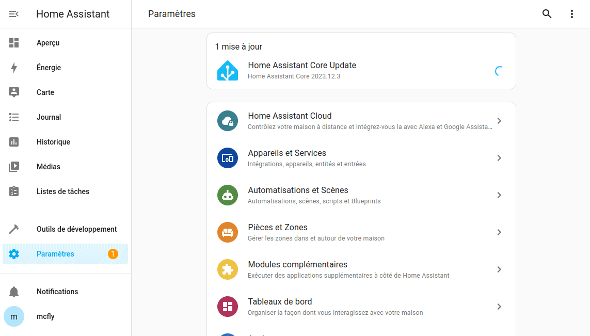
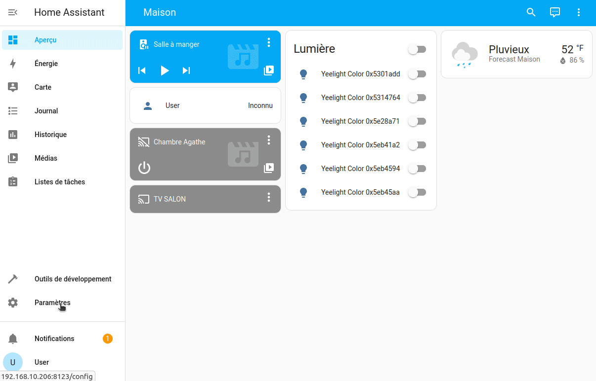

Les modules complémentaires permettent à l'utilisateur d'étendre les fonctionnalités de Home Assistant en installant des applications supplémentaires. 
Il s'agit d'exécuter une application avec laquelle Home Assistant peut s'intégrer (comme Node-Red, Grafana, InfluxDB, DuckDNS, etc.), déjà pré-configuré.

Les modules complémentaires peuvent être installés et configurés via le panneau `Paramètres` > `Modules complémentaires` de Home Assistant. 

Il existe deux types de module complémentaire :
* Les officiels : reconnus officiellement par Home Assistant et disponibles directement depuis la boutique des modules complémentaires,
* Les non-officiels : nécessitant l'ajout du dépôt GitHub en manuel, mais l'installation se fera quand même depuis la Boutique des modules complémentaires.

L'installation d'un module complémentaire étant toujours pareil, je ne reviendrais pas dessus lors de mes publications. Voici comment procéder.

*Home assistant a simplifié la chose en mettant à disposition des développeurs un script générant un bouton (pour les BluePrints, Dépôts, etc) qui, d'un simple clique, fait les actions à votre place. Cela nécessite simplement de saisir l'adresse de votre instance. *

## Installation d'un module complémentaire
## Officiel
Rendez-vous dans `Paramètres` > `Modules complémentaires` puis cliquez sur le bouton `Boutique des modules complémentaires` en bas à droite.
* Rechercher l'application  à ajouter (ici, File Editor),
* Cliquer dessus,
* Puis `INSTALLER`

## Depuis une source externe
Pour installer depuis une source externe, la procédure est identique, **mais** il va falloir ajouter la source (le dépôt) avant de rechercher puis d'installer.
Pour ajouter un dépôt, rendez-vous toujours dans `Paramètres` > `Modules complémentaires` puis cliquez sur le bouton `Boutique des modules complémentaires` en bas a droite.
* Cliquer sur les `...` en haut à droite,
* Puis sur Dépôts,
* Coller l'URL du dépôt,
* Cliquer sur `AJOUTER` puis `FERMER`.
* Rafraîchir votre page avec F5.

Voici un exemple avec l'ajout du dépôt pour [Samba Backup](https://github.com/thomasmauerer/hassio-addons), pour lequel j'ai [écrit un article](/blog/ha_backups) que je vous conseille de lire si ce n'est pas déjà fait.
Normalement, le dépôt devrait être ajouté à la suite de ceux existants.

Il vous suffit de reprendre la procédure pour l'installation d'un [module complémentaire officiel du dessus](#Officiel) et c'est partie.

## Conclusion
Nous arrivons au bout de ce petit article spécial débutant sur Home Assistant. J'espère qu'il vous sera utile et vous aidera à acquérir les bases.

Nous verrons dans un autre article, comment installer HACS (Home Assistant Community Store) qui est un magasin alternatif communautaire qui met à disposition des intégrations, des thèmes, des automatisations et d'autres choses.
Cela permet d'enrichir encore plus Home Assistant de compatibilité d'appareil, de thèmes, etc.

## Sources.
* https://www.home-assistant.io/addons/
