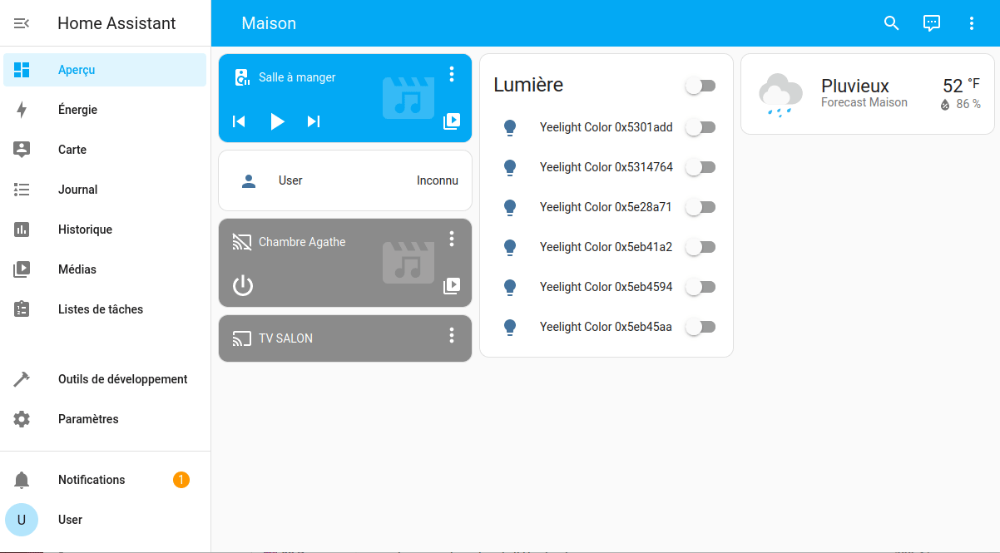
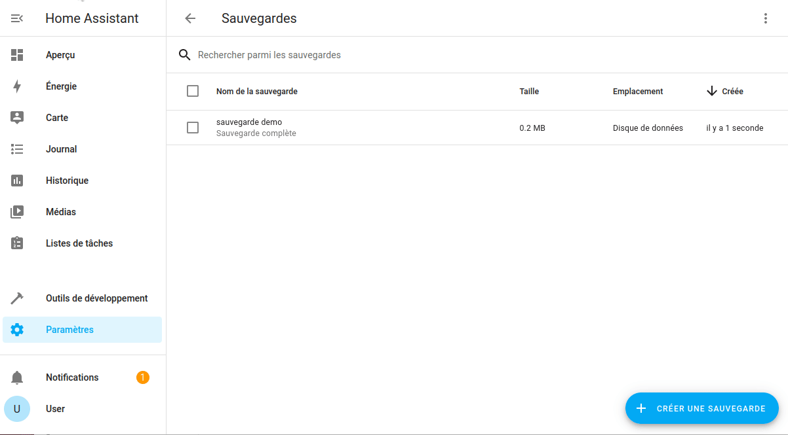
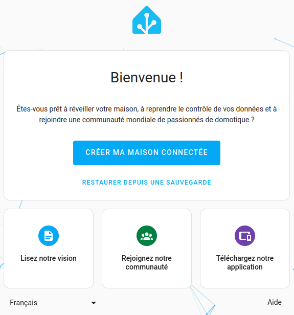
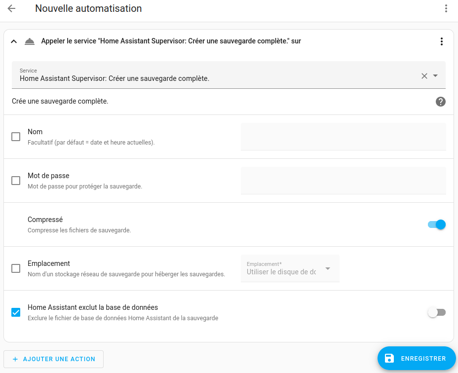
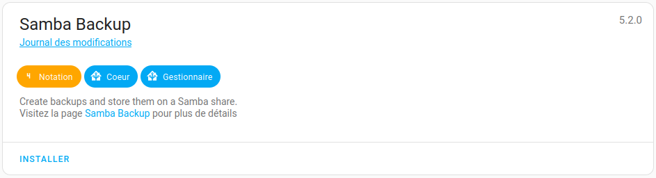
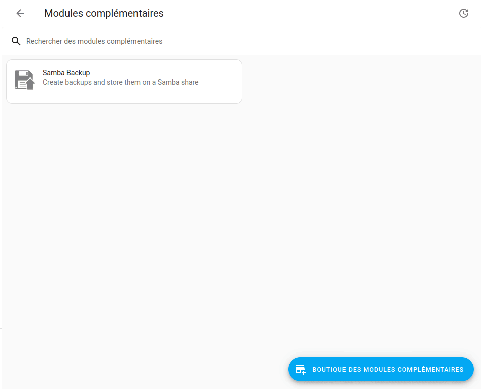

Même si vous débutez avec Home Assistant, je vous recommande de ne pas négliger l'aspect sauvegarde, car c'est quand il est trop tard que l'on se rend compte du travail déjà effectué.

Home Assistant intègre une fonction de sauvegarde, à laquelle il est possible de lui adjoindre une automatisation journalière.

Mais le problème est que les sauvegardes restent sur votre instance.

Nous allons donc voir comment mettre en place une sauvegarde automatique, puis la copier vers un emplacement réseau. Nous ne verrons pas comment déplacer cette sauvegarde vers un cloud.

**Principe de sauvegarde**

Je ne vais pas vous faire un cours sur la gestion des sauvegardes, mais retenez qu'un bon principe est le 3-2-1, trois sauvegardes, deux sur des supports différents en interne et une externe.

## Les sauvegardes dans Home Assistant
### Les sauvegardes manuelles
#### Créer une sauvegarde manuellement
Pour accéder et déclencher manuellement une sauvegarde, vous devez vous rendre dans `Paramètres` -> `Système` -> `Sauvegardes` puis cliquer sur le bouton `CRÉER UNE SAUVEGARDE`.

* Donner un nom a votre sauvegarde
* Choisir entre complète ou partielle
* Protéger par un mot de passe (*facultatif*)
* Cliquer sur CRÉER.



#### Télécharger une sauvegarde
Pour rapatrier une sauvegarde sur votre ordinateur (par exemple), il vous suffit de :
* Cliquer sur la sauvegarde,
* Cliquer sur les trois petits points en bas à droite,
* Cliquer sur Télécharger la sauvegarde.



#### Restaurer une sauvegarde
*Il est possible de restaurer une sauvegarde lors du premier lancement de Home Assistant, ce qui rend très rapide la réinstallation de Home Assistant.*



**Depuis une sauvegarde locale**
* Cliquer sur la sauvegarde,
* Cliquer sur RESTORE.

**Depuis une sauvegarde externe**
Il va d'abord falloir uploader la sauvegarde sur votre instance.
Dans `Paramètres` -> `Système` -> `Sauvegardes` :
* Cliquer sur le bouton `...` en haut a droite,
* Cliquer Téléverser une sauvegarde

Ensuite, suivre la procédure du dessus.

#### Supprimer une sauvegarde
Pour supprimer une sauvegarde de Home Assistant, il vous suffit de :
* Cliquer sur la sauvegarde,
* Cliquer sur les trois petits points en bas à droite,
* Cliquer sur Supprimer la sauvegarde.

### Les sauvegardes automatiques

Le service appelé pour lancer une sauvegarde est `hassio.backup_full`.

Voici l'automatisation depuis L'UI.


Le code `YAML`
```yaml
description: "Création d'une sauvegarde tous les jours a 03h du matin"
mode: single
trigger:
  - platform: time
    at: "03:00:00"
condition: []
action:
  - service: hassio.backup_full
    data:
      compressed: true
      homeassistant_exclude_database: false
```

Avec cette petite automatisation, une sauvegarde sera faite tous les jours.

Le problème, c'est qu'au bout d'un moment, ça va en faire des sauvegardes et donc il va falloir en supprimer manuellement. Même s'il y a un moyen de le faire automatiquement (via le code), nous allons choisir une méthode plus visuelle qui nous permettra en plus de sauvegarder nos sauvegardes vers un emplacement externe (partage samba).

### Les sauvegardes avec un add-on

*Pour suivre cette partie, il vous faut un partage réseaux accessible avec Samba (smb). Je n'aborde pas cette partie dans l'article.*

Pour commencer à respecter notre principe de sauvegarde 3-2-1, nous allons utiliser un add-on appelé `Samba Backup`.

Ce n'est pas un add-on officiel, il faut donc [ajouter le dépôt dans la page des modules complémentaires](/blog/ha_addons/#Installer un add-on depuis une source externe)

Voici le dépôt : https://github.com/thomasmauerer/hassio-addons

Une fois rechargé (peut-être un F5 sera nécessaire), rechercher `samba backup` puis cliquer sur `INSTALLER`


Une fois installé, passons à la configuration, dont voici un aperçu vide.


* **Host :** Mettre l'adresse IP ou le Hostname de votre stockage,
* **Share :** Le nom de votre partage sur le réseau,
* **Target directory :** Le dossier à l'intérieur de votre partage réseau,
* **Username/Password :** Si besoin, sinon laissez vide,
* **Keep local:** Nombre de sauvegardes que vous souhaitez laisser sur votre instance Home Assistant
* **Keep remote :** Idem, mais sur votre emplacement réseau
* **Trigger time :** Heure à laquelle vous souhaitez lancer la sauvegarde
* **Trigger days :** Les jours où vous souhaitez lancer la sauvegarde
* **Exclude add-ons :** Si vous souhaitez exclure des add-ons de la sauvegarde
* **Exclude folders :** Si vous souhaitez exclure des dossiers de la sauvegarde


Cliquez sur Enregistrer, démarrez l'add-on (onglet Info) puis vérifiez les logs dans l'onglet Journal.

Voilà le résultat quand cela se déroule avec succès :
```
s6-rc: info: service s6rc-oneshot-runner: starting
s6-rc: info: service s6rc-oneshot-runner successfully started
s6-rc: info: service fix-attrs: starting
s6-rc: info: service fix-attrs successfully started
s6-rc: info: service legacy-cont-init: starting
cont-init: info: running /etc/cont-init.d/00-banner.sh

-----------------------------------------------------------
 Add-on: Samba Backup
 Create backups and store them on a Samba share
-----------------------------------------------------------
 Add-on version: 5.2.0
 You are running the latest version of this add-on.
 System: Home Assistant OS 11.2  (amd64 / qemux86-64)
 Home Assistant Core: 2023.12.1
 Home Assistant Supervisor: 2023.11.6
-----------------------------------------------------------
 Please, share the above information when looking for help
 or support in, e.g., GitHub, forums or the Discord chat.
-----------------------------------------------------------
cont-init: info: /etc/cont-init.d/00-banner.sh exited 0
cont-init: info: running /etc/cont-init.d/01-log-level.sh
cont-init: info: /etc/cont-init.d/01-log-level.sh exited 0
s6-rc: info: service legacy-cont-init successfully started
s6-rc: info: service legacy-services: starting
s6-rc: info: service legacy-services successfully started
[23-12-12 14:46:14] INFO: ---------------------------------------------------
[23-12-12 14:46:14] INFO: Host/Share: 192.168.10.4/Backups
[23-12-12 14:46:14] INFO: Target directory: HAOS
[23-12-12 14:46:14] INFO: Keep local/remote: 5/20
[23-12-12 14:46:14] INFO: Trigger time: 03:00
[23-12-12 14:46:14] INFO: Trigger days: Mon Tue Wed Thu Fri Sat Sun
[23-12-12 14:46:14] INFO: ---------------------------------------------------
[23-12-12 14:46:15] INFO: Samba Backup started successfully
```
Ne pas oublier d'activer le lancement au démarrage dans l'onglet Info de l'add-on.

## Conclusion

Vous avez commencé à mettre en place une solution de sauvegarde en place, il vous reste maintenant à externaliser cette sauvegarde en dehors de chez vous et vous aurez respecté le principe du 3-2-1.

Nous verrons cela dans un prochain article.

## Sources
* [La page sauvegarde de Home Assistant Officielle (EN)](https://www.home-assistant.io/integrations/backup/)
* [Samba Backup](https://github.com/thomasmauerer/hassio-addons/tree/master/samba-backup)