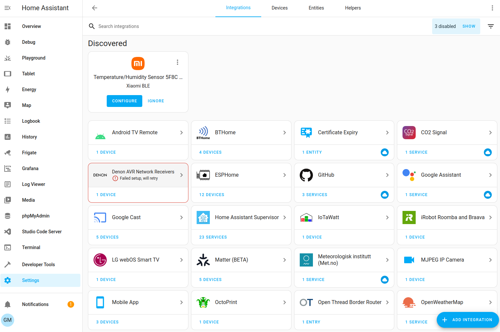
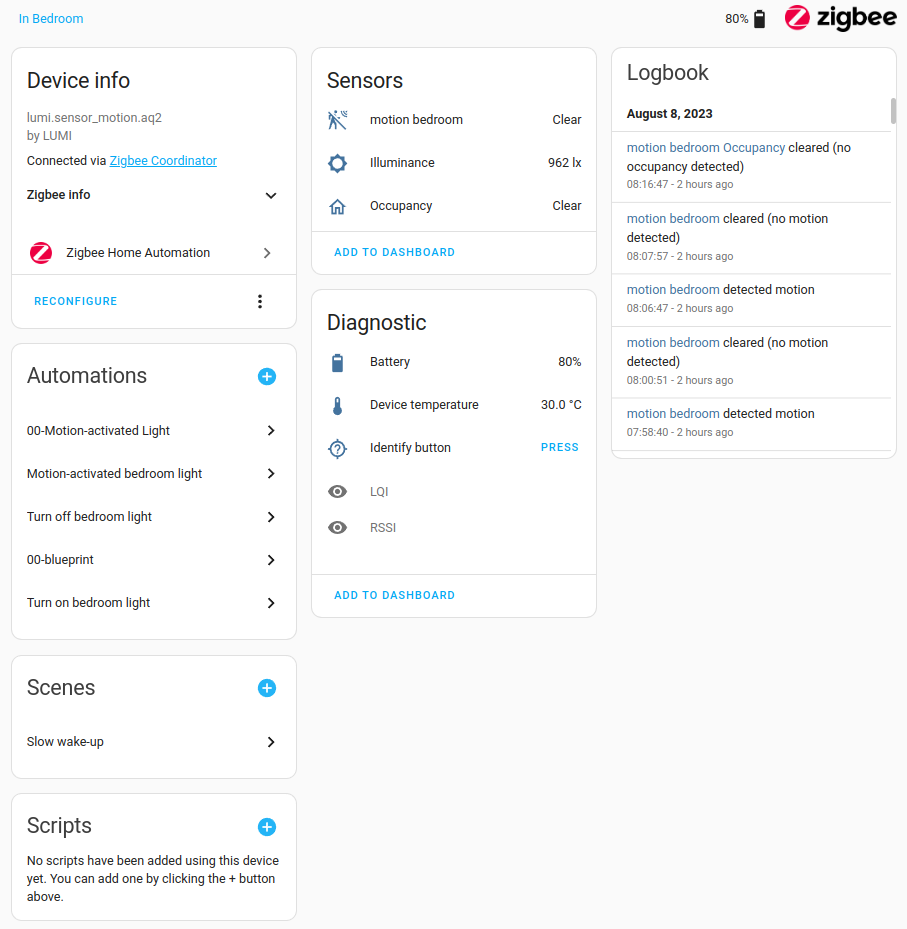
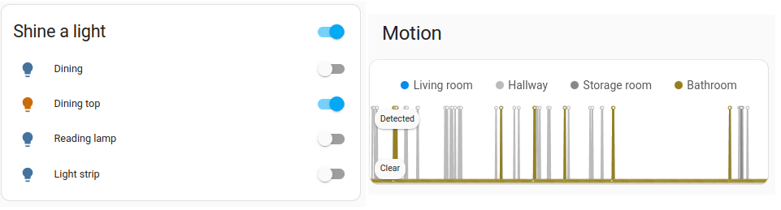
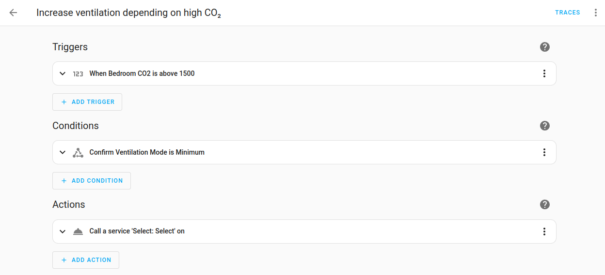
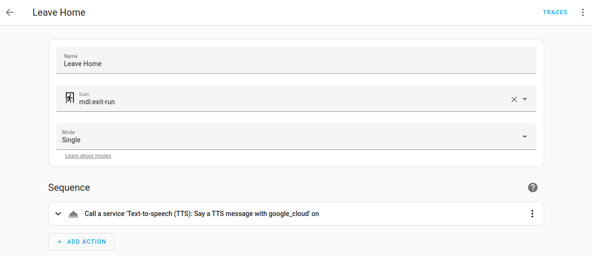
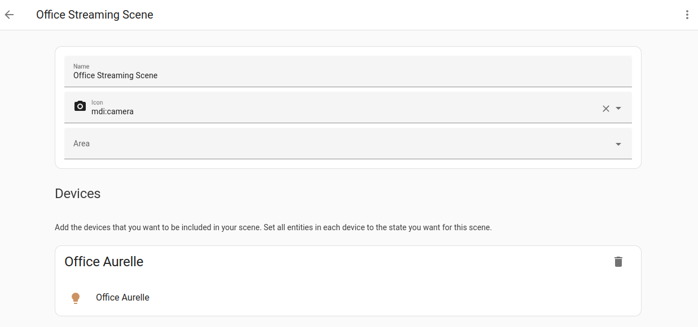
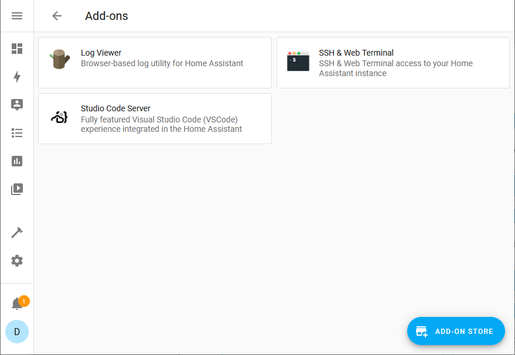

**Cet article est la traduction de '[Concepts and terminology](https://www.home-assistant.io/getting-started/concepts-terminology/)' du site officiel de Home Assistant.**

Maintenant que vous avez installé Home Assistant, voyons les concepts et les terminologies les plus importants pour bien démarrer.

Si vous venez d'une autre solution domotique, il va falloir se séparer de ses mécanismes, sinon, pour les débutants, cet article est une belle entrée en matière pour découvrir les principes de Home Assistant.

## Tableaux de bord

Le tableau de bord Aperçu est la première page que vous voyez après le [processus d'installation](/blog/ha_haos_installation/). Les tableaux de bord (plus souvent appelé par le terme anglais, Dashboard) sont des pages personnalisables permettant l'affichage des informations dans Home Assistant. Par défaut, il y a deux tableaux de bord : Vue d'ensemble et Énergie. L'image ci-dessous montre un exemple personnalisé du tableau de bord Aperçu. Si vous venez faire votre installation, votre tableau de bord sera presque vide. Pour savoir comment personnaliser vos tableaux de bord, reportez-vous à la [documentation sur les tableaux de bord (EN)](https://www.home-assistant.io/dashboards).

## Les intégrations

Les intégrations sont des logiciels permettant à Home Assistant de se connecter à d'autres logiciels et plateformes. Par exemple, un produit de Philips Hue utilisant l'intégration Philips Hue autorise Home Assistant à communiquer avec le contrôleur matériel Hue Bridge. Tous les appareils compatibles avec Home Assistant connectés au Hue Bridge apparaîtront dans Home Assistant en tant qu'[appareils](#les-appareils) (Devices, capteurs, etc).

*[Liste complète des intégrations compatibles (EN)](https://www.home-assistant.io/integrations)*

Une fois l'intégration ajoutée, le matériel et/ou les données sont représentés dans Home Assistant comme des [appareils](#les-appareils) et des [entités](#les-entités).

## Les entités

Les entités sont les éléments de base qui permettent de conserver les données dans Home Assistant. Une entité représente un capteur, un actionneur ou une fonction dans Home Assistant. Les entités sont utilisées pour surveiller les propriétés physiques ou pour contrôler d'autres entités.
* Une entité fait généralement partie d'un appareil ou d'un service,
* Les entités ont des états.

## Les appareils
Les appareils sont un regroupement logique d'une ou plusieurs entités.
Un appareil peut représenter un dispositif physique, qui peut avoir un ou plusieurs capteurs. Les capteurs apparaissent alors comme des entités associées à l'appareil. 
Par exemple, un capteur de mouvement est représenté comme un appareil. Il peut fournir des informations sur la détection de mouvement, la température et les niveaux de luminosité en tant qu'entités. 
Les entités ont des états tels que "détecté" lorsqu'un mouvement est détecté et "non détecté" lorsqu'il n'y a pas.

Les appareils et les entités sont utilisés dans tous les domaines de Home Assistant. Voici quelques exemples :

* Les tableaux de bord peuvent montrer l'état d'une entité. *Par exemple, si une lumière est allumée ou éteinte.*
* Une automatisation peut être déclenchée à partir d'un changement d'état d'une entité. *Par exemple, un capteur de mouvement détecte un mouvement et déclenche l'allumage d'une lumière.*
* Un réglage prédéfini de la couleur et de la luminosité d'une lumière sauvegardé en tant que scène.

## Les automatisations
*(appelé aussi automations)*

Les automatisations sont un ensemble d'actions répétables qui peuvent être configurées pour s'exécuter automatiquement. Les automatisations sont constituées de trois éléments clés :
* Les Déclencheurs (Triggers) - événements qui déclenchent l'automatisation. *Par exemple, lorsque le soleil se couche ou qu'un détecteur de mouvement est activé.*
* Les Conditions - *facultatifs* qui doivent être satisfaits pour qu'une action puisse être exécutée. *Par exemple, si quelqu'un est à la maison.*
* Les Actions - interaction avec les dispositifs. *Par exemple allumer une lumière.*

Pour en savoir plus sur les automatisations, consultez la [page sur les bases de l'automatisation (EN)](https://www.home-assistant.io/docs/automation/basics/) ou essayez de [créer une automatisation vous-même (EN)](https://www.home-assistant.io/getting-started/automation).

## Les scripts

Semblables aux automatisations, les scripts sont des actions répétables qui peuvent être exécutées.
La différence entre les scripts et les automatisations est que les scripts n'ont pas de déclencheurs. Cela signifie que les scripts ne peuvent pas s'exécuter automatiquement, à moins d'être utilisés dans des automatisations.

Les scripts sont particulièrement utiles si vous effectuez les mêmes actions dans différentes automatisations ou si vous souhaitez les déclencher à partir d'un tableau de bord.  
Pour plus d'informations sur la création de scripts, consultez la [documentation sur les scripts (EN)](https://www.home-assistant.io/integrations/script/).

## Les scènes

Les scènes vous permettent de créer des paramètres prédéfinis pour vos appareils. À l'instar des modes de conduite des téléphones ou des profils de conduite des voitures, elles permettent de modifier l'environnement en fonction de vos besoins. 
Par exemple, votre scène de visionnage de films peut diminuer l'éclairage, allumer la télévision et augmenter le volume. Ces réglages peuvent être sauvegardés sous forme de scène et utiliser sans avoir à régler chaque appareil individuellement.

Pour savoir comment utiliser les scènes, consultez la [documentation sur les scènes (EN)](https://www.home-assistant.io/integrations/scene/).

## Les Add-ons

Les add-ons (ou modules complémentaires) sont fonction de votre type d'installation (vu dans l'[article sur l'installation de Home Assistant](/blog/ha_haos_installation)), car ils ne sont **disponibles** (pour les "officiels") **seulement** en version **HAOS** ou **Supervised**. 

Les modules complémentaires sont généralement des applications/services connus qui peuvent être exécutées avec Home Assistant en offrant une rapidité et une facilité d'installation et de configuration. 

*Les modules complémentaires offrent des fonctionnalités supplémentaires tandis que les intégrations relient Home Assistant à d'autres applications.*

Il est possible d'installer des modules complémentaires autres que ceux officiellement supportés via HACS (Home Assistant Community Store) par exemple.

## Conclusion

C'est une traduction quasi fidèle de l'[article l'original (EN)](https://www.home-assistant.io/getting-started/concepts-terminology/) qui vous permet d'avoir quelques notions et bases sur le langage Home Assistant.

## Sources
* https://www.home-assistant.io/getting-started/concepts-terminology/