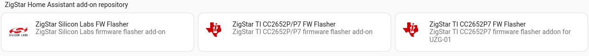
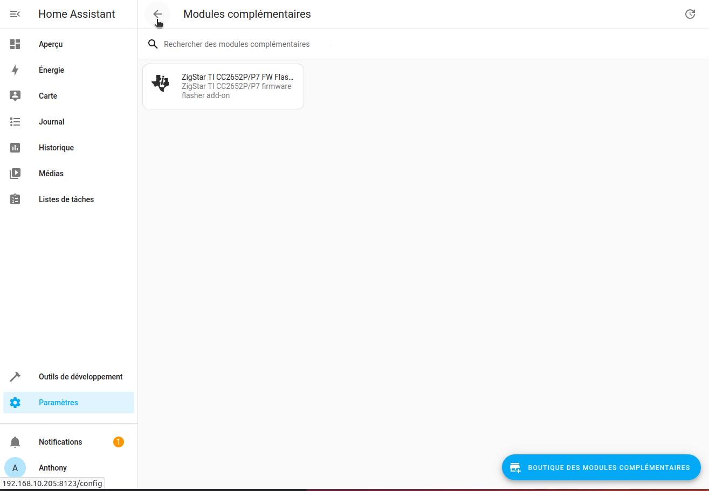
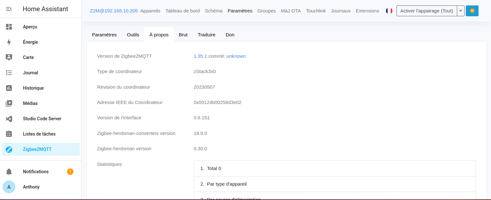
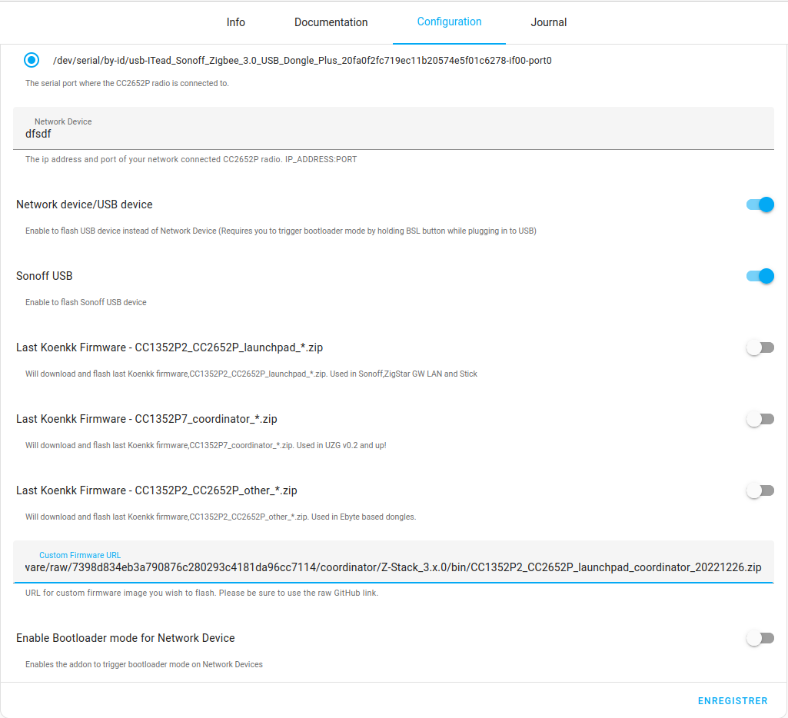

**Tuto réalisé avec :**
* HAOS 11.4, Core 204.1.2
* Add-on : Zigstar 0.40
* Matériels : [Sonoff Zigbee 3.0 USB Dongle Plus **P**](https://amzn.to/41W8f4W) 


Je voudrais vous partager une découverte de @tiiiit74, qui découvre Home Assistant et me sert de cobaye pour mes articles. Il a acheté une clé [Sonoff Zigbee 3.0 USB Dongle Plus **P**](https://amzn.to/41W8f4W) et je lui ai donc proposé de la flasher directement pour enlever la limitation que nous a imposée Sonoff en nombre d'appareils max que la clé pouvait gérer par rapport à la norme Zigbee 3.

Je me rappelle quand j'ai flashé la mienne avoir pas mal galéré, car tous les tutos et applications sont sous Windows, mais sous Linux, rien. J'avais quand même réussi à trouver un tuto en anglais qui avait marché. Forcément impossible de remettre la main dessus, mais ce n'est pas très grave, parce que @tiiiit74 a découvert qu'il existait un add-on Home Assistant pour ça.

Ni une, ni deux, je retrousse mes manches et l'installe sur une instance de test Home Assistant. Le résultat est super, ça marche sans aucun problème, c'est simple et en plus ça nous permet de jouer avec les firmwares en cas de soucis.

Voici donc comment flasher votre clé [Sonoff Zigbee 3.0 USB Dongle Plus **P**](https://amzn.to/41W8f4W) avec la méthode la plus simple possible.

Merci à lui. ;)

Pour en savoir plus sur quel firmware (nom) choisir, 

***IMPORTANT :** Vous utiliserez la version coordinateur par défaut. La version routeur permet, si vous avez plusieurs clés USB Zigbee, d'en passer une en tant que routeur et donc d'étendre votre réseau comme le ferait une prise Zigbee ou la plupart des appareils branchés en permanence au 220v.*

## Add-on Zigstar
### Installation
Nous allons ajouter une source externe, vous savez comment faire maintenant, sinon l'[article est ici](/blog/ha_addons/), ou plus simple en cliquant sur l'image ci-dessous;
[](https://my.home-assistant.io/redirect/supervisor_add_addon_repository/?repository_url=https%3A%2F%2Fgithub.com%2Fmercenaruss%2Fzigstar_addons)

La version à installer est `ZigStar TI CC2652P/P7 FW Flasher` car la [Sonoff Zigbee 3.0 USB Dongle Plus **P**](https://amzn.to/41W8f4W) est sous chipset CC2652P



### Flash de la dernière version disponible
Une fois installé, vous allez dans `configuration`.
* Sélectionnez votre clé USB Zigbee,
* Saisir un nom bidon dans `Network Device`,
Cochez :
* Network device/USB device,
* Sonoff USB
* Last Koenkk Firmware - CC1352P2_CC2652P_launchpad_*.zip


Enregistrer puis démarrer l'add-on et rendez-vous dans `journal` pour voir si tout se passe bien.

***ATTENTION :** Il faut que les add-ons Mosquitto Broker et Zigbee2MQTT soient arrêtés, sinon ça ne marchera pas.*

Voici mes logs:
```
s6-rc: info: service s6rc-oneshot-runner: starting
s6-rc: info: service s6rc-oneshot-runner successfully started
s6-rc: info: service fix-attrs: starting
s6-rc: info: service fix-attrs successfully started
s6-rc: info: service legacy-cont-init: starting
s6-rc: info: service legacy-cont-init successfully started
s6-rc: info: service banner: starting

-----------------------------------------------------------
 Add-on: ZigStar TI CC2652P/P7 FW Flasher
 ZigStar TI CC2652P/P7 firmware flasher add-on
-----------------------------------------------------------
 Add-on version: 0.4.0
 You are running the latest version of this add-on.
 System: Home Assistant OS 11.4  (amd64 / qemux86-64)
 Home Assistant Core: 2024.1.2
 Home Assistant Supervisor: 2023.12.0
-----------------------------------------------------------
 Please, share the above information when looking for help
 or support in, e.g., GitHub, forums or the Discord chat.
-----------------------------------------------------------
s6-rc: info: service banner successfully started
s6-rc: info: service cc2652-flasher: starting
[15:55:27] INFO: Starting CC2652P flasher with Sonoff /dev/ttyUSB0
Setting filename to /root/firmware.hex
sonoff
Opening port /dev/ttyUSB0, baud 500000
Reading data from /root/firmware.hex
Your firmware looks like an Intel Hex file
Connecting to target...
pg_rev = 3, protocols = f, wafer_id = 0xbb41
CC135x PG2.0 (7x7mm): 352KB Flash, 20KB SRAM, CCFG.BL_CONFIG at 0x00057FD8
Primary IEEE Address: 00:12:4B:00:25:8D:3E:02
    Performing mass erase
Erasing all main bank flash sectors
    Erase done
Writing 360448 bytes starting at address 0x00000000
 Write 248 bytes at 0x00000000
 Write 248 bytes at 0x000000F8
 Write 248 bytes at 0x000001F0
 Write 248 bytes at 0x000002E8
...
...
 Write 248 bytes at 0x0002BF50
 Write 248 bytes at 0x0002C048
Write 104 bytes at 0x00057F98
    Write done                                
Verifying by comparing CRC32 calculations.
    Verified (match: 0xe83aa727)
[15:55:37] INFO: cc2652-flasher-up script exited with code 0
s6-rc: info: service cc2652-flasher successfully started
s6-rc: info: service legacy-services: starting
s6-rc: info: service legacy-services successfully started
s6-rc: info: service legacy-services: stopping
s6-rc: info: service legacy-services successfully stopped
s6-rc: info: service cc2652-flasher: stopping
s6-rc: info: service cc2652-flasher successfully stopped
s6-rc: info: service banner: stopping
s6-rc: info: service banner successfully stopped
s6-rc: info: service legacy-cont-init: stopping
s6-rc: info: service legacy-cont-init successfully stopped
s6-rc: info: service fix-attrs: stopping
s6-rc: info: service fix-attrs successfully stopped
s6-rc: info: service s6rc-oneshot-runner: stopping
s6-rc: info: service s6rc-oneshot-runner successfully stopped
```

Voilà le flash est terminé. Vérifier votre version de firmware depuis Zigbee2MQTT (article [ici](/blog/ha_mosquitto_broker_zigbee2mqtt/)) en ouvrant ce dernier, puis dans `Paramètres`, onglet `A propos`, regarder la version après `Révision du coordinateur` (ici 20230507).



### Flash avec une version antérieure ou personnalisée
Il semblerait que la dernière version à date (20230507) ait des problèmes avec certains utilisateurs. Un fix (20231112 et 20231111) est en test (voir la discussion [ici](https://github.com/Koenkk/Z-Stack-firmware/discussions/483)).
Je n'ai pour l'instant pas perçu de problème (deux jours), mais si vous ne souhaitez pas être embêté, il est plus sage de rester avec la version 20221226 tant que les retours ne sont pas bons.

Nous allons donc voir comment flasher avec un firmware personnalisé depuis Zigstar.

La procédure est identique, sauf qu'il faut laisser `* Last Koenkk Firmware - CC1352P2_CC2652P_launchpad_*.zip` décoché et coller le lien en version `raw`du firmware que vous souhaitez flasher.
Voici le lien pour le firmware 20221216 `https://github.com/Koenkk/Z-Stack-firmware/raw/7398d834eb3a790876c280293c4181da96cc7114/coordinator/Z-Stack_3.x.0/bin/CC1352P2_CC2652P_launchpad_coordinator_20221226.zip`



## Conclusion
Voici la méthode la moins prise de tête pour flasher sa clé Sonoff [Sonoff Zigbee 3.0 USB Dongle Plus **P**](https://amzn.to/41W8f4W) depuis Home Assistant directement.
Vous pouvez bien sûr désactiver l'add-on et le réutiliser le jour où une nouvelle version du firmware sera disponible.

***Bon a savoir :**Vous n'avez pas besoin de réappairer vos appareils (contrairement au flash par les méthodes traditionnelles dans mes souvenirs) que ce soit d'un firmware 2022 vers 2023 ou l'inverse.*

## Sources :
* https://github.com/mercenaruss/zigstar_addons
* https://github.com/Koenkk/Z-Stack-firmware/tree/master/coordinator/Z-Stack_3.x.0/bin
* https://community.home-assistant.io/t/zigstar-zigbee-coordinators-and-routers/338586/205