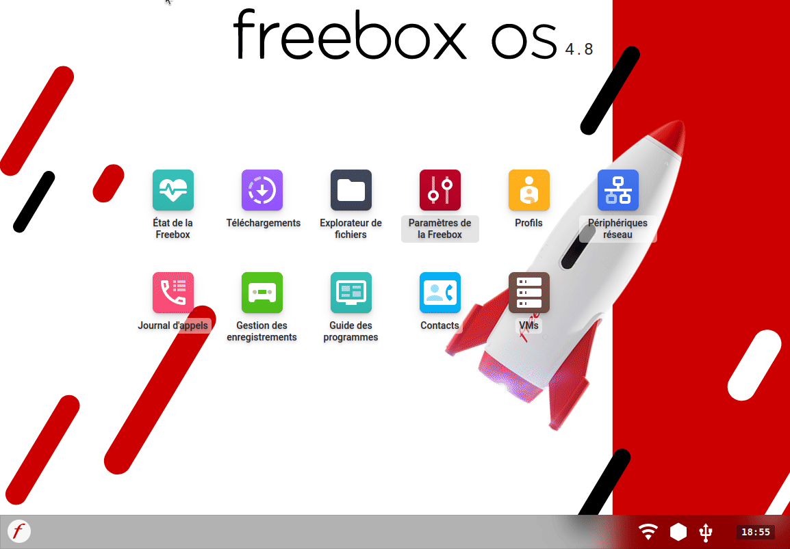

# Home Assistant - Installation sur Freebox et y acceder depuis l'exterieur.

Je retrouve le plaisir d'être chez Free avec des box internet toujours tres riche en fonctionnalité pour les bidouilleurs.
J'ai (enfin) été raccordié a la fibre et j'ai donc soucrit a une offre Free qui je trouve est imbattable en terme de prix/materiels/debits. Je suis donc (l'heureux ?) client d'une Freebox Ultra, la derniere box de Free.

En cherchant un peu je m'apercois qu'elle n'est pas forcement mieux que la delta en terme sde fontionalités, mais elle a quelques avantages pour les amoureux des nouvelles techno.
Je ne vais pas vous faire l'eloge des Freebox, mais nous allons uiliser une fonctionnalité VMs (Machine Virtuelle) proposée par les deux Freebox "Prenium" qui sont la Delta et l'Ultra

***Note :** Si vous n'etes pas a la recherche de debit superieur a 2.5Gbs (ou que que vous n'avez simplement pas le materiel pour supporter de tel débit a la maison) préférez peut etre la Delat a l'Ultra car cette derniere est bridé a 4Go en RAM total dont 2Go seulement pour les VMs et aussi a l'installation d'un seul disque dur NMVE, autant vous dire qu'installer Home Assistant sur l'Ultra c'est plus pour le fun ou les petites configurations, par contre la Delta permet d'upgrader la RAM et l'ajout de plusieurs disque dur.*

**Avantages :**
* Directement dans votre Box (Un materiels en moins allumé),
* Débit en 2.5Gbs (au moins por l'Ultra),
* Acces facile au sauvegarde de VMs depuis l'explorateur de fichier Freebox.

**Inconvenients :**
* Si vous changez d'operateur,
* Panne de box (pareil pour votre materiel aussi),
* Limité en RAM sur l'ultra.
* Un seul port USB (sur l'ultra)

Matériel utilisés :
* Freebox Ultra (Procedure identique sur la Delta)
* Freebox OS 4.8
* Un disque dur dans votre Freebox
* L'image [haos_generic-aarch64-12.0.qcow2.xz](https://github.com/home-assistant/operating-system/releases)

## Installation d'une VM sur Freebox OS
Bien sur a vant de commencer il vous faut ajouter un disque dur.
### Ajouter un disque dur
***Attention :** la Freebox Ultra ne prend en charge que les disque dur M.2 NVMe PCIe gen 3 minimum (Key M), elle ne prend pas en charge les SSD M.2 Sata.*

***Note :** Si votre disque est neuf, il ne sera pas reconnu par la Freebox, il faut le formater avant. Je l'ai fait en EXT4 un format Linux, mais le NTFS,HFS Plus, XFS, Fat 32, exFAT sont acceptés.*

Sur l'Ultra, il suffit d'éteindre la box, d'ouvrir la trappe en dessous, de placer le disque puis appuyer jusqu'a entendre le clique. Vous pouvez allumer votre box.

Vous pouvez le formater dans un autres format via le gestionnaire de fichier de la Freebox.

Rendez vous dans `Paramètres de la Freebox -> Mode avancé -> Disque Externe` puis suivez les étapes en selectionnant votre disque nouvellement installé.

### Installer Home Assistant

## Activer le nom de domaine Free

Sur votre interface de Freebox `192.168.1.254` par défaut. Rendez vous dans `Paramètres de la Freebox -> Mode avancé -> Nom de domaine` et suivez les étapes.

