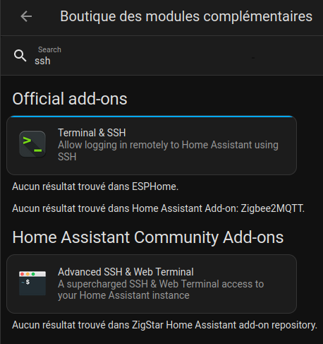
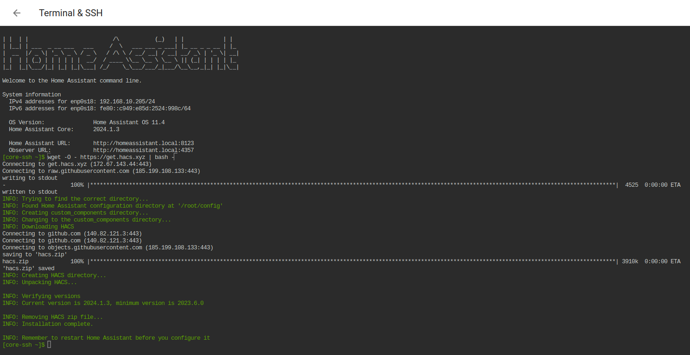
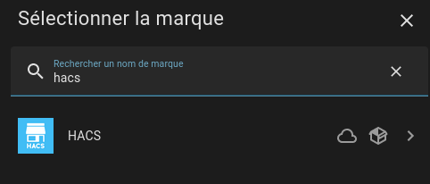
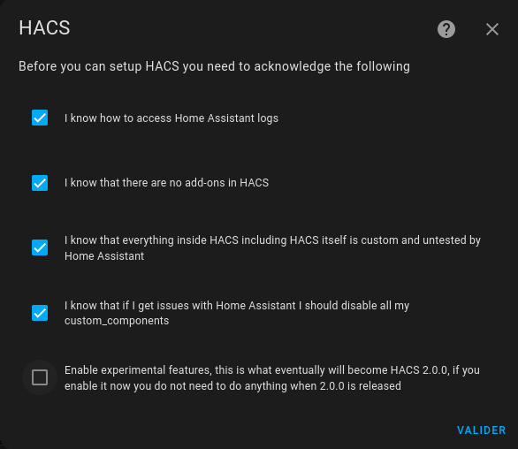
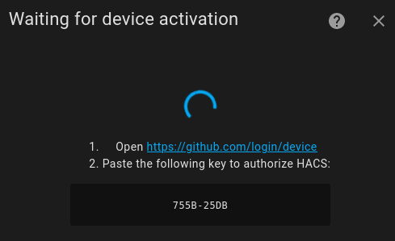
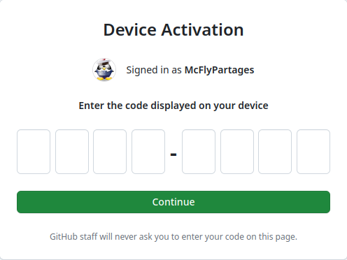
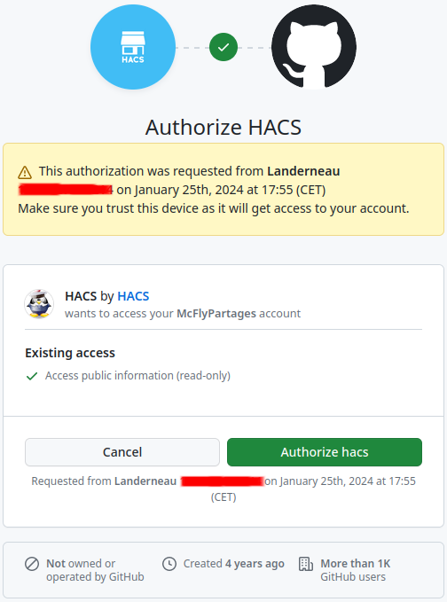
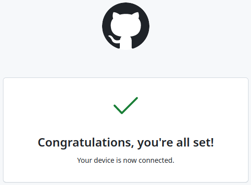
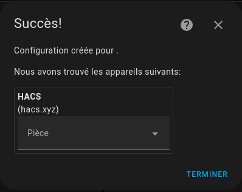
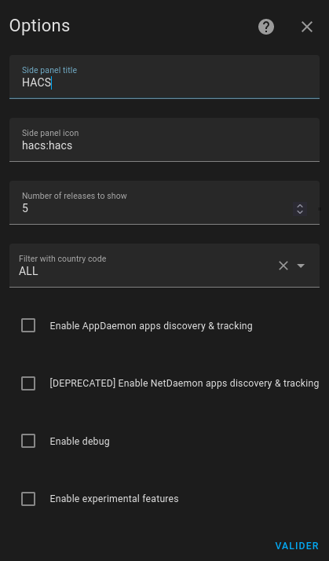

**Tuto réalisé avec :**
* HAOS 11.4, Core 2024.1.3
* Add-on : SSH Web Terminal

Home Assistant intègre un magasin de modules complémentaires (add-ons) avec beaucoup de contenus vérifiés. 
Cela implique des règles de vérifications, mais aussi des normes dans le codage  drastiquement vérifiées par Home Assistant (NabuCasa) ayant pour but la sécurité de notre système domotique. 
Vous comprenez bien que ces validations sont assez longues, ce qui a fait naître un store alternatif communautaire où chacun peut partager ses développements pour Home Assistant, que ce soit des intégrations, des thèmes et même des automatisations.

Bien sûr, comme toute utilisation de magasin alternatif, **vous êtes seul responsable de ce que vous installez**.

Quelques vérifications lorsque vous installez des éléments depuis un HACS (valables aussi depuis n'importe quelle source externe) :
* **Le suivi :** Est-ce toujours maintenu ? 
* **Les mises à jour :** Présence de mises à jour ou d'activités récentes ?
* **Popularité :** Vérifier la popularité depuis le forum officiel est une bonne pratique.

Si vous avez les compétences, vous pouvez aussi consulter le GitHub pour vérifier le code, mais aussi voir les issues ouvertes ou PR en cours. La documentation est aussi souvent plus complète sur les dépôts.

Passons maintenant à l'installation du magasin alternatif communautaire HACS (Home Assistant Community Store).

**Prérequis**
* Un compte [GitHub](https://github.com/) (gratuit),
* Avoir `default_config` dans votre`configuration.yaml` *(normalement, c'est **par défaut**) sinon voir [ici](https://www.home-assistant.io/integrations/my/)*,
* Version de Home Assistant supérieure à 2023.6.0.

## Installation d'un module SSH.
Dans le magasin officiel des modules complémentaires de Home Assistant, il y a deux add-ons pour le SSH, `Terminal & SSH` et `Advanced SSH é Web Terminal`.*:
À vous de choisir, la procédure est quasi la même avec les deux.


*Je vous conseille de ne pas activer le démarrage automatique de l'add-on, **sauf** si vous avez besoin d'un accès permanent en SSH à votre installation. Dans ce cas, configurer un `username` et un `password`*

J'ai pris, pour ce tutoriel, `Terminal & SSH` mais c'est pareil pour `Advanced SSH é Web Terminal`. 
Il n'y a pas de configuration à faire pour suivre ce tutoriel avec `Terminal & SSH` par contre, il faudra configurer un `username` et un `password` avec `Advanced SSH é Web Terminal` et vous pouvez laisser le mode protégé activé.

Si vous avez oublié comment installer un add-on, je vous mets l'[article ici](/blog/ha_addons/).

## Magasin communautaire HACS
### Installation
1. Démarrer l'add-on SSH précédemment installé,
1. Connectez-vous à votre add-on,
1. Lancer la commande d'installation suivant.

```bash
wget -O - https://get.hacs.xyz | bash -
```


L'installation est terminée, passons à la configuration.

### Configuration
Pour ajouter et configurer HACS, rendez-vous dans `Paramètres -> Appareils et services` :
1. Cliquer sur `+ AJOUTER UNE INTEGRATION` et rechercher `HACS`,


***Note :** Si vous ne trouvez pas HACS, il faudra supprimer le cache de votre navigateur, un simple F5 ne semble pas fonctionner sur les navigateurs. S'il n'apparaît toujours pas, redémarrer Home Assistant

1. Cocher toutes les cases commençant par `I know` et à vous de voir si vous souhaitez cocher les options expérimentales (il est possible de les activer plus tard),
1. Cliquer sur `VALIDER`.


Une nouvelle fenêtre s'ouvre pour attacher HACS à votre compte Github. 


Il vous suffit :
1. Cliquer sur le lien,
1. Saisir le code affiché,

1. Cliquer sur `Authorize hacs`


Une fois l'écran de félicitation, retourner sur Home Assistant et sélectionner ou non, une pièce pour HACS.



Vous devriez voir apparaitre HACS dans votre menu latéral. Cliquez dessus et à vous les intégrations, les thèmes personnalisés.

#### Astuces
Si vous voulez activer les options expérimentales et l'App-Deamon ou peaufiner les réglages de HACS, il vous suffit de vous rendre dans `Paramètres -> Appareils et services` de cliquer sur HACS et sur `CONFIGURER`.



### Ajouter une intégration, une interface ou une automatisation.

* Ouvrir HACS, 
* Choisir entre Intégrations, Interface ou Automatisation (si option expérimentale est activée),
* Cliquer sur le`+ EXPLORER ET TÉLÉCHARGER DES DÉPÔTS' 
* Rechercher l’intégration, le thème, la carte ou l'automatisation que vous souhaitez,
* Cliquer dessus, lire le descriptif puis `TELECHARGER`,
* Vérifier votre configuration et redémarrer Home Assistant.

***Note :** Il est possible de choisir une version précise ou d'essayer une version bêta lors de l'installation d'un dépôt, bien sûr, cela est à vos risques.*

## Conclusion
Vous avez dorénavant accès à plus de possibilités pour ajouter ou personnaliser votre solution domotique préférée. Alors, n'oubliez pas les [sauvegardes](/blog/ha_backups/) et amusez-vous.

***Note :** HACS est intéressant, mais n'en profitez pas pour installer tout et n'importe quoi, car lorsque Home Assistant est mis à jour, les services installés avec HACS ne sont pas testés et certains peuvent ne plus fonctionner. Il faudra attendre une mise à jour de l'auteur pour que tout revienne dans l'ordre. **N'oubliez pas de faire une sauvegarde avant chaque mise à jour**.*

### Sources
* [Site officiel](https://hacs.xyz/)