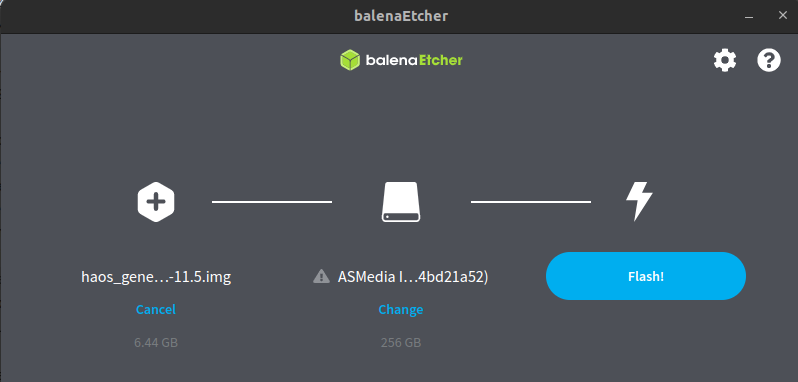
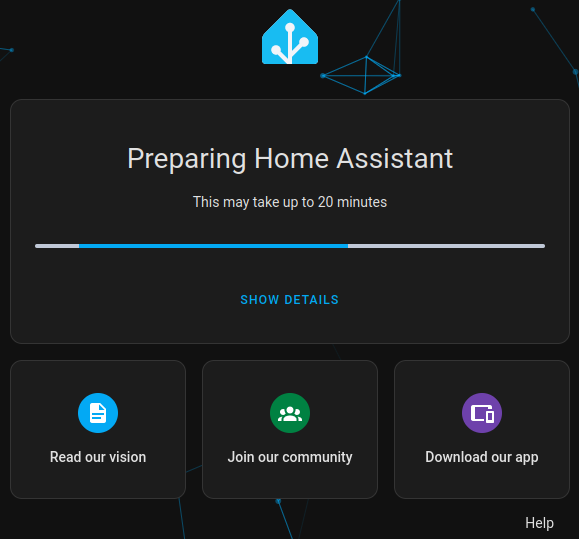
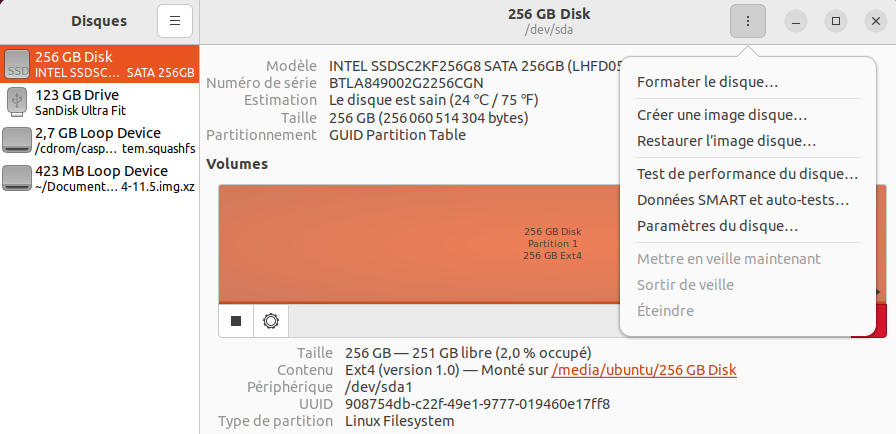
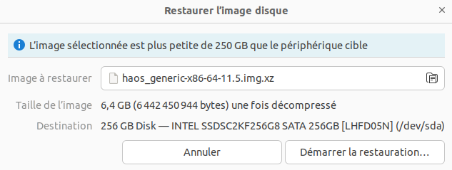
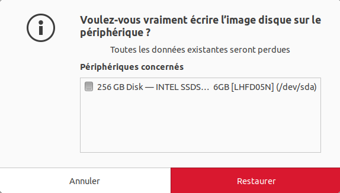
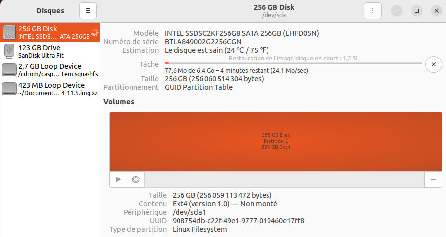
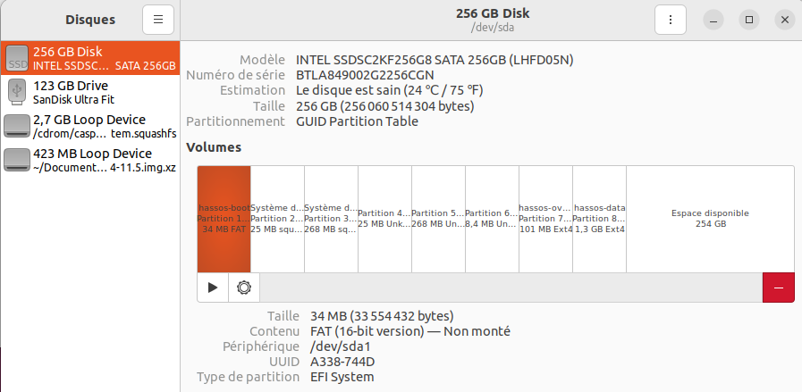

**Tuto réalisé avec :**
* HAOS 11.5,
* Matériels : HP EliteDesk G3 800 ([Amazon (128€)](https://amzn.to/3UDJWa0))

# Home Assistant - installation sur ordinateur X86-64.

***Note :** Cet article est en partie une traduction issue de la procédure officielle que vous pouvez trouver [ici](https://www.home-assistant.io/installation/#install-home-assistant-on-x86-64-machines), réalisée avec un HP Elite Desk 800 G3 qui est l'appareil faisant tourner mon Home Assistant dans une VM avec Proxmox comme détaillé dans [cet article](https://mcflypartages.fr/blog/ha_haos_proxmox_installation/).*

**Pourquoi cet article si je n'utilise pas ce type d'installation ?**
Comme expliqué dans l'[article sur le choix du matériel pour installer Home Assistant](METTRE LE LIEN), je trouve que le Raspberry revient, en 2024, relativement cher s'il faut ajouter l'achat d'une carte SD, d'une Alimentation, d'un boitier, mais aussi disgracieux s'il faut ajouter un disque dur SSD ou M2 avec son boitier, et surement un Hub USB pour alimenter tous ses périphériques. De plus, l'évolution de ce dernier est impossible, il faudra acheter du nouveau matériel et ses accessoires (si changement).

*L'arrivée des Raspberry Pi 5 changera un peu la donne (lorsqu'ils seront officiellement supportés), mais les kits tournent quand même autour de 150/200 euros sur Amazon sans disque M2 qu'il faudra alors rajouter (+20 euros). Un autre point négatif sera toujours son côté non évolutif.*

C'est pour cette raison qu'après avoir tourné plus de deux ans sur Raspberry Pi 4 avec 4Go de RAM et le boitier Argon M2, j'ai décidé de passer sur un mini PC reconditionné comme le HP Elite Desk G3 800 en version USFF, ce qui permet de combiner la puissante, la faible consommation (14w) en pensant un peu à la planète ;).

Je fais tourner Proxmox dessus, depuis lequel j'ai installé Home Assistant en virtualisé ([article ici](/blog/ha_haos_proxmox_installation/)) et sur lequel je fais tourner d'autres services externes à la domotique pure.

Je  suis conscient que l'installation via Proxmox ajoute de la complexité, surtout pour ceux et celle souhaitant seulement utiliser Home Assistant, c'est la raison de ce tutoriel, sur la façon d'installer Home Assistant OS sur un mini PC (NUC, HP, Lenovo, Dell, voire "no name") en "Barre Métal", comprendre en dur donc votre PC servira uniquement à Home Assistant.

Les avantages de cette configuration :
* Faire facilement évoluer votre installation (ajout de RAM, changer de capacité SSD ou M2, etc)
* Passer un maximum de choses via Home Assistant (add-ons, par exemple),
* Simplifier la gestion des sauvegardes (tous vos services hébergés sur Home Assistant seront sauvegardés dans cette sauvegarde),
* Faire de la vidéosurveillance avec Frigate par exemple (peut nécessiter un accélérateur Coral, si vous souhaitez gérer plus de 3/4 caméras).

Démarrer simplement avec Home Assistant si vous n'avez que peu ou pas d'expérience de Linux ou essayer Home Assistant sur une machine qui prend la poussière.

**Matériels nécessaires :**
En fonction de votre matériel de destination, il vous faudra soit :
* Un lecteur de disque SSD externe (SATA vers USB) ([Amazon (9€)](https://amzn.to/49a9Yq7)),
* Un lecteur de disque M.2 externe (M.2 vers USB) ([Amazon (14€)](https://amzn.to/3UDrL4w)).
* Soit une clé USB ([Amazon (12€)](https://amzn.to/4bEGDp9)).

## Prérequis
Ce guide suppose que vous disposiez d'un PC générique x86-64 **dédié à l'utilisation exclusive du système d'exploitation Home Assistant**.

* Il s'agit généralement d'un système basé sur Intel ou AMD.
* Le système doit être capable de fonctionner en 64 bits et de démarrer à l'aide de l'UEFI.

La plupart des systèmes produits au cours des 10 dernières années prennent en charge le mode de démarrage UEFI.

### Désactiver le mode Secure Boot
**Sur HP Elite Desk G3 800 USSF :**
* Démarrez et appuyez plusieurs fois sur <kbd>F10</kbd> puis dans la page qui s'affiche rendez-vous dans ADVANCED puis selectioneez `Legacy secure enable and secure boot disable`.
* Retournez dans `Main` puis sauvegardez en cliquant sur `Save Changes and Exit`.

Au redemarrage il vous demandera de saisir un code a 5 chifffres pour valider la desactivation du `Secure Boot`, saisissez le puis vaidez avec <kbd>Entrée</kbd>

**Pour les autres** démarrez votre matériel x86-64 et appuyez plusieurs fois sur la touche F2 (sur certains systèmes, il peut s'agir de Del, F1 ou F10).

### Activer le mode UEFI
Vérifier que le mode de démarrage UEFI est activé. Pour cela, il va falloir aller dans le BIOS.
**Sur HP Elite Desk G3 800 USSF :**
* Démarrez et appuyez plusieurs fois sur <kbd>F10</kbd> puis dans la page qui s'affiche rendez-vous dans `Advanced` puis vérifiez que `UEFI Boot Order` soit bien coché.

**Pour les autres** démarrez votre matériel x86-64 et appuyez plusieurs fois sur la touche F2 (sur certains systèmes, il peut s'agir de Del, F1 ou F10).

La configuration du BIOS est maintenant terminée.

## Installation de Home Assistant OS
Il va falloir écrire l'image officielle de Home Assistant OS sur l'espace de stockage de votre matériel. Il n'y a pas d'installateur intégré, comme pour Linux ou Windaub qui écrit l'image automatiquement. Vous devez donc l'écrire manuellement en utilisant [Balena Etcher](/blog/balena_etcher_installation_utilisation/) ou l'utilitaire `Disks` d'Ubuntu.

Pour écrire l'image HAOS sur le support de stockage de votre matériel, il existe deux méthodes :

Méthode 1 : La plus facile si vous avez un support de stockage amovible (SSD, M.2 et bien sûr un boitier externe pouvant l'accueillir).
Méthode 2 : Pour les systèmes avec le support de stockage soudé.

**NOTE :** Home Assistant annonce la méthode **2** (attention, j'ai inversé les numéros par rapport à l'article officiel), comme étant la plus simple, personnellement, je préfère la **1**, car elle enlève une étape, mais je vous expose les deux méthodes pour couvrir le plus possible de cas.

### Méthode 1 : Installation de HAOS directement sur le support de stockage
**ATTENTION :** Cela signifie que vous perdrez toutes les données ainsi que le système d'exploitation précédemment installé.*

**Matériels nécessaires :**
* Un lecteur de disque SSD externe (SATA vers USB) ([Amazon (9€)](https://amzn.to/49a9Yq7)),
* Un lecteur de disque M.2 externe (M.2 vers USB) ([Amazon (14€)](https://amzn.to/3UDrL4w)).

1. Récupérez Balena Etcher ([j'ai rédigé un article ici](/blog/balena_etcher_installation_utilisation/)),
1. Connectez le périphérique de stockage à votre ordinateur,
1. Récupérez l'image de Home Assistant OS [ici](https://github.com/home-assistant/operating-system/releases) (idéale pour les connexions ADSL) en prenant celle nommée `haos_generic-x86-64-11.5.img.xz` à la date de l'écriture de l'article,
1. Dans Balena Etcher, sélectionnez l'image téléchargée précédemment, le disque de stockage et cliquez sur `Flash`

**NOTE :** Home Assistant signale qu'il peut y avoir des problèmes en passant par la copie depuis l'URL avec Balena Etcher, privilegiez donc la recuperation de l'OS avant la copie sur votre support*

Une fois la copie réussie, réinstallez le support de stockage dans votre ordinateur, branchez un câble Ethernet connecté au réseau, puis démarrez.

Dans le navigateur de votre système de bureau, dans quelques minutes, vous pourrez accéder à votre nouveau Home Assistant à l'adresse `homeassistant.local:8123`, `homeassistant:8123` ou `http://X.X.X.X:8123` (remplacez X.X.X.X par l'adresse IP de votre Generic x86-64).

**NOTE :** vérifiez que vous avez sélectionné le demarrage sur le bon support de stockage si il y en a plusieurs. Sur HP, <kbd>F9</kbd> au démarrage puis sélectionnez votre disque dur*

### Méthode 2 : Installation de HAOS depuis un live d'Ubuntu
**Matériels nécessaires :**
* Un écran + clavier souris,
* Reliez votre mini PC à internet (ou l'utilisation de la carte Wi-Fi seulement pour l'installation depuis le live d'Ubuntu),
* Une clé USB,
* Récupérer un [live d'Ubuntu](https://www.ubuntu-fr.org/download/),
* [Ventoy](/blog/ventoy_installation_update/) ou [Balena Etcher](/blog/balena_etcher_installation_utilisation/)

1. Mettez sur la clé USB le live d'Ubuntu.
1. Insérez la clé,
1. Démarrez le mini PC en bootant sur la clé USB,
1. Attendez le lancement du live d'Ubuntu.

Une fois le live lancé :
1. Récupérez l'image de Home Assistant OS [ici](https://github.com/home-assistant/operating-system/releases) en prenant celle nommée `haos_generic-x86-64-11.5.img.xz` à la date de l'écriture de l'article,
1. Ouvrir l'application `Disques` (Disks) de Ubuntu,
1. Sélectionnez le support de stockage de votre PC dans la bare de gauche (attention, pas la clé USB)
1. Cliquez sur les trois points en haut a droite et selectionnez Restaurer le Disque

1. Sélectionnez l'image de Home Assistant OS,

1. Lancez la copie.

Une fois la copie terminée, éteignez votre PC, débranchez la clé USB puis redemarrez.

**NOTE :** vérifiez que vous avez sélectionné le demarrage sur le bon support de stockage si il y en a plusieurs. Sur HP, <kbd>F9</kbd> au démarrage puis sélectionnez votre disque dur*

Dans le navigateur de votre système de bureau, dans quelques minutes, vous pourrez accéder à votre nouveau Home Assistant à l'adresse `homeassistant.local:8123`, `homeassistant:8123` ou `http://X.X.X.X:8123` (remplacez X.X.X.X par l'adresse IP de votre Generic x86-64).

## Conlusions

????????
## Sources :
* https://www.home-assistant.io/installation/#install-home-assistant-on-x86-64-machines
