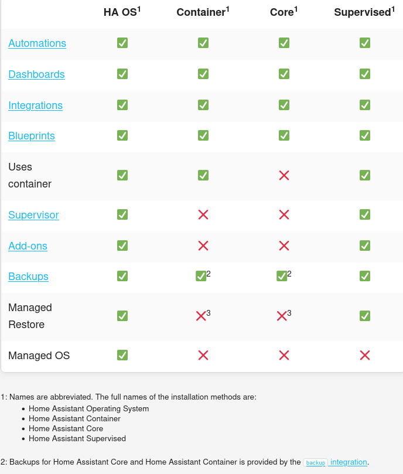
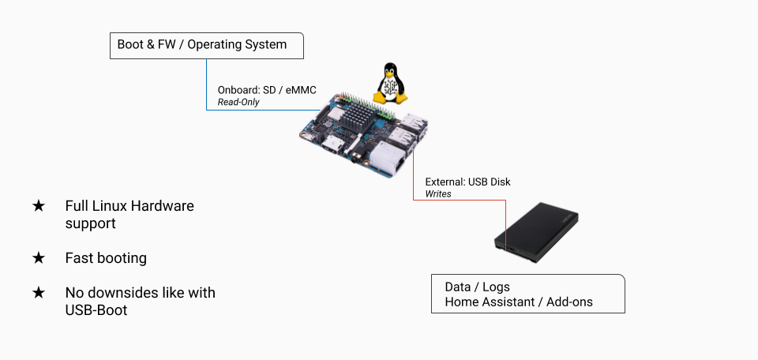
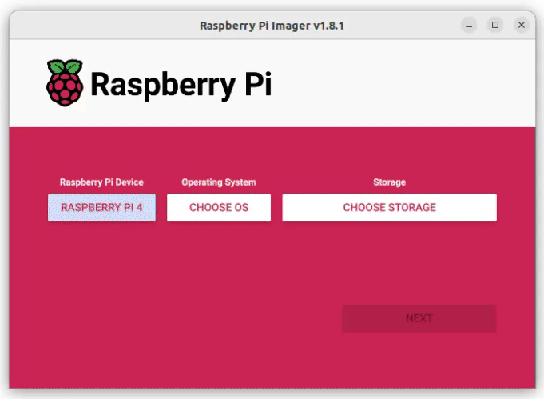
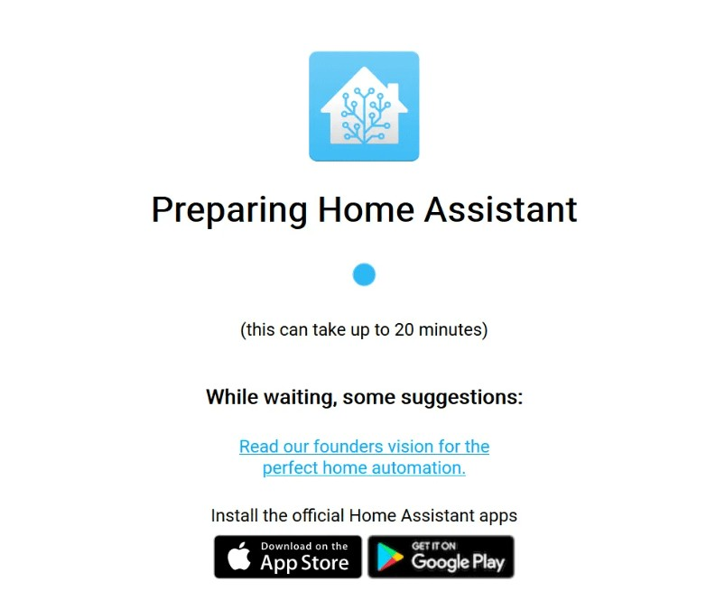
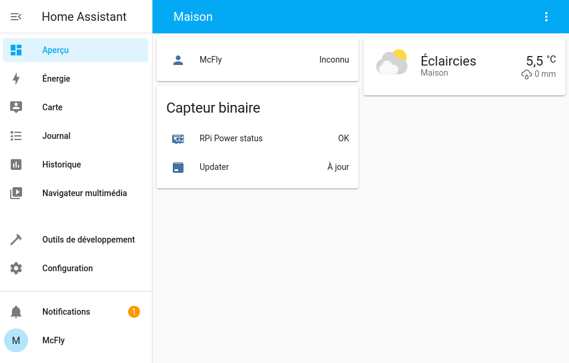
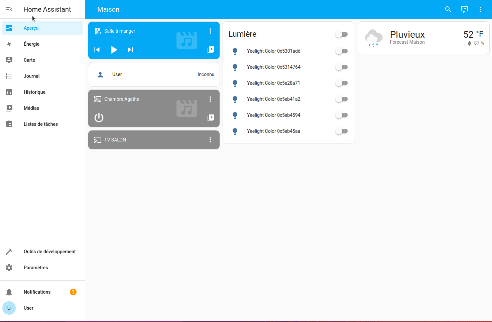

Vous souhaitez commencer l'aventure Home Assistant et votre choix s'est porté sur l'installation de Home Assistant OS sur un matériel dédié ? Vous avez fait le choix de vous concentrer sur votre domotique plutôt que sur les gestions annexes.

Que votre matériel soit une Raspberry, une Tinkerboard ou un Odroid, ce guide est fait pour vous.

Home Assistant est actuellement, le meilleur système domotique sur le marché (ok, c'est mon avis, mais peu de personne ayant quitté leur ancien système domotique pour Home Assistant y sont revenus).

Il est open-source, international, responsive (s'adapte à tous les écrans), élégant et complétement gratuit (application mobile aussi). Il bénéficie aussi d'une grande communauté qui le fait évoluer à la vitesse lumière et lui permet d'être présent sur tous les fronts (Wear OS, extension Chrome et Firefox). Home Assistant est écrit en python (un langage "simple" à apprendre) et construit sur une base "docker" ce qui permet de lui ajouter des services à l'infini.

**Comment il vend le produit !** Oui, j'avoue, mais ayant testé Jeedom puis Domoticz, je parle en connaissance de cause, [mon avis ici](/blog/domotique_introduction).

Il y a plusieurs moyens d'installer Home Assistant et nous allons en voir deux sur mon blog :
* Sur un Raspberry avec carte Micro SD et disque dur optionnellement (obligatoire pour une installation en production). C'est la méthode préconisée par Home Assistant,
* Sur Proxmox (solution de virtualisation libre) avec une Machine Virtuelle (VM). ([Article](/blog/ha_haos_proxmox_installation))

Dans les deux cas, nous installerons Home Assistant OS qui est la version "Supervised" de Home Assistant.

*Voici un tableau de comparaison des différentes installations de Home Assistant.*

* **Pour les débutants**, il est préférable de commencer avec Home Assistant OS, afin de vous concentrer sur la domotique pure.*

***Matériels utilisés :***
* Raspberry Pi 4,
* Un boitier et son alimentation*,
* Une micro SD (16 Go minimum si disque dur en plus, sinon 32 Go minimum)
* Un disque dur USB (une clé USB pour le tuto)*,
* Le logiciel Raspberry Pi Imager (j'en parle [ici](/blog/raspberry_pi_installer_os)),
* [Home Assistant OS 11.2](https://github.com/home-assistant/operating-system/releases/) (a date).

*optionnel pour une installation de test, mais pas en production.

**Installation sur Raspberry Pi : Pourquoi il utilise une carte Micro SD alors que, sur le net, tout le monde parle de problèmes avec les cartes SD ?** Parce que [Home Assistant le recommande](https://www.home-assistant.io/common-tasks/os/#using-external-data-disk).

*Le système d'exploitation Home Assistant permet de stocker la plupart des données sur un support de stockage externe (par exemple, un SSD ou un disque dur connecté par USB). Ce disque de données contient non seulement les données de l'utilisateur, mais aussi la plupart des logiciels de Home Assistant (Core, Supervisor, etc.). Cela signifie qu'un disque de données rapide rendra le système global beaucoup plus rapide.*

*La fonction de disque de données peut être utilisée sur une installation existante sans perdre de données : Le système déplacera automatiquement les données existantes vers le disque de données externe. Toutefois, il est recommandé de [créer et de télécharger une sauvegarde](/blog/ha_backups) complète avant de procéder !

*J'ai tourné sur cette solution et je n'ai eu aucun problème, si vous installez Home Assistant sur un autre Raspberry et que le disque externe est branché, il récupère automatiquement vos données.*

## Installation
### Avec Raspberry Pi Imager
C'est la méthode la plus simple et j'ai déjà [écrit un article dessus](/blog/raspberry_pi_installer_os/), il vous suffit de sectionner Home Assistant comme OS dans `Select Choose OS`, sélectionnez `Other specific-purpose OS` > `Home assistants and home automation` > `Home Assistant`.

### Avec Balena Etcher

Sélectionnez votre [image](https://github.com/home-assistant/operating-system/releases) (téléchargée) ou [le lien](https://www.home-assistant.io/installation/raspberrypi#install-home-assistant-operating-system) et suivez l'[article que j'ai écrit sur Balena Etcher](/blog/balena_etcher_installation_utilisation/index.md)

---

Une fois la copie terminée, il vous suffit de mettre votre carte Micro SD dans votre Raspberry Pi, brancher le câble Ethernet et l'alimenter.

### Connexion en Wi-Fi
Je n'ai pas parlé de la connexion du Raspberry au Wifi. Ce n'est pas un oubli, mais un système domotique efficace ne repose pas sur du Wi-Fi. De plus, Home Assistant ne le recommande pas, mais sachez qu'il est possible de le configurer facilement, surtout si vous passez par [Raspberry Pi OS](/blog/raspberry_pi_installer_os/).

## Première configuration

Rendez-vous, depuis votre navigateur, sur `[http://homeassistant:8123](http://homeassistant:8123)` ou `[homeassistant.local:8123](http://homeassistant.local:8123)` ou alors via `ipdevotremateriel:8123` (récupérable sur votre routeur/box)

*Il peut falloir 2-3 minutes avant que cette page s'affiche.*

Il faut maintenant patienter quelques minutes, plus ou moins longues, en fonction de votre connexion internet avant de pouvoir lancer la première configuration qui est **commune à toutes les installations**.

Une fois la préparation terminée, il va vous demander quelques paramétrages :
*Sur la première page :*
* Un nom pour votre utilisateur,
* Un nom d'utilisateur,
* Un mot de passe et sa confirmation
  
**Cet utilisateur sera l'utilisateur avec tous les droits alors ne pas hésiter à mettre un bon mot de passe.**

*La seconde page concerne votre logement :*
* Donner un nom votre installation,
* Définir la localisation de votre domicile,
* Choisir le fuseau horaire,
* Rentrer l'altitude de son domicile ([récupérable ici](https://www.calcmaps.com/fr/map-elevation/)),
* Choisir le système métrique.

La troisième vous permet de partager anonymement certaines données, pour aider Home Assistant à améliorer le système.

La quatrième concerne les matériels détectés automatiquement par Home Assistant chez vous.
Vous pouvez passer cette étape, on y reviendra plus tard. Ils peuvent être retrouvés dans `Paramètres` -> `Appareils et Services`

Vous voilà enfin sur l'interface de Home Assistant.

### Activer les paramètres avancés

Le mode avancé vous permet d'avoir plus de contrôle sur votre serveur.
Cliquer sur votre utilisateur (dans le menu en bas à gauche) puis activer `Mode avancé`.

### Déplacer ses données vers un support externe
Pour préserver la carte Micro SD tout en gardant un système rapide, Home Assistant préconise de déplacer les données utilisateur sur un support externe (il peut être interne avec un boitier adapté).

Pour cela rien de plus simple :
* Dans `Paramètres`, `Système` puis `Stockage`, 
* Cliquez sur `Déplacer le disque de données`,
* Sélectionnez le disque.

Home Assistant devrait redémarrer.

Vos données seront maintenant sur le disque dur et les écritures ne viendront plus abimer votre carte Micro SD.

## Conclusion
Vous venez d'installer Home Assistant de la plus simple manière qu'il soit, la plus optimisée et surtout de manière pérenne sur un appareil peu énergivore.

Cette méthode (MicroSD + disque dur) permet d'éviter les problèmes de détection du disque dur lié à l'USB3 (sur Raspberry) et permet aussi au système de profiter d'un démarrage rapide. Home Assistant est optimisé pour cela et non pour tourner sur un disque dur externe au système.

Désormais, nous avons un système fonctionnel. À vous de jouer avec, mais n'oubliez pas de [sauvegarder](/blog/ha_backups).

Si vous n'êtes pas familier avec Home Assistant, ou si vous venez d'une autre solution domotique, voyons ensemble quelques [concepts et terminologies](/blog/ha_concepts_terminologie).

## Sources
* [Home Assistant Installation](https://www.home-assistant.io/installation/)
* [Home Assistant OS images](https://github.com/home-assistant/operating-system/releases)
* [Balena Etcher](https://www.balena.io/etcher/)
- [Raspberry Pi Imager Officiel](https://www.raspberrypi.com/software/)
* [Using External Data Disk HA Off](https://www.home-assistant.io/common-tasks/os/#using-external-data-disk)S