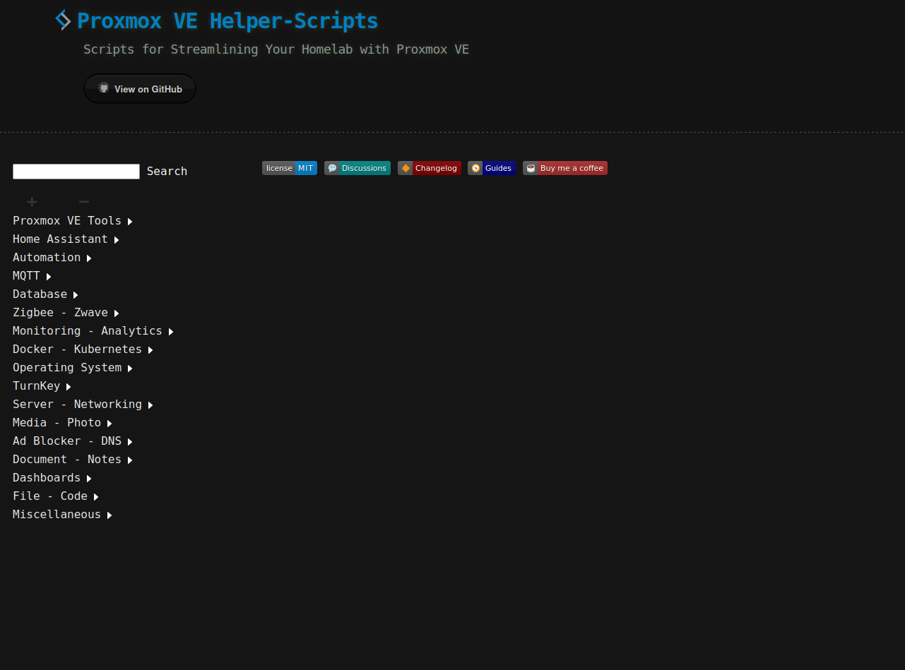
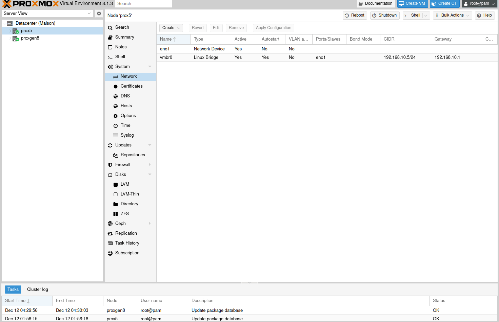
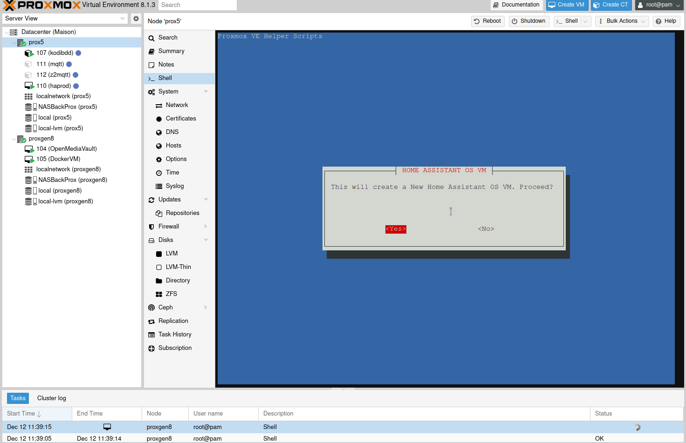
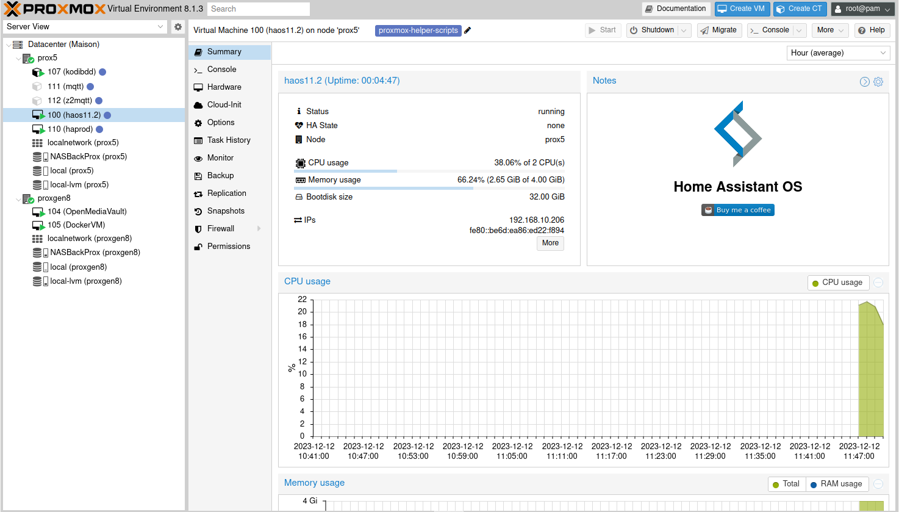
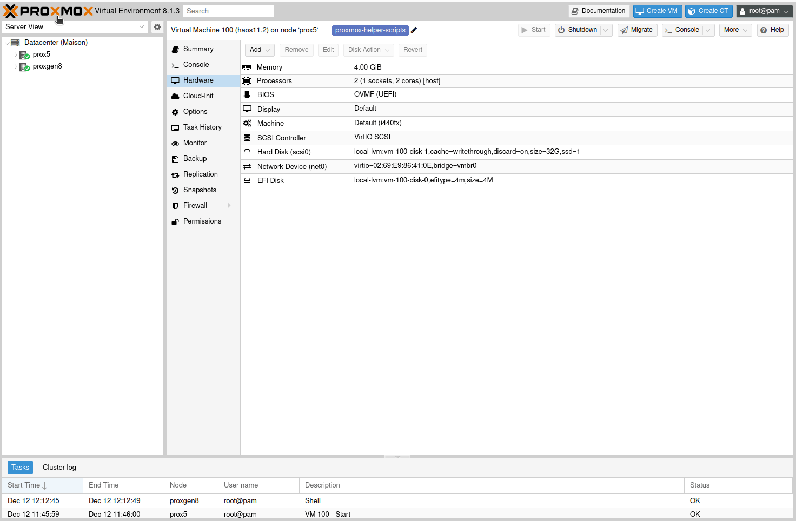

Si vous souhaitez héberger d'autres services en plus de la domotique, ou simplement limiter le nombre de machines alimenté 24/24 chez vous, il y a la solution d'acheter un petit PC, Nuc et y [installer Proxmox](/blog/proxmox_installation) pour ensuite pouvoir déployer ses services et sa domotique dans des machines virtuelles.

Ces petites machines se trouvent soit d'occasions (un petit geste pour la planète), soit neuves, avec ou sans ventilateur (fanless) et consomment souvent moins de 15 watts.

*Je ferais surement un comparatif, mais une Raspberry Pi nue (sans disque dur, sans clé USB branché, etc) consomme environ 4 watts, ce qui au tarif de base EDF actuel, coutent environ 8 euros pour l'option de base et HC/HP et 5 euros en Tempo a l'année.*
*Pour un HP EliteDesk 800 G3 avec un SSD, un I5 et 32Go de RAM, Offre Base et HC/HP 29 euros et 20 euros sous Tempo.*


Allez, assez parlé, passons à l'installation.

**Prérequis**

Je pars du principe que vous avez déjà [installé Proxomox](/blog/proxmox_installation), ici la version 8.


## Installation de Home Assistant

Nous allons installer Home Assistant à l'aide d'un script plutôt que via la [procédure officielle](https://www.home-assistant.io/installation/linux), car c'est beaucoup plus rapide et le script [de tteck](https://tteck.github.io/Proxmox/) est en accès libre sur GitHub, donc vous pouvez vérifier son fonctionnement.

Rendez-vous donc sur le [site de tteck](https://tteck.github.io/Proxmox/), 
* Cliquez sur Home Assistant puis sur Home Assistant OS VM,
* Copier le code.

Vous pouvez profiter pour lire le petit résumé vous indiquant que le disque doit avoir au moins 32 GB d'espace.



* Rendez-vous sur votre serveur Proxmox, puis sur le nœud souhaité (si vous en avez plusieurs),
* Ouvrir le Shell,
* Coller la ligne de commande du site tteck.

```bash
bash -c "$(wget -qLO - https://github.com/tteck/Proxmox/raw/main/vm/haos-vm.sh)"
```

Une fenêtre s'ouvre vous demandant si vous souhaitez créer une machine virtuelle (VM) de Home Assistant OS.



Pour la suite, nous allons prendre les paramètres par défaut qui sont largement suffisants.

*J'ai sûrement une étape supplémentaire, qui est la sélection du disque pour l'installation, alors ne vous inquiétez pas.*



Voici le résultat sur votre console :
```bash
    __  __                        ___              _      __              __     ____  _____
   / / / /___  ____ ___  ___     /   |  __________(_)____/ /_____ _____  / /_   / __ \/ ___/
  / /_/ / __ \/ __ `__ \/ _ \   / /| | / ___/ ___/ / ___/ __/ __ `/ __ \/ __/  / / / /\__ \
 / __  / /_/ / / / / / /  __/  / ___ |(__  |__  ) (__  ) /_/ /_/ / / / / /_   / /_/ /___/ /
/_/ /_/\____/_/ /_/ /_/\___/  /_/  |_/____/____/_/____/\__/\__,_/_/ /_/\__/   \____//____/

Using Default Settings
Using HAOS Version: 11.2
Using Virtual Machine ID: 100
Using Machine Type: i440fx
Using Disk Cache: Write Through
Using Hostname: haos11.2
Using CPU Model: Host
Allocated Cores: 2
Allocated RAM: 4096
Using Bridge: vmbr0
Using MAC Address: 02:69:E9:86:41:0E
Using VLAN: Default
Using Interface MTU Size: Default
Start VM when completed: yes
Creating a HAOS VM using the above default settings
 ✓ Using local-lvm for Storage Location.
 ✓ Virtual Machine ID is 100.
 ✓ https://github.com/home-assistant/operating-system/releases/download/11.2/haos_ova-11.2.qcow2.xz
 ✓ Downloaded haos_ova-11.2.qcow2.xz
 ✓ Extracted KVM Disk Image
 ✓ Created HAOS VM (haos11.2)
 ✓ Started Home Assistant OS VM
 ✓ Completed Successfully!
```
_**Pour information** Dans la version `advanced`, vous pouvez choisir :_
* La version de Home Assistant (**stable**, beta, dev),
* Le numéro de la VM,
* Le type de machine (**i441fx** ou q35),
* d'activer le cache disque (**oui**),
* Configurer le nom de votre instance (hostname),
* Choisir le modèle de CPU (KMV64 ou **Host**),
* Le nombre de cœur CPU alloué (**2**),
* La quantité de RAM allouée (**4096**)
* Configurer le réseau (bridge, adresse MAC, Vlan, MTU),
* Si vous souhaitez démarrer la VM une fois terminé.

Une fois l'installation terminée, vous devriez voir votre VM lancée. Il vous suffit de cliquer dessus pour accéder à son IP via la page Résumé de Proxmox.
Il vous suffit de saisir cette adresse, suivie du port 8123 pour accéder au premier lancement de Home Assistant ( exemple : http://192.168.10.206:8123 ).




La partie configuration étant identique à tous les types d'installation, je vous renvoie vers l'[article sur l'installation de HA OS sur Raspberry Pi](/blog/ha_haos_installation/#Première-configuration)

## Ajouter une clé USB

Si vous avez une clé servant de passerelle Zigbee, il va falloir le dire à votre VM Home Assistant. Voici la procédure.

Allez dans le nœud, puis sur votre VM.
* Aller dans matériel (Hardware),
* Ajouter (Add),
* Périphérique USB (USB Device),
* Utiliser les identifiants USB du fabricant et du périphérique,
* Choisir le périphérique à inclure.



Si votre VM est en route, il faudra la redémarrer pour que votre clé soit prise en compte.

Vous pouvez en ajouter d'autres, mais sachez qu'un périphérique USB ne peut pas être partagé, il appartiendra donc à une seule VM.

**Connaitre le chemin de votre clé USB dans Home Assistant**

Pour connaitre le chemin de votre clé dans Home Assistant, allez dans `Pramètres` -> `Système` -> `Matériel` puis cliquez sur `TOUT LE MATERIEL` et descendez jusqu'à voir votre matériel.

 
**Limitation a quatre USB.**

Une limitation de quatre périphériques peut être outrepassée via la [méthode suivante](https://forum.proxmox.com/threads/limit-for-usb-devices.89774/)

## Conclusion

Vous avez Home Assistant OS installé sur une VM, ce qui vous permet d'installer des services annexes et indépendants de votre domotique, sans risquer de casser un fichier de configuration ou votre installation.

Cette solution vous permet aussi de déporter certains services comme Zigbee2MQTT (pour éviter la perte d'information lors des redémarrages de Home Assistant) ou ESPhome pour la création de ses capteurs DIY via USB nécessitant donc le redémarrage de Home Assistant pour prendre en compte le Passthough USB. (Oui, n'utilisant pas Google, exit la solution via le navigateur).

Si vous n'êtes pas familier avec Home Assistant, ou si vous venez d'une autre solution domotique, voyons ensemble quelques [concepts et terminologies](/blog/ha_concepts_terminologie).

À vous de jouer avec, mais n'oubliez pas de [sauvegarder](/blog/ha_backups).