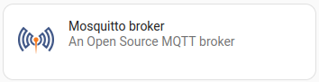
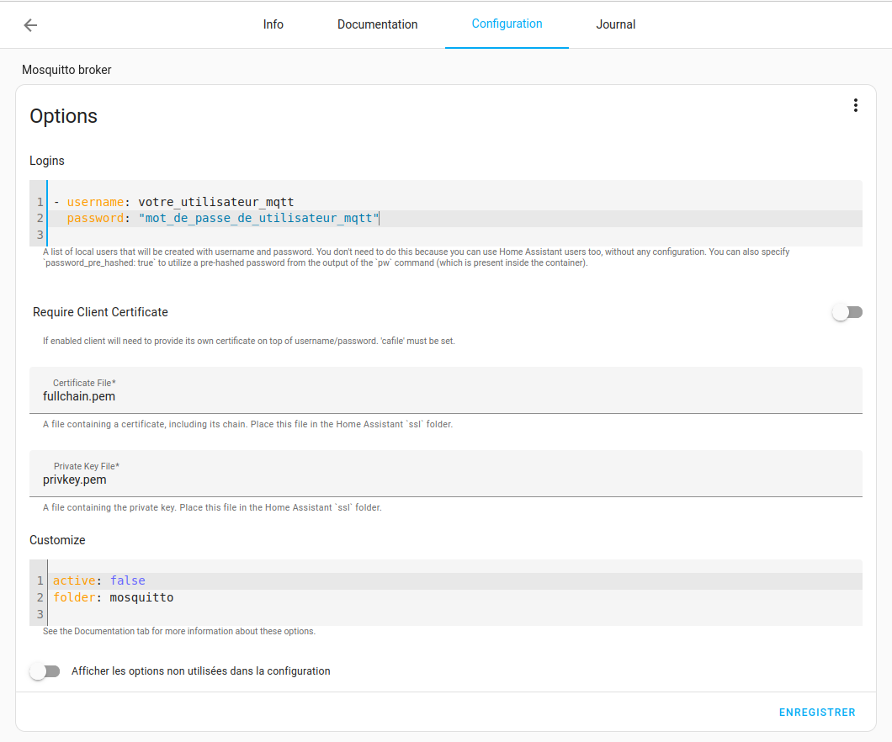
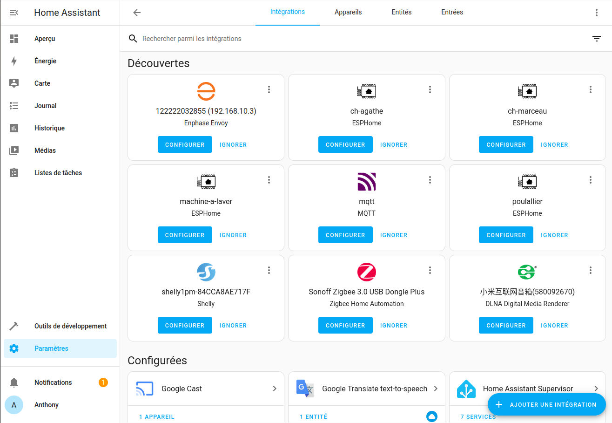
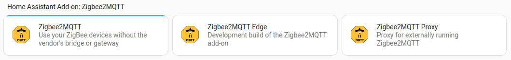
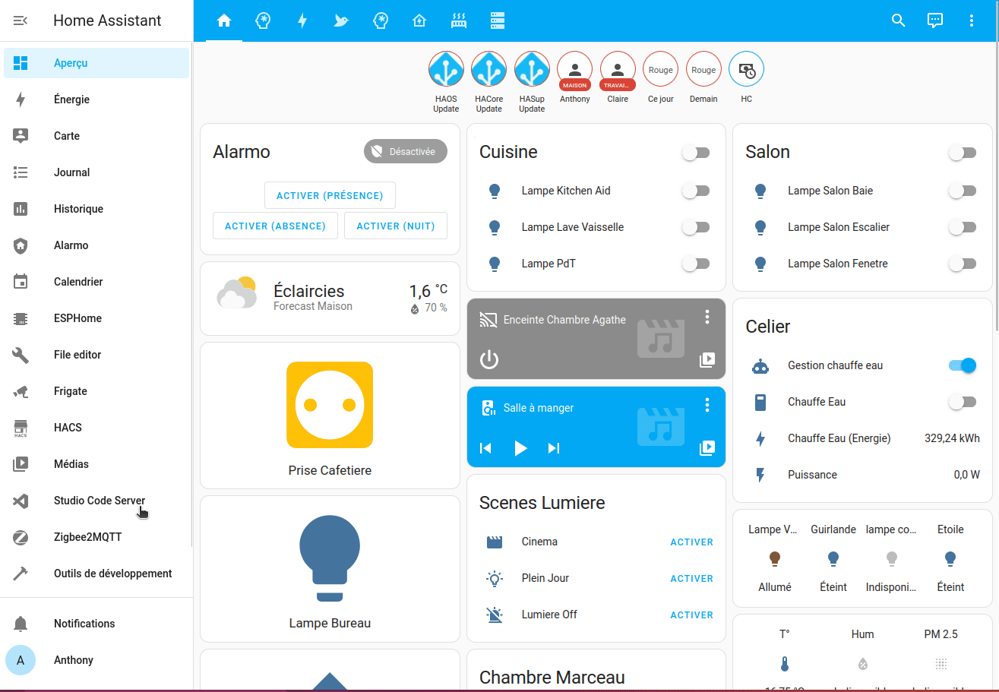

Le Zigbee est le protocole à la mode, basé sur la fréquence 2.4 GHz donc celle du Wi-Fi et du Bluetooth. Il bénéficie d'une multitude de capteurs à des prix très corrects. De plus, il permet de se construire un réseau dit "maillé" permettant d'étendre sa portée.
Cependant, même si la norme Zigbee a d'abord été fait pour créer un protocole uniforme, certain constructeur vendant leurs appareils très chers (coucou Philips) non pas vue d'un bon œil l'interopérabilité quand des marques chinoises (Xiaomi, par exemple) ou grand public comme Ikea sont arrivés sur le marché avec des produits de très bonne qualité a des prix bien plus attractifs. Ce qui a amené à ajouter une "surcouche propriétaire" pour éviter cette interopérabilité.

C'est à ce moment-là qu'intervient la communauté internationale pour nous faire découvrir des passerelles Zigbee, dites "universelles" et aussi des applications permettant à nos capteurs propriétaires de communiquer entre eux.

Ces applications disponibles sur Home Assistant sont :
* [ZHA](https://www.home-assistant.io/integrations/zha/) (natif a Home Assistant), 
* [Zigbee2MQTT](https://www.zigbee2mqtt.io/),
* [DeconZ](https://www.phoscon.de/en/conbee2/software#deconz),

La première, ZHA, a l'avantage de ne nécessiter **aucune** installation, car elle est native à Home Assistant, cependant ce n'est pas celle qui supporte le plus de matériel, mais elle gère la mise à jour de certains appareils.
Pour Zigbee2MQTT, c'est un add-on à ajouter à Home Assistant, et vu qu'il transforme les informations Zigbee vers le *protocole de communication* MQTT, il faut lui ajouter un **Broker MQTT** (comprendre une passerelle) sous la forme d'un add-on supplémentaire. Il a aussi l'avantage de pouvoir mettre à jour certains appareils et c'est celui qui accepte le plus d'appareils à ce jour.
Le dernier DeconZ, disponible en add-on aussi, est celui que je connais le moins, mais aussi celui qui bénéficie d'une compatibilité moindre de capteurs. Cela ne l'empêche pas d'être un bon produit si j'en crois les retours.

Voici un [site répertoriant les capteurs disponibles](https://zigbee.blakadder.com/index.html) (ils n'y sont pas tous) et leur compatibilité avec les différentes solutions.

Vous l'aurez compris, mon choix se porte sur Zigbee2MQTT, mais vous pouvez toujours essayer ZHA pour commencer.

*Si vous commencez par ZHA et que vous souhaitez passer sur Zigbee2MQTT, il vous faudra bien renommer vos entités de la même manière sous peine de devoir repasser sur toutes vos automatisations, votre interface ou vos scripts/scènes.*

***Personnellement**, si vous comptez faire du Zigbee votre protocole domotique principal, je vous conseille de passer directement sur Zigbee2MQTT*

Nous allons voir dans cet article comment installer le Broker MQTT, Mosquitto ainsi que Zigbee2MQTT afin de faire communiquer nos appareils Zigbee avec Home Assistant.
L'installation de Mosquitto Broker vous permettra par la suite de faire communiquer des appareils (grand public ou DIY) via le protocole MQTT sans aucun soucis.

### Les passerelles

Voici quelques passerelles USB Zigbee universelles recommandées pour Zigbee2MQTT :
* [**Sonoff Zigbee 3.0 USB Dongle Plus P**](https://sonoff.tech/product/gateway-and-sensors/sonoff-zigbee-3-0-usb-dongle-plus-p/) (TI CC2652P) disponibles sur [Amazon (19€)](https://amzn.to/41W8f4W) [AliExpress (22€)](https://s.click.aliexpress.com/e/_DlhO6qp),
* [Conbee II](https://www.phoscon.de/en/conbee2), très populaire, [Amazon (32€)](https://amzn.to/41Rryfu),
* [Zigate (FR)](https://zigate.fr/),  [Amazon (54€)](https://amzn.to/3SdV7VA)
* Clés à base Texas Instruments CC2531/2530 (Zigbee v1.2 à éviter depuis l'arrivé du Zigbee 3),

[Liste des clés compatibles avec Zigbee2MQTT](https://www.zigbee2mqtt.io/guide/adapters/#recommended)

Elles sont principalement basées sur le chipset CC2652, sauf pour la Sonoff Zigbee 3.0 USB Dongle Plus **E** à base de chipset EFR32MG21, compatible Matter et Zigbee (**MAIS** pas en même temps) qui est d'ailleurs en expérimentation avec Zigbee2MQTT.

*Home Assistant propose également une clé compatible Zigbee et **Matter** également très intéressante appelée [SkyConnect](https://www.home-assistant.io/skyconnect/). Elle permet de préparer l'arrivée du protocole Matter, qui est censé révolutionner la domotique, mais ça fait deux ans qu'on nous en parle ;).*

*Sachez qu'il y aura des clés qui feront fonctionner Zigbee et Matter en même temps qui devrait arriver, mais quand ??, alors pour 20 euros, prenez une [Sonoff Zigbee 3.0 USB Dongle Plus **P**](https://amzn.to/41W8f4W) et amusez-vous*

***IMPORTANT :** La clé [Sonoff Zigbee 3.0 USB Dongle Plus **P** ou E](https://amzn.to/41W8f4W) est par défaut avec un firmware bridant le nombre d'appareils acceptable à 40, pourquoi ? il faudrait demander à Sonoff, mais comme d'habitude, il est possible de passer outre en flashant le firmware par un autre débridant cette dernière à 50 appareils (enfants) direct et 100/200 routeurs (routes). Voici l'[article à suivre](/blog/ha_flasher_sonoff_zigbee/)*

*Enfants directs : Nombre d'enfants qui peuvent rejoindre directement le coordinateur. Notez qu'il ne s'agit pas de la taille maximale du réseau. Pour plus d'informations, lisez la [FAQ Zigbee2MQTT sur la limite des périphériques (EN)](https://www.zigbee2mqtt.io/guide/faq/#i-read-that-zigbee2mqtt-has-a-limit-of-20-devices-when-using-a-cc2530-cc2531-adapter-is-this-true).
Routes : Ceci indique combien de routes le coordinateur peut garder en mémoire. Par exemple, 100/200 signifie que : 100 routes normales et 200 routes sources peuvent être gardées en mémoire. 0 route source signifie que le routage source est désactivé. Les routes sources améliorent les performances des réseaux de grande taille (plus de 40 nœuds). Pour plus d'informations, lisez [Large ZigBee Networks and Source Routing (EN)](https://www.digi.com/resources/documentation/digidocs/90001537/references/r_large_zigbee_networks-source_routing.htm?TocPath=Working%20with%20Zigbee%7C_____14) (Réseaux ZigBee de grande taille et routage de sources).*

## Mosquitto Broker
### Création d'un utilisateur Home Assistant
*Cette étape est **facultative**, car un utilisateur Zigbee2mqtt est créé automatiquement, mais je vous la **recommande fortement**, si vous voulez connecter facilement d'autres appareils en MQTT plus tard.*

Si vous souhaitez créer un utilisateur dédié à Zigbee2MQTT par vous-même :
* Rendez-vous dans `Paramètre`, `Personnes`, `Utilisateurs` puis `AJOUTER UN UTILISATEUR`,
* Remplir `Nom d'affichage`, `Nom d'utilisateur`, et un `mot de passe`,
* Basculer le bouton `Ne peut se connecter qu'à partir du réseau local`,
* Laissez `Administrateur` désactivé,
* Valider en cliquant sur `Créer`.


### Installation et configuration de l'add-on
Il va falloir installer l'add-on `Mosquitto Broker` via les modules complémentaires (si besoin, il y a un [article ici](/blog/ha_addons/))


**Si vous n'avez pas créé d'utilisateur**
Vous pouvez démarrer directement l'add-on, puis rendez-vous dans `Paramètres`, `Appareils et services` vous devriez voir la découverte automatique de Mosquitto Broker.

**Si vous avez créé un utilisateur**
Une fois l'add-on installé, rendez-vous dans l'onglet `Configuration` de l'add-on `Mosquitto Broker`.
* Dans logins rentrer les informations de l'utilisateur que vous venez de créer.

```yaml
- username: votre_utilisateur_mqtt
  password: "mot_de_passe_de_utilisateur_mqtt"
```



* Laissez la partie réseau par défaut.
* Enregistrez puis démarrez l'add-on.

Une fois démarré, rendez-vous dans `Paramètres`, `Appareils et services` vous devriez voir la découverte automatique de Mosquitto Broker,


S'il n'est pas découvert automatiquement, cliquez sur `+ AJOUTER UNE INTEGRATION` rechercher `MQTT`, cliquez dessus puis de nouveau sur `MQTT`.


Soit il vous demande s'il peut paramétrer seul les informations, soit il va vous demander de rentrer les informations de votre brocker comme l'url, le login et mot de passe. Vous avez les informations plus haut.

Vous avez fini l'installation de l'add-on Mosquitto Broker et venez d'ajouter une possibilité supplémentaire d'interagir avec des capteurs grand public ou DIY via le protocole MQTT.

Passons maintenant a l'installation de Zigbee2MQTT

## Zigbee2MQTT
Zigbee2MQTT est un add-on qui n'est pas directement disponible dans les modules complémentaires, il faut ajouter une source externe. Je vous laisse regarder l'[article sur l'installation d'un add-on](/ha_addon).

Le lien à ajouter est le suivant :
```
https://github.com/zigbee2mqtt/hassio-zigbee2mqtt
```
Ou en cliquant sur le lien ci-dessous :
[](https://my.home-assistant.io/redirect/supervisor_add_addon_repository/?repository_url=https%3A%2F%2Fgithub.com%2Fzigbee2mqtt%2Fhassio-zigbee2mqtt)
Une fois la source ajoutée, il vous faut l'installer. Facile maintenant, il faudra chercher `zigbee2mqtt` et sélectionner `Zigbee2MQTT` (le plus simple).


### Configuration de l'add-on
**Si vous n'avez pas créé d'utilisateur pour votre brocker MQTT**
Il faut seulement rentrer le chemin de votre clé Zigbee (voir plus bas) et au premier lancement de Zigbee2MQTT, il va automatiquement créer un utilisateur pour MQTT et ajouter l'adresse du broker.

**Si vous avez créé un utilisateur pour votre brocker MQTT**
Il faut configurer l'add-on.
Pour cela, nous allons ajouter l'adresse de notre broker, l'utilisateur et le mot de passe pour se connecter au brocker et le chemin de notre clé Zigbee.

***Note :** c'est aussi à cet endroit que vous pouvez ajouter des paramètres comme le canal à utiliser pour votre clé Zigbee (si supporté) qui par défaut est sur le canal 11. Pour ma part, j'utilise le canal 25, car c'est une bande de fréquence qui n'est pas utilisée dans la plupart des routeurs/Box disponibles sur le marché Européen, ce qui évite les interférences avec le Wi-Fi.*

***ATTENTION :** Un changement de canal vous oblige à tout réappairer.*
Voici quelques informations, si vous voulez garder les paramètres par défaut, vous n'avez rien à toucher ou modifier.
*Les paramètres sont disponibles [ici](https://www.zigbee2mqtt.io/guide/configuration/)*

Dans la partie socat :
```yaml
channel: 25
```

Dans la partie mqtt :
```yaml
base_topic: zigbee2mqtt
server: mqtt://core-mosquitto
user: votre_utilisateur_mqtt
password: mot_de_passe_de_utilisateur_mqtt
```

Pour la partie `Sérial`, de la configuration de l'add-on Zigbee2MQTT, saisir le chemin de votre clé Zigbee

**Comment récupérer le chemin de ma clé USB**
Pour commencer, il faut qu'elle soit branché (un oubli est si vite arrivé surtout si vous utilisez Proxmox, n'oubliez pas de l'ajouter à votre VM, voir l'[article sur l'installation de HAOS sur VM](/blog/ha_haos_proxmox_installation/))

Ensuite, rendez-vous dans `Paramètres`, `Système`, `Matériel` puis cliquez sur `TOUT LE MATERIEL` et recherchez votre clé USB.


Dans la capture d'écran c'est `/dev/serial/by-id/usb-ITead_Sonoff_Zigbee_3.0_USB_Dongle_Plus_20fa0f2fc719ec11b20574e5f01c6278-if00-port0`, il se peut que `/dev/ttyUSB0` suffise, mais ça ne marche pas à tous les coups.
Donc c'est ce chemin qui faut rentrer dans la partie `Sérial`, de la configuration.
***> ***ATTENTION :** La configuration est différente selon la clé utilisée.

Exemple :
 Pour la clé Sonoff Dongle Plus
```yaml
port: /dev/serial/by-id/usb-Silicon_Labs_Sonoff_Zigbee_3.0_USB_Dongle_Plus_0001-if00-port0
```
ou
```yaml
port: /dev/ttyUSB0
```
D'autres exemples :
**Conbee II**

```yaml
serial:
  port: /dev/serial/by-id/usb-dresden_elektronik_ingenieurtechnik_GmbH_ConBee_II_DE2234130-if00
  adapter: deconz
```
Il faudra ajouter `adapter: deconz`

**Sonoff Version E** (Remplacer 20XXXXXXXX-if00 par le numéro de votre propre clé).
```yaml
serial:
  port: >-
    /dev/serial/by-id/usb-ITEAD_SONOFF_Zigbee_3.0_USB_Dongle_Plus_V2_20XXXXXXXXX-if00
  adapter: ezsp
```
Il faudra ajouter `adapter: ezsp`

La configuration de Zigbee2MQTT est terminée, il suffit d'enregistrer puis de lancer l'add-on.

## Utilisation
Il est conseillé d'ajouter en premier les apareils faisant office de routeur, ce sont souvent ceux qui sont brancher en permanance au 220v (prise de courant, lumiere, etc)

Pour appairer vos appareils il faut connaitre la procedure d'apparage lié  votre appareil puis autoriser l'appairgae depuis l'interface de Zigbee2MQTT
Un point important est la possibilité de mettre tous les routeuirs en mode appairage ou alors de ne selectionner qu'un seul appareil.

## Conclusion.

Nous venons de faire un grand pas pour notre installation domotique.
Maintenant, tous les capteurs Zigbee de n'importe quelle marque pourront communiquer entre eux et communiquer avec Home Assistant.

Vous pouvez connecter une multitude d'appareils Zigbee avec **une seule** passerelle, envoyer les informations d'autres appareils (aspirateur sous Valetudo ou shelly) via MQTT et connecter d'autres solutions (exemple Node-Red) a votre broker MQTT pour accéder aux différents appareils de votre installation.

Bonne découverte !