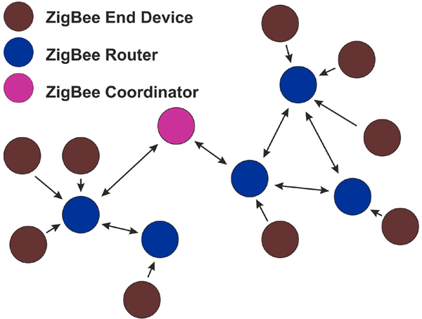
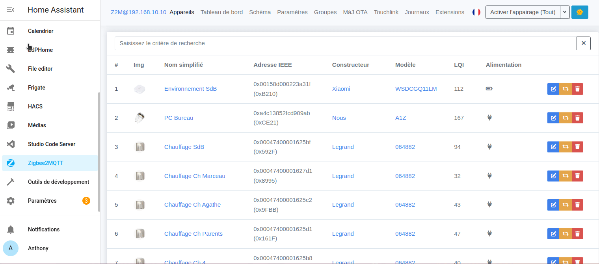
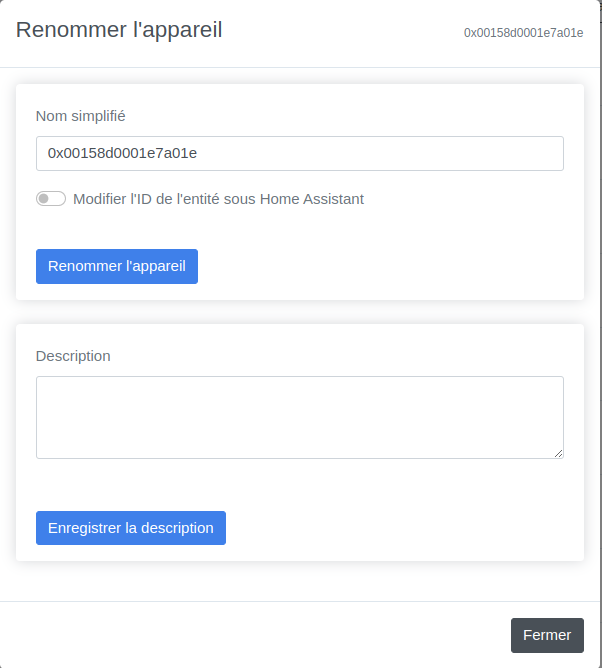
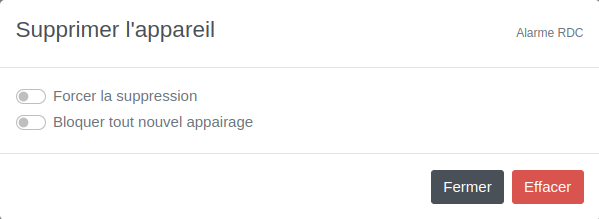

**Le Zigbee, un protocole à la mode**

Le Zigbee est un protocole de communication sans fil basé sur la fréquence 2,4 GHz, la même que celle utilisée par le Wi-Fi et le Bluetooth. Il est conçu pour les applications de faible débit et de faible consommation d'énergie, telles que la domotique.

Le Zigbee présente plusieurs avantages, notamment :

* Une multitude de capteurs et de périphériques disponibles à des prix très abordables;
* La possibilité de créer un réseau maillé, ce qui permet d'étendre la portée du réseau;
* Une faible consommation d'énergie, ce qui permet aux appareils de fonctionner pendant de longues périodes sur des piles ou des batteries.

**L'interopérabilité, un défi**

La norme Zigbee a été conçue pour permettre l'interopérabilité entre les différents produits de différents fabricants. Cependant, certains fabricants, notamment Philips, ont ajouté une "surcouche propriétaire" à leurs produits Zigbee. Cette surcouche empêche l'interopérabilité avec les produits d'autres fabricants.

**La communauté internationale à la rescousse**

Face à cette situation, la communauté internationale a développé des passerelles Zigbee "universelles" et des applications permettant de contourner les surcouches propriétaires. Ces solutions permettent aux utilisateurs de connecter leurs différents appareils Zigbee, quelle que soit la marque.

**Conclusion**

Le Zigbee est un protocole de communication sans fil qui présente de nombreux avantages. Cependant, l'interopérabilité entre les produits de différents fabricants peut être un défi. La communauté internationale a développé des solutions pour contourner ce défi, ce qui permet aux utilisateurs de créer des réseaux Zigbee plus complets et plus flexibles.

**Les passerelles Zigbee pour Home Assistant**

Il existe trois principales passerelles Zigbee compatibles avec Home Assistant : ZHA, Zigbee2MQTT et DeconZ.

**ZHA**
* Avantage : native à Home Assistant, ne nécessite aucune installation et met à jour certains appareils
* Inconvénient : ne supporte pas le plus de matériel,

**Zigbee2MQTT**
* Avantage : supporte le plus de matériel, met à jour certains appareils
* Inconvénient : nécessite un Broker MQTT (passerelle) supplémentaire sous forme d'add-on,

**Deconz**
* Avantage : supporte moins de capteurs que ses concurrents
* Inconvénient : ne supporte pas les mises à jour d'appareils

**Conclusion**

Le choix de la passerelle Zigbee dépend de vos besoins et de vos priorités. Si vous souhaitez une installation simple et rapide, ZHA est une bonne option. Si vous souhaitez une compatibilité maximale avec les appareils Zigbee, Zigbee2MQTT est la meilleure solution.

Voici un [site répertoriant les capteurs disponibles](https://zigbee.blakadder.com/index.html) (ils n'y sont pas tous) et leur compatibilité avec les différentes solutions.

Vous l'aurez compris, mon choix se porte sur Zigbee2MQTT, mais vous pouvez toujours essayer ZHA pour commencer.

*Si vous commencez par ZHA et que vous souhaitez par la suite passer sur Zigbee2MQTT, il vous faudra bien renommer vos entités de la même manière sous peine de devoir repasser sur toutes vos automatisations, votre interface ou vos scripts/scènes.*

***Personnellement**, si vous comptez faire du Zigbee votre protocole domotique principal, je vous conseille de passer directement sur Zigbee2MQTT*

Nous allons voir dans cet article comment installer le Broker MQTT, Mosquitto ainsi que Zigbee2MQTT afin de faire communiquer nos appareils Zigbee avec Home Assistant.
L'installation de Mosquitto Broker vous permettra par la suite de faire communiquer des appareils (grand public ou DIY) via le protocole MQTT sans aucun soucis.

### Les passerelles

Voici quelques passerelles USB Zigbee universelles recommandées pour Zigbee2MQTT :
* [**Sonoff Zigbee 3.0 USB Dongle Plus P**](https://sonoff.tech/product/gateway-and-sensors/sonoff-zigbee-3-0-usb-dongle-plus-p/) (TI CC2652P) disponibles sur [Amazon (19€)](https://amzn.to/41W8f4W) [AliExpress (22€)](https://s.click.aliexpress.com/e/_DlhO6qp),
* [Conbee II](https://www.phoscon.de/en/conbee2), très populaire, [Amazon (32€)](https://amzn.to/41Rryfu),
* [Zigate (FR)](https://zigate.fr/),  [Amazon (54€)](https://amzn.to/3SdV7VA)
* Clés à base Texas Instruments CC2531/2530 (Zigbee v1.2 à éviter depuis l'arrivée du Zigbee 3),

[Liste des clés compatibles avec Zigbee2MQTT](https://www.zigbee2mqtt.io/guide/adapters/#recommended)

Elles sont principalement basées sur le chipset CC2652, sauf pour la Sonoff Zigbee 3.0 USB Dongle Plus **E** à base de chipset EFR32MG21, compatible Zigbee et **Matter** (**MAIS pas en même temps**), celle-ci étant encore en expérimentation avec Zigbee2MQTT.

*Home Assistant propose une clé compatible Zigbee et **Matter** très intéressante appelée [SkyConnect](https://www.home-assistant.io/skyconnect/). Elle permet de préparer l'arrivée du protocole Matter, qui est censé révolutionner la domotique, mais ça fait deux ans qu'on nous en parle ;).*
***Note :** Je n'ai cependant pas trouvé d'information sur sa compatibilité avec Zigbee2MQTT, ce qui vous obligera à utiliser ZHA*

*Sachez que des clés faisant fonctionner Zigbee et Matter en même temps devrait arriver, mais quand ???, alors pour 20 euros, prenez une [Sonoff Zigbee 3.0 USB Dongle Plus **P**](https://amzn.to/41W8f4W) et amusez-vous*

***IMPORTANT :** La clé [Sonoff Zigbee 3.0 USB Dongle Plus **P** ou E](https://amzn.to/41W8f4W) est par défaut livrée avec un firmware bridant le nombre d'appareils intégrables à 40 ! Pourquoi ? Il faudrait demander à Sonoff, mais comme d'habitude, il est possible de passer outre cette limitation en flashant ce firmware d'origine par un autre, débridant ainsi à 50 appareils (enfants) directs et 100/200 routeurs (routes). Voici l'[article à suivre](/blog/ha_flasher_sonoff_zigbee/)*

*Enfants directs : Nombre d'enfants qui peuvent rejoindre directement le coordinateur. Notez qu'il ne s'agit pas de la taille maximale du réseau. Pour plus d'informations, lisez la [FAQ Zigbee2MQTT sur la limite des périphériques (EN)](https://www.zigbee2mqtt.io/guide/faq/#i-read-that-zigbee2mqtt-has-a-limit-of-20-devices-when-using-a-cc2530-cc2531-adapter-is-this-true).
Routes : Ceci indique combien de routes le coordinateur peut garder en mémoire. Par exemple, 100/200 signifie que : 100 routes normales et 200 routes sources peuvent être gardées en mémoire. 0 route source signifie que le routage source est désactivé. Les routes sources améliorent les performances des réseaux de grande taille (plus de 40 nœuds). Pour plus d'informations, lisez [Large ZigBee Networks and Source Routing (EN)](https://www.digi.com/resources/documentation/digidocs/90001537/references/r_large_zigbee_networks-source_routing.htm?TocPath=Working%20with%20Zigbee%7C_____14) (Réseaux ZigBee de grande taille et routage de sources).*

## Mosquitto Broker
### Installation et configuration de l'add-on
Il va falloir installer l'add-on `Mosquitto Broker` via les modules complémentaires (si besoin, se référer à cet [article](/blog/ha_addons/))


Ensuite, démarrer directement l'add-on, puis se rendre dans `Paramètres`, `Appareils et services` vous devriez voir la découverte automatique de Mosquitto Broker.

Ajouter-la, puis il va vous demander s'il peut configurer seul les informations, acceptez.

S'il n'est pas découvert automatiquement, cliquer sur `+ AJOUTER UNE INTEGRATION`, rechercher `MQTT`, cliquer dessus puis de nouveau sur `MQTT`.

Vous avez fini l'installation de l'add-on Mosquitto Broker. Si vous souhaitez que des appareils externes à Home Assistant puissent interagir avec des capteurs grand public ou DIY via le protocole MQTT, il vous faudra ajouter un utilisateur MQTT pour plus de simplicité.

Sinon, vous pouvez passer à l'installation de Zigbee2MQTT.

### Création d'un utilisateur Home Assistant
*Cette étape est **facultative**, car un utilisateur Zigbee2mqtt est créé automatiquement, mais je vous la **recommande** si vous voulez connecter facilement d'autres appareils externes en MQTT plus tard.*

* Rendez-vous dans `Paramètre`, `Personnes`, `Utilisateurs` puis `AJOUTER UN UTILISATEUR`,
* Remplir `Nom d'affichage`, `Nom d'utilisateur`, et un `mot de passe`,
* Basculer le bouton `Ne peut se connecter qu'à partir du réseau local`,
* Laisser `Administrateur` désactivé,
* Valider en cliquant sur `Créer`.


**Ajouter votre utilisateur à Mosquitto**
Rendez-vous dans l'onglet `Configuration` de l'add-on `Mosquitto Broker`.
* Dans `logins`, rentrer les informations de l'utilisateur que vous venez de créer.

```yaml
- username: votre_utilisateur_mqtt
  password: "mot_de_passe_de_utilisateur_mqtt"
```


* Laisser la partie réseau par défaut.

Enregistrer puis redémarrer l'add-on.

Vous pouvez tester la connexion à votre broker avec le logiciel [MQTT Explorer](https://mqtt-explorer.com/).

_Passons maintenant à l'installation de Zigbee2MQTT_

## Zigbee2MQTT
Zigbee2MQTT est un add-on qui n'est pas directement disponible dans les modules complémentaires, il faut ajouter une source externe. Je vous laisse regarder l'[article sur l'installation d'un add-on](/blog/ha_addons/).

Le lien à ajouter est le suivant :
```
https://github.com/zigbee2mqtt/hassio-zigbee2mqtt
```
Ou en cliquant sur le lien ci-dessous :
[](https://my.home-assistant.io/redirect/supervisor_add_addon_repository/?repository_url=https%3A%2F%2Fgithub.com%2Fzigbee2mqtt%2Fhassio-zigbee2mqtt)
Une fois la source ajoutée, il vous faut l'installer. Facile maintenant, il faudra chercher `zigbee2mqtt` et sélectionner `Zigbee2MQTT` (le plus simple).


### Configuration de l'add-on
Il faut seulement rentrer le **chemin de votre clé Zigbee** et au premier lancement de Zigbee2MQTT, il va automatiquement créer un utilisateur pour MQTT et ajouter l'adresse du broker.

**Comment récupérer le chemin de ma clé USB**

Pour commencer, il faut qu'elle soit branchée (un oubli est si vite arrivé surtout si vous utilisez Proxmox, n'oubliez pas de l'ajouter à votre VM, voir l'[article sur l'installation de HAOS sur VM](/blog/ha_haos_proxmox_installation/))

Ensuite, rendez-vous dans `Paramètres`, `Système`, `Matériel` puis cliquez sur `TOUT LE MATERIEL` et recherchez votre clé USB.


Dans la capture d'écran, c'est `/dev/serial/by-id/usb-ITead_Sonoff_Zigbee_3.0_USB_Dongle_Plus_20fa0f2fc719ec11b20574e5f01c6278-if00-port0`, il se peut que `/dev/ttyUSB0` suffise, mais ça ne marche pas à tous les coups (essayez !).
C'est ce chemin qu'il faut rentrer dans la partie `Sérial`, de la configuration de l'add-on Zigbee2MQTT.
***> ***ATTENTION :** La configuration est différente selon la clé utilisée.

Exemple :
 Pour la clé Sonoff Dongle Plus
```yaml
port: /dev/serial/by-id/usb-Silicon_Labs_Sonoff_Zigbee_3.0_USB_Dongle_Plus_0001-if00-port0
```
ou
```yaml
port: /dev/ttyUSB0
```
D'autres exemples :
**Conbee II**

```yaml
serial:
  port: /dev/serial/by-id/usb-dresden_elektronik_ingenieurtechnik_GmbH_ConBee_II_DE2234130-if00
  adapter: deconz
```
Il faudra ajouter `adapter: deconz`

**Sonoff Version E** (Remplacer 20XXXXXXXX-if00 par le numéro de votre propre clé).
```yaml
serial:
  port: >-
    /dev/serial/by-id/usb-ITEAD_SONOFF_Zigbee_3.0_USB_Dongle_Plus_V2_20XXXXXXXXX-if00
  adapter: ezsp
```
Il faudra ajouter `adapter: ezsp`

La configuration de Zigbee2MQTT est terminée, il suffit d'enregistrer puis de lancer l'add-on.

Comme à votre habitude, regardez l'onglet journal pour voir si tout se passe bien.

## Utilisation

L'utilisation de Zigbee2MQTT est assez simple, même si l'interface peut faire peur avec tous les menus et options disponibles.

Voyons ensemble ce que vous devez savoir dès le début.

### Appairer ses appareils
Avant de parler d'appairage, je vais quand même vous faire un petit rappel sur les deux types d'appareils que vous pouvez trouver sous Zigbee qui constitue son réseau "maillé".
* Vous avez les capteurs que l'on appelle les **End Device** (children, Enfants), souvent des capteurs sur pile, qui ne font que transmettre leurs informations. Ils ne participeront pas au "maillage" permettant d'étendre votre réseau.
* Vous avez ceux que l'on appelle **routeur**, qui permettent d'étendre le réseau en faisant transiter les informations des "enfants" vers le **coordinateur** (clé USB Sonoff dans notre cas). Dans la plupart des cas, tous les appareils alimentés en permanence par le réseau électrique font office de  routeur.

Ce réseau permet de connecter bien plus d'appareils que ne pourrait supporter votre **coordinateur** (clé USB Sonoff) à lui seul, car un routeur compte comme un enfant aux yeux du coordinateur, mais chaque routeur peut avoir plusieurs End Device.

Une image vaut bien plus que des mots.


**1^er^ conseil**
Normalement le réseau est censé se gérer tout seul, mais il est conseillé d'ajouter en premier les appareils faisant office de routeur puis les autres.
**2^e^ conseil**
Appairez vos appareils à leur emplacement définitif, si et seulement si ça ne marche pas, essayez proche du coordinateur.

Chaque appareil a sa procédure pour être appairé, la documentation de Zigbee2MQTT l'indique dans la plupart des cas sur la fiche du produit supporté.

Un point positif pour Zigbee2MQTT est la possibilité de mettre tous les routeurs en mode appairage en un clic ou alors de ne sélectionner qu'un seul routeur, ce qui forcera votre capteur à se connecter à ce dernier.

***Mon avis :** Je ne sais pas si cela a vraiment une incidence, car j'active toujours l'appairage sur tous les routeurs, mais je suis preneur de vos retours*.

### Comment ajouter un appareil à Zigbee2MQTT
Rendez-vous dans l'interface de Zigbee2MQTT.
* Cliquer sur le bouton en haut à droite `Activer l'appairage (Tout)` ou alors sur la petite flèche pour choisir sur quel routeur. L'apparaige est autorisé pendant 4 minutes et 14 secondes.

* Aller sur l'appareil à appairer puis lancer la manipulation d'appairage.
* Retourner sur l'interface de Zigbee2MQTT (le plus simple est de s'y connecter avec votre smartphone, ça évite les aller-retour), plusieurs pop-ups devraient s'afficher en vert.
* Une fois appairé, il doit s'afficher à la suite des appareils déjà ajoutés.

Sur l'image ci-dessus, 
* `0x00158d0001e7a01e` correspond à l'adresse IEEE de l'appareil, c'est un numéro unique,
Ensuite, vous avez des informations classiques, le constructeur, le modèle, l'image et le nom simplifié (pas simple pour le moment). Vous avez aussi l'information sur la source d'alimentation, pile ou secteur.
* Le `LQI` est la qualité du signal entre votre appareil et votre coordinateur ou routeur (en fonction de là ou il est connecté), plus il est fort, mieux c'est (je crois que ça s'arrête à 255)

Il reste maintenant les trois boutons complètement à droite.
* Le premier permet de renommer votre appareil,

* * N'oubliez pas de basculer `Modifier l'ID de l'entité sous Home Assistant` pour qu'il soit aussi renommé dans Home Assistant.
* Le deuxième de forcer la reconfiguration de l'appareil (en gros, il l'interroge)
* Le troisième, facile, il supprime votre appareil.

Lors de la suppression, vous avez deux options :
* * Forcer la suppression
* * Bloquer tout nouvel appairage (si vous vendez un appareil par exemple)

### Utilisation avancée
Zigbee2MQTT permet une utilisation plus poussée, comprendre que l'on peut configurer plus en profondeur certains paramètres.

Pour accéder au dossier de l'add-on, il vous faut soit l'add-on File Editor, soit Studio Code Server, soit faire un partage Samba sur votre réseau.
**Si ça ne vous parle pas, n'allez pas plus loin pour le moment.**

Parmi les paramètres intéressants, il y a :
**Le canal** qui est la bande de fréquence sur laquelle les appareils vont communiquer. Comme vous le savez (je l'ai écrit au tout début), le Zigbee travaille autour du 2.4 GHz qui est aussi la fréquence du Wi-Fi (pas le Wi-Fi 5 GHz) mais aussi du Bluetooth. Par défaut, c'est le canal 11 qui est sélectionné, mais vous pouvez le changer.

***Note :** Pour ma part, j'utilise le canal 25, car c'est une bande de fréquence qui n'est pas utilisée par la plupart des routeurs/Box disponibles sur le marché Européen, ce qui évite les interférences avec le Wi-Fi.*

***ATTENTION :** Un changement de canal vous oblige à tout réappairer.*
*Les paramètres sont disponibles [ici](https://www.zigbee2mqtt.io/guide/configuration/)*

Vous pouvez modifier le canal dans l'onglet configuration de Zigbee2MQTT en ajoutant dans la partie socat le code suivant :
```yaml
channel: 25
```

**Connexion avec l'utilisateur MQTT créé**
Si vous souhaitez que Zigbee2MQTT se connecte au brocker avec l'utilisateur que vous avez créé plus haut, il va falloir lui indiquer dans sa configuration.

Pour cela, nous allons ajouter l'adresse de notre broker, l'utilisateur et le mot de passe pour se connecter au brocker.

Dans la partie mqtt :
```yaml
base_topic: zigbee2mqtt
server: mqtt://core-mosquitto
user: votre_utilisateur_mqtt
password: mot_de_passe_de_utilisateur_mqtt
```

**Déplacer les devices du fichier `configuration.yaml` vers `devices.yaml`**
Ce fichier contient toutes les adresses IEEE de vos appareils ainsi que leur nom. Si vous n'avez rien paramétré, ces informations se trouvent directement dans le fichier `configuration.yaml` du dossier de `zigbee2MQTT`. 
Si vous souhaitez séparer les deux fichiers (intéressant quand votre installation grossit), il vous faudra créer un fichier `devices.yaml` dans le dossier de l'add-on Zigbee2MQTT, puis l'indiquer dans le fichier `configuration.yaml` qui se situe au même endroit avec le code suivant.
```yaml
devices: devices.yaml
```

***IMPORTANT :** Si vous devez quelle qu'en soit la raison supprimer et réinstaller Zigbee2MQTT, sauvegardez ou copiez/collez ce fichier, ce qui permettra, lors de l'appairage, de conserver les noms de vos appareils qui seront donc reconnus dans vos automatisations, scènes, scripts et interfaces Home Assistant.*

## Conclusion.

Nous venons de faire un grand pas pour notre installation domotique.
Maintenant, tous les capteurs Zigbee de n'importe quelle marque pourront communiquer entre eux et communiquer avec Home Assistant.

Vous pouvez connecter une multitude d'appareils Zigbee avec **une seule** passerelle, envoyer les informations d'autres appareils (aspirateur sous Valetudo ou shelly) via MQTT et connecter d'autres solutions (exemple Node-Red) à votre broker MQTT pour accéder aux différents appareils de votre installation.

Bonne découverte !