**Tuto réalisé avec :**
* iLO Firmware : V2.82
* ROM : J06 04/04/2019
* Intelligent Provisioning : V1.74.2 (après avoir suivi ce tutoriel)
* Une carte Micro SD ([Amazon (9€)](https://amzn.to/498Um5d))

Je vous ai parlé dans [cet article](/blog/hp_gen_8_mise_en_place/) du MicroServer HP Gen 8 que je trouve intéressant d'un point de vue technique pour faire un NAS DIY et/ou faire un peu de virtualisation sans dépenser des fortunes.

Un des points forts de cette machine est la présence de l'iLO 4 qui permet de tout faire sur la machine sans écran ni clavier, depuis une interface web.

Le problème est que certaines de ces machines sont vendues avec un iLO dégradé apportant une lenteur aux actions via l'interface.

J'ai acheté une troisième machine qui avait ce problème en plus d'autre comme l'impossibilité de démarrer le logiciel HPE Smart Storage Administrator qui permet, en autre, la gestion du Raid matériel, mais aussi de booter sur un SSD installé a la place du lecteur de DVD (toute la [procédure est expliqué ici](/blog/hp_gen_8_mise_en_place/)).

J'ai donc retourné la machine, mais j'ai quand même cherché à voir ce que l'on pouvait faire, car j'ai une machine dans ce cas (mais avec HPE Smart Storage Administrator) .

Voilà le problème sur l'interface iLO en image :
Sur l'interface de connexion iLO.
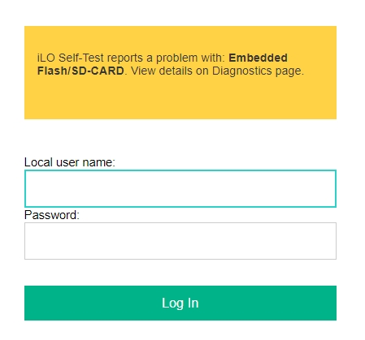
Dans le menu `Information -> Overview`.
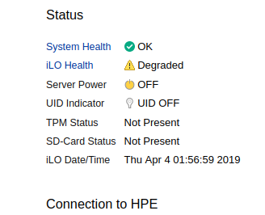
Dans le menu `Information -> Diagnostics`.
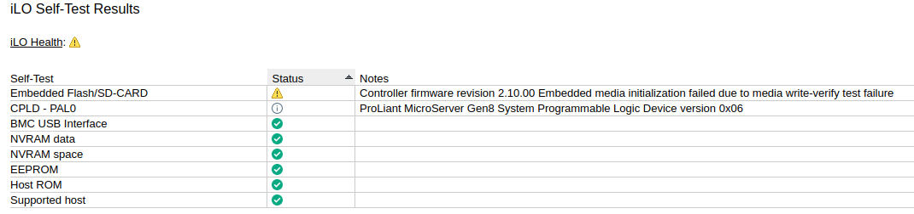

Voyons ensemble quelques pistes pour essayer de retrouver un iLO complètement fonctionnel et réinstaller l'application Intelligent Provisioning de HP permettant l'accès au HPE Smart Storage Administrator.

***NOTE :** Si c'est la puce iLO qui est défectueuse, cette procédure ne changera rien.*

Passons à la pratique !

**Prérequis :**

* Une carte MicroSD [Amazon (9€)](https://amzn.to/498Um5d)

## Reset de l'iLO

Commencer par un Reset de l'iLO peut déjà être une bonne piste, même si des fois cela vous procure une fausse joie, car le status `iLO Health` passe en vert, puis lors de la nouvelle connexion, il repasse en `degraded`.

Deux solutions pour Reset l'iLO.

**Depuis l'interface :**
1. Allez dans `Information -> Diagnostics`,
1. Cliquez sur le bouton `Reset` en dessous de `Reset iLO`.
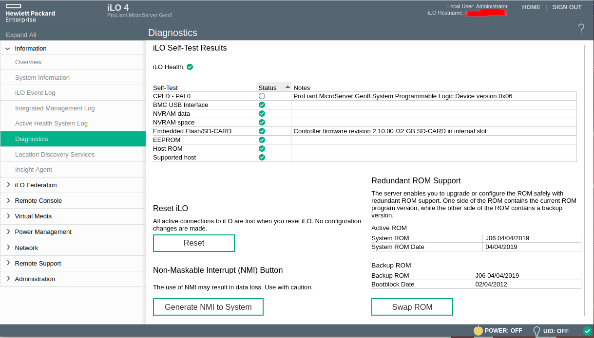
1. Il vous demande de confirmer et lance le reset.
1. Vous devez être de nouveau sur la fenêtre de connexion au dashboard iLO.

**Lors du lancement du serveur :**
1. Démarrez votre serveur,
1. Sur la page de chargement HP, sélectionnez <kbd>F8</kbd>
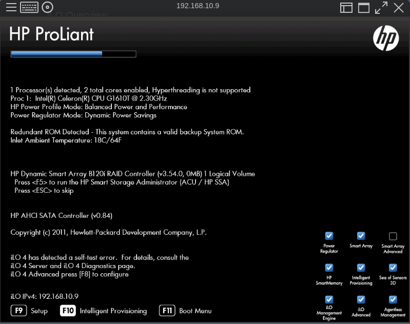
1. Dans les lignes de code, il vous propose un  `Reset iLO` en tapant <kbd>F8</kbd>, faites-le dès que ça s'affiche.
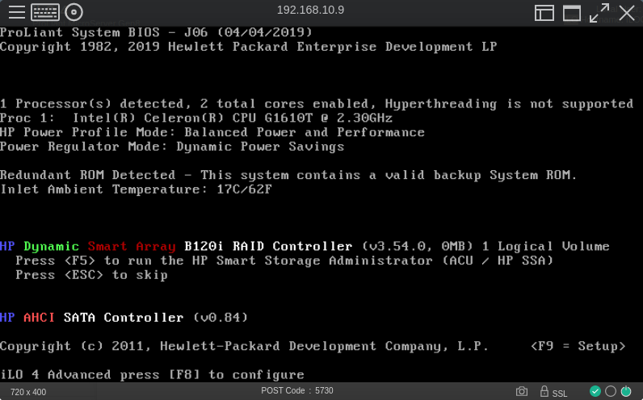

Vous arrivez sur l'interface iLO (a l'ancienne)

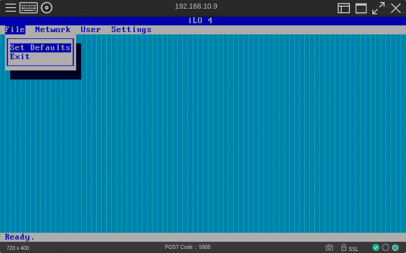
1. Sélectionnez `File -> Set Defaults`

C'est fini. Vous pouvez aussi gérer les utilisateurs depuis cette interface, mais via l'UI c'est un peu plus moderne.

## Essayer de réparer son iLO
### Format Embedded Flash and Reset iLO

Dans `Information -> Overview`, cliquez sur `iLO Health` puis sur la nouvelle page, cliquez de nouveau sur `iLO Health`.
Vous devriez avoir cette page :
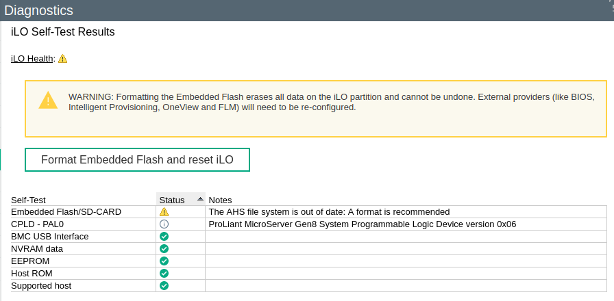
1. Cliquez sur le bouton Format Embedded Flash and Reset iLO
1. Confirmez, puis le reset de l'iLO se lance et vous devriez vous retrouver sur la page de connexion.

Une fois reconnecté, si vous n'avez plus l'état dégradé de l'iLO, c'est surement gagné, il faudra vérifier dans le temps.
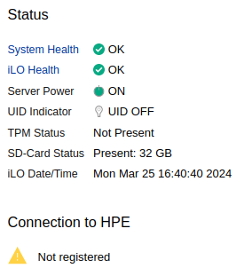

### Service Pack Proliant Gen 8.1
Une autre solution consiste à récupérer le Service Pack Proliant Gen8.1 (SPP) et le lancer. Il vous permettra de voir si vos firmwares sont à jour (sachant que le SPP Gen 8.1 date de novembre 2017, il y a de fortes chances que vous soyez au-dessus). Il permet aussi de faire des diagnostics dont celui de l'iLO.

C'est le lancement qui m'a permis de retrouver l'iLO fonctionnel, je ne sais pas trop pourquoi, car je n'ai rien installé depuis de pack, mais peut-être que le chargement du DVD permet de remettre un peu d'ordre quand il copie les fichiers dans la RAM disque.

L SPP Gen 8.1 n'est pas disponible gratuitement depuis les serveurs HPE alors une petite recherche sur Qwant m'a donné ce [fil de discussion](https://www.reddit.com/r/homelab/comments/hv5qol/hp_service_pack_for_proliant_spp_version_gen81/?rdt=43510) et a l'intérieur ce [lien rapide](https://soft.silinet.net/hp/P03093_001_spp-Gen8.1-SPPGen81.4.iso) pour le récupérer.

HPE laisse quand même accessible le [checksums](https://support.hpe.com/connect/s/softwaredetails?language=fr&softwareId=MTX_ff582daf008c4f529c4d6c28f6&tab=Installation+Instructions) ce qui permet de vérifier l'intégrité de l'ISO téléchargé.

*Chechsums SHA-256 : 085f456c4b4d7dd3d2235258adf787b0785c75e62b4c898411f8198f1c4baa65*

Une fois récupéré (5.8Go) :
1. Rendez-vous dans `Virtual Media -> Boot Order` puis choisir `CD/DVD Drive` dans `Select One-Time Boot Option`
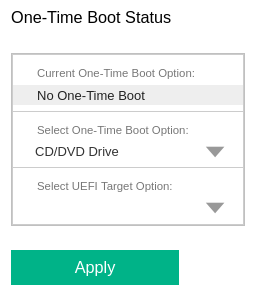
1. Appliquez les réglages en appuyant sur le bouton `Apply`
1. Lancez le contrôle via HTML 5 depuis le dashboard iLO dans `Overview` ou alors depuis `Remote Console` en cliquant sur le bouton `HTML5 Console`
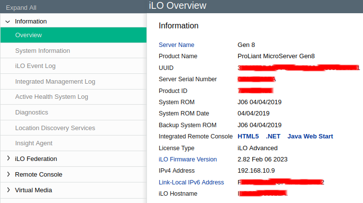
1. Chargez l'image précédemment téléchargée en cliquant sur le `Disque` en haut à gauche, puis en sélectionnant `CD/DVD` et `Load *.ISO file`.
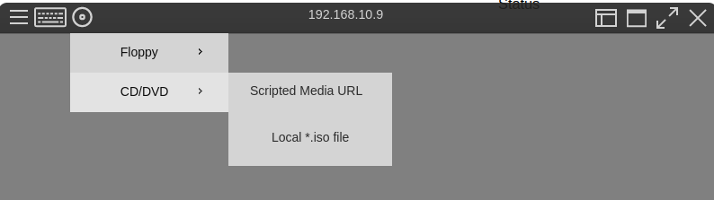
1. Lancer le serveur.

Il devrait démarrer sur l'image du Service Pack Proliant Gen 8.1.

***Note :** S'il ne démarre pas sur le disque, vous pouvez toujours forcer le démarrage en sélectionnant <kbd>F11</kbd> (Boot menu) sur le dashbord de chargement HP.*

Une fois démarré, lors de la première fenêtre, sélectionnez `Interactive Firmware Update Version Gen 8.1`

Il devrait charger des éléments en RAM disque.
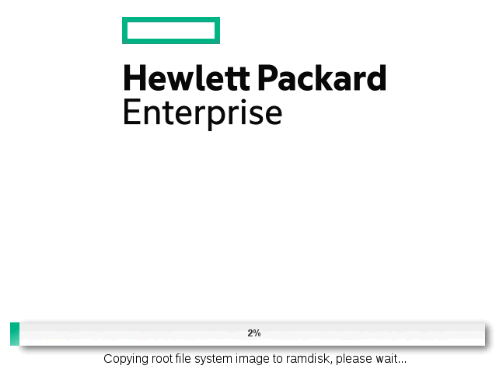
Sélectionnez la langue de votre choix, puis acceptez les conditions.
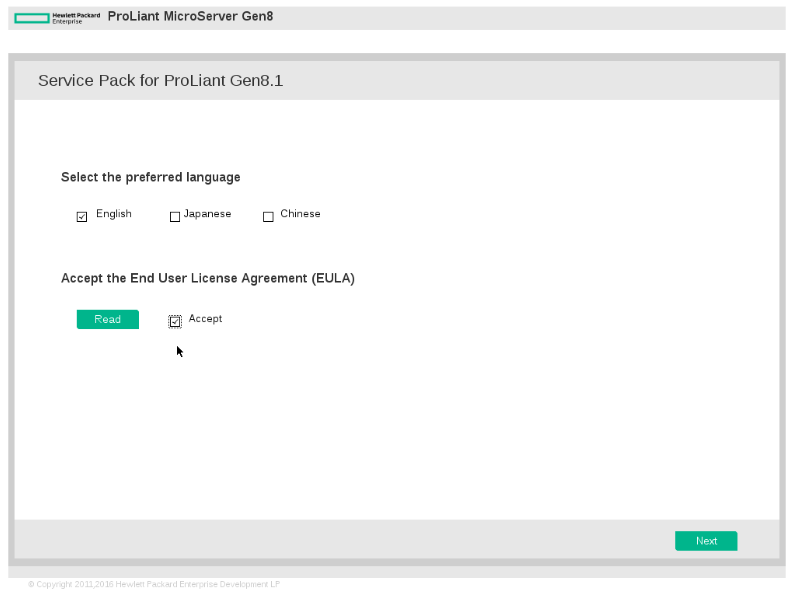

Vous êtes maintenant sur l'interface du Service Pack Proliant Gen 8.1.
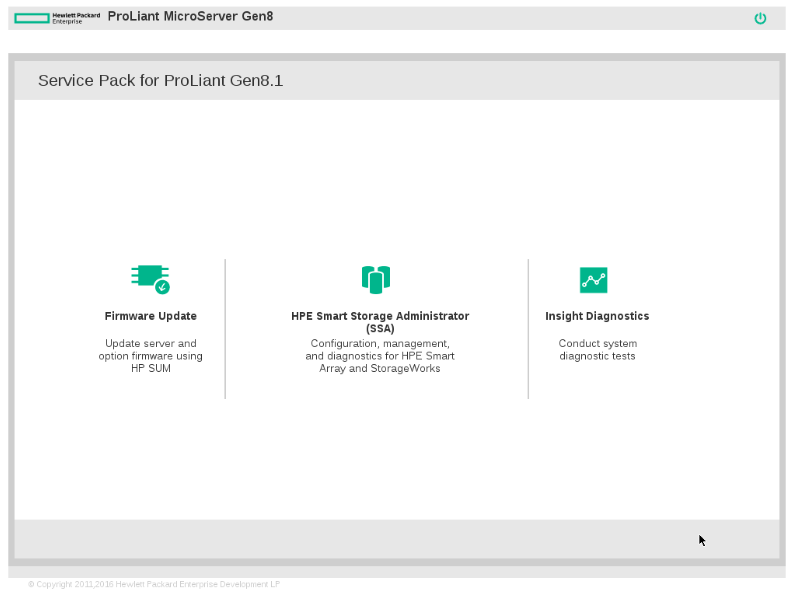
Vous avez accès aux mises à jour des firmwares, au HPE Smart Storage Administrator permettant d'effectuer les réglages sur les disques et a l'outil de diagnostic.

**Firmware Update**
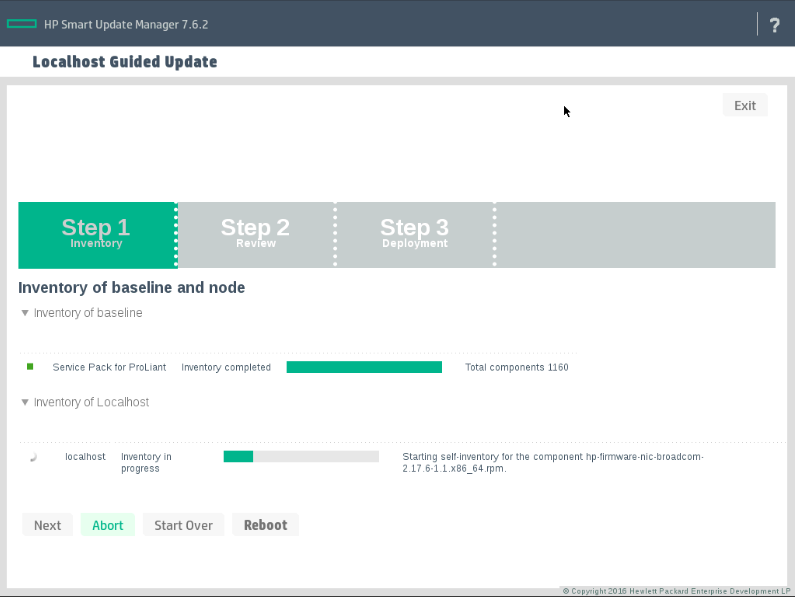

**HPE SMart Storage Administrator**
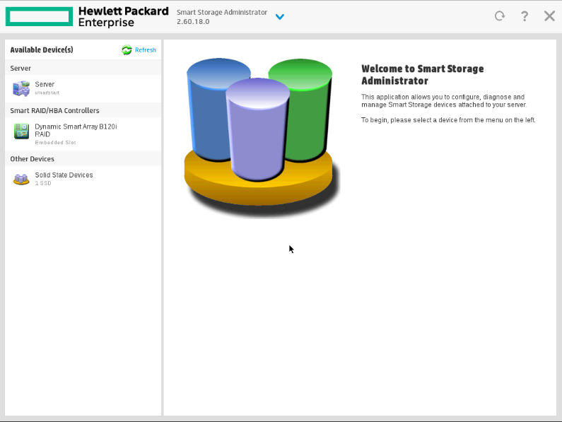

**Insight Diagnostics**
Test de l'iLO
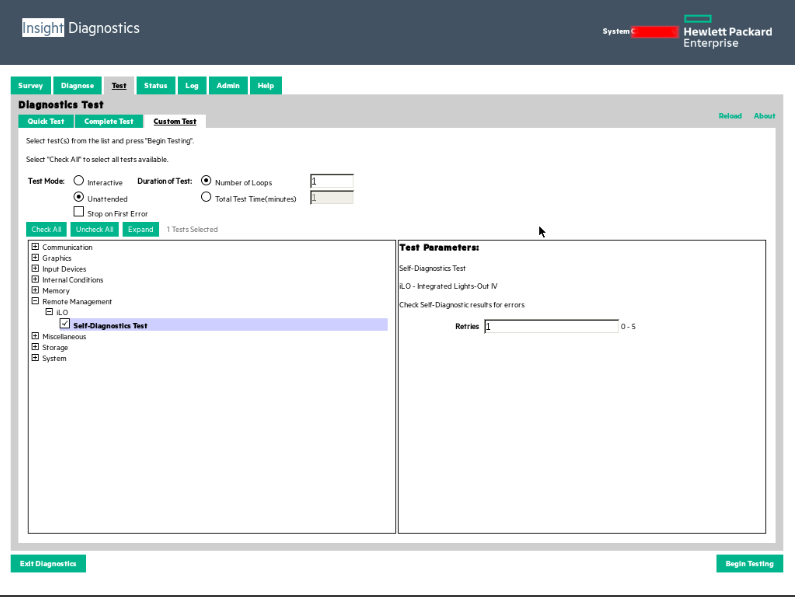

À vous de vérifier, régler, diagnostiquer et finissez par redémarrer.

Verifiez que votre iLO est en meilleur santé, si il est vert c'est en partie gangé, il faudra voir dans le temps.

## Intelligent Provisioning
Pour installer l'Intelligent Provisioning, il faut suivre la même procédure pour sélectionner l'image ISO dans le CD/DVD virtuel.

L'image est cette fois récupérable depuis les [serveurs HPE](https://support.hpe.com/connect/s/softwaredetails?language=en_US&softwareId=MTX_bf5521c396f2440bb0cb5efa87)

***ATTENTION :** Bien prendre la version 1.74 pour HP Gen 8, car il n'est pas compatible avec les versions 2 ou 3.*

Ensuite, lorsque CD est lancé, il faut sélectionner `Intelligent Provisioning Recovery Media`.
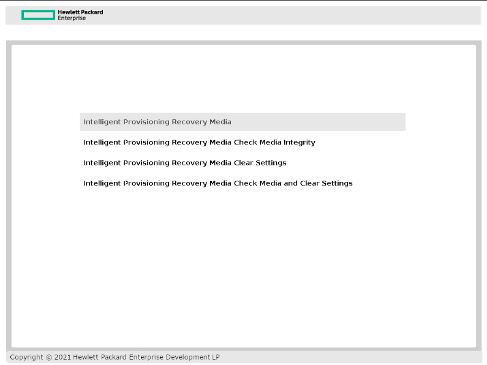
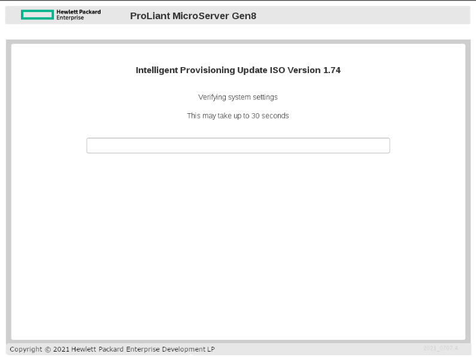
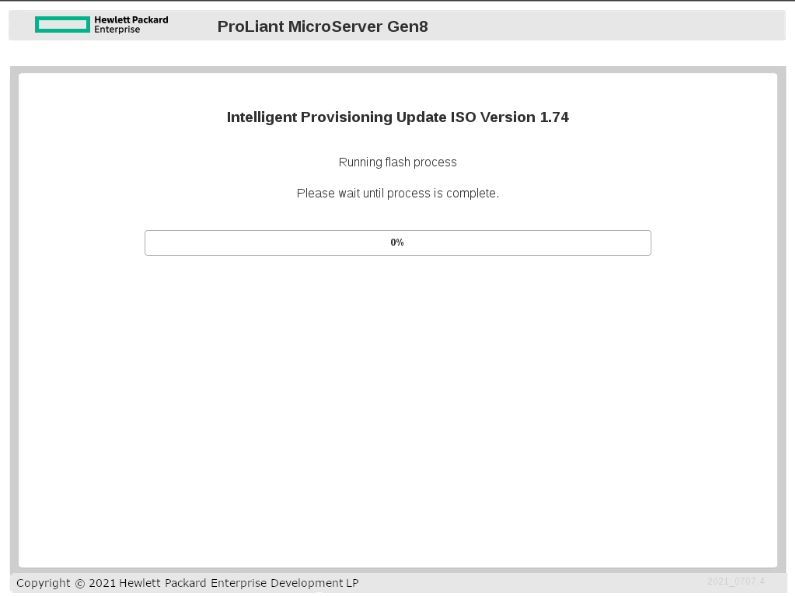

Redémarrez et vérifiez les informations sur les firmwares et logiciels depuis l'interface iLO dans `Information -> System Information` onglet `Firmware`.
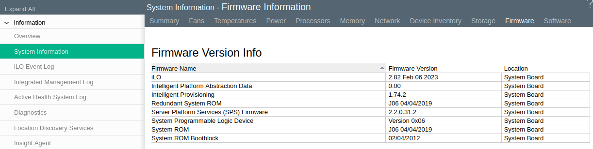

## Conclusion

J'espère que cet article vous aura permis de résoudre votre problème d'iLO et quelques astuces pour votre HP Gen 8.

Je ne suis pas un expert de ces machines que je découvre depuis assez peu de temps, mais je les trouve vraiment intéressantes.

Le prochain article concernant le HP Gen 8 sera surement sur comment upgrader votre serveur (réseau, RAM, processeur) mais ce ne sera pas tout de suite.

À très vite
