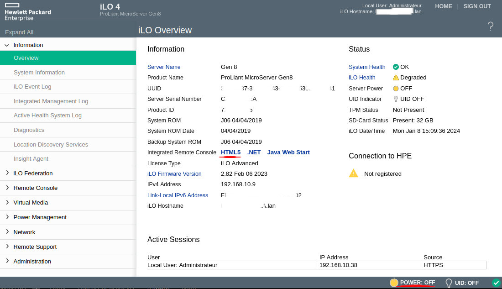

J'ai depuis quelques années, un NAS fait maison, qui au début était un PC sous Debian avec une configuration faite à la main, puis j'ai voulu réduire la place que prenait ce PC, j'ai donc acheté le boîtier [Fractal Design Node 804 (Amazon 135€)](https://amzn.to/48Lh5og) qui avait l'avantage d'avoir plusieurs emplacements pour disque dur. Le problème est que j'avais du matériel de PC de bureau à l'intérieur et la consommation était assez importante. J'ai donc décidé de revoir les données stockées puis j'ai pu descendre sur d'autres gammes de produits qui m'ont ensuite amené à découvrir le MicroServer HP Gen 8.

Ce Microserver HP est assez polyvalent. Il vous permet soit de faire un NAS avec la solution OpenMediaVault ou autre, soit de faire de la virtualisation avec Proxmox. Mais ce qui est génial avec ce MicroServer, c'est que vous n'avez plus besoin d'écran branché dessus, même pour installer un OS, grâce au système ILo de HP.

J'ai actuellement deux MicroServer HP Gen 8, un me servant uniquement de NAS (quand même sous Proxmox ;)), que je coupe lorsque je n'en ai pas besoin (La nuit, les jours Tempo Rouge ou pendant les vacances) et le deuxième en attente de la fibre pour augmenter ma part d'auto-hébergement.

La consommation, sans disque dur, est d'environ 28W pour la version processeur CPU G1610T (2c/2t) avec 12Go de RAM ou Xeon avec 16Go de RAM.

À l'origine, il était destiné aux petites entreprises, mais il est facilement trouvable sur les sites de petite annonce entre 150/200 euros sans disque.

Il dispose de :
* 4 baies pour disque dur 3.5" et un lecteur CD/DVD qu'il est possible (conseillé) de remplacer par un disque dur en 2.5" (SSD de préférence ;)).
* 2 ports Ethernet Gb et 1 Ilo,
* 4 Ports USB 2, 2 en façade, 2 à l'arrière,
* 2 Ports USB3 à l'arrière,
* 2 emplacements de DDR3,
* 1 Port PCIe 2.0 x16,
* 1 Port VGA.

Il peut donc être destiné à plusieurs utilisations, NAS, Virtualisation (Proxmox ou autres), Routeur, Pare-feu, etc.

## Ilo, Késako ?
ILo veut dire "Integrated Lights Out"

>La technologie Integrated Lights-Out (iLO) est un outil de gestion propriétaire intégré aux produits HPE qui permet de contrôler à distance l’accès aux serveurs ProLiant, même sans être connecté au réseau principal de l’organisation, d’où l’expression « Lights Out ».
>
>**Sources :** [HP](https://www.hpe.com/fr/fr/what-is/ilo.html)

Je pense que je n'ai pas besoin de rajouter plus d'explications ? Je vais quand même en ajouter un peu.

Ce qui est, à mon avis, très intéressant avec cette technologie, c'est que vous n'avez pas besoin de brancher d'écran sur ce serveur, car via l'interface ILo, vous avez accès à une fenêtre comme si vous aviez l'écran branché. Vous pouvez aussi allumer ou éteindre votre serveur (même faire un reset) via cette interface puisqu'elle reste accessible tout le temps, que votre serveur soit ou non en route.

### Se connecter à l'interface ILo
Pour profiter de cet accès, il vous suffit de brancher un câble Ethernet supplémentaire sur le port Ethernet nommé ILo à l'arrière (5 sur l'image).

Ensuite, récupérer l'adresse IP qui lui a été attribuée (via votre box internet ou routeur), il devrait apparaitre sous la forme `iloczXXXXXXXX`, puis rendez-vous sur celle-ci depuis un navigateur via `https`.
*Vous avez une alerte de sécurité, mais c'est normal, car les adresses IP ne peuvent pas recevoir de certificat SSL.*
Une fois arrivé sur l'interface de connexion, vous devez saisir vos identifiants présents sur un autocollant derrière le serveur ou alors sur une étiquette couleur sable attachée avec un bout de ficelle.
*Si vous n'arrivez pas à vous connecter, il faudra réinitialiser l'ILo*

Vous voila sur l'interface d'administration de votre MicroServer HP Hen 8.

**HTML5** vous permet d'ouvrir une fenêtre qui remplacera l'écran.
**POWER: OFF** vous permet de gérer l'alimentation de votre serveur, qu'il soit ou non allumé.

Pour le reste, je vous laisse fouiller dans les menus.

## Remplacer le lecteur par un disque dur
Pour remplacer le lecteur CD/DVD par un disque dur, rien de vraiment compliqué.

Il vous faut :
* Un disque dur 2.5" (non ! sérieux ;)) [Amazon (22€)](https://amzn.to/48rZ9iE),
* Une alimentation lecteur disquette vers Sata [Amazon (10€)](https://amzn.to/48EX6rP) [AliExpress (0.50€)](https://s.click.aliexpress.com/e/_DmuqxJR),
* Un câble Sata (droit de préférence).

*Il est possible d'imprimer un boitier pour y mettre le disque et sûrement de trouver un cache à mettre devant la fente du lecteur CD/DVD en façade, ou alors en acheter un sur [Amazon (10€)](https://amzn.to/4aK904R) ou [AliExpress (0.50€)](https://s.click.aliexpress.com/e/_DmSzJJX).*

### Déclarez-le dans HPE Smart Storage Administrator
Normalement, le MicroServer Gen 8, démarre uniquement depuis la carte MicroSD ou via l'un des quatre disques. Il serait dommage de se priver de ses quatre baies pour du stockage, alors nous allons déclarer notre disque dur dans HPE Smart Storage Administrator

Connectez-vous sur l'interface ILo4 de votre serveur HP Gen 8.

Une fois connecté, dans `Information` -> `Overview` cliquez sur `HTML5` (en face de `Integrated Remote Console`, *accessible aussi via le menu `Remote Console`*)

Une fenêtre de type Terminal s'ouvre (alors que votre machine n'est toujours pas allumée)

En bas à droite, vous avez une icône (jaune) avec marqué `POWER : OFF`, cliquez dessus puis sélectionnez `Momentary Press` pour faire démarrer votre machine à distance. Une demande de confirmation s'affiche, puis votre serveur se lance avec les informations qui s'affichent dans votre fenêtre comme si vous aviez un écran. Je trouve vraiment très pratique.

*Vous pouvez éteindre ou reset votre serveur depuis ce même bouton.*

Quand vous avez l'écran ci-dessous, appuyez sur la touche <kbd>F10</kbd> puis sur <kbd>ENTRER</kbd>.

Attendre le moment où il vous propose d'appuyer sur <kbd>F5</kbd> (HPE Smart Storage Administrator) puis faites-le.

*Si vous n'arrivez pas à accéder au HPE Smart Storage Administrator il est peut-être désactivé. Le seul moyen est de réinitialiser l`ILO avec la procédure vue plus bas.*

Voici quelques captures d'écran.

Une fois sur le `HPE Smart Storage Administrator`
- Cliquez sur `Dynamic Smart Array B120i RAID`,
- Cliquez sur `Configure`,
- Puis sur `Create Arrays with RAID 0`,
- Sélectionnez votre disque (ATTENTION à ne pas vous tromper, pour ma part, je débranche tous les disques inutiles pour être sur),
- Cliquez sur OK,
- À la question `Create Arrays with RAID 0` cliquez sur `Yes`,
- Puis sur `Finish`.

Vous devez être de nouveau sur l'écran principal dans `Dynamic Smart Array B120i RAID` :
- Cliquez sur `Set bootable Logical Drive/Volume`,
- Sur la ligne de votre disque, sélectionnez le rond en dessous de `Primary Boot Logical Drive/Volume`,
- Cliquez sur `Ok` puis `Finish`.

Ensuite, fermez `HPE Smart Storage Administrator` en cliquant sur la croix en haut à droite puis sur l'icône de redémarrage et `reboot`.

## Installation d'un OS
Cette procédure marche avec n'importe quel système d'exploitation (OS)(ici OpenMediaVault).

**Prérequis**
Avoir la dernière version de [OpenMediaVault](https://www.openmediavault.org/download.html) sur une [clé USB bootable comme Ventoy](/blog/ventoy_installation_update/) et la brancher sur votre serveur HP Gen 8.

Maintenant, vous pouvez retourner sur n'importe quel PC et lancer votre page de connexion ILo4.

Démarrez votre serveur, puis sur l'écran d'accueil (sur les HP Gen 8) 
* Appuyer sur <kbd>F11</kbd>,
* Sélectionner le numéro de votre clé (Attention le pavé numérique ne fonctionne pas, il faut utiliser la <kbd>MAJ</kbd>+<kbd>1,2,3,4,...</kbd>,
* Sélectionnez votre distribution (ici OpenMediaVault),
* Suivez les étapes **ATTENTION** de bien sélectionner le bon disque dur et de mettre un mot de passe `root` solide (*il sert pour la connexion SSH en root*).

Une fois l'installation terminée, débrancher la clé USB et redémarrer.

Ensuite, rendez-vous sur l'adresse IP de votre serveur (pas celle de l'ILO) et connectez-vous avec le couple login/mot de passe par défaut **admin/openmediavault**.

## Reinitialiser l'ILO
*(facultatif)*
**Arrive prochainement.**

## Conclusion
Vous avez, normalement, quelques bases pour vous amuser avec votre serveur.

Comme vous pouvez le voir, l'installation n'est pas compliquée et ces petits serveurs vous permettent de faire vraiment plein de choses comme un NAS pas cher et OpenSource mais aussi un serveur de virtualisation sur lequel vous pouvez installer tout un tas de service comme Adguard, Home Assistant, Nextcloud, etc. Nous en verrons au fil des articles.

Un NAS quatre baies avec les solutions propriétaires, c'est minimum 400 euros sans disque pour des performances bien moindres.

Alors pour ma part quand c'est moins cher, gratuit et Open source et que ce n'est pas moi le produit, je fonce... Faites de même. ;)

## Sources
* https://www.admfactory.com/hp-microserver-gen8-boot-from-ssd-install-on-odd-bay/
* https://www.abyssproject.net/2017/03/preparation-dun-hp-microserver-gen-8-servir-de-nas/
