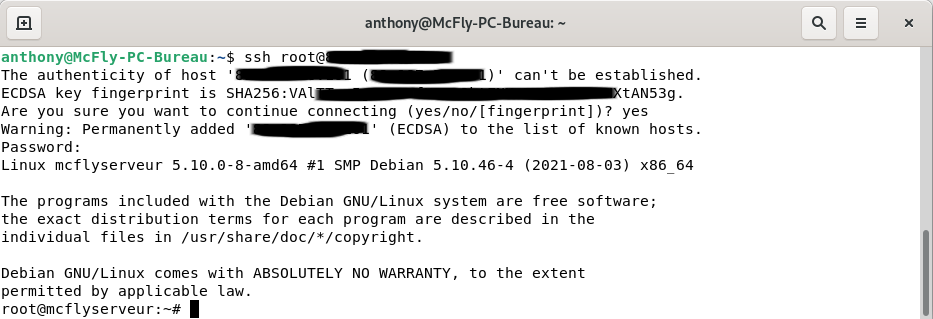
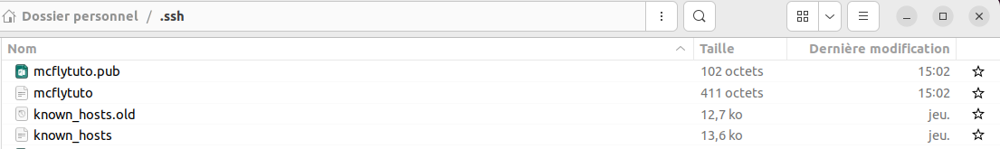

Dès que l'on commence à travailler avec des serveurs, il est important de penser sécurité et la connexion en SSH, qui devient obligatoire, n'y échappe pas.

Nous allons voir comment se connecter simplement en SSH avec un utilisateur et un mot de passe, puis nous allons y ajouter un peu de sécurité en générant une clé pour se connecter à nos serveurs.

*Nous ne sommes pas tous ingénieurs en sécurité informatique, mais il y a quand même des petites astuces que l'on peut faire pour améliorer la sécurité.*

**SSH Késako ?**

*Secure Shell (SSH) est à la fois un programme informatique et un protocole de communication sécurisé. Le protocole de connexion impose un échange de clés de chiffrement en début de connexion. Par la suite, tous les segments TCP sont authentifiés et chiffrés. Il devient donc impossible d'utiliser un sniffer pour voir ce que fait l'utilisateur. Le protocole SSH a été conçu avec l'objectif de remplacer les différents protocoles non chiffrés comme rlogin, telnet, rcp et rsh.*

***Sources :** Wikipédia*

## Connexion SSH depuis un Terminal

Une connexion SSH peut être lancée depuis un simple Terminal sous Linux, mais aussi depuis des applications comme VSCode avec un add-on ou Putty sous Windows et bien d'autres.

Pour se connecter en SSH, il suffit 'ouvrir un Terminal et de taper la commande suivante.
```bash
ssh votre_utilisateur@ip-de-votre-serveur
```
*Par défaut, cette commande se connectera au port 22 de votre serveur qui est le port par défaut du service SSH.*

Lors de la première connexion au serveur, il vous demandera de valider la clé ECDSA en tapant `yes`


*Si vous vous êtes déjà connecté sur ce serveur (avant une réinstallation par exemple), il vous demandera de supprimer l'ancienne clé via la commande suivante.*
`ssh-keygen -f "/home/votre_utilisateur/.ssh/known_hosts" -R "XXX.XXX.XXX.XXX"`


## Les clés SSH

### Les différents types de clé
Il existe plusieurs types de clés asymétriques, mais les plus connues sont RSA, ECDSA, ED25519 et DSA.
* [DSA](https://fr.wikipedia.org/wiki/Digital_Signature_Algorithm) est plus récent et se voulait être une alternative au RSA (qui à l'époque était breveté). Il serait plus rapide, mais n'est plus supporté depuis openssh v7.
* [RSA](https://fr.wikipedia.org/wiki/Chiffrement_RSA) est le premier type de clé à être sorti et connait plusieurs versions.
* [ECDSA](https://fr.wikipedia.org/wiki/Elliptic_curve_digital_signature_algorithm) : Longueurs de clés plus courtes et des opérations de signature et de chiffrement plus rapides, mais semble bénéficier d'une Backdoor US. **conseillé par l'ANSSI**
* [ED25519](https://fr.wikipedia.org/wiki/EdDSA) : Semble être le nouveau format dans le monde de la cybersécurité, avec des longueurs de clés  de 256 bits et des opérations de signature et de chiffrement plus rapides.

Pour ma part, j'utilise le ED25519, sauf quand ce n'est pas possible.

### Principe simple d'une connexion par clé
* Vous générez une clé publique et une privée.
* Vous mettez la clé publique sur tous les serveurs que vous souhaitez contrôler 
* Vous gardez la clé privée bien au chaud sur le ou les systèmes que vous utilisez pour vous connecter.

Lorsque vous vous connectez, les deux clés communiquent, elles vous demandent de saisir la passphrase, si vous en avez choisi une lors de la génération des clés (cela augmente la sécurité), et vous autorisent la connexion.

**Quel est l'intérêt de se connecter avec des clés s'il faut rentrer un mot de passe ?**
**La sécurité**. Si vous vous faites dérober votre clé privée, une personne malveillante aura accès à toutes vos machines reliées à cette clé. (il faut connaître les NDD ou les adresses IP). Avec la passphrase il y a une double sécurité tout en ayant un seul mot de passe à retenir pour toutes vos connexions.

### Générer une paire de clés
Pour créer une paire de clés, sur votre ordinateur (Linux dans ce cas), il faut :
* Ouvrir un terminal,
* Lancer la commande `ssh-keygen -t ed25519`,
*Par défaut, vos clés sont dans `~/.ssh/votre_cle` pour la clé privée et `~/.ssh/votre_cle.pub` pour la clé publique.*
*Vous pouvez générer autant de clé que vous voulez avec la même passphrase par exemple.*


Après avoir affiché les dossiers cachés, regardez dans le dossier `.ssh`.


### Envoyer la clé publique sur le serveur
**Depuis votre ordinateur**, lancer la commande suivante.
`ssh-copy-id -i ~/.ssh/votre_cle.pub -p num_port votre_utilisateur@ndd_ou_ip_du_serveur_devant_recevoir_la_cle_publique`


*Si vous essayez d'envoyer la clé via un utilisateur qui ne peut pas se connecter en SSH (ne fait pas partie du groupe), il faut passer par un compte autorisé puis :
* Se connecter à son utilisateur (`su votre_utilisateur`), 
* Aller dans son dossier (`cd ~/`),
* Créer un dossier `.ssh` (`mkdir .ssh`),
* Ajouter le fichier `authorized_keys` (`nano authorized_keys`),
* Copier le contenu de la clé **publique** `votre_clé.pub` manuellement.

## Sécuriser, configurer le fichier SSH
Il est possible de sécuriser un peu plus votre serveur par quelques réglages supplémentaires.
Sur votre serveur distant (via SSH), la configuration du SSH se fait principalement par le fichier `/etc/ssh/sshd_config`

Après chaque modification, il faudra sauvegarder et relancer le service SSH via les commandes suivantes :
* <span><kbd>CTRL</kbd>+<kbd>X</kbd></span> pour sauvegarder
* `sudo service sshd restart` pour relancer le SSH et valider les nouveaux paramètres.

*Attention, avant de rendre une valeur inaccessible ou interdite, il faut vérifier que vous arrivez à garder la main sur votre serveur.*

### Activer la connexion par clé publique 
*(si ce n'est pas déjà fait)*

*Pour vérifier que vous avez la main, il suffit de vous connecter en SSH et s'il ne vous demande pas le mot de passe de l'utilisateur, c'est qu'il s'est connecté en SSH, sinon vous pouvez aussi utiliser la commande suivante pour forcer la connexion via la clé SSH `ssh -ri ~/.ssh/nom_de_votre_cle votre_utilisateur@ip_de_votre_serveur`*

```bash
 nano /etc/ssh/sshd_config
```

Recherchez la ligne suivante, la valeur devrait être par défaut `yes`, sinon modifiez là.
```
PubkeyAuthentication yes
```

### Autoriser votre clé

Dans le fichier `sshd_config`, vérifiez que cette ligne apparaisse en non commenté. (adapter en fonction du type de clé choisi)

```bash
HostKey /etc/ssh/ssh_host_ed25519_key
HostKey /etc/ssh/ssh_host_rsa_key 
```
*Une seule ligne suffit, si vous n'avez qu'une clé.*

### Désactiver la connexion par mot de passe
Pour désactiver la connexion par mot de passe, c'est la ligne suivante.

```bash
PasswordAuthentication no
```
### Changer le port par défaut.
Le port 22 est le port par défaut sur toutes les machines lors de leurs installations, il est donc, naturellement, la source d'attaque des robots.

*Ne choisissez pas un [port déjà connu,](https://fr.wikipedia.org/wiki/Liste_de_ports_logiciels) utilisez un port compris entre 49152-65535.*

```bash
Port 52145 #par exemple
```

### Désactiver l'accès SSH du compte `root`
Dans les bonnes pratiques, il y a l'utilisation minimum du compte `root` et son accès direct en SSH en fait partie.

```bash
PermitRootLogin No
```

Une fois les paramètres changés, n'oubliez pas de sauvegarder et relancer le service `ssh`.
* <span><kbd>CTRL</kbd>+<kbd>X</kbd></span> pour sauvegarder
* `sudo service sshd restart` pour relancer le SSH et valider les nouveaux paramètres.

## Quelques commandes supplementaires.
**Spécifier un port**
```bash
ssh -p num_port user@ndd_ou_ip_du_serveur
```
**Spécifier une clé**
```bash
ssh -ri ~/.ssh/nom_de_votre_cle votre_utilisateur@ip_de_votre_serveur
```
**Forcer la connexion SSH par mot de passe**
```bash
ssh -o "PreferredAuthentications=password" votre_utilisateur@ip_de_votre_serveur
```


## Connexion SSH avec Visual Studio Code ou Codium
*Codium est une version, Opensource et débarrassée des mouchards Microsoft, de Visual Studio Code.*

Quand on commence à bidouiller, c'est un super outil.

Il existe plusieurs extensions pour se connecter en SSH depuis VSC (Visual Studio Code) ou Codium ce qui simplifie les copier-coller de code, car l'édition peut se faire directement depuis Codium.

L'extension que j'utilise est [SSH Client](https://marketplace.visualstudio.com/items?itemName=cweijan.vscode-ssh) parce qu'elle fonctionne aussi sur une version serveur de Codium.

Il suffit de la rechercher depuis le market, de l'installer puis d'ajouter vos serveurs avec mot de passe ou clé.

## Conclusion
Je ne suis pas un expert en sécurité informatique, ce guide est élaboré à base de plusieurs informations glanées sur le net.

Je suis preneur de toutes autres modifications pouvant apporter plus de sécurité.

À vous les joies de la bidouille sur serveur.

*Personnellement, j'utilise plus souvent Visual Studio Code dans sa version Codium, plutôt que le Terminal, mais c'est bien de connaître les deux.*

## Sources
* [Extension SSH Client](https://github.com/vscode-ext-studio/vscode-ssh)
* [Doc Ubuntu sur le SSH](https://doc.ubuntu-fr.org/ssh)
* [Cours complet sur SSH](https://www.it-connect.fr/cours/comprendre-et-maitriser-ssh/)