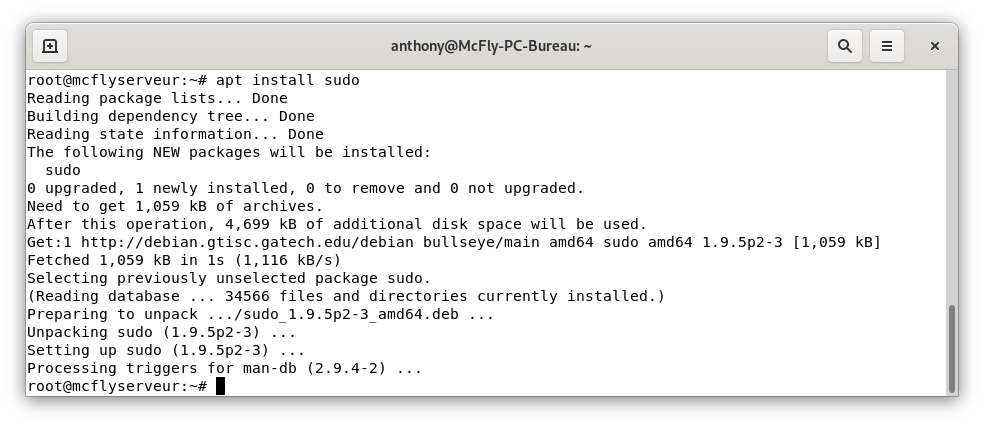
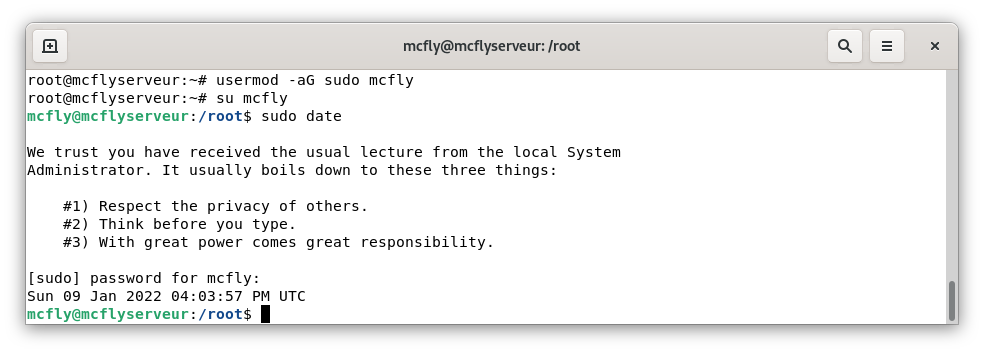

Comme vous avez dû le remarquer depuis la version 10 de Debian nommée Buster, une commande avec `sudo` renvoie que `sudo` est introuvable. Et oui, depuis cette version, Debian n'installe plus `sudo` par défaut. 

## Sudo, kézako

>sudo (abréviation de "substitute user do", "super user do"3 ou "switch user do"4, en français : « se substituer à l'utilisateur pour faire », « faire en tant que super-utilisateur  » ou « changer d'utilisateur pour faire ») est une commande informatique utilisée principalement dans les systèmes d'exploitation de type Unix.
>
>Cette commande permet à un administrateur système d'accorder à certains utilisateurs (ou groupes d'utilisateurs) la possibilité de lancer une commande en tant qu'administrateur, ou en tant qu'autre utilisateur, tout en conservant une trace des commandes saisies et des arguments.
>
>**Source :** [Wikipedia](https://fr.wikipedia.org/wiki/Sudo)

Le paquet `sudo` a été supprimé, car il était au final superficiel et ajouté la possibilité de contenir des failles (plus, vous avez d'intermédiaire, plus, vous avez des risques).

Il est tout à fait possible de ne pas installer `sudo` et donc de passer directement par l'utilisateur `root` quand vous en avez besoin avec la commande suivante `su -` puis en rentrant le mot de passe du super utilisateur.

Pour ceux qui préfèrent, utiliser `sudo` voici comment le remettre.

## Installation
Dans un Terminal, [connectez-vous-en SSH](/blog/linux_connexion_ssh)

Passer en `root` (si vous êtes connecté via un utilisateur) puis procéder à l'installation avec les commandes suivantes :

```bash
su - #Permet de passer en utilisateur root
apt install sudo -y # Install le paquet sudo sans vopus poser de question
```


## Ajout d'un utilisateur au groupe `sudo`.
Maintenant, nous allons ajouter votre utilisateur au groupe `sudo` avec la commande suivante.

```bash
usermod -aG sudo votre_user
```

### Tester

Il ne reste qu'à tester.
Reconnectez-vous avec votre utilisateur puis afficher la date avec les commandes suivantes.

```bash
su votre_user
sudo date
```



## Conclusion

Vous voilà avec la possibilité de lancer des commandes en administrateur sans pour cela changer d'user en permanence.

Cet article est plus un mémo qui me permet de ne pas devoir rechercher en cas de doute.

## Sources
* [HowToWared](https://howto.wared.fr/debian-sudo/)
* [Debian.org](https://wiki.debian.org/fr/sudo)
