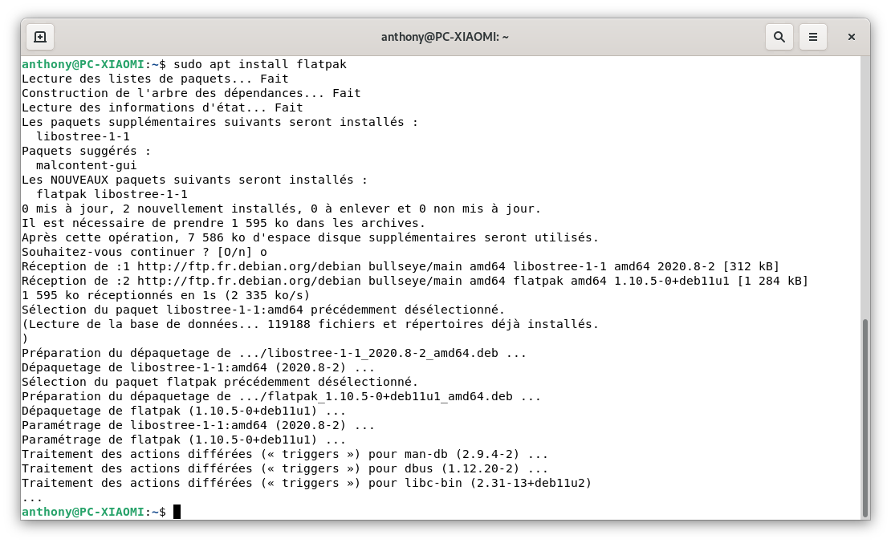
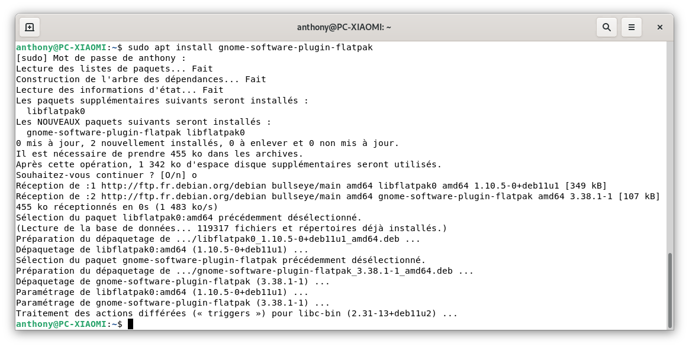
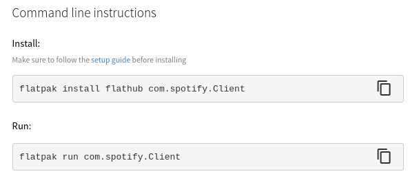

Sur un système Linux, il y a plusieurs méthodes pour installer un logiciel.
Soit, vous passez par :
- Le magasin d'applications (logithèque) pré-installé (ex. Ubuntu Software sous Ubuntu),
- Un magasin alternatif comme Flatpak (Cet article),
- Une AppImage (C'est une version portable d'un logiciel),
- Un `.deb` ([tutoriel ici](/blog/linux_installer_deb)),
- Via un Terminal en ligne de commande (CLI)

Aujourd'hui, c'est au tour de [FlatPak](https://flatpak.org), qui permet d'installer des applications de manière conteneurisée, comprendre isolées de votre système.

Il y a un magasin d'application bien connu [FlatHub](https://flathub.org/fr) pour faire vos courses.

**Flatpak qu'est-ce que c'est ?**

Je ne vais pas réinventer la roue, voici la première ligne de la page Wikipédia.
>Flatpak (anciennement xdg-app) est un système de virtualisation d’applications pour les distributions GNU/Linux de bureau.
>
>Le système de paquets Flatpak fut développé à l'origine pour faciliter le déploiement sécurisé d'applications sur différentes distributions.
>
>[Wikipédia](https://fr.wikipedia.org/wiki/Flatpak)

Pour imager et si vous avez lu d'autres articles de mon blog, c'est un peu comme si vous installiez vos applications avec Docker.
Cela permet aussi de faciliter le travail des développeurs, car flatpak est compatible avec la quasi-totalité des distributions.

Les applications sont plus lourdes (en poids d'installation) mais cela vous permet de bénéficier des dernières versions, contrairement à celles disponibles sur les logithèques des systèmes d'exploitations (surtout Debian).

Vous allez me dire, qu'**il n'est pas toujours nécessaire d'avoir la dernière version d'une application**, sauf si celle-ci est liée  à la sécurité (dans ce cas, elle est, dans la plupart du temps, mise à jour sur les logithèques des OS)

**Vous avez tout à fait raison** et c'est donc à vous de voir, même si dans l'ensemble, il n'y a aucun inconvénient à installer la version à jour, que ce soit via Flatpak ou en CLI.

Passons à l'installation...

## Installer FlatPak

Il faut avoir installé [sudo](/blog/debian_ajouter_sudo/).

Ensuite pour installer Flatpak, il suffit simplement de lancer les commandes suivantes dans un Terminal.

```bash
sudo add-apt-repository ppa:flatpak/stable ## Ajoute le dépôt officiel à votre liste de dépôts
sudo apt update ## Mise à jour de votre liste d'application (en intégrant le nouveau dépôt)
sudo apt install flatpak ## Installationde Flatpak
```


Flatpak est installé, vous pouvez dès à présent installer des applications FlatPak via les lignes de commande.

*Pas très pratique la ligne de commande, non ? Passons à la suite.*

### Ajouter le plugin Software Flatpak pour Gnome.

Cela permet de gérer (rechercher, installer, supprimer) ses applications Flatpak depuis le gestionnaire d'applications de Gnome.

Allez une petite ligne dans le Terminal :

```bash
sudo apt install gnome-software-plugin-flatpak
```

Ajouter le dépot FlatHub
```bash
sudo flatpak remote-add --if-not-exists flathub https://flathub.org/repo/flathub.flatpakrepo
```



Redemarrer votre système et c'est fini.

Rendez-vous dans le gestionnaire d'application de Gnome, vous devriez pouvoir choisir entre une installation Snap ou FlatHub sur certaines applications.

## Installation d'une application.

Parfois, vous pouvez avoir accès directement aux applications Flathub depuis votre logithèque, sinon il vous suffit : 
* D'aller sur [FlatHub](https://flathub.org/home), 
* Rechercher votre logiciel,
* Cliquer sur `install`.

Si vous préférez la ligne de commande, en bas de la page de l'application recherche, il y a la commande d'installation et celle pour lancer l'application.

```bash
## Pour installer
flatpak install flathub votre_application

## Pour l'executer
flatpak run votre_application

## Pour supprimer
flatpak uninstall --user votre_application ## Le -user permet de supprimer le dossier de l'appli dans le dossier de l'utilisateur.
```


## Conclusion.
Il y a beaucoup d'échange sur internet à propos de l'installation d'applications via Flatpak.
Je pense, personnellement, que c'est un chemin  intéressant pour une personne débutant sous Linux ou ne voulant pas taper de la ligne de commandes pour installer ou tester un logiciel.

Libre à chacun de se faire sa propre opinion.


## Conclusion
Flatpak permet de bénéficier des dernières mises à jour des applications avant qu'elles ne soient sur les dépôts officiels de votre distribution. Elle a aussi l'avantage de lancer les applications dans un "conteneur" ce qui veut dire que l'application est globalement isolée de votre système. 
Même si l'isolation est un avantage, elle peut aussi être un inconvénient pour certaines applications, il faut le garder en mémoire.

## Sources
* [Site Officiel (EN)](https://www.flatpak.org/)
* [Installation Ubuntu Offiielle (EN)](https://flatpak.org/setup/Ubuntu)