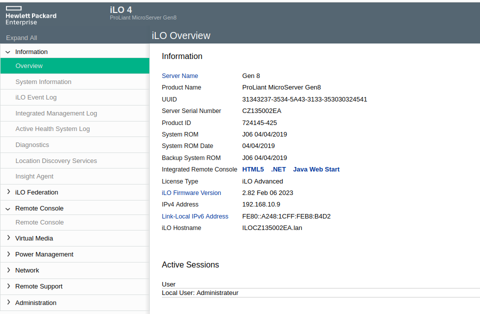
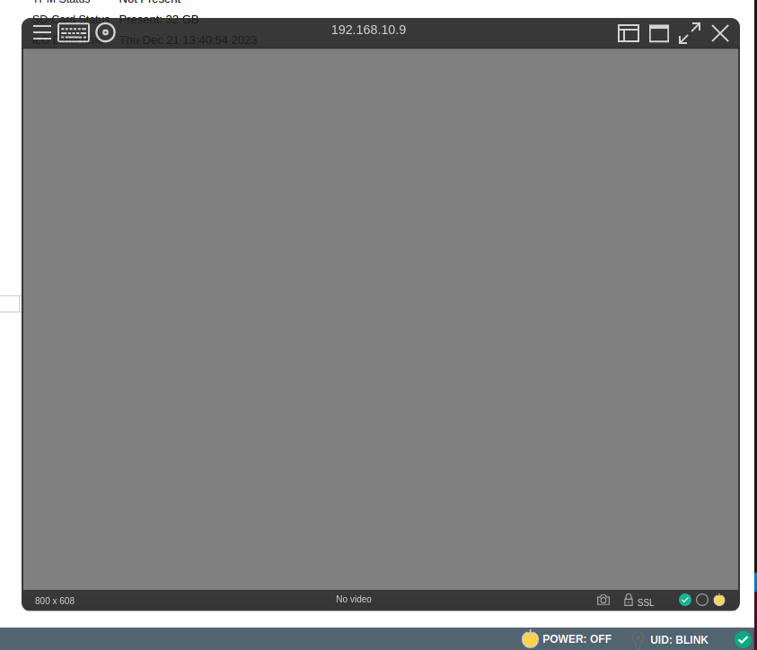
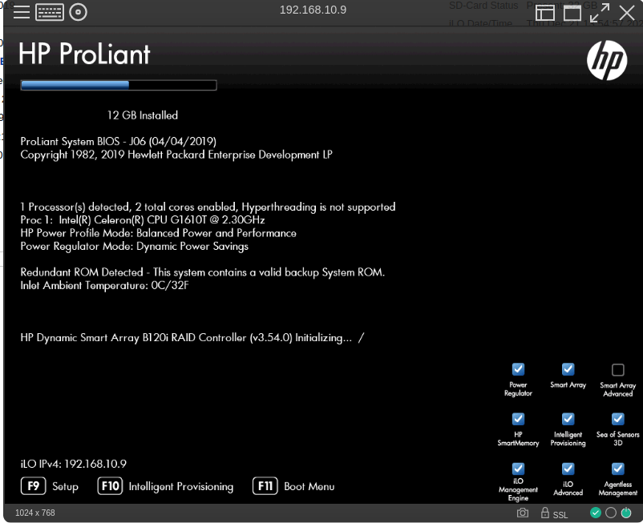

J'ai depuis quelques années, un NAS fait maison, qui au début était un PC sous Debian bourré de disque dur et fit a la main, puis j'ai voulu reduire la place que prenait ce PC, j'ai donc acheté un Boitier 

Ce qui est genial avec ce MicroServer, c'est que vous n'aurez jamais besoin de brancher un ecran dessus, même pour installer un OS, grace au systeme ILo4 de HP.

J'ai actuellement deux MicroServer HP Gen 8, un me servant uniquement de NAS, que je coupe lorsque j'en ai pas besoin (La nuit, lesjours tempo Rouge ou pendant les vacances)

La consomation sans disque dur est de XXXX pour ka version processeur GTXXX et 12Go de RAM et XX pour la version Xeon et 16 Go de RAM.

Ce qui en fait un bon outil pour faire de l'autohebergement, ou heberger tous types de services.

A l'origine il est destiné au petite entreprise, mais il est facilement trouvabe sur les sites de petite annonce entre 150/200 euros sans disque.

Il dispose de 4 baie pour disque dur 3.5" et un lecteur CD/DVD qu'iol est possible (conseillé) de remplacer par un disque dur en 2.5".

Trois port eEthernet 1Ilo et 2 ports Gb

AJOUTER LES CARACTERISQTIQUES

Il peut donc etre destiné a plusieurs utilisations, NAS, Proxmox, Routeur, etc ou cumuler le tout.

*Pour ceux qui veulent simplment installer OpenMediaVault vous pouvez passer directement a installation.*

## Remplacer le lecteur par un disque dur
Pour remplacer le lecteur CD/DVD par un disque dur rien de vraiment compliqué.

Il vous faut :
* Un disque dur 2.5" (non! sérieurx ;)),
* Une alimentation lesteur disquette vers Sata,
* Un cable Sata.

*Il est possible d'imprimer un boitier pour y mettre le disque et surement u trouver un cache a mettre devant la fente du lecteur CD/DVD en facade.*

### Déclarer le dans HPE Smart Storage Administrator
Normalement le MicroServer Gen 8, supporte le boot uniquement depuis la carte MicroSD ou via les un des quatre disque. Il serait ommage de se priver de ses 4 baies alors nousllons déclarer notre disque dur dans le HPE Smart Storage Administrator du Micro Server.

Connectez vous sur l'interface Ilo4 de votre MicroServer.

Une fois connectez, dans `Information` -> `Overview` cliquez sur `HTML5` (en face de Integrated Remote Console, accessible aussi via le menu `Remote Console`)

Une fenetre type Terminal s'ouvre (alors que votre machine n'est toujours pas allumée)

En bas a droite vous avez un icone (jaune) avec marqué `POWER : OFF`, cliquez dessus puis selectionner `Momentary Press` pour faire demarrer votre machine a distance. Une fenetre de confirmation s'affiche, puis votre serveur demarre avec les informations qui s'affiche d  ans votre fenetre comme si vous aviez un écran. Je trouve vraiment tres pratiqu

*Vous pouvez eteindre ou reset votre serveur depuis ce meme bouton*

Qaund vous avez cette ecran appuyer sur la touche <kbd>F10</kbd> puis sur <kbd>ENTRER</kbd>.

Attendre le moment ou il vous propose d'appuyer sur <kbd>F5</kbd> (HPE Smart Storage Administrator) puis faites le.

*Si vous n'arrivez pas a acceder au HPE Smart Storage Administrator il est peut etre desactivé, le seul moyen est de reset l`ILO*

Voici quelques captures d'écran.

Une fois sur le `HPE Smart Storage Administrator`
- Cliquez sur `Dynamic Smart Array B120i RAID`,
- CLiquez sur `Configure`,
- Puis sur `Create Arrays with RAID 0`,
- Selectionnez votre disque (ATTENTION a ne pas vous trompez, pour ma part je debranche tous les autres pour être sur),
- Cliquez sur OK
- A lma question `Create Arrays with RAID 0` cliquez sur `Yes`
- Puis sur `Finish`

Vous devez etre de nouveau sur l'ecran principal dans `Dynamic Smart Array B120i RAID` :
- Cliquez sur `Set bootable Logical Drive/Volume`,
- Sur la ligne de votre disque, Selectionnez le rond en dessous de `Primary Boot Logical Drive/Volume`,
- Cliquez sur `Ok` puis `Finish`.

Ensuite fermez `HPE Smart Storage Administrator` en cliquant sur la crois en haut a droite puis sur l'icin de redemarrage et `reboot`.

## Installation d'un OS
*Dans cet article, je vais installer la solution OpenMediaVault en tant que systeme d'exploitation, mais le principe reste le meme pour n'importe quel systeme d'exploitation (OS) comme Proxmox, par exemple.*

**Prérequis**
Avoir la derniere versionde [OpenMediaVault](https://www.openmediavault.org/download.html) sur une [clé USB bootable comme Ventoy](/blog/ventoy_installation_update/) et la bracher su votre MicroServeur.

Maintenant pour les detenteur d'un HP MicroServer Gen 8, vous pouvez retourner sur n'imprte quel PC et lancer votre page de connection ILo4.

Démarrez votre serveur, puis sur l'écran d'accueil (sur les HP Gen 8) 
* Appuyer sur <kbd>F11</kbd>,
* Sélectionner le numero de votre clé (Attention le pavé numerique n'a pas l'air de fonnctionner),
* Selectionner votre distribution (ici OpenMediaVault),
* Suivez les etapes **ATTENTION** de selectionner le bon Disque dur et de mettre un mot de passe `root` solide.

Une fois l'installation terminé, débrancher la clé USB et redemarrer.

Ensuite, rendez-vous sur l'adresse IP de votre serveur (pas celle de l'ILO) et connectez vous aves le couple login/mot depasse par defaut `admin/openmediavault`

## Conclusion
Je vais m'arreter là pour cet article, mais un article sur les premieres choses a faire sur OMV est en cours de redaction.

Comme vous pouvez le voir l'installation et pas compliqué et ces petits serveurs vous permettent de faire vraiment plein de choses comme un NAS pas cher et OpenSource mais aussi un serveur de virtualisation sur lequel vous pouvez installer tout un tas de service comme Adguard, Home Assistant, Nextcloud, etc etc. Nous en verrons au fil des articles.

L'interface de OpenMediaVault est accessible au débutant et surtout un NAS quatres baies avec les solutions propriétaires c'est minimum 400 euros sans disque pour des performances bien moindres.

Alors pour ma part quand c'esdt moins cher, gratuit et Open source et que c'est pas moi le produits, j'adopte...

## Sources
https://www.abyssproject.net/2017/03/preparation-dun-hp-microserver-gen-8-servir-de-nas/