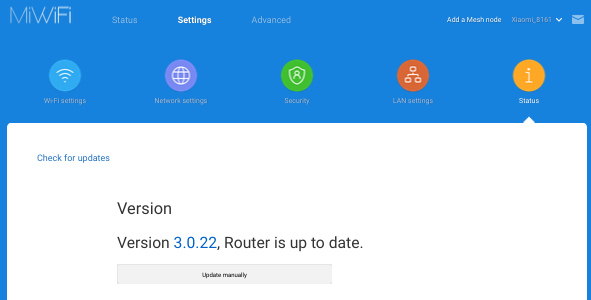
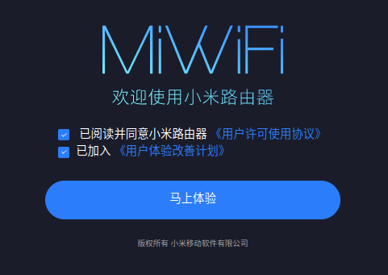
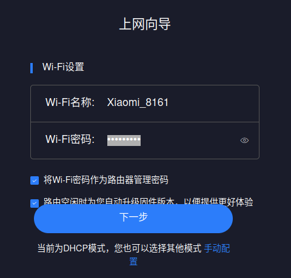
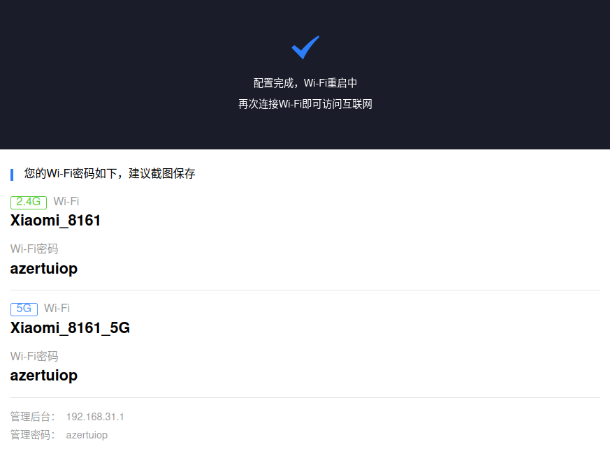
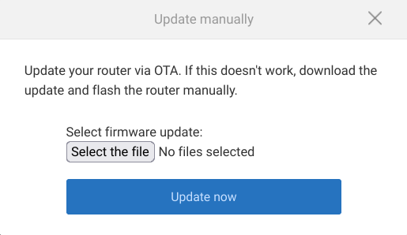
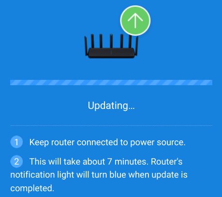
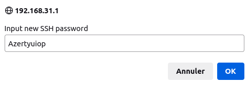
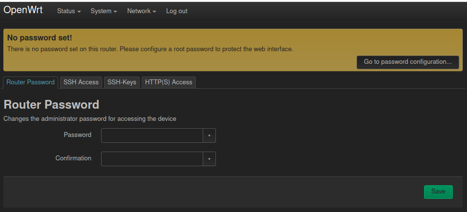
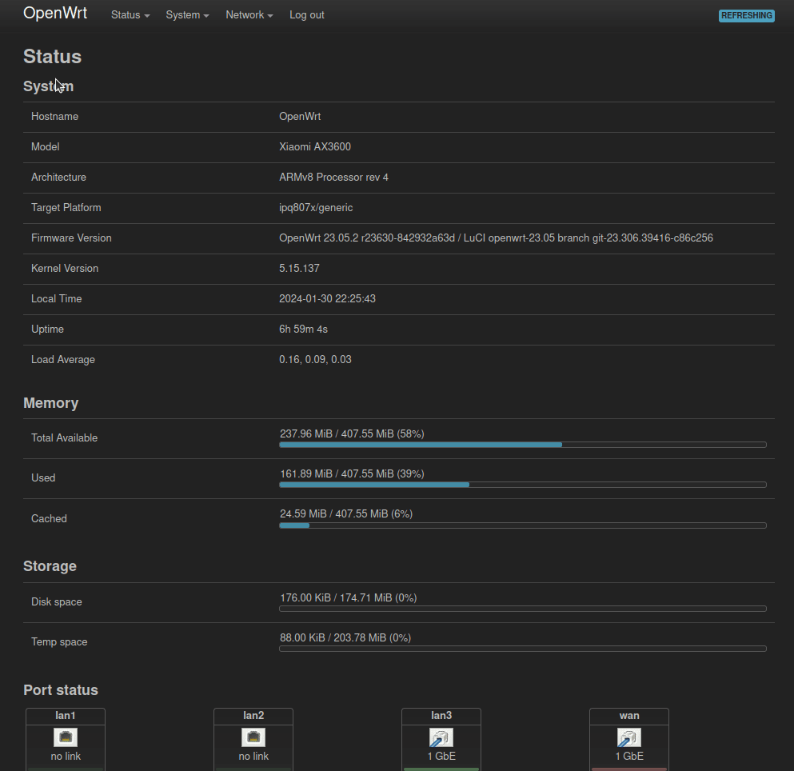

**Tuto réalisé avec :**
* Mi AIoT Router AX3600 [Amazon](https://amzn.to/42ieCzo) 
* (facultatif) : L'application Mi Wi-Fi v4.3.2 (40602) sur [Aurora Store](https://f-droid.org/packages/com.aurora.store/) ou Play Store.
* [OpenWRT 23.05.2](https://openwrt.org/)

---

Aujourd'hui, je vais vous parler d'OpenWRT, qui est un système open-source prévu pour remplacer l'OS par défaut de certains routeurs grand public, et je vais l'installer sur le remplaçant de mon Xiaomi Mi Router 3G qui est, lui aussi, sous OpenWRT et qui va terminer en répétiteur Wi-Fi.

**OpenWRT**
OpenWrt est une distribution GNU/Linux hautement extensible. Contrairement à beaucoup d'autres distributions pour ces routeurs, OpenWrt est conçu dès le départ pour être un système d'exploitation complet et facilement modifiable pour votre routeur. En pratique, cela signifie que vous pouvez disposer de toutes les fonctionnalités dont vous avez besoin, sans rien de superflu, grâce à un noyau Linux plus récent que la plupart des autres distributions. 

**Mi AIoT Router AX3600**
Le routeur Xiaomi AX3600 est un routeur WiFi tri-bande 802.11ax OFDMA et MU-MIMO, qui dispose des interfaces WiFi 2.4GHz (QCN5024 2×2/40MHz ax), 5GHz (QCN5054 4×4/80 ou 2×2/160MHz ax) et une AIoT (QCA9889 1×1 ac/n)

Il est équipé :
* D'un SoC Qualcomm IPQ8071A à 4 cœurs (jusqu'à 1,4 GHz),
* De 3 ports LAN 1Gb et d'un port WAN 1Gb,
* De 7 antennes externes non détachables.

Il existe en deux variantes. Une avec le micrologiciel OEM chinois, une autre avec l'OEM international.

Les deux peuvent fonctionner avec n'importe quels micrologiciels, Chinois ou International et **les deux supportent OpenWrt**

Les grandes étapes de ce tutoriel sont :
* Première mise en route du routeur et vérification de sa version de firmware,
* Downgrade (revenir à une version antérieure) de la version du firmware par la version officielle autorisant l'exploit,
* Création de l'accès SSH,
* Pré-installation d'OpenWRT,
* Installation permanente d'OpenWRT,
* Premier lancement d'OpenWRT

## Lancement du routeur en version originale
### Premier lancement du routeur
Si vous venez de vous procurer ce routeur neuf ou d'occasion, il va falloir faire le premier lancement pour vérifier sa version de firmware et le downgrader, si nécessaire.

Pour le configurer, vous avez deux méthodes :
* Via l'application Mi Wi-Fi (permet de garder internet sur votre PC) 
* Via un câble Ethernet branché entre votre PC et un port LAN du routeur.

***Note :** Quand j'ai acheté le mien, il n'était pas réinitialisé, il fallait un mot de passe. J'ai dû le réinitialiser en restant appuyé 10 secondes sur le bouton `reset` situé derrière.*

#### Avec l'application Mi Wi-Fi

1. Téléchargez et installez l'application Mi Wifi (Xiaomi Inc),

1. Branchez votre routeur électriquement, mais aussi en Ethernet, via le port WAN, sur votre box opérateur. (1er à gauche, mais c'est indiqué en dessous du port),
1. Connectez-vous au Wi-Fi du routeur "Xiaomi_XXXX_XXXX", il n'y a pas de mot de passe (s'il vous en demande, réinitialisez le routeur),
1. Lancez l'application puis choisissez `Définir un nouveau routeur`. Il devrait se connecter à internet. Cliquez sur suivant,

1. Il vous demande de sélectionner la région (France), le nom du réseau que vous souhaitez mettre et un mot de passe qui sera aussi le mot de passe admin en laissant la case en dessous cochée. *Faites simple, car ça va changer*,

1. Il va ensuite examiner s'il y a des radars autour de vous (législation française) puis il activera la connexion Wi-Fi,

Une fois terminé, connectez-vous au Wi-Fi puis à l'interface du routeur `http://192.168.31.1` ou `miwifi.com`,
1. Saisir votre mot de passe admin (configuré plus haut),
1. Une fois sur l'interface, allez dans `Settings -> Status` et vérifiez la version actuellement installée. (ici 3.0.22).


#### En Ethernet

1. Branchez votre routeur électriquement, mais aussi en Ethernet, via le port WAN, sur votre box opérateur. (1er à gauche, mais c'est indiqué en dessous du port),
1. Branchez un câble Ethernet entre votre PC et un port LAN du routeur,
1. Connectez-vous sur l'interface du routeur `http://192.168.31.1` ou `miwifi.com` depuis votre navigateur,

1. Saisir un mot de passe pour votre Wi-Fi et la connexion admin,

Un rappel des éléments vous est affiché.

Reconnectez-vous à l'interface puis
1. Allez dans `Settings -> Status` et vérifiez la version actuellement installée. (ici 3.0.22)


### Revenir à la version 1.0.17
Pour pouvoir accéder à l'exploit permettant l'accès SSH, il faut retourner sur la version 1.0.17.
1. Récupérez le firmware 1.0.17 [ici](http://cdn.cnbj1.fds.api.mi-img.com/xiaoqiang/rom/r3600/miwifi_r3600_firmware_5da25_1.0.17.bin)(*Firefox m'a affiché une alerte sur ce fichier parce que c'est un `.bin`. Fennec ne m'a annoncé aucune alerte*)
1. Dans `Settings -> Status` cliquez sur `Update manually`,
1. Cliquez sur `Select file` et sélectionnez le fichier `miwifi_r3600_firmware_5da25_1.0.17.bin`,

1. Cliquer sur `Update now`,
Une fenêtre s'affiche, vous prévenant que vous allez installer une ancienne version et que vous devez nettoyer toutes les configurations personnalisées avant de continuer.

1. Cocher la case `clear all custom configuration` puis cliquer sur `OK`,
Le flash vers la version 1.0.17 est en cours.
    

Une fois le retour de la LED bleue sur le routeur, l'update est fini. Votre routeur est réinitialisé.

### Obtenir l'accès SSH
Il existe quatre méthodes différentes pour rooter ce modèle. Vous pouvez choisir celle qui vous convient le mieux, mais dans ce tutoriel, nous utiliserons la méthode JavaScript qui est la plus simple et la plus sûre.

Vu que votre routeur a été réinitialisé lors du downgrade, il va falloir suivre de nouveau les étapes pour la mise en route, que ce soit via l'application ou via l'Ethernet.

Ensuite, connectez-vous à l'interface.
Une fois connectés, nous allons injecter un code JavaScript depuis le navigateur.
1. Appuyez sur <kbd>F12</kbd> pour ouvrir la console d'inspection, puis cliquez sur l'onglet `Console`
1. Collez le code suivant et cliquez sur <kbd>entrée</kbd> :


```js
function getSTOK() {
    let match = location.href.match(/;stok=(.*?)\//);
    if (!match) {
        return null;
    }
    return match[1];
}

function execute(stok, command) {
    command = encodeURIComponent(command);
    let path = `/cgi-bin/luci/;stok=${stok}/api/misystem/set_config_iotdev?bssid=SteelyWing&user_id=SteelyWing&ssid=-h%0A${command}%0A`;
    console.log(path);
    return fetch(new Request(location.origin + path));
}

function enableSSH() {
    stok = getSTOK();
    if (!stok) {
        console.error('stok not found in URL');
        return;
    }
    console.log(`stok = "${stok}"`);

    password = prompt('Input new SSH password');
    if (!password) {
        console.error('You must input password');
        return;
    }

    execute(stok,
`
nvram set ssh_en=1
nvram commit
sed -i 's/channel=.*/channel=\\"debug\\"/g' /etc/init.d/dropbear
/etc/init.d/dropbear start
`
    )
        .then((response) => response.text())
        .then((text) => console.log(text));
    console.log('New SSH password: ' + password);
    execute(stok, `echo -e "${password}\\n${password}" | passwd root`)
        .then((response) => response.text())
        .then((text) => console.log(text));
}

enableSSH();
```

Un popup s'affiche vous demandant de saisir un mot de passe SSH. Mettez un mot de passe avec plus de huit caractères, mais sans caractère spécial, puis validez.


**Testons maintenant l'accès SSH**

Ouvrez un Terminal puis lancez la commande suivante `ssh -oHostKeyAlgorithms=+ssh-rsa root@192.168.31.1`

***Note :** La commande classique `ssh root@192.168.31.1` indiquée dans la documentation ne marche pas.*

Retour de la commande :
```bash
anthony@McFly-Bureau:~$ ssh -oHostKeyAlgorithms=+ssh-rsa root@192.168.31.1
The authenticity of host '192.168.31.1 (192.168.31.1)' can't be established.
RSA key fingerprint is SHA256:K4bpJk49UQDBCNCrfERVwWMNsYtUsmFmeqvcVgPRYUA.
This key is not known by any other names
Are you sure you want to continue connecting (yes/no/[fingerprint])? yes
Warning: Permanently added '192.168.31.1' (RSA) to the list of known hosts.
root@192.168.31.1's password: 


BusyBox v1.25.1 (2020-02-19 10:57:26 UTC) built-in shell (ash)

 -----------------------------------------------------
       Welcome to XiaoQiang!
 -----------------------------------------------------
  $$$$$$\  $$$$$$$\  $$$$$$$$\      $$\      $$\        $$$$$$\  $$\   $$\
 $$  __$$\ $$  __$$\ $$  _____|     $$ |     $$ |      $$  __$$\ $$ | $$  |
 $$ /  $$ |$$ |  $$ |$$ |           $$ |     $$ |      $$ /  $$ |$$ |$$  /
 $$$$$$$$ |$$$$$$$  |$$$$$\         $$ |     $$ |      $$ |  $$ |$$$$$  /
 $$  __$$ |$$  __$$< $$  __|        $$ |     $$ |      $$ |  $$ |$$  $$<
 $$ |  $$ |$$ |  $$ |$$ |           $$ |     $$ |      $$ |  $$ |$$ |\$$\
 $$ |  $$ |$$ |  $$ |$$$$$$$$\       $$$$$$$$$  |       $$$$$$  |$$ | \$$\
 \__|  \__|\__|  \__|\________|      \_________/        \______/ \__|  \__|


root@XiaoQiang:~# 

```

Vous avez maintenant accès SSH à votre routeur (toujours sous le firmware Xiaomi pour le moment).

## Installation de OpenWRT
### Activer le port série
Ce n'est pas obligatoire, mais cela vous permet d'avoir une solution de repli en cas de Breakage de votre routeur (en plus, ça ne mange pas de pain).

```bash
nvram set uart_en=1
nvram set boot_wait=on
nvram commit
reboot
```

Voici le retur :
```bash
root@XiaoQiang:~# nvram set uart_en=1
root@XiaoQiang:~# nvram set boot_wait=on
root@XiaoQiang:~# nvram commit
root@XiaoQiang:~# reboot
root@XiaoQiang:~# Connection to 192.168.31.1 closed by remote host.
Connection to 192.168.31.1 closed.
```

### Préinstaller OpenWRT
L'installation se fait par la méthode ubiformat, via SSH.

1. Ouvrez le Terminal et connectez-vous en SSH à votre routeur.
1. Récupérez le fichier `.ubi` avec la commande `wget` sous Linux (ou `scp` sous windaub) dans le dossier `/tmp`
*Le lien vers la dernière version [ici](https://openwrt.org/toh/xiaomi/ax3600#firmware_download) (prenez la stable).*
***Note :** Les noms des fichiers correspondent à la version au moment où j'écris cet article, alors n'hésitez pas à vérifier.*

```bash
cd /tmp/
wget https://downloads.openwrt.org/releases/23.05.2/targets/ipq807x/generic/openwrt-23.05.2-ipq807x-generic-xiaomi_ax3600-initramfs-factory.ubi
```

Retour de la commande :
```bash
root@XiaoQiang:~# cd /tmp/
root@XiaoQiang:/tmp# wget http://downloads.openwrt.org/releases/23.05.2/targets/
ipq807x/generic/openwrt-23.05.2-ipq807x-generic-xiaomi_ax3600-initramfs-factory.
ubi
Connecting to downloads.openwrt.org (151.101.194.132:80)
openwrt-23.05.2-ipq8 100% |*******************************| 12800k  0:00:00 ETA
root@XiaoQiang:/tmp# 
```

On vérifie sur quelle partition root notre routeur est démarré avec la commande suivante `nvram get flag_boot_rootfs` (0 = rootfs | 1 = rootfs_1)

```bash
root@XiaoQiang:/tmp# nvram get flag_boot_rootfs
0
```

Mon routeur est démarré sur rootfs.

Vérifiez que les index mtd de `rootfs` et `rootfs_1` soient bien mtd12 et mtd13  avec la commande suivante :

```bash
cat /proc/mtd
```

Retour de la commande :
```
root@XiaoQiang:/tmp# cat /proc/mtd
dev:    size   erasesize  name
mtd0: 00100000 00020000 "0:SBL1"
mtd1: 00100000 00020000 "0:MIBIB"
mtd2: 00300000 00020000 "0:QSEE"
mtd3: 00080000 00020000 "0:DEVCFG"
mtd4: 00080000 00020000 "0:RPM"
mtd5: 00080000 00020000 "0:CDT"
mtd6: 00080000 00020000 "0:APPSBLENV"
mtd7: 00100000 00020000 "0:APPSBL"
mtd8: 00080000 00020000 "0:ART"
mtd9: 00080000 00020000 "bdata"
mtd10: 00080000 00020000 "crash"
mtd11: 00080000 00020000 "crash_syslog"
mtd12: 023c0000 00020000 "rootfs"
mtd13: 023c0000 00020000 "rootfs_1"
mtd14: 01ec0000 00020000 "overlay"
mtd15: 00080000 00020000 "rsvd0"
mtd16: 0041e000 0001f000 "kernel"
mtd17: 015cc000 0001f000 "ubi_rootfs"
mtd18: 01876000 0001f000 "data"
root@XiaoQiang:/tmp# 
```

Nous sommes prêts à lancer le flash. **ATTENTION** à bien choisir la procédure associée à votre `rootfs`.

#### Si rootfs = 0 
Lancer cette commande (attention au nom du fichier, il doit correspondre au vôtre).
```bash
ubiformat /dev/mtd13 -y -f /tmp/openwrt-23.05.2-ipq807x-gen
eric-xiaomi_ax3600-initramfs-factory.ubi -s 2048 -O 2048 && nvram set flag_boot_
rootfs=1 && nvram set flag_last_success=1 && nvram commit
```

Retour de la commande pour rootfs=0 :
```bash
root@XiaoQiang:/tmp# nvram get flag_boot_rootfs
0
root@XiaoQiang:/tmp# ubiformat /dev/mtd13 -y -f /tmp/openwrt-23.05.2-ipq807x-gen
eric-xiaomi_ax3600-initramfs-factory.ubi -s 2048 -O 2048 && nvram set flag_boot_
rootfs=1 && nvram set flag_last_success=1 && nvram commit
ubiformat: mtd13 (nand), size 37486592 bytes (35.7 MiB), 286 eraseblocks of 131072 bytes (128.0 KiB), min. I/O size 2048 bytes
libscan: scanning eraseblock 285 -- 100 % complete  
ubiformat: 286 eraseblocks have valid erase counter, mean value is 0
ubiformat: flashing eraseblock 99 -- 100 % complete  
ubiformat: formatting eraseblock 285 -- 100 % complete  
root@XiaoQiang:/tmp# 
```

Puis redémarrez avec `reboot`.*:

#### Si rootfs = 1
Lancer cette commande (attention au nom du fichier, il doit correspondre au vôtre).
```bash
ubiformat /dev/mtd12 -y -f /tmp/openwrt-23.05.2-ipq807x-generic-xiaomi_ax3600-initramfs-factory.ubi -s 2048 -O 2048 && nvram set flag_boot_rootfs=0 && nvram set flag_last_success=0 && nvram commit
```

Puis redemarrez avec `reboot`.

Nous venons de flasher un initramfs OpenWrt ubinisé qui servira d'étape intermédiaire puisque OpenWrt utilise des rootfs unifiés afin d'utiliser pleinement la NAND et de fournir suffisamment d'espace pour les paquets.

#### Installation permanente d'OpenWRT
Nous allons quasiment suivre les mêmes étapes pour récupérer le fichier `sysupgrade.bin` que la récupération du fichier `openwrt-23.05.2-ipq807x-generic-xiaomi_ax3600-initramfs-factory.ubi`.

1. Connexion en SSH,
***ATTENTION :** L'adresse IP a changé, elle est maintenant `192.168.1.1` donc `ssh root@192.168.1.1`
1. Se rendre dans le dossier `/tmp` puis récupérer le fichier `openwrt-23.05.2-ipq807x-generic-xiaomi_ax3600-squashfs-sysupgrade.bin`

```bash
cd /tmp/
wget https://downloads.openwrt.org/releases/23.05.2/targets/ipq807x/generic/openwrt-23.05.2-ipq807x-generic-xiaomi_ax3600-squashfs-sysupgrade.bin
```
*Le lien vers la dernière  version [ici](https://openwrt.org/toh/xiaomi/ax3600#firmware_download) (prenez la stable).*

Retour de la commande :

```bash

anthony@McFly-Bureau:~$ ssh root@192.168.1.1
The authenticity of host '192.168.1.1 (192.168.1.1)' can't be established.
ED25519 key fingerprint is SHA256:lgTFkR3CSD+nRbI4VzWISieE5baeAAsISMzfKGR6y8A.
This key is not known by any other names
Are you sure you want to continue connecting (yes/no/[fingerprint])? yes
Warning: Permanently added '192.168.1.1' (ED25519) to the list of known hosts.


BusyBox v1.36.1 (2023-11-14 13:38:11 UTC) built-in shell (ash)

  _______                     ________        __
 |       |.-----.-----.-----.|  |  |  |.----.|  |_
 |   -   ||  _  |  -__|     ||  |  |  ||   _||   _|
 |_______||   __|_____|__|__||________||__|  |____|
          |__| W I R E L E S S   F R E E D O M
 -----------------------------------------------------
 OpenWrt 23.05.2, r23630-842932a63d
 -----------------------------------------------------
=== WARNING! =====================================
There is no root password defined on this device!
Use the "passwd" command to set up a new password
in order to prevent unauthorized SSH logins.
--------------------------------------------------
root@OpenWrt:~# cd /tmp/
root@OpenWrt:/tmp# wget https://downloads.openwrt.org/releases/23.05.2/targets/ipq807x/generic/open
wrt-23.05.2-ipq807x-generic-xiaomi_ax3600-squashfs-sysupgrade.bin
Downloading 'https://downloads.openwrt.org/releases/23.05.2/targets/ipq807x/generic/openwrt-23.05.2-ipq807x-generic-xiaomi_ax3600-squashfs-sysupgrade.bin'
Connecting to 151.101.130.132:443
Writing to 'openwrt-23.05.2-ipq807x-generic-xiaomi_ax3600-squashfs-sysupgrade.bin'
openwrt-23.05.2-ipq8 100% |*******************************| 11930k  0:00:00 ETA
Download completed (12216619 bytes)
root@OpenWrt:/tmp# 
```

Lancez la commande de mise à jour du système.
```bash
sysupgrade -n openwrt-23.05.2-ipq807x-generic-xiaomi_ax3600-squashfs-sysupgrade.
bin 
```

Retour de la commande :

```bash
root@OpenWrt:/tmp# sysupgrade -n openwrt-23.05.2-ipq807x-generic-xiaomi_ax3600-squashfs-sysupgrade.
bin
Tue Jan 30 15:25:54 UTC 2024 upgrade: Commencing upgrade. Closing all shell sessions.
Command failed: Connection failed
root@OpenWrt:/tmp# Connection to 192.168.1.1 closed by remote host.
Connection to 192.168.1.1 closed.
anthony@McFly-Bureau:~$ 
```
 
Votre routeur redémarre avec OpenWRT complètement opérationnel.
 
 
## Premiere connexion

Rendez vous sur l'adresse `http:/192.168.1.1` puis connectez vous sans mot de passe.
Ensuite allez mettre un mot de passe solide, cette fois, car lui il va rester soit en passant par le bandeau en haut de l'ecran, soit depuis les menus `System -> Administration` onglet `ROuter Password`.


***pas d'internet** 

Vue que j'ai une configuration particuliere pour ce tuto, je ne rencontre pas de probleme particulié mais je me souvien avoir cherché longtemps un probleme de connexion a internet dés l'installation de OpenWRT. Si vous etes dans ce cas, c'est un probleme de DNS qui n'est pas configuré.

Pour ajouter un DNS, il suffit d'aller dans `Network -> Interfaces` puis dans l'onglet interfaces, editer l'interface LAN.



## Conclusion
 
Vous voila aves un routeur grd public mais commandé par une solution totalement OpenSource. Fini les envois vers des serveur Cchinois ou autres de vos données.
 
OpenWRT permet de faire beacoup plus de chose comme de l'agregation de ligne (deux lignes internet en une exemple ADSL et 4G), la création de plusieurs reseaux Wi-Fi, de faire des Vlans, des DMZ mais aussi d'etendre les réglages et options par rapport a un routeur classique.
Il permet aussi d'exporter vos reglages pour ensuite les réimporter en cas de probleme.

Alors amusez vous bien avec votre nouveau joué.

## Sources
* https://openwrt.org/toh/xiaomi/ax3600
* https://forum.openwrt.org/t/solved-ssh-no-matching-host-key-type-found-their-offer-ssh-rsa/124149