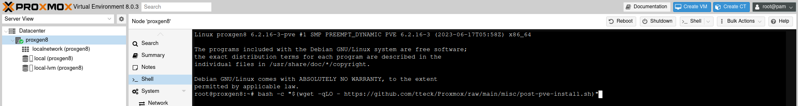

---

*Proxmox Virtual Environnement est une solution de virtualisation libre (licence AGPLv3) basée sur l'hyperviseur Linux KVM, et offre aussi une solution de conteneurs avec LXC. Elle propose un support payant.
Elle est fournie avec un packaging par Proxmox Server Solutions GmbH.*

*Proxmox est une solution de virtualisation de type « bare metal ».*

*L'installation de Proxmox VE s'effectue via une image ISO. L'installateur configure les élements suivant :*

*Système d'exploitation complet (distribution Linux Debian stable 64 bits)
Partitionnement de disque dur avec LVM2
Support de LXC (conteneurs) et du module KVM (virtualisation complète)2,3
Outils de sauvegarde et de restauration
Interface web d'administration et de supervision.
Fonctions de clustering qui permet par exemple la migration à chaud des machines virtuelles d'un serveur physique à un autre (à condition d'utiliser un stockage partagé, SAN, ou Ceph sinon la migration entraîne une courte interruption lors du redémarrage sur un autre nœud du cluster).*

***Source :** Wikipedia*

---

Nous allons voir comment l'installer, creer notre premiere VM et ajouter une Clé USB a celle ci.

**Prérequis**
* Avoir récuperer la [derniere version de Proxmox](https://www.proxmox.com/en/downloads),
* Avoir une clé [USB Bootable comme Ventoy](/blog/ventoy_installation_update/) par exemple,
* Un NUC, Serveur ou autres avec minimum 8Go de RAM (ce n'est pas un imperatif mais c'est plus confort)
* Un processeur acceptant la technoligie [Technologie de virtualisation Intel® (VT-x)](https://ark.intel.com/content/www/fr/fr/ark/search/featurefilter.html?productType=873&2_VTX=true)


## Installation
Démarrer sur votre clé USB puis selmectionner votre distribution Proxmox.

Une interface graphique s'ouvre, selectionner Install (Graphic mode)

* A*ccepter la licence avec le bouton `I agree` en bas a droite.

* Selectionner le disque dur sur lequel vous souhaitez installer Proxmox

* Selectionner votre Pays, le fuseau Horaire et la lmangue utilisé sur votre clavier.

* Saisir un mot de passe solide et un email (perso je n'ai jamais rien recu),

* Configurer le Hostname, ainsi que les informations reseaux,

* Verifier que toutes les informations vous paraissent correctes.


L'installation se lance, il ne vous reste lplus qu'a attendre.


## Découverte de l'interface
Une fois l'installation terminé, vous pouvez vous rendre sur l'interface via l'adresse suivante `https://votre_IP:8006`

Une fois sur l'interface vous pouvez rentrer l'utilisateur `root` puis mettre un mot de passe solide et se connecter.


A gauche vous avez le `Datacenter` avec le ou les `noeuds`, si vous avez plusieurs Proxmox en cluster. Le noeud sur la capture s'appel `proxgen8`.

Dans la partie centrale, vous avez un menu sur les reglages disponnible du Datacenter et a droite les noeuds avec les metrics et les disques dur configurés.
Chaque noeud a ses stockages, mais des stockages reseaux peuvent etre disponnible su tous les noeuds (on y reviendra).

Les VM ou les container LXC peuvent etre créé sur un noeud (et no sur un datacenter)

En hut a droite, vous avez des action rapide comme creer une VM ou un container LXC, mais aussi l'ouverture d'un shell (Terminal) pour le Noeud, la possibilié d'eteindre ou de redemarrer le noeud etc etc.
Vous avez aussi acces a l'utilisateur connecté et lui modfifier certains parametres, theme ou changer de mot de passe.

## Mise a jour.
Pour mettre a jour votre Proxmox, vou devez allez dans le noeud, puis dans `Updates`.
Cliquez sur le bouton `Refresh`, vous devez avoir un popup vous disant que vous n'avez pas de souscription valide.

Nous allons donc changer cela en remplacant les sources dites "entreprise" par celle sans souscription.
*Pourquoi c'est comme ca par defaut, je ne sais pas, mais ben il ya des gens qui ont fait des scripts pour modifier tout ca avec une seule ligne de commande.*

Nous allons donc lancer notre premiere ligne de commande dans le Shell du noeud en lancant le `script post Install` de [TTeck](https://tteck.github.io/Proxmox/) grave a un simple copier-coller.


* Copier la ligne ci-dessous
```bash
bash -c "$(wget -qLO - https://github.com/tteck/Proxmox/raw/main/misc/post-pve-install.sh)"
```
* Rendez vous dans le shell de votre noeud.
* Coller la ligne de command, puis lancer le script avec la touche <span><kbd>ENTREE</kbd></span>

Je vous laisse suivre les informations a l'ecran mais en gros vous pouvez cliquer sur `Yes` partout.

A la fin il vous proposera de mettre a jour Proxmox, selectionnez `Yes` et vous demandera de redemarrer.

Votre Proxmox est maintenant a jour avec les reglages grand publique (sources, etc)
*Si la mise ajour tourne en rond, vous pouvez quitter puis relancer le script mais sans autolriser la mise ajour a la fin, ensuite il vous suffit de proceder directement par les menus pour effectuer les mises a jour.*

## Conclusion
Le gros avantage d'un systeme de cirtualisation est que vous pouvez utiliser les ressources complete de votre machine et non ps la dedier a un seul service ou une seule tache.
De plus, les sauvegardes, restaurations sont simplifié, et cous pouvez mettre plusieurs systeme d'esploitation en parallele sans rique de casser quelques chose.

Sur le site de TTeck, il ya plein de VM ou de LXC installable a partir d'une simple ligne de commande, alors n'hesitez pas a y jeter un oeil.

## Sources :
* https://tteck.github.io/Proxmox/