---

*Proxmox Virtual Environnement est une solution de virtualisation libre (licence AGPLv3) basée sur l'hyperviseur Linux KVM, et offre aussi une solution de conteneurs avec LXC. Elle propose un support payant.
Elle est fournie avec un packaging par Proxmox Server Solutions GmbH.*

*Proxmox est une solution de virtualisation de type « barre métal ».*

*L'installation de Proxmox VE s'effectue via une image ISO. L'installateur configure les éléments suivant :*

*Système d'exploitation complet (distribution Linux Debian stable 64 bits)
Partitionnement de disque dur avec LVM2
Support de LXC (conteneurs) et du module KVM (virtualisation complète)2,3
Outils de sauvegarde et de restauration
Interface web d'administration et de supervision.
Fonctions de clustering qui permet par exemple la migration à chaud des machines virtuelles d'un serveur physique à un autre (à condition d'utiliser un stockage partagé, SAN, ou Ceph sinon la migration entraîne une courte interruption lors du redémarrage sur un autre nœud du cluster).*

***Source :** Wikipédia*

---

Nous allons voir comment l'installer, mais aussi, comment hanger les sources d'entreprise par celles sans souscription et effectuer les mises à jour et tout ca via une seul ligne de commande, grace au script de TTeck.

**Prérequis**
* Récupérer la [dernière version de Proxmox](https://www.proxmox.com/en/downloads),
* Avoir une clé [USB Bootable avec Ventoy](/blog/ventoy_installation_update/) par exemple,
* Un NUC, Serveur ou autres avec minimum 8Go de RAM (ce n'est pas un impératif mais c'est plus confort)
* Un processeur acceptant la [Technologie de virtualisation Intel® (VT-x)](https://ark.intel.com/content/www/fr/fr/ark/search/featurefilter.html?productType=873&2_VTX=true)

Il faut aussi activer, depuis le bios, la/les options de virtualisation.
Par exemple :
**HP Elite Desk 800 G3 :** 
Appuyez plusieurs fois sur <kbd>F10</kbd> au démarrage pour accéder au Bios, puis dans `Advanced` cocher les cases `Virtualization Technology (VTx)` et `Virtualization Technology for Directed I/O (VTd)`.
** Sur Dell OptiPlex 3050 :**
Appuyez plusieurs fois sur <kbd>F2</kbd> au démarrage puis dans la page qui s'affiche rendez-vous dans `Virtualization -> Virtualization` puis activez `Enable Intel Virtualization Technology` et pareil pour `Virtualization -> VT for Direct I/O` pour activez `Enable VT for Direct I/O`.
* Ensuite, cliquez sur `Apply` puis `Exit`.

## Installation
L'installation se passe comme la plupart des installations d'OS, il suffit de suivre les étapes, mais je vous les détaille quand même.

Démarrer sur votre clé USB puis sélectionner la distribution Proxmox.

Une interface graphique s'ouvre, sélectionner `Install (Graphic mode)`

* Accepter la licence avec le bouton `I agree` en bas à droite.
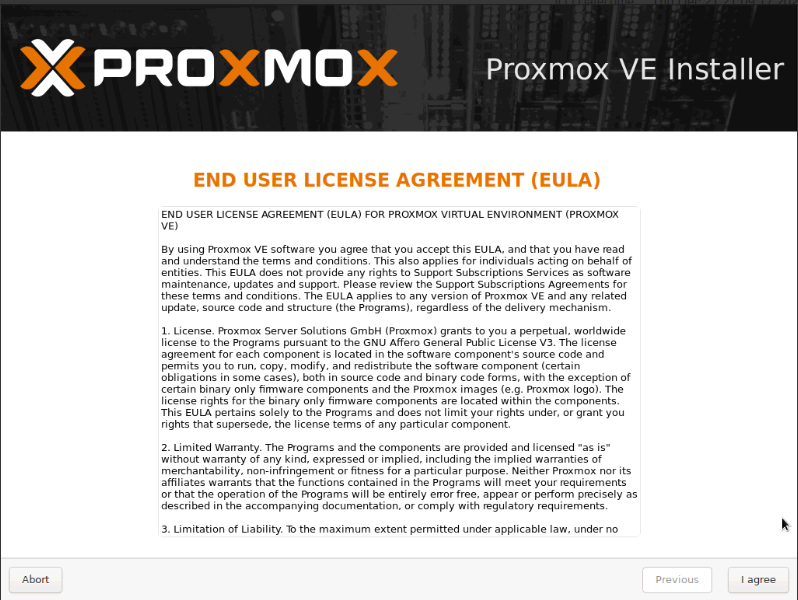
* Sélectionnez le disque dur sur lequel vous souhaitez installer Proxmox
*Personnellement, je débranche tous les disques non utiles pour éviter les erreurs.*
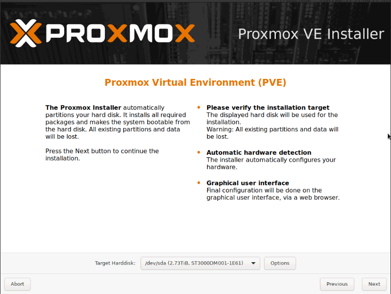
* Sélectionnez votre Pays, le fuseau Horaire et la langue utilisée sur votre clavier.
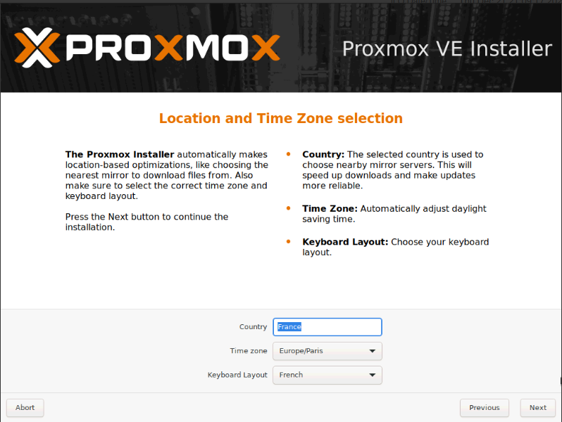
* Saisir un mot de passe solide et un email (*Je pense que c'est pour les notifications si vous configurez un serveur mail, mais pas sûr*),
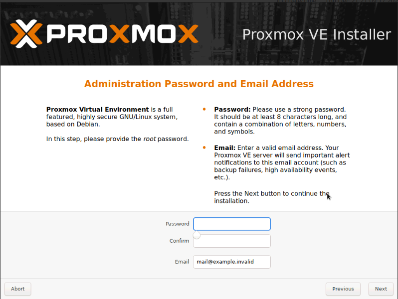
* Configurer le Hostname, ainsi que les informations réseaux,
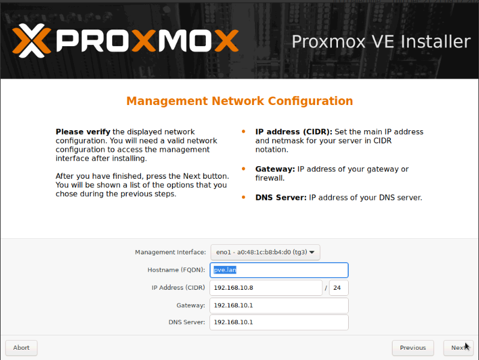
* Vérifier que toutes les informations sont correctes.


L'installation se lance, il ne vous reste plus qu'à attendre.


## Découverte de l'interface
Une fois l'installation terminée, vous pouvez vous rendre sur l'interface via l'adresse suivante `https://votre_IP:8006`

Une fois sur l'interface, connectez-vous avec l'utilisateur `root` puis mettez le mot de passe que vous avez saisi pendant l'installation.
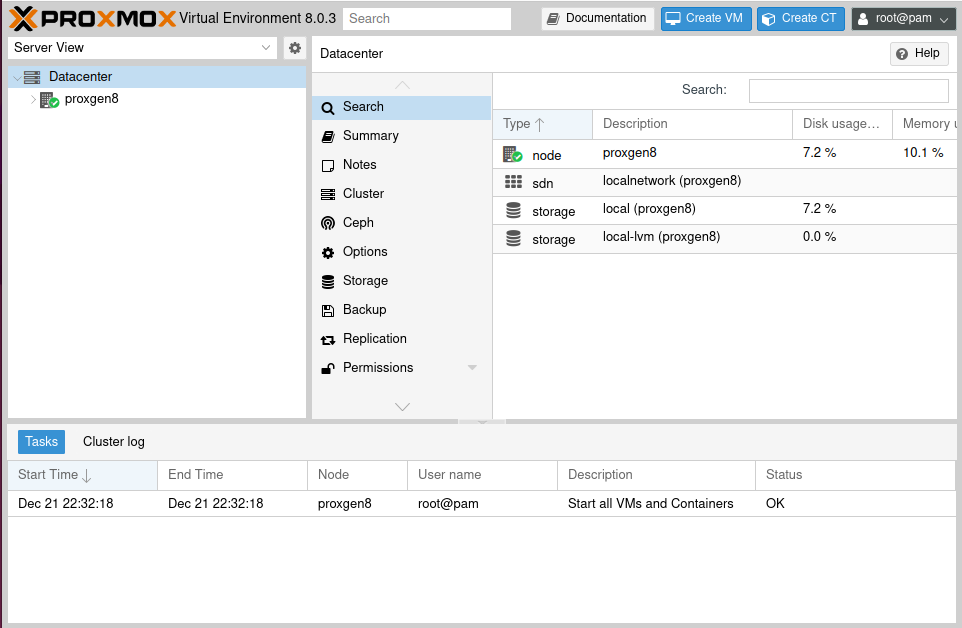

À gauche, vous avez le `Datacenter` avec le ou les `noeuds`, si vous avez plusieurs Proxmox en cluster. Le nœud sur la capture s'appelle `proxgen8`.

Dans la partie centrale, vous avez un menu sur les réglages disponibles du Datacenter et à droite les nœuds avec les métriques et les disques durs configurés.
Chaque nœud a ses stockages, mais des stockages réseaux peuvent être disponibles sur tous les nœuds (on y reviendra).

Des Machines Virtuelles (VM) ou des containers LXC peuvent être créés sur un nœud (mais pas sur un datacenter)

En haut à droite, vous avez des actions rapides comme créer une VM ou un container LXC, mais aussi l'ouverture d'un shell (Terminal) pour le nœud, la possibilité d'éteindre ou de redémarrer le nœud, etc.
Vous avez aussi accès à l'utilisateur connecté et pouvez modifier certains paramètres, thèmes ou changer de mot de passe.

### Mise à jour.
Pour mettre à jour votre Proxmox, vous devez aller dans le nœud, puis dans `Updates`.
Cliquez sur le bouton `Refresh`, puis sur `Upgrade`.
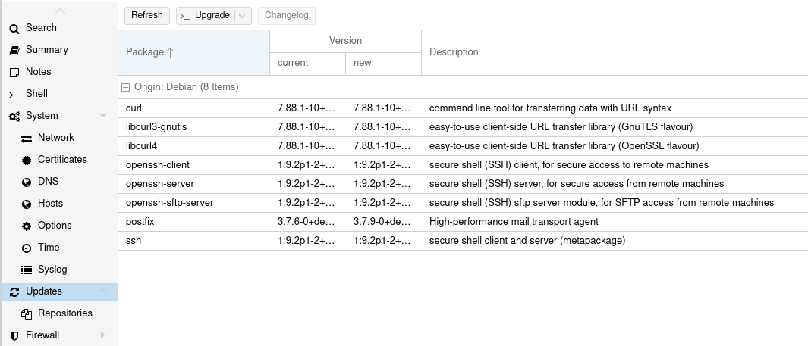

*Lors de votre première installation, vous pouvez avoir un popup vous disant que vous n'avez pas de souscription valide.*
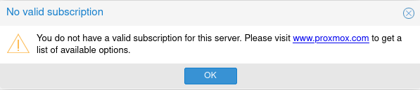

Nous allons donc changer cela en remplaçant les sources dites "entreprise" par celles sans souscription via un le script post install de Tteck.
*Pourquoi c'est comme ça par défaut, je ne sais pas, sûrement parce que c'est plus destiné aux professionnels.*

### Script Post Install TTeck
Nous allons lancer notre première ligne de commande dans le Shell du nœud en lançant le `script post Install` de [TTeck](https://tteck.github.io/Proxmox/) grâce à un simple copier-coller.

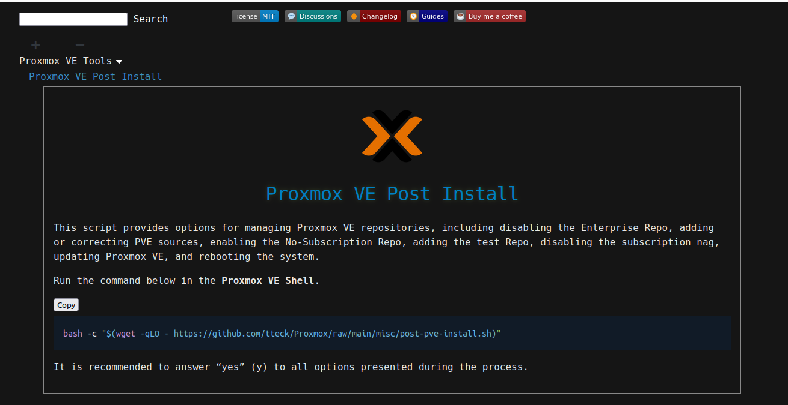

* Copier la ligne ci-dessous
```bash
bash -c "$(wget -qLO - https://github.com/tteck/Proxmox/raw/main/misc/post-pve-install.sh)"
```
* Rendez-vous dans le shell de votre nœud.
* Coller la ligne de commande, puis lancer le script avec la touche <span><kbd>ENTRÉE</kbd></span>
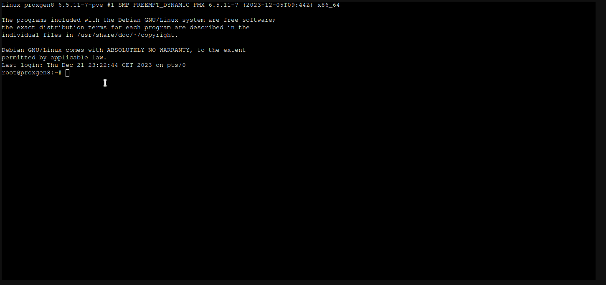
Je vous laisse suivre les informations à l'écran, mais en gros, vous pouvez cliquer sur `Yes` partout.

Il vous demandera de désactiver la haute disponibilité (si vous avez un seul nœud Proxmox)
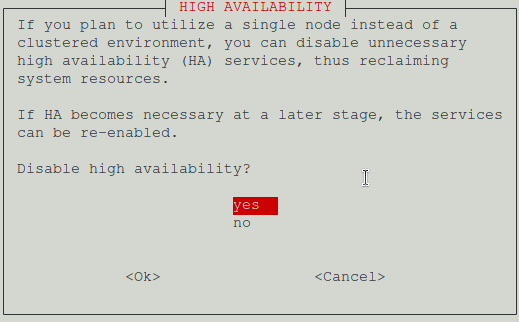

À la fin, il vous proposera de mettre à jour Proxmox, sélectionnez `Yes` et ensuite, il vous demandera de redémarrer.
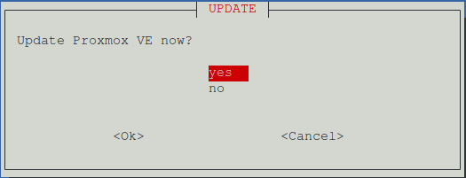

Votre Proxmox est maintenant à jour avec les réglages grand public (sources, etc).
*Si la mise à jour tourne en rond, vous pouvez quitter puis relancer le script, mais lancer la mise à jour à la fin, ensuite il vous suffit de procéder directement comme indiqué un peu plus haut.*

## Ajout de votre première VM
Nous allons créer notre première machine virtuelle pour y installer un serveur sous Debian 12

La première étape consiste à rapatrier l'image ISO d'installation sur notre Proxmox. Pour ça, nous allons :
1. Récupérez l'image ISO [ici](https://www.debian.org/) en cliquant sur `Téléchargement` pour télécharger la dernière image pour AMD64.
1. Ajoutez l'image à Proxmox,
* * Dans Proxmox, allez sur `local (XXX)` 
* * Sélectionnez `ISO Images` 
* * Cliquez sur `Upload` et sélectionner votre image.
Vous remarquerez qu'il est aussi possible de récupérer une image directement via son URL.


Maintenant que l'image est sur notre Proxmox, nous allons pouvoir créer une Machine Virtuelle.
1. Cliquez sur le bouton `Create VM`,
1. Onglet `General` : Donner un numéro a votre VM dans `VM ID` (facultatif) puis donnez un nom dans `Name`, (*Astuces : Dans mon VM ID, je mets les derniers chiffres de l'IP de la machine pour la retrouver d'un coup d'œil*)
1. Onglet `OS` : Dans `storage` sélectionnez `local` puis dans `ISO image` recherchez votre image Debian,
1. Onglet `System` : Activez le Qemu Agent (facultatif) qui permet d'avoir la remonter de l'adresse IP si la Qemu Agent est installé dans la distribution (Sinon il peut être installé). `Add TPM` est utile pour une installation de Windows 10/11,
1. Onglet `Disks` : Laissez par défaut, ajuster l'espace `Disk size (GiB)` à la baisse si vous le souhaiter, car vous ne pourrez pas le baisser plus tard sans avoir de problème, par contre, il est possible de l'augmenter,
1. Onglet `CPU` : Adapter le nombre de `Cores` à votre CPU, mais aussi a vos besoins (Peut être modifié ultérieurement à la hausse comme à la baisse),
1. Onglet `Memory` : Idem que le CPU mis pour la mémoire RAM (vous pouvez booster pour l'installation puis diminuer la valeur ensuite),
1. Onglet `Network` : Vous pouvez laisser par défaut sauf si vous disposez de plusieurs interfaces et que vous savez ce que vous faites,
1. Onglet `Confirm` : Vous donne un récapitulatif de votre VM,
1. Cliquez sur `Finish` pour lancer la création.
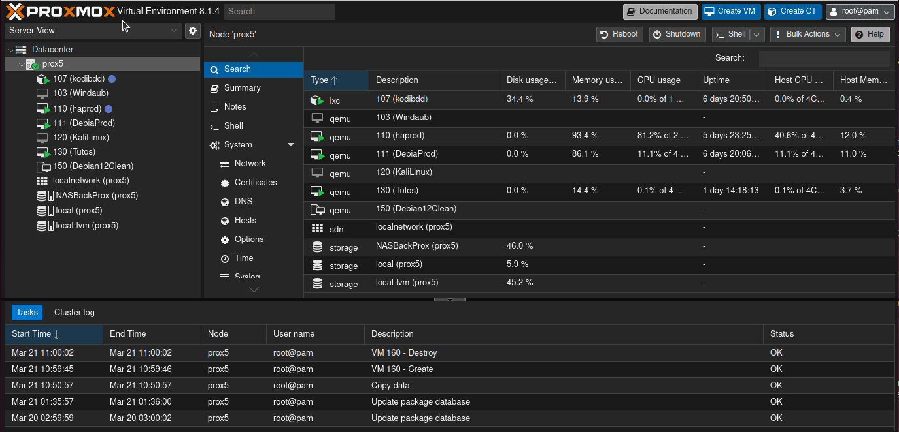

Votre première VM est créée, il vous faut la lancer et ouvrir la console pour suivre les étapes de l'[installation de l'OS Debian 12](/blog/linux_debian_12_installation) cette fois.
## Conclusion
L'avantage d'un système de virtualisation est la possibilité d'utiliser l'ensemble des ressources de votre machine et non pas de la dédier à un seul service ou une seule tâche.
De plus, les sauvegardes et la restauration sont simplifiées, et vous pouvez mettre plusieurs systèmes d'exploitation en parallèle sans risque de casser quelque chose.

Sur le site de TTeck, il y a plein de VM ou de LXC installables à partir d'une simple ligne de commande, alors n'hésitez pas à y jeter un œil, tous les scripts sont consultables sur son GitHub si vous souhaitez vérifier les actions effectuées.

***IMPORTANT :** Ce n'est pas parce qu'il est possible de tout mettre au même endroit qu'il faut forcément le faire, il y a des services plus ou moins importants qui nécessiteront peut-être d'avoir le propre matériel. À vous de juger.*

Nous verrons dans un prochain article comment installer une VM et lui ajouter une clé USB, mais vous pouvez dès lors [installer Home Assistant](/blog/ha_haos_proxmox_installation/) sur votre Proxmox via une simple ligne de code. Merci TTeck ;).

## Sources :
* https://tteck.github.io/Proxmox/