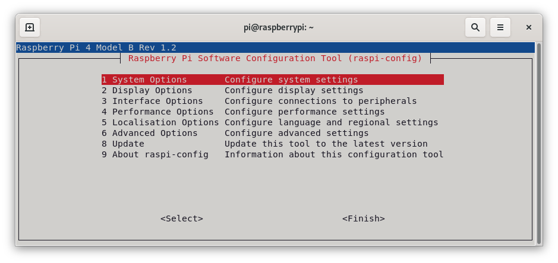
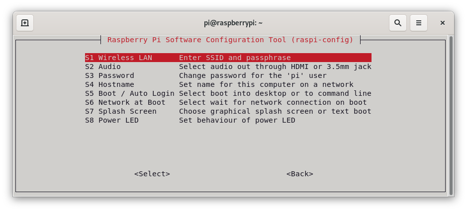
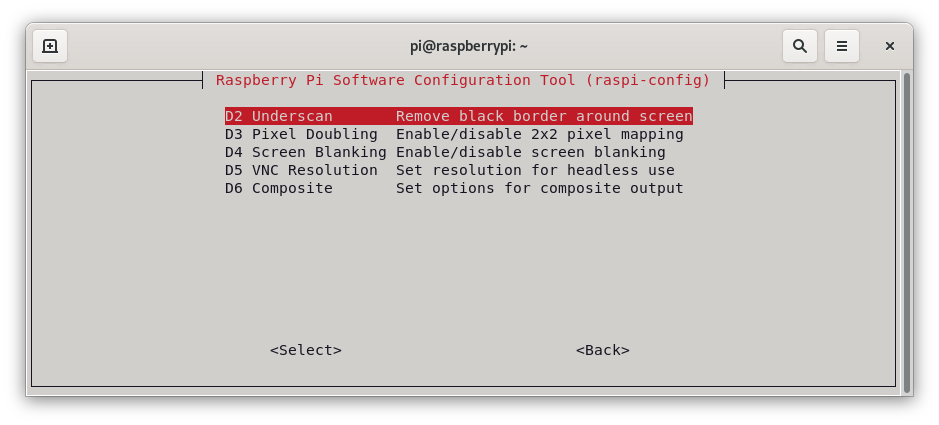
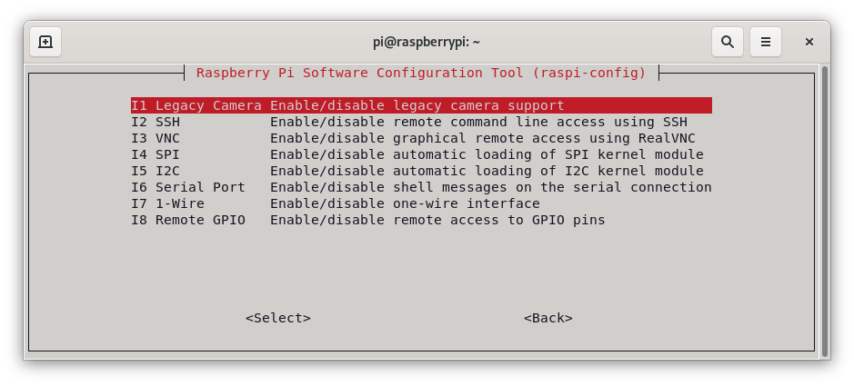
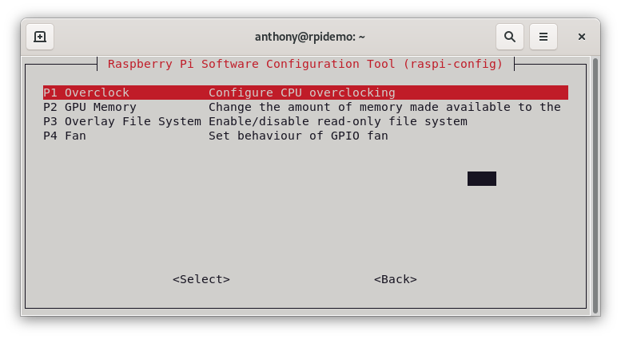
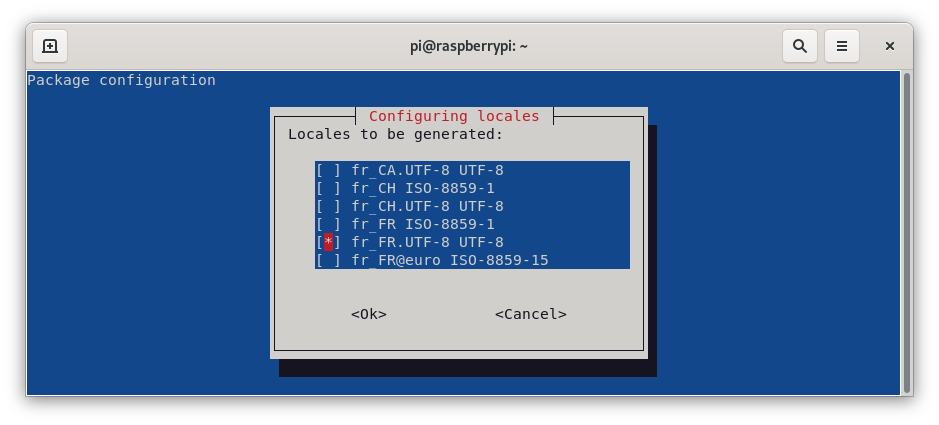
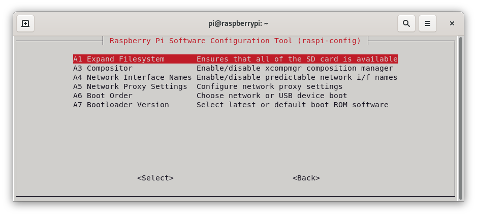
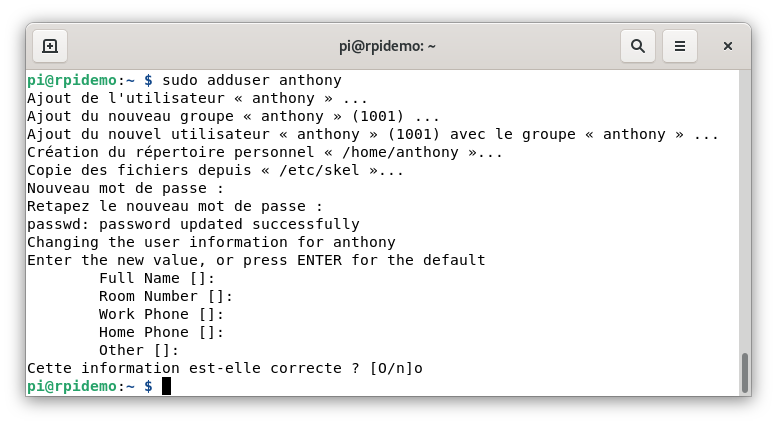

Débuter avec un  Raspberry peut être facile quand l'on connait un peu le monde Linux. Mais si nous venons de Windows, il y a plein de choses différentes.
Dans cet article, nous allons voir comment bien commencer avec son Raspberry Pi. De l'installation à la sécurisation en passant par la suppression de l'utilisateur PI et par l'utilitaire raspi-config, je vais essayer de rendre cela le plus simple possible.

## Préparation.

Transférer l'image via [Balena Etcher](https://www.balena.io/etcher/) ou [Raspberry Pi Imager](/blog/raspberry_pi_installer_os)

### Utilisation sans clavier ni souris. 

Pour cela il suffit d'ajouter un fichier nomme `ssh` vide et sans extension dans la partition `boot` de votre carte Micro SD.

### Connexion au Wi-Fi.
Si vous souhaitez le connecter à votre réseau via le Wi-Fi alors il faut ajouter un fichier nommé `wpa_supplicant.conf` avec pour contenu ce qui suit :

```cmd
country=FR
update_config=1
ctrl_interface=/var/run/wpa_supplicant

network={
  scan_ssid=1
  ssid="votre-_reseau"
  psk="votre_mot_de_passe"
}
```

>Il est possible de mettre son code Wi-Fi en version chiffre via la commande `wpa_passphrase votre_ssid` qui peut être exécuté sur n'importe quelle machine Linux.


## Premier lancement.

Voilà les préparatifs sont faits, passons maintenant au premier lancement et a l'amélioration de la sécurité.

### Connexion SSH est `raspi-config.

Pour se connecter en SSH au Raspberry voici la commande `ssh pi@ip_du_rpi`.

Il vous est demandé de changer le mot de passe par défaut, mais nous allons faire mieux un peu plus loin en supprimant complètement l'utilisateur `pi`

La première commande à lancer est la mise à jour du système via `sudo apt update && sudo apt upgrade %% sudo apt dist-upgrade`

La première récupère la liste des paquets, la deuxième met les paquets à jour et la troisième met la distribution à jour.

### Raspi-config.

Lancer l'utilitaire de configuration du Raspberry via la commande `sudo raspi-config`.

Il est possible, via cet utilitaire, de changer pas mal de choses (wifi, activation SSH, VNC, caméra, gpio, etc). Nous allons seulement voir les plus intéressantes (des ajouts seront fait en fonction de mes utilisations).


#### 1.System option.



Deux choses intéressantes :
* `S1 Wirless LAN` : Permet (si vous ne l'avez pas déjà configuré via `wpa-supplicant.conf`) de régler les paramètres de votre carte Wi-Fi et de la connecter à votre réseau.
* `S4 Hostname` : Permet de donner un nom différent de `raspberrypi` sur votre réseau.

Commençons par aller dans `S1`, choisir son pays puis entrer son SSID et son mot de passe Wi-Fi.

Changeons le nom de notre Raspberry sur le réseau via `S4` puis `entrer` pour valider le message qui vous dit que le hostname ne peut contenir que des caractères ASCII (a-z,1-9)

#### 2.Display options


En version `Lite` de Raspbian, il n'y a rien d'intéressant.

#### 3.Interface options.


Ici, vous pouvez activer le SSH, les GPIO, I2C,VNC, SPI, les cameras, etc.

Le SSH étant déjà activé, pas besoin de plus pour le moment.

#### 4.Performance options.


P1 : Vous permet d'overclocker votre Pi (version 1 et 2 seulement) si le besoin s'en fait ressentir.
P2 : Permet d'allouer plus ou moins de mémoire à votre GPU. Pour ma part je le descends à 16 pour laisser un max de mémoire au système MAIS il peut être intéressant de le monter si votre applicatif utilise le GPU de votre Raspberry.
P3 : [Une explication en français](https://www.adaltas.com/fr/2021/06/03/linux-overlay-filesystem-docker/)
P4 : Permet de paramétrer les GPIO utilisé par votre ventilateur (si vous en avez un).

#### 4.Localisation options.


Permet de régler le clavier, le fuseau horaire, la langue de votre système et le Pays de votre wifi (sélection des canaux)

Aller dans `L1 local` après avoir passé le message d'info, sélectionner votre encodage `fr_FR.UTF-8 UTF-8` en vous rendant sur la ligne puis en appuyant sur la touche `espace`, un astérisque devrait apparaître.

il est possible d'en sélectionner plusieurs.

Ensuite continuer et sélectionner celui à utiliser par défaut.


Changer le fuseau horaire via `L2`, puis le code Country pour le Wifi via `L4`.

#### 5.Advanced options.


Seul l'option `A1 expand Filsystem` et `A6 Boot Order` nous intéresses.

A1 : permet d'utiliser toute la capacité de votre carte Micro SD car par défaut Raspberry Pi OS ne s'installe pas sur tout l'espace.
A6 : Seulement si vous souhaitez démarrer sur un support "externe".

#### 6.Update.

Il vous permet de faire simplement la mise à jour de votre système sans ligne de commande.


On valide le tout par un redémarrage via la commande `sudo reboot`

## Ajouter un utilisateur.
	
Nous allons ajouter un utilisateur qui viendra remplacer l'utilisateur `pi` que nous supprimerons par la suite.

Une fois connecté en SSH, taper la commande suivante `sudo adduser votre_user` puis rentrer un mot de passe (solide) deux fois, ensuite valider les informations.


### Ajouter l'utilisateur à un groupe.

Nous allons ajouter notre utilisateur au groupe `sudo` via la commande suivante `sudo usermod -aG sudo votre_user`.

Connectez-vous avec votre utilisateur via `su votre_utilisateur` ensuite essayer la commande `sudo date`. Si elle marche, alors votre utilisateur est bien ajouté au groupe `sudo`.

Si c'est un utilisateur destiné à avoir les droits `root` ajoutez-le au groupe `root`.

Changer le mot de passe de l'utilisateur `root` (car sans l'utilisateur `pi`, on ne pourra plus se connecter à `root`) via la commande `sudo passwd root`.

Redémarrer puis connecter vous avec votre nouvel utilisateur via SSH.

## Suppression de l'utilisateur `pi`.
La suppression de l'utilisateur `pi` et de tous ses fichiers se fait par la commande `sudo userdel -r pi`.

Si vous avez une erreur concernant des processus qui tournent alors il vous faut les tuer avant via la commande `sudo killall -u pi`

Un petit `cat /etc/passwd` permet de confirmer, par l'absence de l'utilisateur `pi` dans la liste, que la suppression a bien été réalisée.

## Sécuriser le SSH

Je vous invite à aller voir directement l'[article](##) pour éviter les doublons.

## Conclusion.

Voici la fin d'un article pour débuter sur de bonne base avec un Raspberry Pi.

Si vous voyez d'autres choses à aborder ou à améliorer, n'hésitez pas à me contacter par mail (voir en dessous).