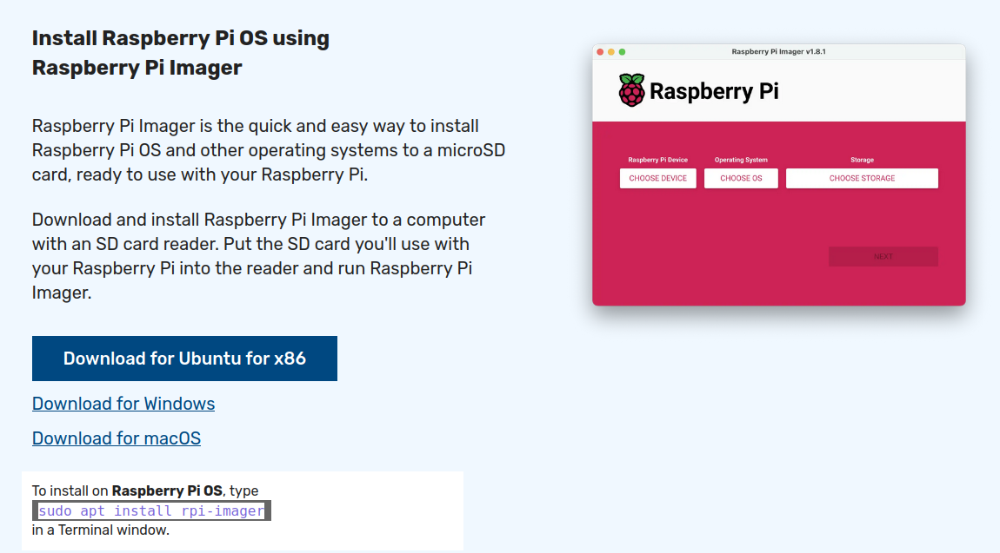
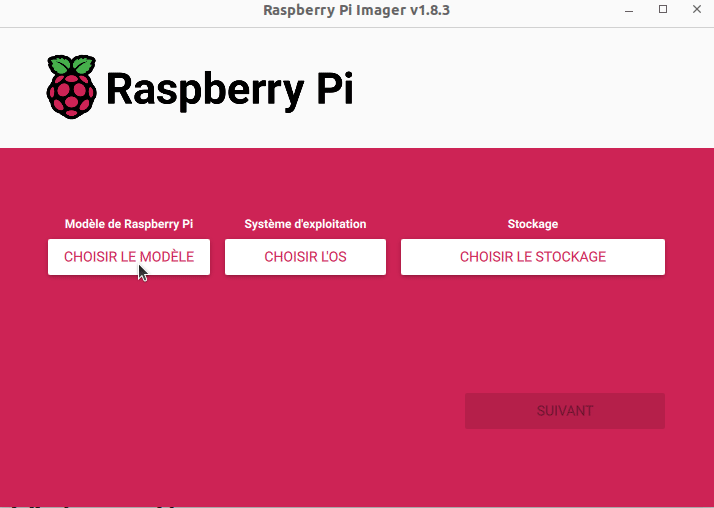
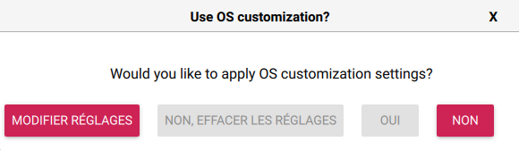
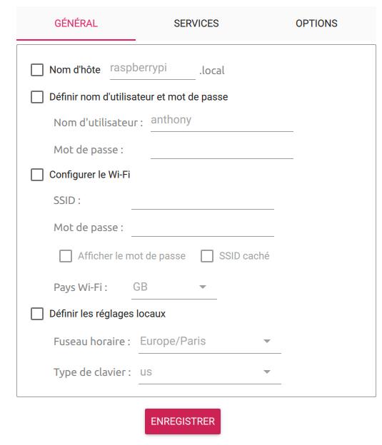
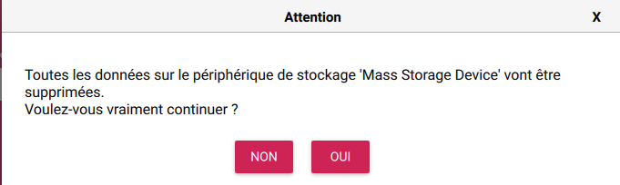
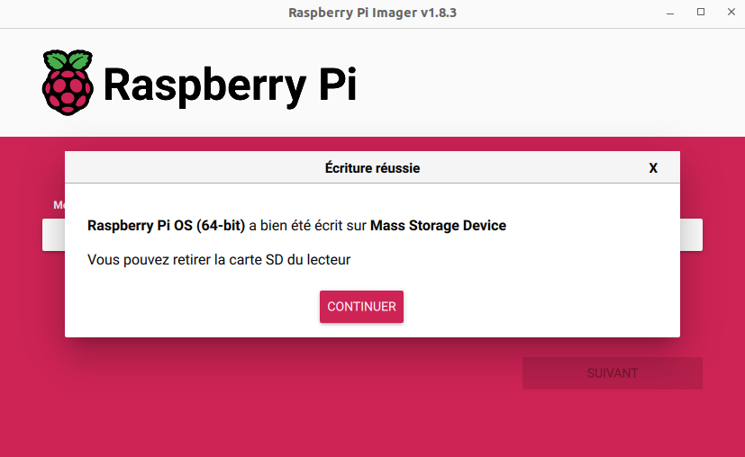

Vous avez reçu votre Raspberry Pi, mais vous ne savez pas **comment y installer** un **système d'exploitation** (OS) ou une **application**. C'est ce que nous allons voir, et croyez-moi, c'est devenu **très simple**.
## Prérequis
- Un Raspberry
- Son alimentation et boîtier,
- Une Carte MicroSD (taille en fonction du projet)
- Un lecteur de carte MicroSD

## Installation de Raspberry Pi Imager.
### Linux (Ubuntu et autres)
Il y a plusieurs choix :
- Soit via votre gestionnaire d'application, (possiblement pas la dernière version)
- Soit sur le site d'origine 
- - En téléchargent le `.deb` et en suivant l'article sur [comment installer un `.deb`](/blog/linux_installer_deb)
- - Via le Terminal avec la commande suivante : (Idem pas la dernière version)

```
sudo apt install rpi-imager
```
- Soit en installant la version Flatpak (Article en cours)

Cette dernière est celle que je recommande si vous voulez avoir la dernière version de l'application.

### Windows ou Mac
Rendez-vous sur le site officiel et cliquez sur `Download for Windows`, ou via le [lien direct Windows](https://downloads.raspberrypi.org/imager/imager_latest.exe), [MacOS](https://downloads.raspberrypi.org/imager/imager_latest.dmg). 



## Installation de l'OS depuis Raspberry Pi Imager
Pour l'exemple, je vais prendre une Raspberry Pi OS (anciennement Raspbian) en 64bits, mais ça marche avec tout le catalogue d'OS disponible dans Raspberry Pi Imager.

- Lancer Raspberry Pi Imager,
- Choisir le modèle de Raspberry Pi
- Choisir le système d'exploitation (OS),
- Choisir votre stockage (carte MicroSD dans mon cas). Normalement, il ne doit pas vous proposer votre disque système (mais faites bien attention quand même)



- Cliquer sur `SUIVANT`.

>Dans cet articles nous utilisons une carte MicroSD, mais sachez qu'il est possible de le faire avec un disque dur dans le ca d'un boitier acceptant les SSD ou autres.

Une fenêtre apparaît vous proposant de configurer certains paramètres de votre OS.


- Cliquer sur `MODIFIER REGLAGES`,
- Puis cochez les cases et remplissez les options que vous souhaitez configurer.
- Finir en cliquant sur `ENREGISTRER`



De retour dans la fenêtre de customisation, cliquez maintenant sur `OUI`, une fenêtre vous alertant que la suppression des données sur le média sera irréversible.


Raspberry Pi Imager va désormais récupérer la dernière image disponible et l'écrire sur la MicroSD en y insérant les paramètres que vous avez configurés, puis vérifier que tout s'est bien passé.


Une fois toutes les étapes finies, éjecter proprement votre carte MicroSD de votre ordinateur et insérez là dans votre Raspberry Pi, brancher son alimentation et l'écran (si version Desktop), et attendez.

Si vous avez installé une image serveur, alors il vous faudra récupérer l'adresse IP de votre Raspberry via votre routeur/Box et vous connecter en SSH via un Terminal dans Linux en tapant la commande suivante.
```bash
ssh votre_user@ip.de.votre.pi
```
Ou via le nom d'hôte (si votre routeur le permet)
```bash
ssh votre_user@raspberry.local
```

## Conclusion
Auparavant, j'utilisais beaucoup Balena Etcher que je trouvais plus sympa et il servait aussi pour d'autres images, mais il est vrai que la partie configuration de l'OS est un plus pour ne pas avoir à mettre les mains dans la carte MicroSD pour activer les options.

## Sources
- [Raspberry Pi Imager Officiel](https://www.raspberrypi.com/software/)