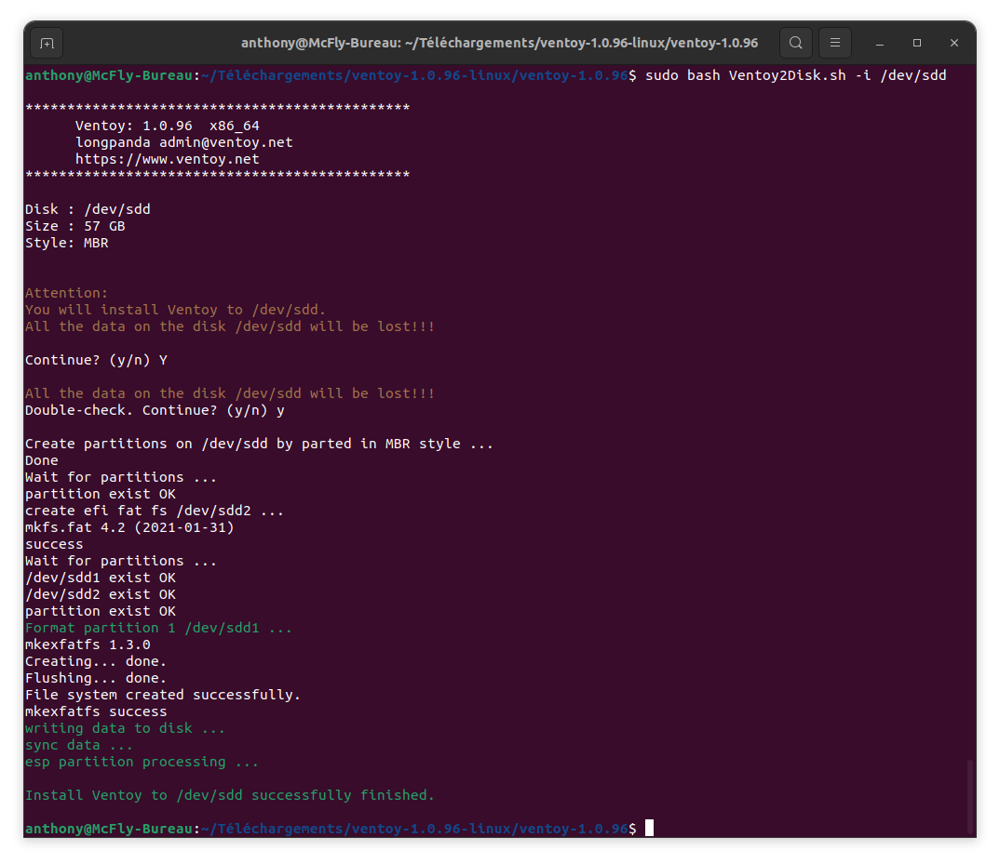
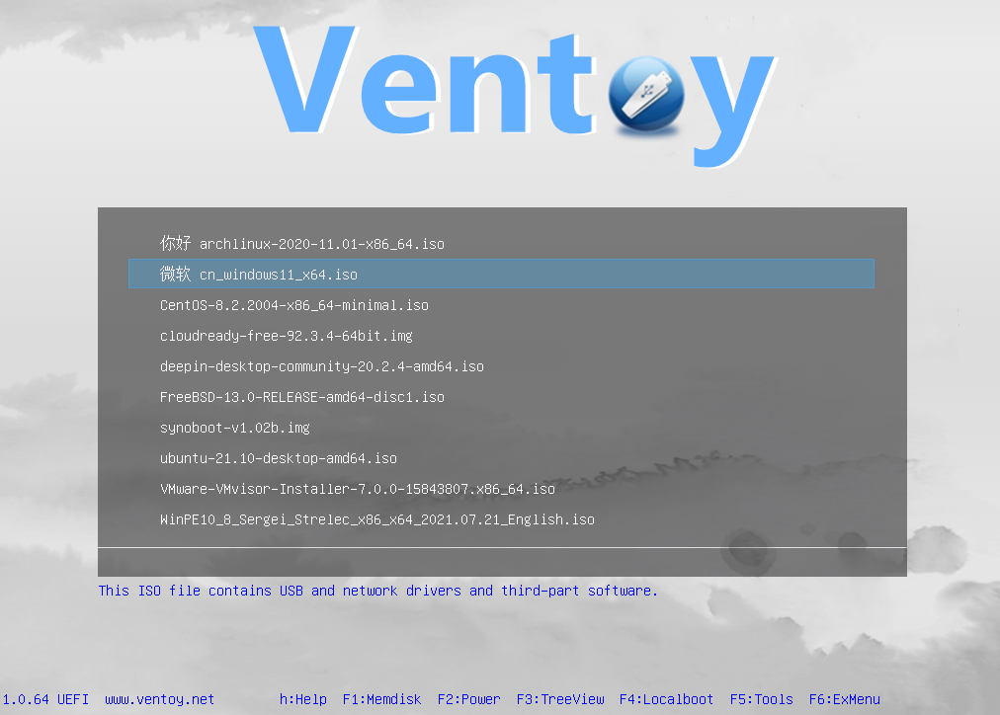
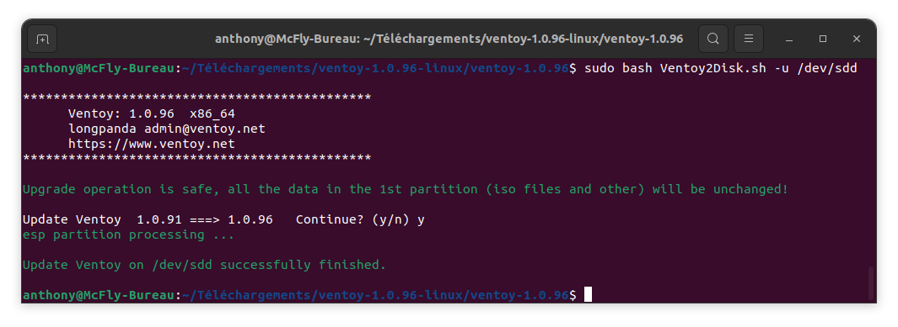

Marre de passer son temps à effacer votre clé USB pour y copier un nouvel OS et perdre du temps à chaque test ou installation d'OS ? Avec [Ventoy](https://www.ventoy.net/), c'est fini. Vous créez la clé une fois et ensuite un simple copier-coller de votre ou vos OS sur la clé et c'est prêt.

C'est ce que nous allons voir dans cet article.

## Ventoy, késako ?
>Ventoy est un outil open source qui permet de créer une clé USB amorçable pour les fichiers ISO/WIM/IMG/VHD(x)/EFI. 
>Avec ventoy, vous n'avez pas besoin de formater le disque encore et encore, il vous suffit de copier les fichiers ISO/WIM/IMG/VHD(x)/EFI sur la clé USB et de les démarrer directement. 
>Vous pouvez copier plusieurs fichiers à la fois et ventoy vous proposera un menu de démarrage pour les sélectionner (capture d'écran). La plupart des types d'OS sont supportés (Windows/WinPE/Linux/ChromeOS/Unix/VMware/Xen...) 
>Plus de 1100 images sont testés, plus de 90% des distributions de [distrowatch.com](https://distrowatch.com/) sont supportées 
>
> **Source :** Ventoy 

## Installation de Ventoy

Rendez-vous dans la partie [Download du site officiel](https://www.ventoy.net/en/download.html), puis récupérez l'archive correspondante à votre OS.
Je vais faire l'installation sous Ubuntu ici, mais sur Windows, c'est un simple exécutable.

Donc, vous récupérez l'archive `ventoy-1.0.96-linux.tar.gz`, puis dans le dossier Téléchargement,  
- Décompressez l'Archive,
- Sélectionnez le dossier `ventoy-1.0.96-linux` puis `ventoy-1.0.96`,
- Branchez une clé USB,
- Ouvrez le Terminal avec un Clic-droit, lancez un Terminal,
- Lancer la commande `fdisk -l` (vous avez peut-être besoin du `sudo` avant)
- Récupérez le chemin de votre clé USB (ici `/dev/sddX`),
- Lancez la commande
```bash
sudo bash Ventoy2Disk.sh -i /dev/sdd #a remplacer par votre chemin sans le numero derriere.
```
**ATTENTION :** Ceci supprimera toutes les données présentes sur la clé USB, il vous demande par deux fois de confirmer.



Une fois l'installation terminée, il vous suffit de copier vos ISOs directement à la racine de la clé USB.

Lorsque vous allez démarrer depuis la clé USB, il vous sera proposé un écran avec les ISOs que vous avez mis dessus.



## Mise à jour
Pour mettre à jour votre clé USB vers la dernière version de Ventoy, il vous suffit de suivre la procédure d'installation, mais en changeant la commande d'installation par :
```bash
sudo bash Ventoy2Disk.sh -i /dev/sdd #a remplacer par votre chemin sans le numero derriere.
```
*Normalement, il n'y a pas besoin de supprimer toutes les images ISOs ou autres.*



## Sources
- [Ventoy](https://www.ventoy.net/)